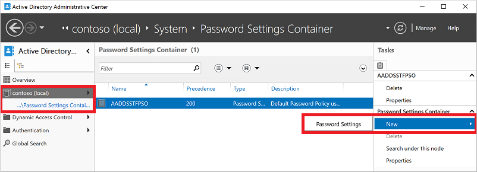

# Password and account lockout policies on managed domains

To manage user security in Azure Active Directory Domain Services (Azure AD DS), you can define fine-grained password policies that control account lockout settings or minimum password length and complexity. A default fine grained password policy is created and applied to all users in an Azure AD DS managed domain. To provide granular control and meet specific business or compliance needs, additional policies can be created and applied to specific groups of users.

This article shows you how to create and configure a fine-grained password policy in Azure AD DS using the Active Directory Administrative Center.

> [!NOTE]
> Password policies are only available for Azure AD DS managed domains created using the Resource Manager deployment model. For older managed domains created using Classic, [migrate from the Classic virtual network model to Resource Manager][migrate-from-classic].

## Before you begin

To complete this article, you need the following resources and privileges:

* An active Azure subscription.
  * If you don’t have an Azure subscription, [create an account](https://azure.microsoft.com/free/?WT.mc_id=A261C142F).
* An Azure Active Directory tenant associated with your subscription, either synchronized with an on-premises directory or a cloud-only directory.
  * If needed, [create an Azure Active Directory tenant][create-azure-ad-tenant] or [associate an Azure subscription with your account][associate-azure-ad-tenant].
* An Azure Active Directory Domain Services managed domain enabled and configured in your Azure AD tenant.
  * If needed, complete the tutorial to [create and configure an Azure Active Directory Domain Services instance][create-azure-ad-ds-instance].
  * The Azure AD DS instance must have been created using the Resource Manager deployment model. If needed, [Migrate from the Classic virtual network model to Resource Manager][migrate-from-classic].
* A Windows Server management VM that is joined to the Azure AD DS managed domain.
  * If needed, complete the tutorial to [create a management VM][tutorial-create-management-vm].
* A user account that's a member of the *Azure AD DC administrators* group in your Azure AD tenant.

## Default password policy settings

Fine-grained password policies (FGPPs) let you apply specific restrictions for password and account lockout policies to different users in a domain. For example, to secure privileged accounts you can apply stricter account lockout settings than regular non-privileged accounts. You can create multiple FGPPs within an Azure AD DS managed domain and specify the order of priority to apply them to users.

Policies are distributed through group association in an Azure AD DS managed domain, and any changes you make are applied at the next user sign-in. Changing the policy doesn't unlock a user account that's already locked out.

Password policies behave a little differently depending on how the user account they're applied to was created. There are two ways a user account can be created in Azure AD DS:

* The user account can be synchronized in from Azure AD. This includes cloud-only user accounts created directly in Azure, and hybrid user accounts synchronized from an on-premises AD DS environment using Azure AD Connect.
    * The majority of user accounts in Azure AD DS are created through the synchronization process from Azure AD.
* The user account can be manually created in an Azure AD DS managed domain, and doesn't exist in Azure AD.

All users, regardless of how they're created, have the following account lockout policies applied by the default password policy in Azure AD DS:

* **Account lockout duration:** 30
* **Number of failed logon attempts allowed:** 5
* **Reset failed logon attempts count after:** 30 minutes
* **Maximum password age (lifetime):** 90 days

With these default settings, user accounts are locked out for 30 minutes if five invalid passwords are used within 2 minutes. Accounts are automatically unlocked after 30 minutes.

Account lockouts only occur within the managed domain. User accounts are only locked out in Azure AD DS, and only due to failed sign-in attempts against the managed domain. User accounts that were synchronized in from Azure AD or on-premises aren't locked out in their source directories, only in Azure AD DS.

If you have an Azure AD password policy that specifies a maximum password age greater than 90 days, that password age is applied to the default policy in Azure AD DS. You can configure a custom password policy to define a different maximum password age in Azure AD DS. Take care if you have a shorter maximum password age configured in an Azure AD DS password policy than in Azure AD or an on-premises AD DS environment. In that scenario, a user's password may expire in Azure AD DS before they're prompted to change in Azure AD or an on-premises AD DS environment.

For user accounts created manually in an Azure AD DS managed domain, the following additional password settings are also applied from the default policy. These settings don't apply to user accounts synchronized in from Azure AD, as a user can't update their password directly in Azure AD DS.

* **Minimum password length (characters):** 7
* **Passwords must meet complexity requirements**

You can't modify the account lockout or password settings in the default password policy. Instead, members of the *AAD DC Administrators* group can create custom password policies and configure it to override (take precedence over) the default built-in policy, as shown in the next section.

## Create a custom password policy

As you build and run applications in Azure, you may want to configure a custom password policy. For example, you could create a policy to set different account lockout policy settings.

Custom password policies are applied to groups in an Azure AD DS managed domain. This configuration effectively overrides the default policy.

To create a custom password policy, you use the Active Directory Administrative Tools from a domain-joined VM. The Active Directory Administrative Center lets you view, edit, and create resources in an Azure AD DS managed domain, including OUs.

> [!NOTE]
> To create a custom password policy in an Azure AD DS managed domain, you must be signed in to a user account that's a member of the *AAD DC Administrators* group.

1. From the Start screen, select **Administrative Tools**. A list of available management tools is shown that were installed in the tutorial to [create a management VM][tutorial-create-management-vm].
1. To create and manage OUs, select **Active Directory Administrative Center** from the list of administrative tools.
1. In the left pane, choose your Azure AD DS managed domain, such as *aadds.contoso.com*.
1. Open the **System** container, then the **Password Settings Container**.

    A built-in password policy for the Azure AD DS managed domain is shown. You can't modify this built-in policy. Instead, create a custom password policy to override the default policy.

    

1. In the **Tasks** panel on the right, select **New > Password Settings**.
1. In the **Create Password Settings** dialog, enter a name for the policy, such as *MyCustomFGPP*.
1. When multiple password policies exist, the policy with the highest precedence, or priority, is applied to a user. The lower the number, the higher the priority. The default password policy has a priority of *200*.

    Set the precedence for your custom password policy to override the default, such as *1*.

1. Edit other password policy settings as desired. Remember the following key points:

    * Settings like password complexity, age, or expiration time only to users manually created in an Azure AD DS managed domain.
    * Account lockout settings apply to all users, but only take effect within the managed domain and not in Azure AD itself.

    

1. Uncheck **Protect from accidental deletion**. If this option is selected, you can't save the FGPP.
1. In the **Directly Applies To** section, select the **Add** button. In the **Select Users or Groups** dialog, select the **Locations** button.

    

1. Password policies can only be applied to groups. In the **Locations** dialog, expand the domain name, such as *aadds.contoso.com*, then select an OU, such as **AADDC Users**. If you have a custom OU that contains a group of users you wish to apply, select that OU.

    

1. Type the name of the group you wish to apply the policy to, then select **Check Names** to validate that the group exists.

    

1. With the name of the group you selected now displayed in **Directly Applies To** section, select **OK** to save your custom password policy.

## Next steps

For more information about password policies and using the Active Directory Administration Center, see the following articles:

* [Learn about fine-grained password policies](/previous-versions/windows/it-pro/windows-server-2008-R2-and-2008/cc770394(v=ws.10))
* [Configure fine-grained password policies using AD Administration Center](/windows-server/identity/ad-ds/get-started/adac/introduction-to-active-directory-administrative-center-enhancements--level-100-#fine_grained_pswd_policy_mgmt)

<!-- INTERNAL LINKS -->
[create-azure-ad-tenant]: ../active-directory/fundamentals/sign-up-organization.md
[associate-azure-ad-tenant]: ../active-directory/fundamentals/active-directory-how-subscriptions-associated-directory.md
[create-azure-ad-ds-instance]: tutorial-create-instance.md
[tutorial-create-management-vm]: tutorial-create-management-vm.md
[migrate-from-classic]: migrate-from-classic-vnet.md
