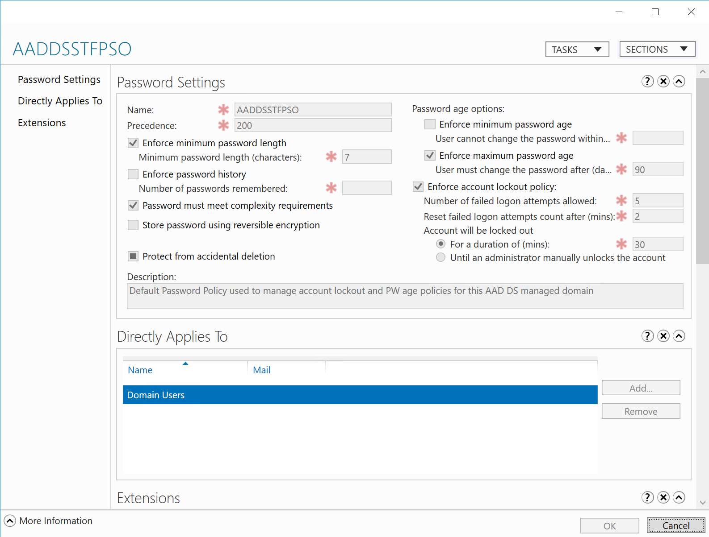
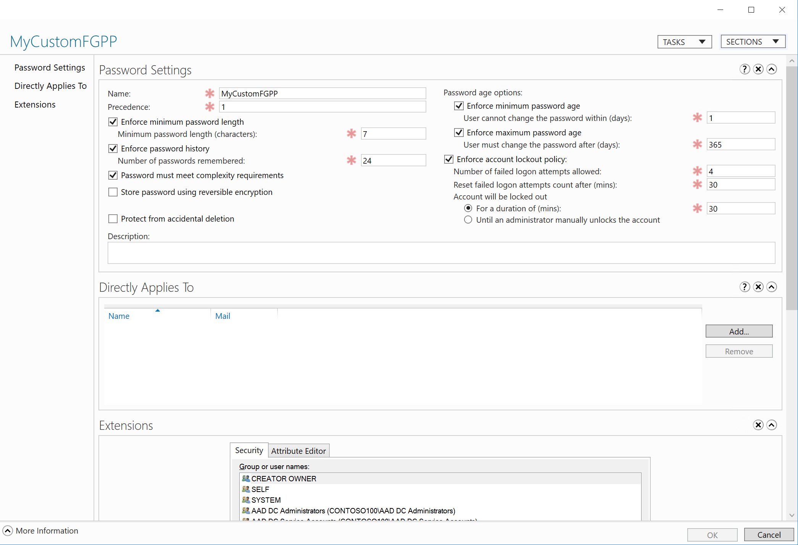
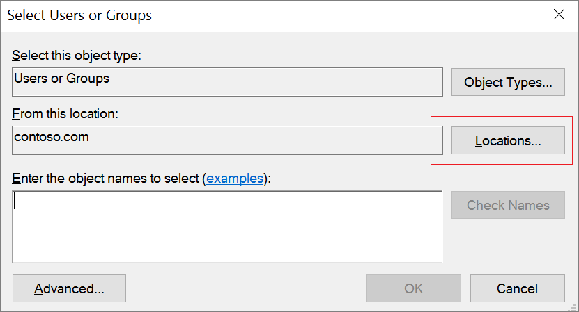
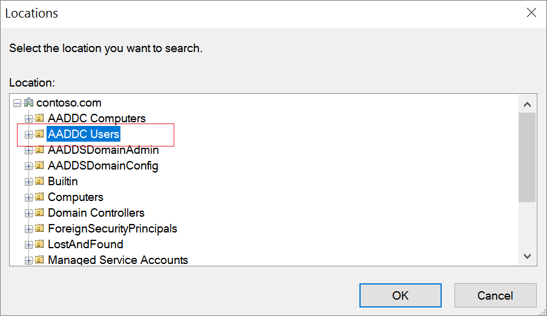
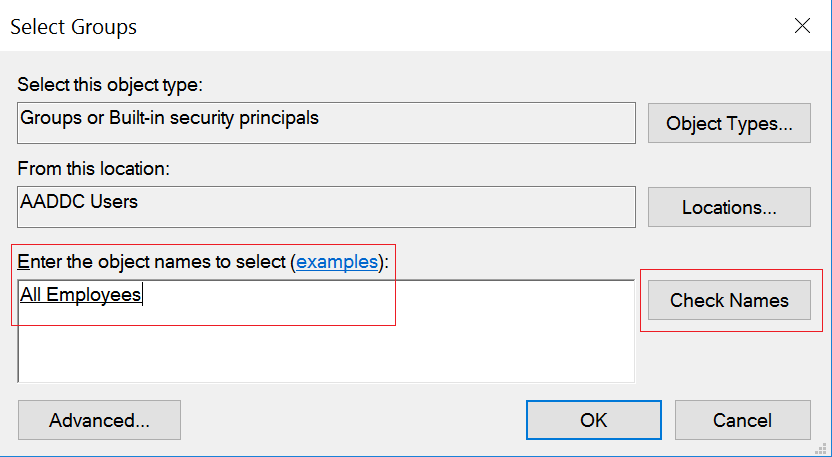
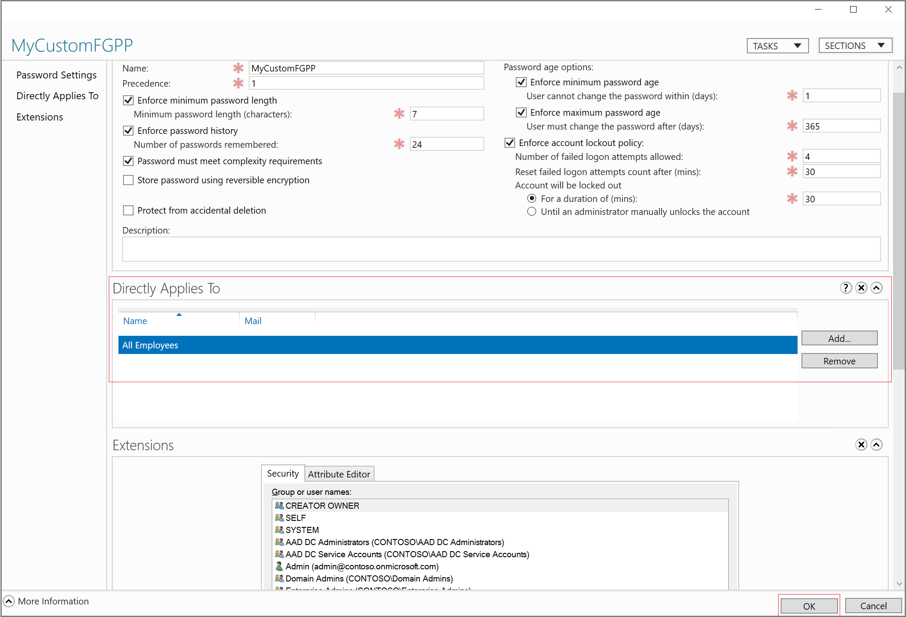

# Password and account lockout policies on managed domains
This article explains the default password policies on a managed domain. It also covers how you can configure these policies.

## Fine grained password policies (FGPP)
Use fine-grained password policies to specify many password policies within a single domain. FGPP enables you to apply different restrictions for password and account lockout policies to different sets of users in a domain. For example, you can apply strict password settings to privileged accounts.

You can configure the following password settings using FGPP:
* Minimum password length
* Password history
* Passwords must meet complexity requirements
* Minimum password age
* Maximum password age
* Account lockout policy
    * Account lockout duration
    * Number of failed logon attempts allowed
    * Reset failed logon attempts count after

## Default fine grained password policy settings on a managed domain
The following screenshot illustrates the default fine grained password policy configured on an Azure AD Domain Services managed domain.

> [!NOTE]
> You can't modify or delete the default built-in fine grained password policy. Members of the 'AAD DC Administrators' group can create custom FGPP and configure it to override (take precedence over) the default built-in FGPP.
>
>

## Password policy settings
On a managed domain, the following password policies are configured by default:
* Minimum password length (characters): 7
* Maximum password age (lifetime): 90 days
* Passwords must meet complexity requirements

### Account lockout settings
On a managed domain, the following account lockout policies are configured by default:
* Account lockout duration: 30
* Number of failed logon attempts allowed: 5
* Reset failed logon attempts count after: 30 minutes

Effectively, user accounts are locked out for 30 minutes if five invalid passwords are used within 2 minutes. Accounts are automatically unlocked after 30 minutes.

## Create a custom fine grained password policy (FGPP) on a managed domain
You can create a custom FGPP and apply it to specific groups in your managed domain. This configuration effectively overrides the default FGPP configured for the managed domain.

> [!TIP]
> Only members of the **'AAD DC Administrators'** group have the permissions to create custom fine grained password policies.
>
>

Additionally, you can also create custom fine grained password policies and apply them to any custom OUs you create on the managed domain.

You can configure a custom FGPP for the following reasons:
* To set a different account lockout policy.
* To configure a default password lifetime setting for the managed domain.

To create a custom FGPP on your managed domain:
1. Sign in to the Windows VM you use to administer your managed domain. If you don't have one, follow the instructions to [Manage an Azure AD Domain Services domain](manage-domain.md).
2. Launch the **Active Directory Administrative Center** on the VM.
3. Click the domain name (for example, 'contoso100.com').
4. Double-click **System** to open the System container.
5. Double-click **Password Settings Container**.
6. You see the default built-in FGPP for the managed domain called **AADDSSTFPSO**. You can't modify this built-in FGPP. You can however, create a new custom FGPP override the default FGPP.
7. On the **Tasks** panel in the right, click **New** and click **Password Settings**.
8. In the **Create Password Settings** dialog, specify the custom password settings to apply as part of the custom FGPP. Remember to set the precedence appropriately to override the default FGPP.

   

   > [!TIP]
   > **Remember to uncheck the Protect from accidental deletion option.** If this option is selected, the FGPP cannot be saved.
   >
   >

9. In **Directly Applies To**, click the **Add** button. In the **Select Users or Groups** dialog, click the **Locations** button.

   

10. In the **Locations** dialog, expand the domain name and click **AADDC Users**. You can now select a group from the built-in users OU, to which to apply the FGPP.

    

11. Type the name of the group and click the **Check Names** button to validate the group exists.

    

12. The name of the group is displayed in **Directly Applies To** section. Click the **OK** button to save these changes.

    

> [!TIP]
> **To apply custom password policies for user accounts in a custom OU:**
> Fine grained password policies can be applied only to groups. To configure a custom password policy only for users from a custom OU, create a group that includes users in that OU.
>
>

## Next steps
* [Learn about Active Directory fine grained password policies](/previous-versions/windows/it-pro/windows-server-2008-R2-and-2008/cc770394(v=ws.10))
* [Configure fine grained password policies using AD Administration Center](https://docs.microsoft.com/windows-server/identity/ad-ds/get-started/adac/introduction-to-active-directory-administrative-center-enhancements--level-100-#fine_grained_pswd_policy_mgmt)
