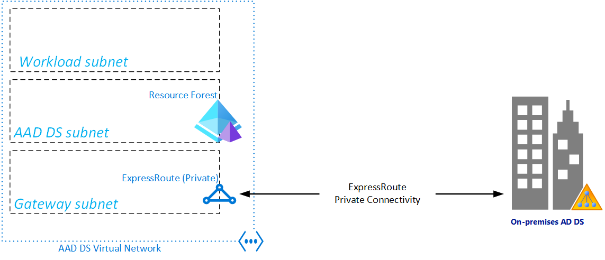
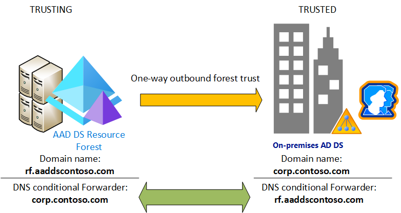

# Overview and planning considerations for resource forests in Azure Active Directory Domain Services

In environments where you can't synchronize password hashes, or you have users that exclusively sign in using smart cards so they don't know their password, you can use a resource forest in Azure Active Directory Domain Services (AD DS). A resource forest uses a one-way outbound trust from Azure AD DS to one or more on-premises AD DS environments. This trust relationship lets users, applications, and computers authenticate against an on-premises domain from the Azure AD DS managed domain. Azure AD DS resource forests are currently in preview.

This article details some of the planning considerations for virtual network connectivity, forest naming, and DNS. To get started with creating a resource forest and trust, or to learn more about the concepts that let this secure authentication happen, see the following additional articles:

* [Create a forest trust using the Azure portal][create-trust-portal]
* [Create a resource forest and trust using Azure PowerShell][create-trust-powershell]
* [What are resource forests?][concepts-forest]
* [How do forest trusts work in Azure AD DS?][concepts-trust]

## Networking considerations

The virtual network that hosts the Azure AD DS resource forest needs network connectivity to your on-premises Active Directory. Applications and services also need network connectivity to the virtual network hosting the Azure AD DS resource forest. Network connectivity to the Azure AD DS resource forest must be always on and stable otherwise users may fail to authenticate or access resources.

Before you configure a forest trust in Azure AD DS, make sure your networking between Azure and on-premises environment meets the following requirements:

* Use private IP addresses. Don't rely on DHCP with dynamic IP address assignment.
* Avoid overlapping IP address spaces to allow virtual network peering and routing to successfully communicate between Azure and on-premises.
* An Azure virtual network needs a gateway subnet to configure a site-to-site (S2S) VPN or ExpressRoute connection
* Create subnets with enough IP addresses to support your scenario.
* Make sure Azure AD DS has its own subnet, don't share this virtual network subnet with application VMs and services.
* Peered virtual networks are NOT transitive.
    * Azure virtual network peerings must be created between all virtual networks you want to use the Azure AD DS resource forest trust to the on-premises AD DS environment.
* Provide continuous network connectivity to your on-premises Active Directory forest. Don't use on-demand connections.
* Make sure there's continuous name resolution (DNS) between your Azure AD DS resource forest name and your on-premises Active Directory forest name.

The following example diagram shows an Azure ExpressRoute connection from the *Gateway* subnet for the Azure AD DS virtual network to the on-premises datacenter. An Azure Site-to-Site VPN connection could be used instead of ExpressRoute:

The hybrid network configuration is beyond the scope of this documentation, and may already exist in your environment. For details on specific scenarios, see the following articles:

* [Azure Site-to-Site VPN](/vpn-gateway/vpn-gateway-about-vpngateways).
* [Azure ExpressRoute Overview](/vpn-gateway/vpn-gateway-about-vpngateways).
* [Connect AWS VPC to Azure using Site-to-Site VPN](https://docs.aws.amazon.com/vpn/latest/s2svpn/VPC_VPN.html)

### Virtual Network

Your Azure AD DS resource forest needs an Azure virtual network for network connectivity. The `New-AaddsForest` PowerShell cmdlet can create the needed virtual network for you, or you can provide the name of an existing subnet. If you create a virtual networking using the `New-AaddsForest` cmdlet, make sure the previous network considerations are included.

### Subnets

The virtual network for Azure AD DS should include a minimum of two or three subnets:

| Purpose     | Description |
|:------------|:------------|
| Azure AD DS | This subnet exclusively hosts the Azure AD DS resource forest. Don't create your own VMs or attach other services to this subnet. |
| Workload    | This subnet hosts your own Azure VMs for virtualized applications and resources. |
| Gateway     | The subnet hosts the termination point for Azure Site-to-Site VPN or Azure ExpressRoute connection. In larger environments, this Site-to-Site VPN or ExpressRoute connection already exists in another virtual network. If so, use [Azure virtual network peering][network-peering] between this Azure AD DS virtual network and your Site-to-Site VPN or ExpressRoute virtual network.|

## Choose an Azure AD DS forest name

The Azure AD DS resource forest is a separate forest from your on-premises Active Directory. The Azure AD DS resource forest is only used to host resources and users that manage or connect to the forest in Azure. Users and groups are not replicated to the Azure AD DS resource forest from the on-premises AD DS. DNS resource records and zones also aren't replicated.

To establish a trust requires network connectivity and name resolution. The resource forest works like traditional Active Directory - it locates domains and domain controllers using DNS. For this name resolution to work correctly, the Azure AD DS resource forest name must be different from your on-premises Active Directory forest, including any child domains and other trusted forest names.

It's recommended to prefix your existing forest name with either *aadds* or *rf* and then optionally add another label to the left of the domain for additional uniqueness.

## Next steps

To learn more about resource forests and trusts, see [How do forest trusts work in Azure AD DS?][concepts-trust]

To get started with creating an Azure AD DS managed domain with a resource forest, see [Create and configure an Azure AD DS managed domain][tutorial-create-advanced].

<!-- LINKS - INTERNAL -->
[concepts-trust]: concepts-forest-trust.md
[tutorial-create-advanced]: tutorial-create-instance-advanced.md
[concepts-forest]: concepts-resource-forest.md
[create-trust-portal]: tutorial-create-forest-trust.md
[create-trust-powershell]: create-resource-forest-powershell.md
