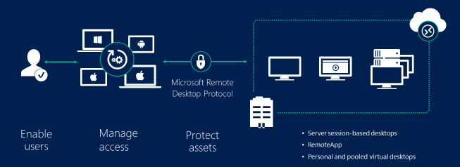

# Secure remote access to virtual machines in Azure Active Directory Domain Services

To secure remote access to virtual machines (VMs) that run in an Azure Active Directory Domain Services (Azure AD DS) managed domain, you can use Remote Desktop Services (RDS) and Network Policy Server (NPS). Azure AD DS authenticates users as they request access through the RDS environment. For enhanced security, you can integrate Azure Multi-Factor Authentication to provide an additional authentication prompt during sign-in events. Azure Multi-Factor Authentication uses an extension for NPS to provide this feature.

> [!IMPORTANT]
> The recommended way to securely connect to your VMs in an Azure AD DS managed domain is using Azure Bastion, a fully platform-managed PaaS service that you provision inside your virtual network. A bastion host provides secure and seamless Remote Desktop Protocol (RDP) connectivity to your VMs directly in the Azure portal over SSL. When you connect via a bastion host, your VMs don't need a public IP address, and you don't need to use network security groups to expose access to RDP on TCP port 3389.
>
> We strongly recommend that you use Azure Bastion in all regions where it's supported. In regions without Azure Bastion availability, follow the steps detailed in this article until Azure Bastion is available. Take care with assigning public IP addresses to VMs joined to Azure AD DS where all incoming RDP traffic is allowed.
>
> For more information, see [What is Azure Bastion?][bastion-overview].

This article shows you how to configure RDS in Azure AD DS and optionally use the Azure Multi-Factor Authentication NPS extension.



## Prerequisites

To complete this article, you need the following resources:

* An active Azure subscription.
    * If you don't have an Azure subscription, [create an account](https://azure.microsoft.com/free/?WT.mc_id=A261C142F).
* An Azure Active Directory tenant associated with your subscription, either synchronized with an on-premises directory or a cloud-only directory.
    * If needed, [create an Azure Active Directory tenant][create-azure-ad-tenant] or [associate an Azure subscription with your account][associate-azure-ad-tenant].
* An Azure Active Directory Domain Services managed domain enabled and configured in your Azure AD tenant.
    * If needed, [create and configure an Azure Active Directory Domain Services managed domain][create-azure-ad-ds-instance].
* A *workloads* subnet created in your Azure Active Directory Domain Services virtual network.
    * If needed, [Configure virtual networking for an Azure Active Directory Domain Services managed domain][configure-azureadds-vnet].
* A user account that's a member of the *Azure AD DC administrators* group in your Azure AD tenant.

## Deploy and configure the Remote Desktop environment

To get started, create a minimum of two Azure VMs that run Windows Server 2016 or Windows Server 2019. For redundancy and high availability of your Remote Desktop (RD) environment, you can add and load balance additional hosts later.

A suggested RDS deployment includes the following two VMs:

* *RDGVM01* - Runs the RD Connection Broker server, RD Web Access server, and RD Gateway server.
* *RDSHVM01* - Runs the RD Session Host server.

Make sure that VMs are deployed into a *workloads* subnet of your Azure AD DS virtual network, then join the VMs to managed domain. For more information, see how to [create and join a Windows Server VM to a managed domain][tutorial-create-join-vm].

The RD environment deployment contains a number of steps. The existing RD deployment guide can be used without any specific changes to use in a managed domain:

1. Sign in to VMs created for the RD environment with an account that's part of the *Azure AD DC Administrators* group, such as *contosoadmin*.
1. To create and configure RDS, use the existing [Remote Desktop environment deployment guide][deploy-remote-desktop]. Distribute the RD server components across your Azure VMs as desired.
    * Specific to Azure AD DS - when you configure RD licensing, set it to **Per Device** mode, not **Per User** as noted in the deployment guide.
1. If you want to provide access using a web browser, [set up the Remote Desktop web client for your users][rd-web-client].

With RD deployed into the managed domain, you can manage and use the service as you would with an on-premises AD DS domain.

## Deploy and configure NPS and the Azure MFA NPS extension

If you want to increase the security of the user sign-in experience, you can optionally integrate the RD environment with Azure Multi-Factor Authentication. With this configuration, users receive an additional prompt during sign-in to confirm their identity.

To provide this capability, an additional Network Policy Server (NPS) is installed in your environment along with the Azure Multi-Factor Authentication NPS extension. This extension integrates with Azure AD to request and return the status of multi-factor authentication prompts.

Users must be [registered to use Azure Multi-Factor Authentication][user-mfa-registration], which may require additional Azure AD licenses.

To integrate Azure Multi-Factor Authentication in to your Azure AD DS Remote Desktop environment, create an NPS Server and install the extension:

1. Create an additional Windows Server 2016 or 2019 VM, such as *NPSVM01*, that's connected to a *workloads* subnet in your Azure AD DS virtual network. Join the VM to the managed domain.
1. Sign in to NPS VM as account that's part of the *Azure AD DC Administrators* group, such as *contosoadmin*.
1. From **Server Manager**, select **Add Roles and Features**, then install the *Network Policy and Access Services* role.
1. Use the existing how-to article to [install and configure the Azure MFA NPS extension][nps-extension].

With the NPS server and Azure Multi-Factor Authentication NPS extension installed, complete the next section to configure it for use with the RD environment.

## Integrate Remote Desktop Gateway and Azure Multi-Factor Authentication

To integrate the Azure Multi-Factor Authentication NPS extension, use the existing how-to article to [integrate your Remote Desktop Gateway infrastructure using the Network Policy Server (NPS) extension and Azure AD][azure-mfa-nps-integration].

The following additional configuration options are needed to integrate with a managed domain:

1. Don't [register the NPS server in Active Directory][register-nps-ad]. This step fails in a managed domain.
1. In [step 4 to configure network policy][create-nps-policy], also check the box to **Ignore user account dial-in properties**.
1. If you use Windows Server 2019 for the NPS server and Azure Multi-Factor Authentication NPS extension, run the following command to update the secure channel to allow the NPS server to communicate correctly:

    ```powershell
    sc sidtype IAS unrestricted
    ```

Users are now prompted for an additional authentication factor when they sign in, such as a text message or prompt in the Microsoft Authenticator app.

## Next steps

For more information on improving resiliency of your deployment, see [Remote Desktop Services - High availability][rds-high-availability].

For more information about securing user sign-in, see [How it works: Azure Multi-Factor Authentication][concepts-mfa].

<!-- INTERNAL LINKS -->
[bastion-overview]: ../bastion/bastion-overview.md
[create-azure-ad-tenant]: ../active-directory/fundamentals/sign-up-organization.md
[associate-azure-ad-tenant]: ../active-directory/fundamentals/active-directory-how-subscriptions-associated-directory.md
[create-azure-ad-ds-instance]: tutorial-create-instance.md
[configure-azureadds-vnet]: tutorial-configure-networking.md
[tutorial-create-join-vm]: join-windows-vm.md
[user-mfa-registration]: ../active-directory/authentication/howto-mfa-nps-extension.md#register-users-for-mfa
[nps-extension]: ../active-directory/authentication/howto-mfa-nps-extension.md
[azure-mfa-nps-integration]: ../active-directory/authentication/howto-mfa-nps-extension-rdg.md
[register-nps-ad]:../active-directory/authentication/howto-mfa-nps-extension-rdg.md#register-server-in-active-directory
[create-nps-policy]: ../active-directory/authentication/howto-mfa-nps-extension-rdg.md#configure-network-policy
[concepts-mfa]: ../active-directory/authentication/concept-mfa-howitworks.md

<!-- EXTERNAL LINKS -->
[deploy-remote-desktop]: https://docs.microsoft.com/windows-server/remote/remote-desktop-services/rds-deploy-infrastructure
[rd-web-client]: https://docs.microsoft.com/windows-server/remote/remote-desktop-services/clients/remote-desktop-web-client-admin
[rds-high-availability]: https://docs.microsoft.com/windows-server/remote/remote-desktop-services/rds-plan-high-availability
