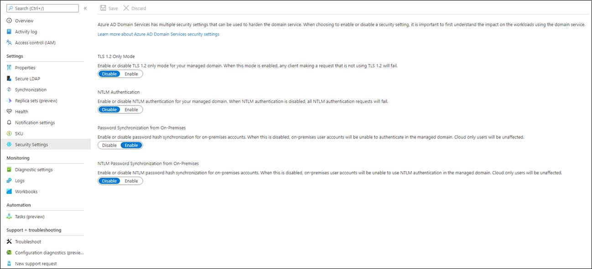
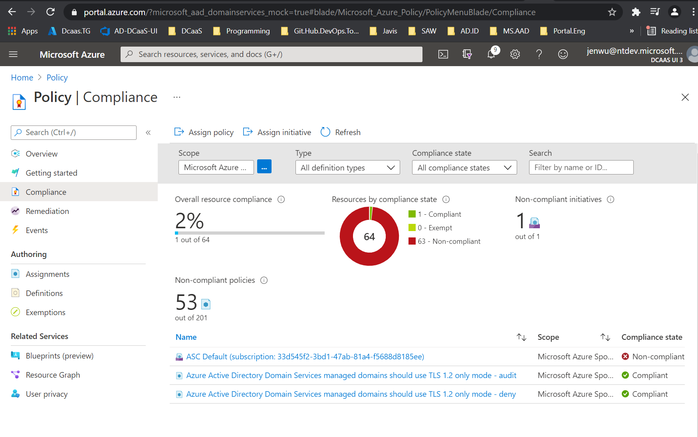

# Harden a Microsoft Entra Domain Services managed domain

By default, Microsoft Entra Domain Services enables the use of ciphers such as NTLM v1 and TLS v1. These ciphers may be required for some legacy applications, but are considered weak and can be disabled if you don't need them. If you have on-premises hybrid connectivity using Microsoft Entra Connect, you can also disable the synchronization of NTLM password hashes.

This article shows you how to harden a managed domain by using setting setting such as: 

- Disable NTLM v1 and TLS v1 ciphers
- Disable NTLM password hash synchronization
- Disable the ability to change passwords with RC4 encryption
- Enable Kerberos armoring
- LDAP signing 
- LDAP channel binding

## Prerequisites

To complete this article, you need the following resources:

* An active Azure subscription.
    * If you don't have an Azure subscription, [create an account](https://azure.microsoft.com/free/?WT.mc_id=A261C142F).
* A Microsoft Entra tenant associated with your subscription, either synchronized with an on-premises directory or a cloud-only directory.
    * If needed, [create a Microsoft Entra tenant][create-azure-ad-tenant] or [associate an Azure subscription with your account][associate-azure-ad-tenant].
* A Microsoft Entra Domain Services managed domain enabled and configured in your Microsoft Entra tenant.
    * If needed, [create and configure a Microsoft Entra Domain Services managed domain][create-azure-ad-ds-instance].

## Use Security settings to harden your domain

1. Sign in to the [Azure portal](https://portal.azure.com).
1. Search for and select **Microsoft Entra Domain Services**.
1. Choose your managed domain, such as *aaddscontoso.com*.
1. On the left-hand side, select **Security settings**.
1. Click **Enable** or **Disable** for the following settings:
   - **TLS 1.2 Only Mode**
   - **NTLM v1 Authentication**
   - **NTLM Password Synchronization**
   - **Kerberos RC4 Encryption**
   - **Kerberos Armoring**
   - **LDAP Signing**
   - **LDAP Channel Binding**

   

## Assign Azure Policy compliance for TLS 1.2 usage

In addition to **Security settings**, Microsoft Azure Policy has a **Compliance** setting to enforce TLS 1.2 usage. The policy has no impact until it is assigned. When the policy is assigned, it appears in **Compliance**:

- If the assignment is **Audit**, the compliance will report if the Domain Services instance is compliant.
- If the assignment is **Deny**, the compliance will prevent a Domain Services instance from being created if TLS 1.2 is not required and prevent any update to a Domain Services instance until TLS 1.2 is required.



## Audit NTLM failures

While disabling NTLM password synchronization will improve security, many applications and services are not designed to work without it. For example, connecting to any resource by its IP address, such as DNS Server management or RDP, will fail with Access Denied. If you disable NTLM password synchronization and your application or service isn’t working as expected, you can check for NTLM authentication failures by enabling security auditing for the **Logon/Logoff** > **Audit Logon** event category, where NTLM is specified as the **Authentication Package** in the event details. For more information, see [Enable security audits for Microsoft Entra Domain Services](security-audit-events.md).

## Use PowerShell to harden your domain

If needed, [install and configure Azure PowerShell](/powershell/azure/install-azure-powershell). Make sure that you sign in to your Azure subscription using the [Connect-AzAccount][Connect-AzAccount] cmdlet. 

Also if needed, [install and configure Azure AD PowerShell](/powershell/azure/active-directory/install-adv2). Make sure that you sign in to your Microsoft Entra tenant using the [Connect-AzureAD][Connect-AzureAD] cmdlet.

To disable weak cipher suites and NTLM credential hash synchronization, sign in to your Azure account, then get the Domain Services resource using the [Get-AzResource][Get-AzResource] cmdlet:

> [!TIP]
> If you receive an error using the [Get-AzResource][Get-AzResource] command that the *Microsoft.AAD/DomainServices* resource doesn't exist, [elevate your access to manage all Azure subscriptions and management groups][global-admin].

```powershell
Login-AzAccount

$DomainServicesResource = Get-AzResource -ResourceType "Microsoft.AAD/DomainServices"
```

Next, define *DomainSecuritySettings* to configure the following security options:

1. Disable NTLM v1 support.
2. Disable the synchronization of NTLM password hashes from your on-premises AD.
3. Disable TLS v1.

> [!IMPORTANT]
> Users and service accounts can't perform LDAP simple binds if you disable NTLM password hash synchronization in the Domain Services managed domain. If you need to perform LDAP simple binds, don't set the *"SyncNtlmPasswords"="Disabled";* security configuration option in the following command.

```powershell
$securitySettings = @{"DomainSecuritySettings"=@{"NtlmV1"="Disabled";"SyncNtlmPasswords"="Disabled";"TlsV1"="Disabled";"KerberosRc4Encryption"="Disabled";"KerberosArmoring"="Disabled"}}
```

Finally, apply the defined security settings to the managed domain using the [Set-AzResource][Set-AzResource] cmdlet. Specify the Domain Services resource from the first step, and the security settings from the previous step.

```powershell
Set-AzResource -Id $DomainServicesResource.ResourceId -Properties $securitySettings -ApiVersion “2021-03-01” -Verbose -Force
```

It takes a few moments for the security settings to be applied to the managed domain.

> [!IMPORTANT]
> After you disable NTLM, perform a full password hash synchronization in Microsoft Entra Connect to remove all the password hashes from the managed domain. If you disable NTLM but don't force a password hash sync, NTLM password hashes for a user account are only removed on the next password change. This behavior could allow a user to continue to sign in if they have cached credentials on a system where NTLM is used as the authentication method.
>
> Once the NTLM password hash is different from the Kerberos password hash, fallback to NTLM won't work. Cached credentials also no longer work if the VM has connectivity to the managed domain controller.  

## Next steps

To learn more about the synchronization process, see [How objects and credentials are synchronized in a managed domain][synchronization].

<!-- INTERNAL LINKS -->
[create-azure-ad-tenant]: /azure/active-directory/fundamentals/sign-up-organization
[associate-azure-ad-tenant]: /azure/active-directory/fundamentals/how-subscriptions-associated-directory
[create-azure-ad-ds-instance]: tutorial-create-instance.md
[global-admin]: /azure/role-based-access-control/elevate-access-global-admin
[synchronization]: synchronization.md

<!-- EXTERNAL LINKS -->
[Get-AzResource]: /powershell/module/az.resources/get-azresource
[Set-AzResource]: /powershell/module/az.resources/set-azresource
[Connect-AzAccount]: /powershell/module/Az.Accounts/Connect-AzAccount
[Connect-AzureAD]: /powershell/module/AzureAD/Connect-AzureAD
