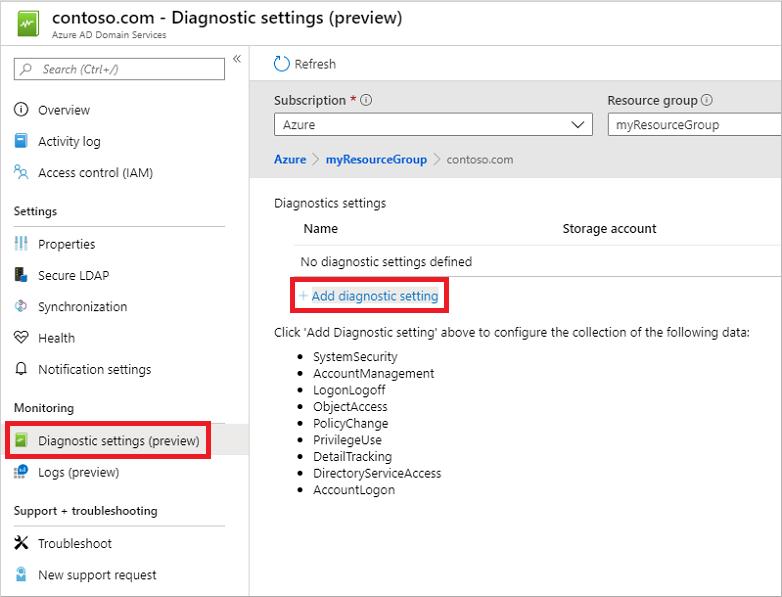
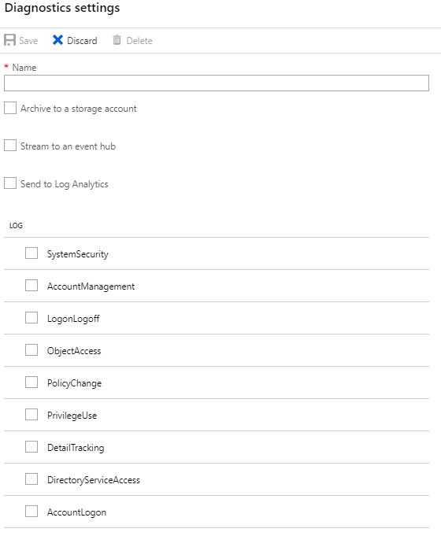

# Enable security audits for Azure Active Directory Domain Services

Azure Active Directory Domain Services (Azure AD DS) security audits lets Azure stream security events to targeted resources. These resources include Azure Storage, Azure Log Analytics workspaces, or Azure Event Hub. After you enable security audit events, Azure AD DS sends all the audited events for the selected category to the targeted resource.

You can archive events into Azure storage and stream events into security information and event management (SIEM) software (or equivalent) using Azure Event Hubs, or do your own analysis and using Azure Log Analytics workspaces from the Azure portal.

> [!IMPORTANT]
> Azure AD DS security audits are only available for Azure Resource Manager-based managed domains. For information on how to migrate, see [Migrate Azure AD DS from the Classic virtual network model to Resource Manager][migrate-azure-adds].

## Security audit destinations

You can use Azure Storage, Azure Event Hubs, or Azure Log Analytics workspaces as a target resource for Azure AD DS security audits. These destinations can be combined. For example, you could use Azure Storage for archiving security audit events, but an Azure Log Analytics workspace to analyze and report on the information in the short-term.

The following table outlines scenarios for each destination resource type.

> [!IMPORTANT]
> You need to create the target resource before you enable Azure AD DS security audits. You can create these resources using the Azure portal, Azure PowerShell, or the Azure CLI.

| Target Resource | Scenario |
|:---|:---|
|Azure Storage| This target should be used when your primary need is to store security audit events for archival purposes. Other targets can be used for archival purposes, however those targets provide capabilities beyond the primary need of archiving. <br /><br />Before you enable Azure AD DS security audit events, first [Create an Azure Storage account](../storage/common/storage-account-create.md).|
|Azure Event Hubs| This target should be used when your primary need is to share security audit events with additional software such as data analysis software or security information & event management (SIEM) software.<br /><br />Before you enable Azure AD DS security audit events, [Create an event hub using Azure portal](https://docs.microsoft.com/azure/event-hubs/event-hubs-create)|
|Azure Log Analytics Workspace| This target should be used when your primary need is to analyze and review secure audits from the Azure portal directly.<br /><br />Before you enable Azure AD DS security audit events, [Create a Log Analytics workspace in the Azure portal.](https://docs.microsoft.com/azure/azure-monitor/learn/quick-create-workspace)|

## Enable security audit events using the Azure portal

To enable Azure AD DS security audit events using the Azure portal, complete the following steps.

> [!IMPORTANT]
> Azure AD DS security audits aren't retroactive. You can't retrieve or replay events from the past. Azure AD DS can only send events that occur after security audits are enabled.

1. Sign in to the Azure portal at https://portal.azure.com.
1. At the top of the Azure portal, search for and select **Azure AD Domain Services**. Choose your managed domain, such as *aaddscontoso.com*.
1. In the Azure AD DS window, select **Diagnostic settings** on the left-hand side.
1. No diagnostics are configured by default. To get started, select **Add diagnostic setting**.

    

1. Enter a name for the diagnostic configuration, such as *aadds-auditing*.

    Check the box for the security audit destination you want. You can choose from an Azure Storage account, an Azure event hub, or a Log Analytics workspace. These destination resources must already exist in your Azure subscription. You can't create the destination resources in this wizard.

    

    * **Azure storage**
        * Select **Archive to a storage account**, then choose **Configure**.
        * Select the **Subscription** and the **Storage account** you want to use to archive security audit events.
        * When ready, choose **OK**.
    * **Azure event hubs**
        * Select **Stream to an event hub**, then choose **Configure**.
        * Select the **Subscription** and the **Event hub namespace**. If needed, also choose an **Event hub name** and then **Event hub policy name**.
        * When ready, choose **OK**.
    * **Azure Log Analytic workspaces**
        * Select **Send to Log Analytics**, then choose the **Subscription** and **Log Analytics Workspace** you want to use to store security audit events.

1. Select the log categories you want included for the particular target resource. If you send the audit events to an Azure Storage account, you can also configure a retention policy that defines the number of days to retain data. A default setting of *0* retains all data and doesn't rotate events after a period of time.

    You can select different log categories for each targeted resource within a single configuration. This ability lets you choose which logs categories you want to keep for Log Analytics and which logs categories your want to archive, for example.

1. When done, select **Save** to commit your changes. The target resources start to receive Azure AD DS security audit events soon after the configuration is saved.

## Enable security audit events using Azure PowerShell

To enable Azure AD DS security audit events using Azure PowerShell, complete the following steps. If needed, first [install the Azure PowerShell module and connect to your Azure subscription](/powershell/azure/install-az-ps).

> [!IMPORTANT]
> Azure AD DS security audits aren't retroactive. You can't retrieve or replay events from the past. Azure AD DS can only send events that occur after security audits are enabled.

1. Authenticate to your Azure subscription using the [Connect-AzAccount](/powershell/module/Az.Accounts/Connect-AzAccount) cmdlet. When prompted, enter your account credentials.

    ```azurepowershell
    Connect-AzAccount
    ```

1. Create the target resource for the security audit events.

    * **Azure storage** - [Create a storage account using Azure PowerShell](../storage/common/storage-account-create.md?tabs=azure-powershell)
    * **Azure event hubs** - [Create an event hub using Azure PowerShell](../event-hubs/event-hubs-quickstart-powershell.md). You may also need to use the [New-AzEventHubAuthorizationRule](/powershell/module/az.eventhub/new-azeventhubauthorizationrule) cmdlet to create an authorization rule that grants Azure AD DS permissions to the event hub *namespace*. The authorization rule must include the **Manage**, **Listen**, and **Send** rights.

        > [!IMPORTANT]
        > Ensure you set the authorization rule on the event hub namespace and not the event hub itself.

    * **Azure Log Analytic workspaces** - [Create a Log Analytics workspace with Azure PowerShell](../azure-monitor/learn/quick-create-workspace-posh.md).

1. Get the resource ID for your Azure AD DS managed domain using the [Get-AzResource](/powershell/module/Az.Resources/Get-AzResource) cmdlet. Create a variable named *$aadds.ResourceId* to hold the value:

    ```azurepowershell
    $aadds = Get-AzResource -name aaddsDomainName
    ```

1. Configure the Azure Diagnostic settings using the [Set-AzDiagnosticSetting](/powershell/module/Az.Monitor/Set-AzDiagnosticSetting) cmdlet to use the target resource for Azure AD Domain Services security audit events. In the following examples, the variable *$aadds.ResourceId* is used from the previous step.

    * **Azure storage** - Replace *storageAccountId* with your storage account name:

        ```powershell
        Set-AzDiagnosticSetting `
            -ResourceId $aadds.ResourceId `
            -StorageAccountId storageAccountId `
            -Enabled $true
        ```

    * **Azure event hubs** - Replace *eventHubName* with the name of your event hub and *eventHubRuleId* with your authorization rule ID:

        ```powershell
        Set-AzDiagnosticSetting -ResourceId $aadds.ResourceId `
            -EventHubName eventHubName `
            -EventHubAuthorizationRuleId eventHubRuleId `
            -Enabled $true
        ```

    * **Azure Log Analytic workspaces** - Replace *workspaceId* with the ID of the Log Analytics workspace:

        ```powershell
        Set-AzureRmDiagnosticSetting -ResourceId $aadds.ResourceId `
            -WorkspaceID workspaceId `
            -Enabled $true
        ```

## Query and view security audit events using Azure Monitor

Log Analytic workspaces let you view and analyze the security audit events using Azure Monitor and the Kusto query language. This query language is designed for read-only use that boasts power analytic capabilities with an easy-to-read syntax. For more information to get started with Kusto query languages, see the following articles:

* [Azure Monitor documentation](https://docs.microsoft.com/azure/azure-monitor/)
* [Get started with Log Analytics in Azure Monitor](../azure-monitor/log-query/get-started-portal.md)
* [Get started with log queries in Azure Monitor](../azure-monitor/log-query/get-started-queries.md)
* [Create and share dashboards of Log Analytics data](../azure-monitor/learn/tutorial-logs-dashboards.md)

The following sample queries can be used to start analyzing security audit events from Azure AD DS.

### Sample query 1

View all the account lockout events for the last seven days:

```Kusto
AADDomainServicesAccountManagement
| where TimeGenerated >= ago(7d)
| where OperationName has "4740"
```

### Sample query 2

View all the account lockout events (*4740*) between February 3, 2020 at 9 a.m. and February 10, 2020 midnight, sorted ascending by the date and time:

```Kusto
AADDomainServicesAccountManagement
| where TimeGenerated >= datetime(2020-02-03 09:00) and TimeGenerated <= datetime(2020-02-10)
| where OperationName has "4740"
| sort by TimeGenerated asc
```

### Sample query 3

View account sign-in events seven days ago (from now) for the account named user:

```Kusto
AADDomainServicesAccountLogon
| where TimeGenerated >= ago(7d)
| where "user" == tolower(extract("Logon Account:\t(.+[0-9A-Za-z])",1,tostring(ResultDescription)))
```

### Sample query 4

View account sign-in events seven days ago from now for the account named user that attempted to sign in using a bad password (*0xC0000006a*):

```Kusto
AADDomainServicesAccountLogon
| where TimeGenerated >= ago(7d)
| where "user" == tolower(extract("Logon Account:\t(.+[0-9A-Za-z])",1,tostring(ResultDescription)))
| where "0xc000006a" == tolower(extract("Error Code:\t(.+[0-9A-Za-z])",1,tostring(ResultDescription)))
```

### Sample query 5

View account sign-in events seven days ago from now for the account named user that attempted to sign in while the account was locked out (*0xC0000234*):

```Kusto
AADDomainServicesAccountLogon
| where TimeGenerated >= ago(7d)
| where "user" == tolower(extract("Logon Account:\t(.+[0-9A-Za-z])",1,tostring(ResultDescription)))
| where "0xc0000234" == tolower(extract("Error Code:\t(.+[0-9A-Za-z])",1,tostring(ResultDescription)))
```

### Sample query 6

View the number of account sign-in events seven days ago from now for all sign-in attempts that occurred for all locked out users:

```Kusto
AADDomainServicesAccountLogon
| where TimeGenerated >= ago(7d)
| where "0xc0000234" == tolower(extract("Error Code:\t(.+[0-9A-Za-z])",1,tostring(ResultDescription)))
| summarize count()
```

## Audit event categories

Azure AD DS security audits align with traditional auditing for traditional AD DS domain controllers. In hybrid environments, you can reuse existing audit patterns so the same logic may be used when analyzing the events. Depending on the scenario you need to troubleshoot or analyze, the different audit event categories need to be targeted.

The following audit event categories are available:

| Audit Category Name | Description |
|:---|:---|
| Account Logon|Audits attempts to authenticate account data on a domain controller or on a local Security Accounts Manager (SAM).</p>Logon and Logoff policy settings and events track attempts to access a particular computer. Settings and events in this category focus on the account database that is used. This category includes the following subcategories:<ul><li>[Audit Credential Validation](https://docs.microsoft.com/windows/security/threat-protection/auditing/audit-credential-validation)</li><li>[Audit Kerberos Authentication Service](https://docs.microsoft.com/windows/security/threat-protection/auditing/audit-kerberos-authentication-service)</li><li>[Audit Kerberos Service Ticket Operations](https://docs.microsoft.com/windows/security/threat-protection/auditing/audit-kerberos-service-ticket-operations)</li><li>[Audit Other Logon/Logoff Events](https://docs.microsoft.com/windows/security/threat-protection/auditing/audit-other-logonlogoff-events)</li></ul>|
| Account Management|Audits changes to user and computer accounts and groups. This category includes the following subcategories:<ul><li>[Audit Application Group Management](https://docs.microsoft.com/windows/security/threat-protection/auditing/audit-application-group-management)</li><li>[Audit Computer Account Management](https://docs.microsoft.com/windows/security/threat-protection/auditing/audit-computer-account-management)</li><li>[Audit Distribution Group Management](https://docs.microsoft.com/windows/security/threat-protection/auditing/audit-distribution-group-management)</li><li>[Audit Other Account Management](https://docs.microsoft.com/windows/security/threat-protection/auditing/audit-other-account-management-events)</li><li>[Audit Security Group Management](https://docs.microsoft.com/windows/security/threat-protection/auditing/audit-security-group-management)</li><li>[Audit User Account Management](https://docs.microsoft.com/windows/security/threat-protection/auditing/audit-user-account-management)</li></ul>|
| Detail Tracking|Audits activities of individual applications and users on that computer, and to understand how a computer is being used. This category includes the following subcategories:<ul><li>[Audit DPAPI Activity](https://docs.microsoft.com/windows/security/threat-protection/auditing/audit-dpapi-activity)</li><li>[Audit PNP activity](https://docs.microsoft.com/windows/security/threat-protection/auditing/audit-pnp-activity)</li><li>[Audit Process Creation](https://docs.microsoft.com/windows/security/threat-protection/auditing/audit-process-creation)</li><li>[Audit Process Termination](https://docs.microsoft.com/windows/security/threat-protection/auditing/audit-process-termination)</li><li>[Audit RPC Events](https://docs.microsoft.com/windows/security/threat-protection/auditing/audit-rpc-events)</li></ul>|
| Directory Services Access|Audits attempts to access and modify objects in Active Directory Domain Services (AD DS). These audit events are logged only on domain controllers. This category includes the following subcategories:<ul><li>[Audit Detailed Directory Service Replication](https://docs.microsoft.com/windows/security/threat-protection/auditing/audit-detailed-directory-service-replication)</li><li>[Audit Directory Service Access](https://docs.microsoft.com/windows/security/threat-protection/auditing/audit-directory-service-access)</li><li>[Audit Directory Service Changes](https://docs.microsoft.com/windows/security/threat-protection/auditing/audit-directory-service-changes)</li><li>[Audit Directory Service Replication](https://docs.microsoft.com/windows/security/threat-protection/auditing/audit-directory-service-replication)</li></ul>|
| Logon-Logoff|Audits attempts to log on to a computer interactively or over a network. These events are useful for tracking user activity and identifying potential attacks on network resources. This category includes the following subcategories:<ul><li>[Audit Account Lockout](https://docs.microsoft.com/windows/security/threat-protection/auditing/audit-account-lockout)</li><li>[Audit User/Device Claims](https://docs.microsoft.com/windows/security/threat-protection/auditing/audit-user-device-claims)</li><li>[Audit IPsec Extended Mode](https://docs.microsoft.com/windows/security/threat-protection/auditing/audit-ipsec-extended-mode)</li><li>[Audit Group Membership](https://docs.microsoft.com/windows/security/threat-protection/auditing/audit-group-membership)</li><li>[Audit IPsec Main Mode](https://docs.microsoft.com/windows/security/threat-protection/auditing/audit-ipsec-main-mode)</li><li>[Audit IPsec Quick Mode](https://docs.microsoft.com/windows/security/threat-protection/auditing/audit-ipsec-quick-mode)</li><li>[Audit Logoff](https://docs.microsoft.com/windows/security/threat-protection/auditing/audit-logoff)</li><li>[Audit Logon](https://docs.microsoft.com/windows/security/threat-protection/auditing/audit-logon)</li><li>[Audit Network Policy Server](https://docs.microsoft.com/windows/security/threat-protection/auditing/audit-network-policy-server)</li><li>[Audit Other Logon/Logoff Events](https://docs.microsoft.com/windows/security/threat-protection/auditing/audit-other-logonlogoff-events)</li><li>[Audit Special Logon](https://docs.microsoft.com/windows/security/threat-protection/auditing/audit-special-logon)</li></ul>|
|Object Access| Audits attempts to access specific objects or types of objects on a network or computer. This category includes the following subcategories:<ul><li>[Audit Application Generated](https://docs.microsoft.com/windows/security/threat-protection/auditing/audit-application-generated)</li><li>[Audit Certification Services](https://docs.microsoft.com/windows/security/threat-protection/auditing/audit-certification-services)</li><li>[Audit Detailed File Share](https://docs.microsoft.com/windows/security/threat-protection/auditing/audit-detailed-file-share)</li><li>[Audit File Share](https://docs.microsoft.com/windows/security/threat-protection/auditing/audit-file-share)</li><li>[Audit File System](https://docs.microsoft.com/windows/security/threat-protection/auditing/audit-file-system)</li><li>[Audit Filtering Platform Connection](https://docs.microsoft.com/windows/security/threat-protection/auditing/audit-filtering-platform-connection)</li><li>[Audit Filtering Platform Packet Drop](https://docs.microsoft.com/windows/security/threat-protection/auditing/audit-filtering-platform-packet-drop)</li><li>[Audit Handle Manipulation](https://docs.microsoft.com/windows/security/threat-protection/auditing/audit-handle-manipulation)</li><li>[Audit Kernel Object](https://docs.microsoft.com/windows/security/threat-protection/auditing/audit-kernel-object)</li><li>[Audit Other Object Access Events](https://docs.microsoft.com/windows/security/threat-protection/auditing/audit-other-object-access-events)</li><li>[Audit Registry](https://docs.microsoft.com/windows/security/threat-protection/auditing/audit-registry)</li><li>[Audit Removable Storage](https://docs.microsoft.com/windows/security/threat-protection/auditing/audit-removable-storage)</li><li>[Audit SAM](https://docs.microsoft.com/windows/security/threat-protection/auditing/audit-sam)</li><li>[Audit Central Access Policy Staging](https://docs.microsoft.com/windows/security/threat-protection/auditing/audit-central-access-policy-staging)</li></ul>|
|Policy Change|Audits changes to important security policies on a local system or network. Policies are typically established by administrators to help secure network resources. Monitoring changes or attempts to change these policies can be an important aspect of security management for a network. This category includes the following subcategories:<ul><li>[Audit Audit Policy Change](https://docs.microsoft.com/windows/security/threat-protection/auditing/audit-audit-policy-change)</li><li>[Audit Authentication Policy Change](https://docs.microsoft.com/windows/security/threat-protection/auditing/audit-authentication-policy-change)</li><li>[Audit Authorization Policy Change](https://docs.microsoft.com/windows/security/threat-protection/auditing/audit-authorization-policy-change)</li><li>[Audit Filtering Platform Policy Change](https://docs.microsoft.com/windows/security/threat-protection/auditing/audit-filtering-platform-policy-change)</li><li>[Audit MPSSVC Rule-Level Policy Change](https://docs.microsoft.com/windows/security/threat-protection/auditing/audit-mpssvc-rule-level-policy-change)</li><li>[Audit Other Policy Change](https://docs.microsoft.com/windows/security/threat-protection/auditing/audit-other-policy-change-events)</li></ul>|
|Privilege Use| Audits the use of certain permissions on one or more systems. This category includes the following subcategories:<ul><li>[Audit Non-Sensitive Privilege Use](https://docs.microsoft.com/windows/security/threat-protection/auditing/audit-non-sensitive-privilege-use)</li><li>[Audit Sensitive Privilege Use](https://docs.microsoft.com/windows/security/threat-protection/auditing/audit-sensitive-privilege-use)</li><li>[Audit Other Privilege Use Events](https://docs.microsoft.com/windows/security/threat-protection/auditing/audit-other-privilege-use-events)</li></ul>|
|System| Audits system-level changes to a computer not included in other categories and that have potential security implications. This category includes the following subcategories:<ul><li>[Audit IPsec Driver](https://docs.microsoft.com/windows/security/threat-protection/auditing/audit-ipsec-driver)</li><li>[Audit Other System Events](https://docs.microsoft.com/windows/security/threat-protection/auditing/audit-other-system-events)</li><li>[Audit Security State Change](https://docs.microsoft.com/windows/security/threat-protection/auditing/audit-security-state-change)</li><li>[Audit Security System Extension](https://docs.microsoft.com/windows/security/threat-protection/auditing/audit-security-system-extension)</li><li>[Audit System Integrity](https://docs.microsoft.com/windows/security/threat-protection/auditing/audit-system-integrity)</li></ul>|

## Event IDs per category

 Azure AD DS security audits record the following event IDs when the specific action triggers an auditable event:

| Event Category Name | Event IDs |
|:---|:---|
|Account Logon security|4767, 4774, 4775, 4776, 4777|
|Account Management security|4720, 4722, 4723, 4724, 4725, 4726, 4727, 4728, 4729, 4730, 4731, 4732, 4733, 4734, 4735, 4737, 4738, 4740, 4741, 4742, 4743, 4754, 4755, 4756, 4757, 4758, 4764, 4765, 4766, 4780, 4781, 4782, 4793, 4798, 4799, 5376, 5377|
|Detail Tracking security|None|
|DS Access security|5136, 5137, 5138, 5139, 5141|
|Logon-Logoff security|4624, 4625, 4634, 4647, 4648, 4672, 4675, 4964|
|Object Access security|None|
|Policy Change security|4670, 4703, 4704, 4705, 4706, 4707, 4713, 4715, 4716, 4717, 4718, 4719, 4739, 4864, 4865, 4866, 4867, 4904, 4906, 4911, 4912|
|Privilege Use security|4985|
|System security|4612, 4621|

## Next steps

For specific information on Kusto, see the following articles:

* [Overview](/azure/kusto/query/) of the Kusto query language.
* [Kusto tutorial](/azure/kusto/query/tutorial) to familiarize you with query basics.
* [Sample queries](/azure/kusto/query/samples) that help you learn new ways to see your data.
* Kusto [best practices](/azure/kusto/query/best-practices) to optimize your queries for success.

<!-- LINKS - Internal -->
[migrate-azure-adds]: migrate-from-classic-vnet.md
