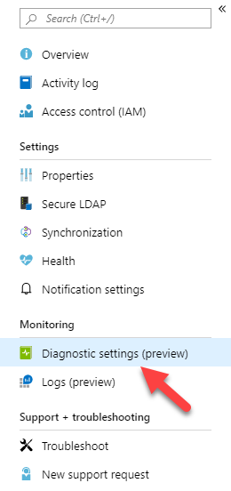
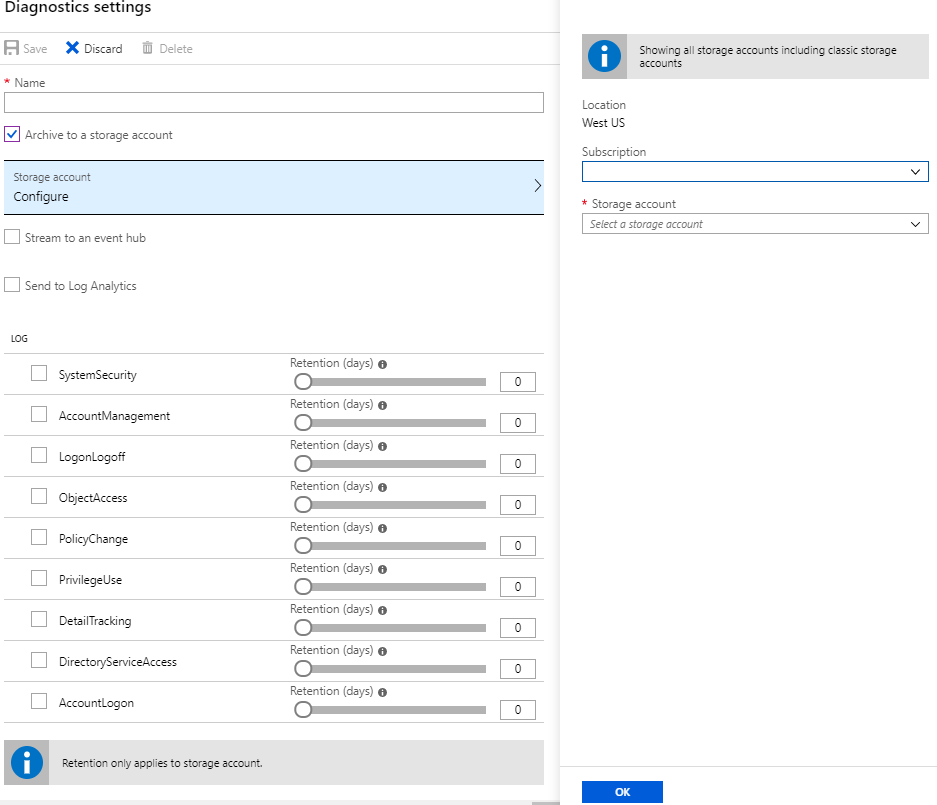
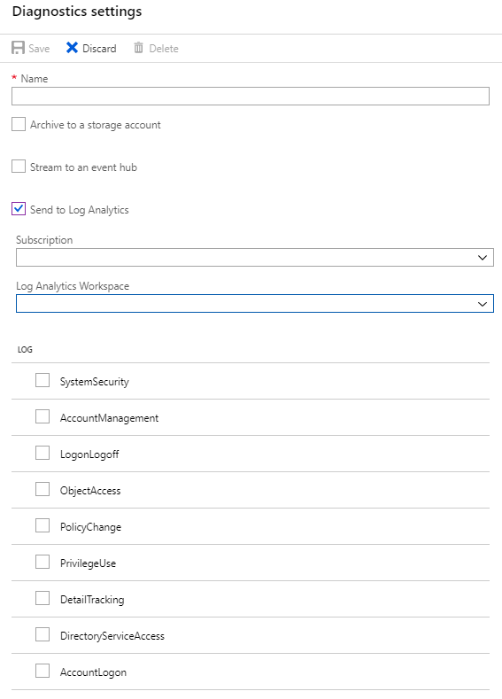

# Enable Security Audits for Azure AD Domain Services (Preview)
Azure AD Domain Service Security Auditing enables customers to use the Azure AD Domain Service portal to stream security audit events to targeted resources. Resources that can receive these events include Azure Storage, Azure Log Analytics workspaces, or Azure Event Hub. Shortly after enabling security audit events, Azure AD Domain Service sends all the audited events for the selected category to the targeted resource. Security audit events  enable customers to archive audited events into Azure storage. Additionally, customers can stream events into security information and event management (SIEM) software (or equivalent) using event hubs, or do their own analysis and insights using Azure Log Analytics from the Azure portal. 

> [!IMPORTANT]
> Azure AD Domain Services security auditing is available only on Azure Resource Manager-based instances for Azure AD Domain Services.
>
>

## Auditing event categories
Azure AD Domain Services security auditing aligns with traditional auditing that comes for Active Directory Domain Services domain controllers. Reusing existing audit patterns ensures the same logic may be used when analyzing the events. Azure AD Domain Services security auditing includes the following event categories.

| Audit Category Name | Description |
|:---|:---|
| Account Logon|Audits attempts to authenticate account data on a domain controller or on a local Security Accounts Manager (SAM).</p>Logon and Logoff policy settings and events track attempts to access a particular computer. Settings and events in this category focus on the account database that is used. This category includes the following subcategories:<ul><li>[Audit Credential Validation](https://docs.microsoft.com/windows/security/threat-protection/auditing/audit-credential-validation)</li><li>[Audit Kerberos Authentication Service](https://docs.microsoft.com/windows/security/threat-protection/auditing/audit-kerberos-authentication-service)</li><li>[Audit Kerberos Service Ticket Operations](https://docs.microsoft.com/windows/security/threat-protection/auditing/audit-kerberos-service-ticket-operations)</li><li>[Audit Other Logon/Logoff Events](https://docs.microsoft.com/windows/security/threat-protection/auditing/audit-other-logonlogoff-events)</li></ul>|
| Account Management|Audits changes to user and computer accounts and groups. This category includes the following subcategories:<ul><li>[Audit Application Group Management](https://docs.microsoft.com/windows/security/threat-protection/auditing/audit-application-group-management)</li><li>[Audit Computer Account Management](https://docs.microsoft.com/windows/security/threat-protection/auditing/audit-computer-account-management)</li><li>[Audit Distribution Group Management](https://docs.microsoft.com/windows/security/threat-protection/auditing/audit-distribution-group-management)</li><li>[Audit Other Account Management](https://docs.microsoft.com/windows/security/threat-protection/auditing/audit-other-account-management-events)</li><li>[Audit Security Group Management](https://docs.microsoft.com/windows/security/threat-protection/auditing/audit-security-group-management)</li><li>[Audit User Account Management](https://docs.microsoft.com/windows/security/threat-protection/auditing/audit-user-account-management)</li></ul>|
| Detail Tracking|Audits activities of individual applications and users on that computer, and to understand how a computer is being used. This category includes the following subcategories:<ul><li>[Audit DPAPI Activity](https://docs.microsoft.com/windows/security/threat-protection/auditing/audit-dpapi-activity)</li><li>[Audit PNP activity](https://docs.microsoft.com/windows/security/threat-protection/auditing/audit-pnp-activity)</li><li>[Audit Process Creation](https://docs.microsoft.com/windows/security/threat-protection/auditing/audit-process-creation)</li><li>[Audit Process Termination](https://docs.microsoft.com/windows/security/threat-protection/auditing/audit-process-termination)</li><li>[Audit RPC Events](https://docs.microsoft.com/windows/security/threat-protection/auditing/audit-rpc-events)</li></ul>|
| Directory Services Access|Audits attempts to access and modify objects in Active Directory Domain Services (AD DS). These audit events are logged only on domain controllers. This category includes the following subcategories:<ul><li>[Audit Detailed Directory Service Replication](https://docs.microsoft.com/windows/security/threat-protection/auditing/audit-detailed-directory-service-replication)</li><li>[Audit Directory Service Access](https://docs.microsoft.com/windows/security/threat-protection/auditing/audit-directory-service-access)</li><li>[Audit Directory Service Changes](https://docs.microsoft.com/windows/security/threat-protection/auditing/audit-directory-service-changes)</li><li>[Audit Directory Service Replication](https://docs.microsoft.com/windows/security/threat-protection/auditing/audit-directory-service-replication)</li></ul>|
| Logon-Logoff|Audits attempts to log on to a computer interactively or over a network. These events are useful for tracking user activity and identifying potential attacks on network resources. This category includes the following subcategories:<ul><li>[Audit Account Lockout](https://docs.microsoft.com/windows/security/threat-protection/auditing/audit-account-lockout)</li><li>[Audit User/Device Claims](https://docs.microsoft.com/windows/security/threat-protection/auditing/audit-user-device-claims)</li><li>[Audit IPsec Extended Mode](https://docs.microsoft.com/windows/security/threat-protection/auditing/audit-ipsec-extended-mode)</li><li>[Audit Group Membership](https://docs.microsoft.com/windows/security/threat-protection/auditing/audit-group-membership)</li><li>[Audit IPsec Main Mode](https://docs.microsoft.com/windows/security/threat-protection/auditing/audit-ipsec-main-mode)</li><li>[Audit IPsec Quick Mode](https://docs.microsoft.com/windows/security/threat-protection/auditing/audit-ipsec-quick-mode)</li><li>[Audit Logoff](https://docs.microsoft.com/windows/security/threat-protection/auditing/audit-logoff)</li><li>[Audit Logon](https://docs.microsoft.com/windows/security/threat-protection/auditing/audit-logon)</li><li>[Audit Network Policy Server](https://docs.microsoft.com/windows/security/threat-protection/auditing/audit-network-policy-server)</li><li>[Audit Other Logon/Logoff Events](https://docs.microsoft.com/windows/security/threat-protection/auditing/audit-other-logonlogoff-events)</li><li>[Audit Special Logon](https://docs.microsoft.com/windows/security/threat-protection/auditing/audit-special-logon)</li></ul>|
|Object Access| Audits attempts to access specific objects or types of objects on a network or computer. This category includes the following subcategories:<ul><li>[Audit Application Generated](https://docs.microsoft.com/windows/security/threat-protection/auditing/audit-application-generated)</li><li>[Audit Certification Services](https://docs.microsoft.com/windows/security/threat-protection/auditing/audit-certification-services)</li><li>[Audit Detailed File Share](https://docs.microsoft.com/windows/security/threat-protection/auditing/audit-detailed-file-share)</li><li>[Audit File Share](https://docs.microsoft.com/windows/security/threat-protection/auditing/audit-file-share)</li><li>[Audit File System](https://docs.microsoft.com/windows/security/threat-protection/auditing/audit-file-system)</li><li>[Audit Filtering Platform Connection](https://docs.microsoft.com/windows/security/threat-protection/auditing/audit-filtering-platform-connection)</li><li>[Audit Filtering Platform Packet Drop](https://docs.microsoft.com/windows/security/threat-protection/auditing/audit-filtering-platform-packet-drop)</li><li>[Audit Handle Manipulation](https://docs.microsoft.com/windows/security/threat-protection/auditing/audit-handle-manipulation)</li><li>[Audit Kernel Object](https://docs.microsoft.com/windows/security/threat-protection/auditing/audit-kernel-object)</li><li>[Audit Other Object Access Events](https://docs.microsoft.com/windows/security/threat-protection/auditing/audit-other-object-access-events)</li><li>[Audit Registry](https://docs.microsoft.com/windows/security/threat-protection/auditing/audit-registry)</li><li>[Audit Removable Storage](https://docs.microsoft.com/windows/security/threat-protection/auditing/audit-removable-storage)</li><li>[Audit SAM](https://docs.microsoft.com/windows/security/threat-protection/auditing/audit-sam)</li><li>[Audit Central Access Policy Staging](https://docs.microsoft.com/windows/security/threat-protection/auditing/audit-central-access-policy-staging)</li></ul>|
|Policy Change|Audits changes to important security policies on a local system or network. Policies are typically established by administrators to help secure network resources. Monitoring changes or attempts to change these policies can be an important aspect of security management for a network. This category includes the following subcategories:<ul><li>[Audit Audit Policy Change](https://docs.microsoft.com/windows/security/threat-protection/auditing/audit-audit-policy-change)</li><li>[Audit Authentication Policy Change](https://docs.microsoft.com/windows/security/threat-protection/auditing/audit-authentication-policy-change)</li><li>[Audit Authorization Policy Change](https://docs.microsoft.com/windows/security/threat-protection/auditing/audit-authorization-policy-change)</li><li>[Audit Filtering Platform Policy Change](https://docs.microsoft.com/windows/security/threat-protection/auditing/audit-filtering-platform-policy-change)</li><li>[Audit MPSSVC Rule-Level Policy Change](https://docs.microsoft.com/windows/security/threat-protection/auditing/audit-mpssvc-rule-level-policy-change)</li><li>[Audit Other Policy Change](https://docs.microsoft.com/windows/security/threat-protection/auditing/audit-other-policy-change-events)</li></ul>|
|Privilege Use| Audits the use of certain permissions on one or more systems. This category includes the following subcategories:<ul><li>[Audit Non-Sensitive Privilege Use](https://docs.microsoft.com/windows/security/threat-protection/auditing/audit-non-sensitive-privilege-use)</li><li>[Audit Sensitive Privilege Use](https://docs.microsoft.com/windows/security/threat-protection/auditing/audit-sensitive-privilege-use)</li><li>[Audit Other Privilege Use Events](https://docs.microsoft.com/windows/security/threat-protection/auditing/audit-other-privilege-use-events)</li></ul>|
|System| Audits system-level changes to a computer not included in other categories and that have potential security implications. This category includes the following subcategories:<ul><li>[Audit IPsec Driver](https://docs.microsoft.com/windows/security/threat-protection/auditing/audit-ipsec-driver)</li><li>[Audit Other System Events](https://docs.microsoft.com/windows/security/threat-protection/auditing/audit-other-system-events)</li><li>[Audit Security State Change](https://docs.microsoft.com/windows/security/threat-protection/auditing/audit-security-state-change)</li><li>[Audit Security System Extension](https://docs.microsoft.com/windows/security/threat-protection/auditing/audit-security-system-extension)</li><li>[Audit System Integrity](https://docs.microsoft.com/windows/security/threat-protection/auditing/audit-system-integrity)</li></ul>|

## Event IDs per category
 Azure AD Domain Services security auditing records the following event IDs when the specific action triggers an auditable event.

| Event Category Name | Event IDs |
|:---|:---|
|Account Logon security|4767, 4774, 4775, 4776, 4777|
|Account Management security|4720, 4722, 4723, 4724, 4725, 4726, 4727, 4728, 4729, 4730, 4731, 4732, 4733, 4734, 4735, 4737, 4738, 4740, 4741, 4742, 4743, 4754, 4755, 4756, 4757, 4758, 4764, 4765, 4766, 4780, 4781, 4782, 4793, 4798, 4799, 5376, 5377|
|Detail Tracking security|None|
|DS Access security|5136, 5137, 5138, 5139, 5141|
|Logon-Logoff security|4624, 4625, 4634, 4647, 4648, 4672, 4675, 4964|
|Object Access security|None|
|Policy Change security|4670, 4703, 4704, 4705, 4706, 4707, 4713, 4715, 4716, 4717, 4718, 4719, 4739, 4864, 4865, 4866, 4867, 4904, 4906, 4911, 4912|
|Privilege Use security|4985|
|System security|4612, 4621|

## Enable security audit events
The following guidance helps you to successfully subscribe to Azure AD Domain Services security audit events.

> [!IMPORTANT]
> Azure AD Domain Services security audits are not retroactive. It is not possible to retrieve events from the past or to replay events from the past. The service can only send events that occur after it is enabled.
>

### Choose the target resource
You can use any combination of Azure Storage, Azure Event Hubs, or Azure Log Analytics Workspaces as a target resource for your security audits. Consider the following table for the best resource for your use case.

> [!IMPORTANT]
> You need to create the target resource before you enable Azure AD Domain Services security audits.
>

| Target Resource | Scenario |
|:---|:---|
|Azure Storage|Consider using this target when your primary need is to store security audit events for archival purposes. Other targets can be used for archival purposes; however, those targets provide capabilities beyond the primary need of archiving. To create an Azure Storage account, follow [Create a storage account.](https://docs.microsoft.com/azure/storage/common/storage-quickstart-create-account?tabs=azure-portal#create-a-storage-account-1)|
|Azure Event Hubs|Consider using this target when your primary need is to share security audit events with additional software such as data analysis software or security information & event management (SIEM) software. To create an event hub, follow [Quickstart: Create an event hub using Azure portal.](https://docs.microsoft.com/azure/event-hubs/event-hubs-create)|
|Azure Log Analytics Workspace|Consider using this target when your primary need is to analyze and review secure audits from the Azure portal directly.  To create a Log Analytics workspace, follow [Create a Log Analytics workspace in the Azure portal.](https://docs.microsoft.com/azure/azure-monitor/learn/quick-create-workspace)|

## Using the Azure portal to enable security audit events 
1. Sign in to the Azure portal at https://portal.azure.com.  In the Azure portal, click All services. In the list of resources, type **Domain**. As you begin typing, the list filters based on your input. Click **Azure AD Domain Services**.
2. Click the Azure AD Domain Services instance from the list.
3. Click **Diagnostic settings (preview)** from the list of actions on the left.</p>

4. Type the name of diagnostic configuration (**aadds-auditing** as an example).</p>

5. Select the appropriate checkbox next to the targeted resources you'll use with security audit events.
    > [!NOTE]
    > You cannot create  target resources from this page.
    >
    
    **Azure storage:**</p>
    Select **Archive to a storage account**. Click **Configure**. Select the **subscription** and the **storage account** you want to use to archive security auditing events. Click **OK**.</p>
    
    
    
    **Azure event hubs:**</p>
    Select **Stream to an event hub**. Click **Configure**. In the **Select event hub page**, select the **subscription** used to create the event hub. Next, select the **event hub namespace**, **event hub name**, and **event hub policy name**. Click **OK**.</p>
    
    
    **Azure Log Analytic workspaces:**</p>
    Select **Send to Log Analytics**. Select the **Subscription** and **Log Analytics Workspace** used to store security audit events.</p>
    

6. Select the log categories you want included for the particular target resource. If using storage accounts, you can configure retention policies.

    > [!NOTE]
    > You can select different log categories for each targeted resource within a single configuration. This enables you to choose which logs categories you want to keep for Log Analytics and which logs categories your want to archive.
    >

7. Click **Save** to commit your changes. The target resources will receive Azure AD Domain Services security audit events shortly after you save your configuration.

## Using Azure PowerShell to enable security audit events
 
### Prerequisites

Follow the instructions in the article to [install the Azure PowerShell module and connect to your Azure subscription](https://docs.microsoft.com/powershell/azure/install-az-ps?toc=%2fazure%2factive-directory-domain-services%2ftoc.json).

### Enable security audits

1. Authenticate to the Azure Resource Manager for the appropriate tenant and subscription using the **Connect-AzAccount** Azure PowerShell cmdlet.
2. Create the target resource for the security audit events.</p>
    **Azure storage:**</p>
    Follow [Create a storage account](https://docs.microsoft.com/azure/storage/common/storage-quickstart-create-account?tabs=azure-powershell) to create your storage account.</p>
    **Azure event hubs:**</p>
    Follow [Quickstart: Create an event hub using Azure PowerShell](https://docs.microsoft.com/azure/event-hubs/event-hubs-quickstart-powershell) to create your event hub. You may also need to use the [New-AzEventHubAuthorizationRule](https://docs.microsoft.com/powershell/module/az.eventhub/new-azeventhubauthorizationrule?view=azps-2.3.2) Azure PowerShell cmdlet to create an authorization rule to allow Active Directory AD Domain Services permissions to the event hub **namespace**. The authorization rule must include the **Manage**, **Listen**, and **Send** rights.
    > [!IMPORTANT]
    > Ensure you set the authorization rule on the event hub namespace and not the event hub.
       
    </p>
    
    **Azure Log Analytic workspaces:**</p>
    Follow [Create a Log Analytics workspace with Azure PowerShell](https://docs.microsoft.com/azure/azure-monitor/learn/quick-create-workspace-posh) to create your workspace.
3. Get the resource ID for your Azure AD Domain Services instance. In an opened, authenticated Windows PowerShell console, type the following command. Use the **$aadds.ResourceId** variable as a parameter for the Azure AD Domain Services resource ID for future cmdlets.
    ```powershell
    $aadds = Get-AzResource -name aaddsDomainName
    ``` 
4. Use the **Set-AzDiagnosticSetting** cmdlet to configure the Azure Diagnostic settings to use the target resource for Azure AD Domain Services security audit events. In the examples below, the variable $aadds.ResourceId represents the resource ID of your Azure AD Domain Services instance (see Step 3).</p>
    **Azure storage:**
    ```powershell
    Set-AzDiagnosticSetting `
    -ResourceId $aadds.ResourceId` 
    -StorageAccountId storageAccountId `
    -Enabled $true
    ```
    Replace *storageAccountId* with your storage account ID.</p>
    
    **Azure event hubs:**
    ```powershell
    Set-AzDiagnosticSetting -ResourceId $aadds.ResourceId ` 
    -EventHubName eventHubName `
    -EventHubAuthorizationRuleId eventHubRuleId `
    -Enabled $true
    ```
    Replace *eventHubName* with the name of your event hub. Replace *eventHubRuleId* with your authorization rule ID you previously created.</p>
    
    **Azure Log Analytic workspaces:**
    ```powershell
    Set-AzureRmDiagnosticSetting -ResourceId $aadds.ResourceId ` 
    -WorkspaceID workspaceId `
    -Enabled $true
    ```
    Replace *workspaceId* with the ID of the Log Analytics workspace you previously created. 

## View security audit events using Azure Monitor
Log Analytic workspaces enable you to view and analyze the security audit events using Azure Monitor and the Kusto query language. The query language is designed for read-only use that boasts power analytic capabilities with an easy-to-read syntax.
Here are some resources to help you get started with Kusto query languages.
* [Azure Monitor documentation](https://docs.microsoft.com/azure/azure-monitor/)
* [Get started with Log Analytics in Azure Monitor](https://docs.microsoft.com/azure/azure-monitor/log-query/get-started-portal)
* [Get started with log queries in Azure Monitor](https://docs.microsoft.com/azure/azure-monitor/log-query/get-started-queries)
* [Create and share dashboards of Log Analytics data](https://docs.microsoft.com/azure/azure-monitor/learn/tutorial-logs-dashboards)

## Sample queries

### Sample query 1
All the account lockout events for the last seven days.
```Kusto
AADDomainServicesAccountManagement
| where TimeGenerated >= ago(7d)
| where OperationName has "4740"
```

### Sample query 2
All the account lockout events (4740) between June 26, 2019 at 9 a.m. and July 1, 2019 midnight, sorted ascending by the date and time.
```Kusto
AADDomainServicesAccountManagement
| where TimeGenerated >= datetime(2019-06-26 09:00) and TimeGenerated <= datetime(2019-07-01) 
| where OperationName has "4740"
| sort by TimeGenerated asc
```

### Sample query 3
Account log on events seven days ago (from now) for the account named user.
```Kusto
AADDomainServicesAccountLogon
| where TimeGenerated >= ago(7d)
| where "user" == tolower(extract("Logon Account:\t(.+[0-9A-Za-z])",1,tostring(ResultDescription)))
```

### Sample query 4
Account logon events seven days ago from now for the account named user that attempted to sign in using a bad password (0xC0000006a).
```Kusto
AADDomainServicesAccountLogon
| where TimeGenerated >= ago(7d)
| where "user" == tolower(extract("Logon Account:\t(.+[0-9A-Za-z])",1,tostring(ResultDescription)))
| where "0xc000006a" == tolower(extract("Error Code:\t(.+[0-9A-Za-z])",1,tostring(ResultDescription)))
```

### Sample query 5
Account logon events seven days ago from now for the account named user that attempted to sign in while the account was locked out (0xC0000234).
```Kusto
AADDomainServicesAccountLogon
| where TimeGenerated >= ago(7d)
| where "user" == tolower(extract("Logon Account:\t(.+[0-9A-Za-z])",1,tostring(ResultDescription)))
| where "0xc0000234" == tolower(extract("Error Code:\t(.+[0-9A-Za-z])",1,tostring(ResultDescription)))
```

### Sample query 6
The number of account logon events seven days ago from now for all sign in attempts that occurred for all locked out users.
```Kusto
AADDomainServicesAccountLogon
| where TimeGenerated >= ago(7d)
| where "0xc0000234" == tolower(extract("Error Code:\t(.+[0-9A-Za-z])",1,tostring(ResultDescription)))
| summarize count()
```

## Related content
* [Overview](https://docs.microsoft.com/azure/kusto/query/) of the Kusto query language.
* [Kusto tutorial](https://docs.microsoft.com/azure/kusto/query/tutorial) to familiarize you with query basics.
* [Sample queries](https://docs.microsoft.com/azure/kusto/query/samples) that help you learn new ways to see your data.
* Kusto [best practices](https://docs.microsoft.com/azure/kusto/query/best-practices) – optimize your queries for success.


 
