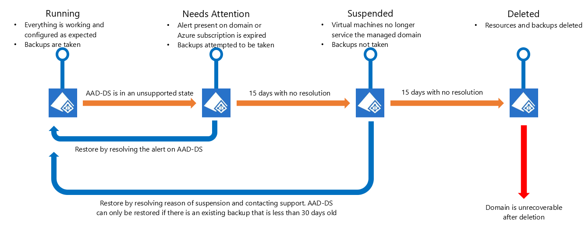

# Suspended domains
When Azure Active Directory Domain Services (Azure AD DS) is unable to service a managed domain for a long period of time, it puts the managed domain into a suspended state. This article explains why managed domains are suspended, and how to remediate a suspended domain.

## States your managed domain can be in

The preceding graphic outlines the possible states an Azure AD DS managed domain can be in.

### "Running" state
A managed domain that is configured correctly and operating regularly is in the **Running** state.

**What to expect**
* Microsoft can regularly monitor the health of your managed domain.
* Domain controllers for your managed domain are patched and updated regularly.
* Changes from Azure Active Directory are regularly synchronized to your managed domain.
* Regular backups are taken for your managed domain.

### "Needs Attention" state
A managed domain is in the **Needs Attention** state if one or more issues require an administrator to take action. The health page of your managed domain lists one or more alerts in this state.

For example, if you've configured a restrictive NSG for your virtual network, Microsoft might not be able to update and monitor your managed domain. This invalid configuration triggers an alert that puts your managed domain into the "Needs Attention" state.

Each alert has a set of resolution steps. Some alerts are transient and get automatically resolved by the service. You can resolve some other alerts by following the instructions in the corresponding resolution steps for that alert. For some critical alerts, you need to contact Microsoft support to get a resolution.

For more information, see [How to troubleshoot alerts on a managed domain](troubleshoot-alerts.md).

**What to expect**

In some cases (for example, if you have an invalid network configuration), the domain controllers for your managed domain might be unreachable. When your managed domain is in the "Needs Attention" state, Microsoft can't guarantee that it will be monitored, patched, updated, or backed-up on a regular basis.

* Your managed domain is in an unhealthy state and ongoing health monitoring might stop until the alert is resolved.
* Domain controllers for your managed domain can't be patched or updated.
* Changes from Azure Active Directory might not be synchronized to your managed domain.
* Backups for your managed domain might be taken, if possible.
* If you resolve alerts that are impacting your managed domain, you might be able to restore it to the "Running" state.
* Critical alerts are triggered for configuration issues where Microsoft is unable to reach your domain controllers. If such alerts aren't resolved within 15 days, your managed domain is put in the "Suspended" state.

### The "Suspended" state
A managed domain is put in the **Suspended** state for the following reasons:

* One or more critical alerts haven't been resolved in 15 days. Critical alerts can be caused by a misconfiguration that blocks access to resources that are needed by Azure AD DS.
    * For example, the alert [AADDS104: Network Error](alert-nsg.md) has been unresolved for more than 15 days in the managed domain.
* There's a billing issue with your Azure subscription or your Azure subscription has expired.

Managed domains are suspended when Microsoft is unable to manage, monitor, patch, or back up the domain on an ongoing basis.

**What to expect**
* Domain controllers for your managed domain are de-provisioned and aren't reachable within the virtual network.
* Secure LDAP access to the managed domain over the internet (if it's enabled) stops working.
* You notice failures in authenticating to the managed domain, logging on to domain-joined virtual machines, or connecting over LDAP/LDAPS.
* Backups for your managed domain are no longer taken.
* Synchronization with Azure AD stops.

After you resolve the alert, your managed domain goes into the "Suspended" state. Then you need to contact support.
Support might restore your managed domain, but only if a backup that is less than 30 days old exists.

The managed domain only stays in a suspended state for 15 days. To recover your managed domain, Microsoft recommends that you resolve critical alerts immediately.

### "Deleted" state
A managed domain that stays in the "Suspended" state for 15 days is **Deleted**.

**What to expect**
* All resources and backups for the managed domain are deleted.
* You can't restore the managed domain, and need to create a new managed domain to use Azure AD DS.
* After it's deleted, you aren't billed for the managed domain.

## How do you know if your managed domain is suspended?
You see an [alert](troubleshoot-alerts.md) on the Azure AD DS Health page in the Azure portal that declares that the domain is suspended. The state of the domain also shows "Suspended".

## Restore a suspended domain
To restore a domain that's in the "Suspended" state, take the following steps:

1. Go to the [Azure Active Directory Domain Services page](https://portal.azure.com/#blade/HubsExtension/Resources/resourceType/Microsoft.AAD%2FdomainServices) in the Azure portal.
2. Select the managed domain.
3. In the left panel, select **Health**.
4. Select the alert. The alert ID will be either AADDS503 or AADDS504, depending on the cause of suspension.
5. Select the resolution link that's provided in the alert. Then follow the steps to resolve the alert.

Your managed domain can only be restored to the date of the last backup. The date of your last backup is displayed on the Health page of your managed domain. Any changes that occurred after the last backup won't be restored. Backups for a managed domain are stored for up to 30 days. Backups that are older than 30 days are deleted.

## Next steps
- [Resolve alerts for your managed domain](troubleshoot-alerts.md)
- [Read more about Azure Active Directory Domain Services](overview.md)
- [Contact the product team](contact-us.md)

## Contact us
Contact the Azure Active Directory Domain Services product team to [share feedback or for support](contact-us.md).
