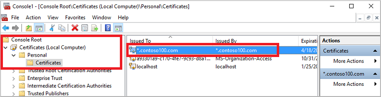
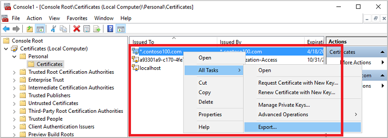
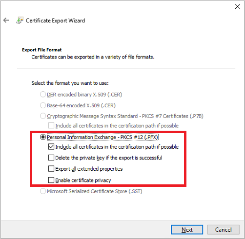
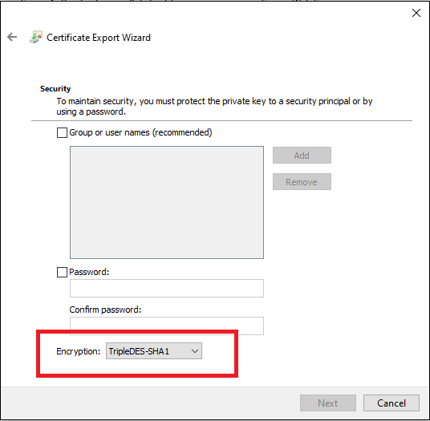
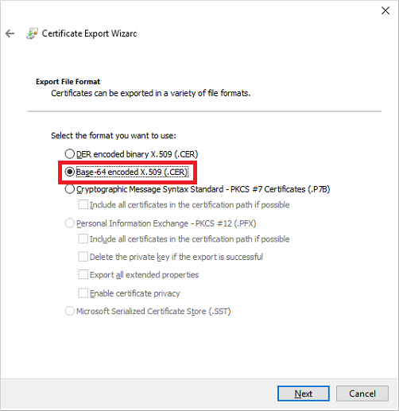
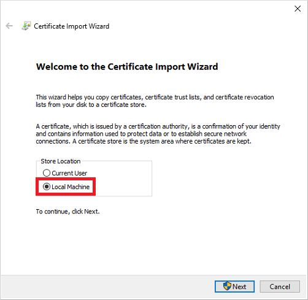
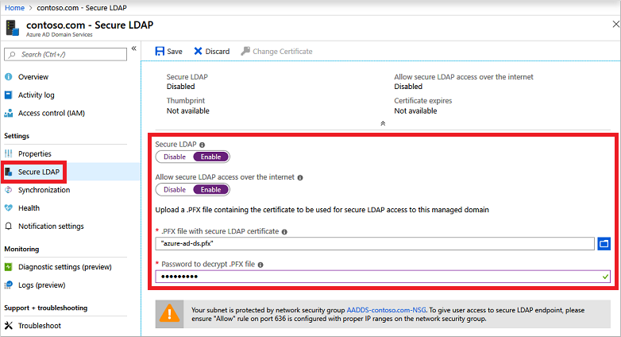
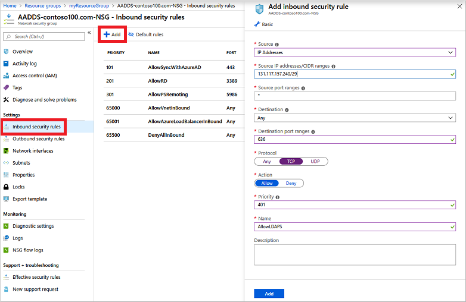
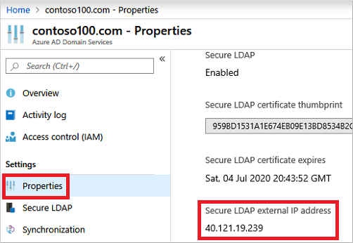
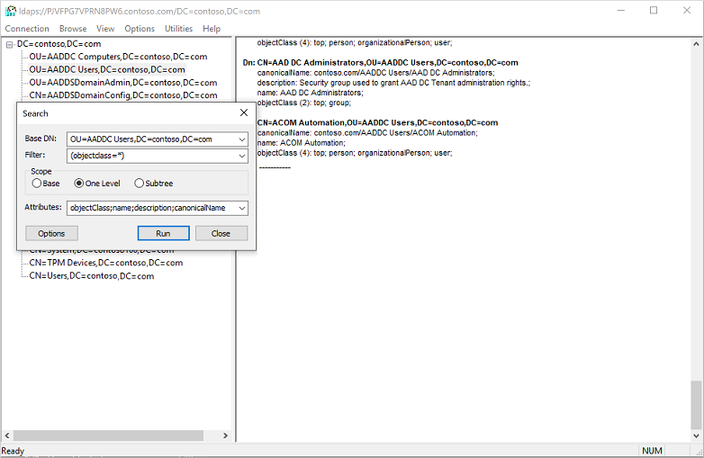

# Tutorial: Configure secure LDAP for a Microsoft Entra Domain Services managed domain

To communicate with your Microsoft Entra Domain Services managed domain, the Lightweight Directory Access Protocol (LDAP) is used. By default, the LDAP traffic isn't encrypted, which is a security concern for many environments.

With Microsoft Entra Domain Services, you can configure the managed domain to use secure Lightweight Directory Access Protocol (LDAPS). When you use secure LDAP, the traffic is encrypted. Secure LDAP is also known as LDAP over Secure Sockets Layer (SSL) / Transport Layer Security (TLS).

This tutorial shows you how to configure LDAPS for a Domain Services managed domain.

In this tutorial, you learn how to:

> [!div class="checklist"]
> * Create a digital certificate for use with Microsoft Entra Domain Services
> * Enable secure LDAP for Microsoft Entra Domain Services
> * Configure secure LDAP for use over the public internet
> * Bind and test secure LDAP for a managed domain

If you don't have an Azure subscription, [create an account](https://azure.microsoft.com/free/?WT.mc_id=A261C142F) before you begin.

## Prerequisites

To complete this tutorial, you need the following resources and privileges:

* An active Azure subscription.
  * If you don't have an Azure subscription, [create an account](https://azure.microsoft.com/free/?WT.mc_id=A261C142F).
* A Microsoft Entra tenant associated with your subscription, either synchronized with an on-premises directory or a cloud-only directory.
  * If needed, [create a Microsoft Entra tenant][create-azure-ad-tenant] or [associate an Azure subscription with your account][associate-azure-ad-tenant].
* A Microsoft Entra Domain Services managed domain enabled and configured in your Microsoft Entra tenant.
  * If needed, [create and configure a Microsoft Entra Domain Services managed domain][create-azure-ad-ds-instance].
* The *LDP.exe* tool installed on your computer.
  * If needed, [install the Remote Server Administration Tools (RSAT)][rsat] for *Active Directory Domain Services and LDAP*.
* You need [Application Administrator](/azure/active-directory/roles/permissions-reference#application-administrator) and [Groups Administrator](/azure/active-directory/roles/permissions-reference#groups-administrator) Microsoft Entra roles in your tenant to enable secure LDAP.

## Sign in to the Microsoft Entra admin center

In this tutorial, you configure secure LDAP for the managed domain using the Microsoft Entra admin center. To get started, first sign in to the [Microsoft Entra admin center](https://entra.microsoft.com).

## Create a certificate for secure LDAP

To use secure LDAP, a digital certificate is used to encrypt the communication. This digital certificate is applied to your managed domain, and lets tools like *LDP.exe* use secure encrypted communication when querying data. There are two ways to create a certificate for secure LDAP access to the managed domain:

* A certificate from a public certificate authority (CA) or an enterprise CA.
  * If your organization gets certificates from a public CA, get the secure LDAP certificate from that public CA. If you use an enterprise CA in your organization, get the secure LDAP certificate from the enterprise CA.
  * A public CA only works when you use a custom DNS name with your managed domain. If the DNS domain name of your managed domain ends in *.onmicrosoft.com*, you can't create a digital certificate to secure the connection with this default domain. Microsoft owns the *.onmicrosoft.com* domain, so a public CA won't issue a certificate. In this scenario, create a self-signed certificate and use that to configure secure LDAP.
* A self-signed certificate that you create yourself.
  * This approach is good for testing purposes, and is what this tutorial shows.

The certificate you request or create must meet the following requirements. Your managed domain encounters problems if you enable secure LDAP with an invalid certificate:

* **Trusted issuer** - The certificate must be issued by an authority trusted by computers connecting to the managed domain using secure LDAP. This authority may be a public CA or an Enterprise CA trusted by these computers.
* **Lifetime** - The certificate must be valid for at least the next 3-6 months. Secure LDAP access to your managed domain is disrupted when the certificate expires.
* **Subject name** - The subject name on the certificate must be your managed domain. For example, if your domain is named *aaddscontoso.com*, the certificate's subject name must be **.aaddscontoso.com*.
  * The DNS name or subject alternate name of the certificate must be a wildcard certificate to ensure the secure LDAP works properly with Domain Services. Domain Controllers use random names and can be removed or added to ensure the service remains available.
* **Key usage** - The certificate must be configured for *digital signatures* and *key encipherment*.
* **Certificate purpose** - The certificate must be valid for TLS server authentication.

There are several tools available to create self-signed certificate such as OpenSSL, Keytool, MakeCert, [New-SelfSignedCertificate][New-SelfSignedCertificate] cmdlet, etc.

In this tutorial, let's create a self-signed certificate for secure LDAP using the [New-SelfSignedCertificate][New-SelfSignedCertificate] cmdlet.

Open a PowerShell window as **Administrator** and run the following commands. Replace the *$dnsName* variable with the DNS name used by your own managed domain, such as *aaddscontoso.com*:

```powershell
# Define your own DNS name used by your managed domain
$dnsName="aaddscontoso.com"

# Get the current date to set a one-year expiration
$lifetime=Get-Date

# Create a self-signed certificate for use with Azure AD DS
New-SelfSignedCertificate -Subject *.$dnsName `
  -NotAfter $lifetime.AddDays(365) -KeyUsage DigitalSignature, KeyEncipherment `
  -Type SSLServerAuthentication -DnsName *.$dnsName, $dnsName
```

The following example output shows that the certificate was successfully generated and is stored in the local certificate store (*LocalMachine\MY*):

```output
PS C:\WINDOWS\system32> New-SelfSignedCertificate -Subject *.$dnsName `
>>   -NotAfter $lifetime.AddDays(365) -KeyUsage DigitalSignature, KeyEncipherment `
>>   -Type SSLServerAuthentication -DnsName *.$dnsName, $dnsName.com

   PSParentPath: Microsoft.PowerShell.Security\Certificate::LocalMachine\MY

Thumbprint                                Subject
----------                                -------
959BD1531A1E674EB09E13BD8534B2C76A45B3E6  CN=aaddscontoso.com
```

## Understand and export required certificates

To use secure LDAP, the network traffic is encrypted using public key infrastructure (PKI).

* A **private** key is applied to the managed domain.
  * This private key is used to *decrypt* the secure LDAP traffic. The private key should only be applied to the managed domain and not widely distributed to client computers.
  * A certificate that includes the private key uses the *.PFX* file format.
  * When exporting the certificate, you must specify the *TripleDES-SHA1* encryption algorithm. This is applicable to the .pfx file only and does not impact the algorithm used by the certificate itself. Note that the *TripleDES-SHA1* option is available only beginning with Windows Server 2016.
* A **public** key is applied to the client computers.
  * This public key is used to *encrypt* the secure LDAP traffic. The public key can be distributed to client computers.
  * Certificates without the private key use the *.CER* file format.

These two keys, the *private* and *public* keys, make sure that only the appropriate computers can successfully communicate with each other. If you use a public CA or enterprise CA, you are issued with a certificate that includes the private key and can be applied to a managed domain. The public key should already be known and trusted by client computers.

In this tutorial, you created a self-signed certificate with the private key, so you need to export the appropriate private and public components.

<a name='export-a-certificate-for-azure-ad-ds'></a>


### Export a certificate for Microsoft Entra Domain Services

Before you can use the digital certificate created in the previous step with your managed domain, export the certificate to a *.PFX* certificate file that includes the private key.

1. To open the *Run* dialog, select the **Windows** + **R** keys.
1. Open the Microsoft Management Console (MMC) by entering **mmc** in the *Run* dialog, then select **OK**.
1. On the **User Account Control** prompt, then select **Yes** to launch MMC as administrator.
1. From the **File** menu, select **Add/Remove Snap-in...**
1. In the **Certificates snap-in** wizard, choose **Computer account**, then select **Next**.
1. On the **Select Computer** page, choose **Local computer: (the computer this console is running on)**, then select **Finish**.
1. In the **Add or Remove Snap-ins** dialog, select **OK** to add the certificates snap-in to MMC.
1. In the MMC window, expand **Console Root**. Select **Certificates (Local Computer)**, then expand the **Personal** node, followed by the **Certificates** node.

    

1. The self-signed certificate created in the previous step is shown, such as *aaddscontoso.com*. Right-select this certificate, then choose **All Tasks > Export...**

    

1. In the **Certificate Export Wizard**, select **Next**.
1. The private key for the certificate must be exported. If the private key is not included in the exported certificate, the action to enable secure LDAP for your managed domain fails.

    On the **Export Private Key** page, choose **Yes, export the private key**, then select **Next**.
1. Managed domains only support the *.PFX* certificate file format that includes the private key. Don't export the certificate as *.CER* certificate file format without the private key.

    On the **Export File Format** page, select **Personal Information Exchange - PKCS #12 (.PFX)** as the file format for the exported certificate. Check the box for *Include all certificates in the certification path if possible*:

    

1. As this certificate is used to decrypt data, you should carefully control access. A password can be used to protect the use of the certificate. Without the correct password, the certificate can't be applied to a service.

    On the **Security** page, choose the option for **Password** to protect the *.PFX* certificate file. The encryption algorithm must be *TripleDES-SHA1*. Enter and confirm a password, then select **Next**. This password is used in the next section to enable secure LDAP for your managed domain.

    If you export using the [PowerShell export-pfxcertificate cmdlet](/powershell/module/pki/export-pfxcertificate), you need to pass the *-CryptoAlgorithmOption* flag using TripleDES_SHA1.

    

1. On the **File to Export** page, specify the file name and location where you'd like to export the certificate, such as `C:\Users\<account-name>\azure-ad-ds.pfx`. Keep a note of the password and location of the *.PFX* file as this information would be required in next steps.
1. On the review page, select **Finish** to export the certificate to a *.PFX* certificate file. A confirmation dialog is displayed when the certificate has been successfully exported.
1. Leave the MMC open for use in the following section.

### Export a certificate for client computers

Client computers must trust the issuer of the secure LDAP certificate to be able to connect successfully to the managed domain using LDAPS. The client computers need a certificate to successfully encrypt data that is decrypted by Domain Services. If you use a public CA, the computer should automatically trust these certificate issuers and have a corresponding certificate.

In this tutorial you use a self-signed certificate, and generated a certificate that includes the private key in the previous step. Now let's export and then install the self-signed certificate into the trusted certificate store on the client computer:

1. Go back to the MMC for *Certificates (Local Computer) > Personal > Certificates* store. The self-signed certificate created in a previous step is shown, such as *aaddscontoso.com*. Right-select this certificate, then choose **All Tasks > Export...**
1. In the **Certificate Export Wizard**, select **Next**.
1. As you don't need the private key for clients, on the **Export Private Key** page choose **No, do not export the private key**, then select **Next**.
1. On the **Export File Format** page, select **Base-64 encoded X.509 (.CER)** as the file format for the exported certificate:

    

1. On the **File to Export** page, specify the file name and location where you'd like to export the certificate, such as `C:\Users\<account-name>\azure-ad-ds-client.cer`.
1. On the review page, select **Finish** to export the certificate to a *.CER* certificate file. A confirmation dialog is displayed when the certificate has been successfully exported.

The *.CER* certificate file can now be distributed to client computers that need to trust the secure LDAP connection to the managed domain. Let's install the certificate on the local computer.

1. Open File Explorer and browse to the location where you saved the *.CER* certificate file, such as `C:\Users\<account-name>\azure-ad-ds-client.cer`.
1. Right-select the *.CER* certificate file, then choose **Install Certificate**.
1. In the **Certificate Import Wizard**, choose to store the certificate in the *Local machine*, then select **Next**:

    

1. When prompted, choose **Yes** to allow the computer to make changes.
1. Choose to **Automatically select the certificate store based on the type of certificate**, then select **Next**.
1. On the review page, select **Finish** to import the *.CER* certificate. file A confirmation dialog is displayed when the certificate has been successfully imported.

<a name='enable-secure-ldap-for-azure-ad-ds'></a>

<a name='enable-secure-ldap-for-microsoft-entra-ds'></a>

## Enable secure LDAP for Microsoft Entra Domain Services

With a digital certificate created and exported that includes the private key, and the client computer set to trust the connection, now enable secure LDAP on your managed domain. To enable secure LDAP on a managed domain, perform the following configuration steps:

1. In the [Microsoft Entra admin center](https://entra.microsoft.com), enter *domain services* in the **Search resources** box. Select **Microsoft Entra Domain Services** from the search result.
1. Choose your managed domain, such as *aaddscontoso.com*.
1. On the left-hand side of the Microsoft Entra Domain Services window, choose **Secure LDAP**.
1. By default, secure LDAP access to your managed domain is disabled. Toggle **Secure LDAP** to **Enable**.
1. Secure LDAP access to your managed domain over the internet is disabled by default. When you enable public secure LDAP access, your domain is susceptible to password brute force attacks over the internet. In the next step, a network security group is configured to lock down access to only the required source IP address ranges.

    Toggle **Allow secure LDAP access over the internet** to **Enable**.

1. Select the folder icon next to **.PFX file with secure LDAP certificate**. Browse to the path of the *.PFX* file, then select the certificate created in a previous step that includes the private key.

    > [!IMPORTANT]
    > As noted in the previous section on certificate requirements, you can't use a certificate from a public CA with the default *.onmicrosoft.com* domain. Microsoft owns the *.onmicrosoft.com* domain, so a public CA won't issue a certificate.
    >
    > Make sure your certificate is in the appropriate format. If it's not, the Azure platform generates certificate validation errors when you enable secure LDAP.

1. Enter the **Password to decrypt .PFX file** set in a previous step when the certificate was exported to a *.PFX* file.
1. Select **Save** to enable secure LDAP.

    

A notification is displayed that secure LDAP is being configured for the managed domain. You can't modify other settings for the managed domain until this operation is complete.

It takes a few minutes to enable secure LDAP for your managed domain. If the secure LDAP certificate you provide doesn't match the required criteria, the action to enable secure LDAP for the managed domain fails.

Some common reasons for failure are if the domain name is incorrect, the encryption algorithm for the certificate isn't *TripleDES-SHA1*, or the certificate expires soon or has already expired. You can re-create the certificate with valid parameters, then enable secure LDAP using this updated certificate.

## Change an expiring certificate

1. Create a replacement secure LDAP certificate by following the steps to [create a certificate for secure LDAP](#create-a-certificate-for-secure-ldap).
1. To apply the replacement certificate to Domain Services, in the left menu for **Microsoft Entra Domain Services** in the Microsoft Entra admin center, select **Secure LDAP**, and then select **Change Certificate**.
1. Distribute the certificate to any clients that connect by using secure LDAP.

## Lock down secure LDAP access over the internet

When you enable secure LDAP access over the internet to your managed domain, it creates a security threat. The managed domain is reachable from the internet on TCP port 636. It's recommended to restrict access to the managed domain to specific known IP addresses for your environment. An Azure network security group rule can be used to limit access to secure LDAP.

Let's create a rule to allow inbound secure LDAP access over TCP port 636 from a specified set of IP addresses. A default *DenyAll* rule with a lower priority applies to all other inbound traffic from the internet, so only the specified addresses can reach your managed domain using secure LDAP.

1. In the [Microsoft Entra admin center](https://entra.microsoft.com), search for and select *Resource groups*.
1. Choose your resource group, such as *myResourceGroup*, then select your network security group, such as *aaads-nsg*.
1. The list of existing inbound and outbound security rules are displayed. On the left-hand side of the network security group window, choose **Settings > Inbound security rules**.
1. Select **Add**, then create a rule to allow *TCP* port *636*. For improved security, choose the source as *IP Addresses* and then specify your own valid IP address or range for your organization.

    | Setting                           | Value        |
    |-----------------------------------|--------------|
    | Source                            | IP Addresses |
    | Source IP addresses / CIDR ranges | A valid IP address or range for your environment |
    | Source port ranges                | *            |
    | Destination                       | Any          |
    | Destination port ranges           | 636          |
    | Protocol                          | TCP          |
    | Action                            | Allow        |
    | Priority                          | 401          |
    | Name                              | AllowLDAPS   |

1. When ready, select **Add** to save and apply the rule.

    

## Configure DNS zone for external access

With secure LDAP access enabled over the internet, update the DNS zone so that client computers can find this managed domain. The *Secure LDAP external IP address* is listed on the **Properties** tab for your managed domain:



Configure your external DNS provider to create a host record, such as *ldaps*, to resolve to this external IP address. To test locally on your machine first, you can create an entry in the Windows hosts file. To successfully edit the hosts file on your local machine, open *Notepad* as an administrator, then open the file `C:\Windows\System32\drivers\etc\hosts`.

The following example DNS entry, either with your external DNS provider or in the local hosts file, resolves traffic for `ldaps.aaddscontoso.com` to the external IP address of `168.62.205.103`:

```
168.62.205.103    ldaps.aaddscontoso.com
```

## Test queries to the managed domain

To connect and bind to your managed domain and search over LDAP, you use the *LDP.exe* tool. This tool is included in the Remote Server Administration Tools (RSAT) package. For more information, see [install Remote Server Administration Tools][rsat].

1. Open *LDP.exe* and connect to the managed domain. Select **Connection**, then choose **Connect...**.
1. Enter the secure LDAP DNS domain name of your managed domain created in the previous step, such as *ldaps.aaddscontoso.com*. To use secure LDAP, set **Port** to *636*, then check the box for **SSL**.
1. Select **OK** to connect to the managed domain.

Next, bind to your managed domain. Users (and service accounts) can't perform LDAP simple binds if you have disabled NTLM password hash synchronization on your managed domain. For more information on disabling NTLM password hash synchronization, see [Secure your managed domain][secure-domain].

1. Select the **Connection** menu option, then choose **Bind...**.
1. Provide the credentials of a user account that belongs to the managed domain. Enter the user account's password, then enter your domain, such as *aaddscontoso.com*.
1. For **Bind type**, choose the option for *Bind with credentials*.
1. Select **OK** to bind to your managed domain.

To see of the objects stored in your managed domain:

1. Select the **View** menu option, and then choose **Tree**.
1. Leave the *BaseDN* field blank, then select **OK**.
1. Choose a container, such as *AADDC Users*, then right-select the container and choose **Search**.
1. Leave the pre-populated fields set, then select **Run**. The results of the query are displayed in the right-hand window, as shown in the following example output:

    

To directly query a specific container, from the **View > Tree** menu, you can specify a **BaseDN** such as *OU=AADDC Users,DC=AADDSCONTOSO,DC=COM* or *OU=AADDC Computers,DC=AADDSCONTOSO,DC=COM*. For more information on how to format and create queries, see [LDAP query basics][ldap-query-basics].

> [!NOTE]
> If a Self signed certificate is used, make sure Self signed certificate added on the Trusted Root Certification Authorities for LDAPS to work with LDP.exe

## Clean up resources

If you added a DNS entry to the local hosts file of your computer to test connectivity for this tutorial, remove this entry and add a formal record in your DNS zone. To remove the entry from the local hosts file, complete the following steps:

1. On your local machine, open *Notepad* as an administrator
1. Browse to and open the file `C:\Windows\System32\drivers\etc\hosts`.
1. Delete the line for the record you added, such as `168.62.205.103    ldaps.aaddscontoso.com`

## Troubleshooting

If you see an error stating that LDAP.exe cannot connect, try working through the different aspects of getting the connection:

1. Configuring the domain controller
1. Configuring the client
1. Networking
1. Establishing the TLS session

For the certificate subject name match, the DC will use the Domain Services domain name (not the Microsoft Entra domain name) to search its certificate store for the certificate. Spelling mistakes, for example, prevent the DC from selecting the right certificate.

The client attempts to establish the TLS connection using the name you provided. The traffic needs to get all the way through. The DC sends the public key of the server auth cert. The cert needs to have the right usage in the certificate, the name signed in the subject name must be compatible for the client to trust that the server is the DNS name which you’re connecting to (that is, a wildcard will work, with no spelling mistakes), and the client must trust the issuer. You can check for any problems in that chain in the System log in Event Viewer, and filter the events where source equals Schannel. Once those pieces are in place, they form a session key.  

For more information, see [TLS Handshake](/windows/win32/secauthn/tls-handshake-protocol).

## Next steps

In this tutorial, you learned how to:

> [!div class="checklist"]
> * Create a digital certificate for use with Microsoft Entra Domain Services
> * Enable secure LDAP for Microsoft Entra Domain Services
> * Configure secure LDAP for use over the public internet
> * Bind and test secure LDAP for a managed domain

> [!div class="nextstepaction"]
> [Configure password hash synchronization for a hybrid Microsoft Entra environment](tutorial-configure-password-hash-sync.md)

<!-- INTERNAL LINKS -->
[create-azure-ad-tenant]: /azure/active-directory/fundamentals/sign-up-organization
[associate-azure-ad-tenant]: /azure/active-directory/fundamentals/how-subscriptions-associated-directory
[create-azure-ad-ds-instance]: tutorial-create-instance.md
[secure-domain]: secure-your-domain.md

<!-- EXTERNAL LINKS -->
[rsat]: /windows-server/remote/remote-server-administration-tools
[ldap-query-basics]: /windows/win32/ad/creating-a-query-filter
[New-SelfSignedCertificate]: /powershell/module/pki/new-selfsignedcertificate
