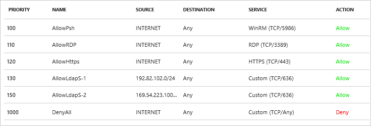

# Tutorial: Configure secure LDAP for an Azure Active Directory Domain Services managed domain

To communicate with your Azure Active Directory Domain Services (Azure AD DS) managed domain, the Lightweight Directory Access Protocol (LDAP) is used. By default, the traffic isn't encrypted, which is a security concern for many environments. With Azure AD DS, you can configure the managed domain to use Secure Lightweight Directory Access Protocol (LDAPS). Secure LDAP is also known as LDAP over Secure Sockets Layer (SSL) / Transport Layer Security (TLS). When you use LDAPS, the traffic is encrypted.

This tutorial shows you how to configure LDAPS for an Azure AD DS managed domain.

In this tutorial, you learn how to:

> [!div class="checklist"]
> * Create a digital certificate for use with Azure AD DS
> * Enable LDAPS for Azure AD DS
> * Configure LDAPS for use over the public internet
> * Bind and test LDAPS for an Azure AD DS managed domain

If you don’t have an Azure subscription, create a [free account](https://azure.microsoft.com/free/?WT.mc_id=A261C142F) before you begin.

## Prerequisites

To complete this tutorial, you need the following resources and privileges:

* An active Azure subscription.
    * If you don’t have an Azure subscription, create a [free account](https://azure.microsoft.com/free/?WT.mc_id=A261C142F).
* An Azure Active Directory tenant associated with your subscription, either synchronized with an on-premises directory or a cloud-only directory.
    * If needed, [create an Azure Active Directory tenant][create-azure-ad-tenant] or [associate an Azure subscription with your account][associate-azure-ad-tenant].
* You need a user account part of the *'AAD DC Administrators* group to domain.

## Sign in to the Azure portal

In this tutorial, you create and configure the Azure AD DS instance using the Azure portal. To get started, first sign in to the [Azure portal](https://portal.azure.com).

## Create a certificate for secure LDAP

The first task involves obtaining a certificate used for secure LDAP access to the managed domain. You have two options:

* A certificate from a public certificate authority (CA) or an enterprise CA.
    * If your organization gets certificates from a public CA, get the secure LDAP certificate from that public CA. If you use an enterprise CA in your organization, get the secure LDAP certificate from the enterprise CA.
    * A public CA only works when you use a custom DNS name with your Azure AD DS managed domain. If the DNS domain name of your managed domain ends in *.onmicrosoft.com*, you can't get a secure LDAP certificate from a public CA. Since Microsoft owns the 'onmicrosoft.com' domain, public CAs refuse to issue a secure LDAP certificate to you for a domain with this suffix. In this scenario, create a self-signed certificate and use that to configure secure LDAP.
* A self-signed certificate.
    * This approach is good for testing purposes, and is what this tutorial shows.

The certificate you request or create must meet the following requirements. Your managed domain encounters problems if you enable secure LDAP with an invalid certificate:

* **Trusted issuer** - The certificate must be issued by an authority trusted by computers connecting to the managed domain using secure LDAP. This authority may be a public CA or an Enterprise CA trusted by these computers.
* **Lifetime** - The certificate must be valid for at least the next 3-6 months. Secure LDAP access to your managed domain is disrupted when the certificate expires.
* **Subject name** - The subject name on the certificate must be your managed domain. For instance, if your domain is named *contoso100.com*, the certificate's subject name must be *contoso100.com*. Set the DNS name (subject alternate name) to a wildcard name for your managed domain.
* **Key usage** - The certificate must be configured for the *digital signatures* and *key encipherment*.
* **Certificate purpose** - The certificate must be valid for SSL server authentication.

In this tutorial, let's create a self-signed certificate for secure LDAP using PowerShell. Open a PowerShell window as **Administrator** and run the following commands. Replace the *$dnsName* variable with the DNS name used by your own managed domain, such as *contoso100.com*:

```powershell
# Define your own DNS name used by your Azure AD DS managed domain
$dnsName="contoso100.com"

# Get the current date to set a one-year expiration
$lifetime=Get-Date

# Create a self-signed certificate for use with Azure AD DS
New-SelfSignedCertificate -Subject $dnsName `
  -NotAfter $lifetime.AddDays(365) -KeyUsage DigitalSignature, KeyEncipherment `
  -Type SSLServerAuthentication -DnsName *.$dnsName, $dnsName.com
```

The following example output shows that the certificate was successfully generated and is stored in the local certificate store (*LocalMachine\MY*):

```output
PS C:\WINDOWS\system32> New-SelfSignedCertificate -Subject $dnsName `
>>   -NotAfter $lifetime.AddDays(365) -KeyUsage DigitalSignature, KeyEncipherment `
>>   -Type SSLServerAuthentication -DnsName *.$dnsName, $dnsName.com

   PSParentPath: Microsoft.PowerShell.Security\Certificate::LocalMachine\MY

Thumbprint                                Subject
----------                                -------
959BD1531A1E674EB09E13BD8534B2C76A45B3E6  CN=contoso100.com
```

## Export the certificate to a .PFX file

Before you start this task, get the secure LDAP certificate from a public certification authority or create a self-signed certificate.

Export the digital certificate created in the previous to a *.PFX* file:

1. To open the *Run* dialog, select the **Windows** and **R**. 
1. Open the Microsoft Management Console (MMC) by entering **mmc** in the *Run* dialog, then select **OK**.
1. On the **User Account Control** prompt, click **Yes** to launch MMC as administrator.
1. From the **File** menu, click **Add/Remove Snap-in...**.
1. In the **Certificates snap-in** wizard, choose **Computer account**, then select **Next**.
1. On the **Select Computer** page, choose **Local computer: (the computer this console is running on)**, then select **Finish**.
1. In the **Add or Remove Snap-ins** dialog, click **OK** to add the certificates snap-in to MMC.
1. In the MMC window, expand **Console Root**. Select **Certificates (Local Computer)**, then expand the **Personal** node, followed by the **Certificates** node.

    

1. The self-signed certificate created in the previous step is shown, such as *contoso100.com*. Right-click this certificate, then choose **All Tasks > Export...**.

    

1. In the **Certificate Export Wizard**, select **Next**.
1. The private key for with the certificate must exported. If the *.PFX* file that doesn't contain the private key for the certificate, the action to enable secure LDAP for your managed domain fails.

    On the **Export Private Key** page, choose **Yes, export the private key**, then select **Next**.
1. Only the *.PFX* file format is supported. Don't export the certificate as *.CER* file format.
    
    On the **Export File Format** page, select **Personal Information Exchange - PKCS #12 (.PFX)** as the file format for the exported certificate.

    

1. On the **Security** page, choose the option for **Password** to protect the *.PFX* file. Enter and confirm a password, then select **Next**. This password is used in the next section to enable secure LDAP for you Azure AD DS managed domain.
1. On the **File to Export** page, specify the file name and location where you'd like to export the certificate, such as *C:\Users\<accountname>\LDAP_cert*.
16. On the review page, select **Finish** to export the certificate to a *.PFX* file. A confirmation dialog is displayed when the certificate has been successfully exported.

## Enable secure LDAP for Azure AD DS

To enable secure LDAP, perform the following configuration steps:

1. In the [Azure portal](https://portal.azure.com), search for *domain services* in the **Search resources** box. Select **Azure AD Domain Services** from the search result. The **Azure AD Domain Services** page lists your managed domain.

    

1. Choose your managed domain, such as *contoso100.com*.
1. On the left-hand side of the Azure AD DS window, choose **Secure LDAP**.
1. By default, secure LDAP access to your managed domain is disabled. Toggle **Secure LDAP** to **Enable**.
1. Secure LDAP access to your managed domain over the internet is disabled by default. When you enable public secure LDAP access, your domain is susceptible to password brute force attacks over the internet. In one of the next steps, a network security group is configure to lock down access to required source IP address ranges.

    Toggle **Allow secure LDAP access over the internet** to **Enable**.

1. Select the folder icon next to **.PFX file with secure LDAP certificate**. Browse to the path of the *.PFX* file and then select the certificate created in the previous step.
1. Enter the **Password to decrypt .PFX file**. This is the password you used in the previous step to export the certificate to the *.PFX* file.
1. Select **Save** to enable secure LDAP.

    

A notification is displayed that secure LDAP is being configured for the managed domain. You can't modify other settings for the managed domain until this operation is complete.


It takes 10-15 minutes to enable secure LDAP for your managed domain. If the secure LDAP certificate you provide doesn't match the required criteria, the action to enable secure LDAP for the managed domain fails. Some common reasons for failure are if the domain name is incorrect, or the certificate expires soon or has already expired. You can re-create the certificate with valid parameters, then enable secure LDAP using this updated certificate.

## Lock down secure LDAP access to your managed domain over the internet

When you enable LDAPS access over the internet to your managed domain, it creates a security threat. The managed domain is reachable from the internet at the port used for secure LDAP (that is, port 636). You can choose to restrict access to the managed domain to specific known IP addresses. Create a network security group (NSG) and associate it with the subnet where you have enabled Azure AD Domain Services.

The sample NSG in the following table locks down secure LDAP access over the internet. The rules in the NSG allow inbound secure LDAP access over TCP port 636 only from a specified set of IP addresses. The default 'DenyAll' rule applies to all other inbound traffic from the internet. The NSG rule to allow LDAPS access over the internet from specified IP addresses has a higher priority than the DenyAll NSG rule.



## Configure DNS to access the managed domain from the internet

After you enable secure LDAP access over the internet, you need to update DNS so that client computers can find this managed domain. You see an external IP address on the **Properties** tab in **EXTERNAL IP ADDRESS FOR LDAPS ACCESS**.

Configure your external DNS provider so that the DNS name of the managed domain (for example, 'ldaps.contoso100.com') points to this external IP address. For example, create the following DNS entry:

    ldaps.contoso100.com  -> 52.165.38.113

> [!WARNING]
> Remember that client computers must trust the issuer of the LDAPS certificate to be able to connect successfully to the managed domain using LDAPS. If you are using a publicly trusted certification authority, you do not need to do anything since client computers trust these certificate issuers. If you are using a self-signed certificate, install the public part of the self-signed certificate into the trusted certificate store on the client computer.

## Bind to the managed domain over LDAP using LDP.exe
You can use the LDP.exe tool, which is included in the Remote Server Administration tools package to bind and search over LDAP.

First, open LDP and connect to the managed domain. Click **Connection** and click **Connect...** in the menu. Specify the DNS domain name of the managed domain. Specify the port to use for connections. For LDAP connections, use port 389. For LDAPS connections, use port 636. Click **OK** button to connect to the managed domain.

Next, bind to the managed domain. Click **Connection** and click **Bind...** in the menu. Provide the credentials of a user account belonging to the 'AAD DC Administrators' group.

> [!IMPORTANT]
> Users (and service accounts) cannot perform LDAP simple binds if you have disabled NTLM password hash synchronization on your Azure AD Domain Services instance.  For more information on disabling NTLM password hash synchronization, read [Secure your Azure AD DOmain Services managed domain](secure-your-domain.md).

Select **View**, and then select **Tree** in the menu. Leave the Base DN field blank, and click OK. Navigate to the container that you want to search, right-click the container, and select Search.

> [!TIP]
> - Users and groups synchronized from Azure AD are stored in the **AADDC Users** organizational unit. The search path for this organizational unit looks like ```OU=AADDC Users,DC=CONTOSO100,DC=COM```.
> - Computer accounts for computers joined to the managed domain are stored in the **AADDC Computers** organizational unit. The search path for this organizational unit looks like ```OU=AADDC Computers,DC=CONTOSO100,DC=COM```.

More information - [LDAP query basics](https://docs.microsoft.com/windows/desktop/ad/creating-a-query-filter)

## Clean up resources

If you no longer wish to use secure LDAP for your Azure AD DS managed domain, disable LDAPS using the following steps:

1. In the [Azure portal](https://portal.azure.com), search for *domain services* in the **Search resources** box. Select **Azure AD Domain Services** from the search result. The **Azure AD Domain Services** page lists your managed domain.
1. On the left-hand side of the Azure AD DS window, choose **Secure LDAP**.
1. Toggle **Secure LDAP** to **Enable**.
1. If desired, delete the local *.PFX* file exported during this tutorial, and delete the certificate from the personal certificate in the MMC.

## Next steps

In this tutorial, you learned how to:

> [!div class="checklist"]
> * Create a digital certificate for use with Azure AD DS
> * Enable LDAPS for Azure AD DS
> * Configure LDAPS for use over the public internet
> * Bind and test LDAPS for an Azure AD DS managed domain

> [!div class="nextstepaction"]
> [Join a Windows Server virtual machine to your managed domain](join-windows-vm.md)

<!-- INTERNAL LINKS -->
