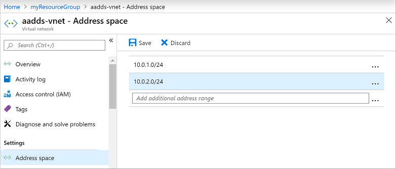
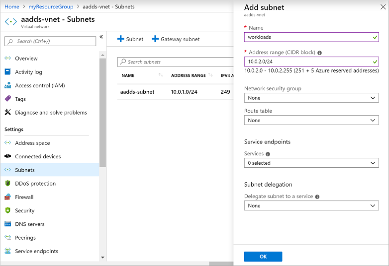
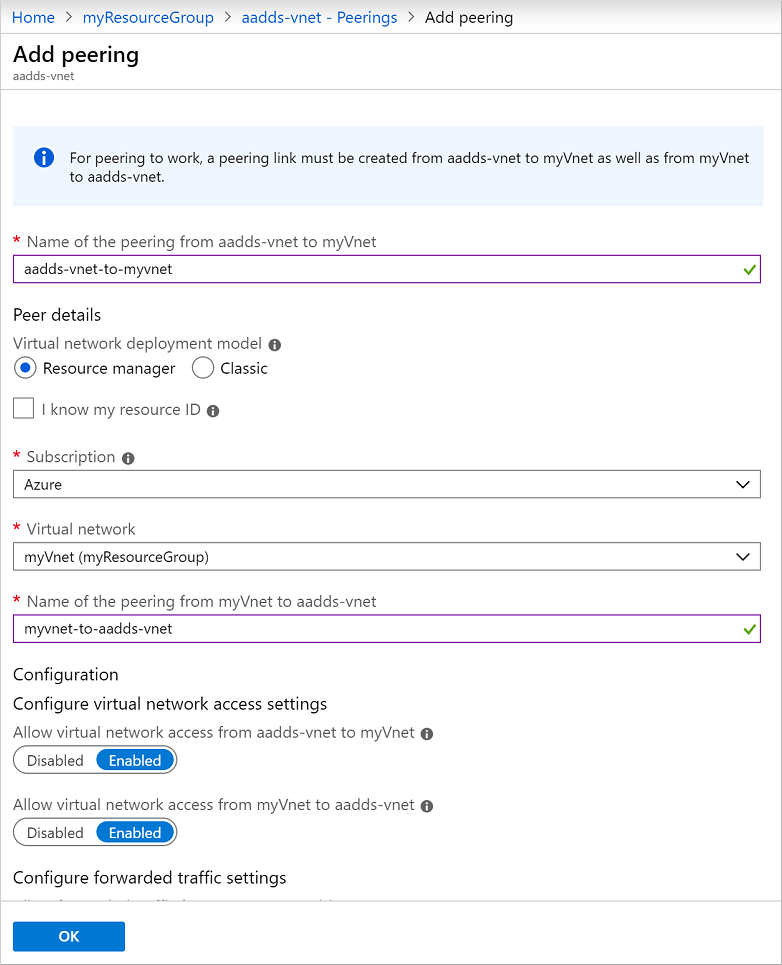
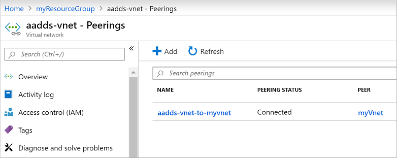

# Tutorial: Configure virtual networking for an Azure Active Directory Domain Services managed domain

To provide connectivity to users and applications, an Azure Active Directory Domain Services (Azure AD DS) managed domain is deployed into an Azure virtual network subnet. This virtual network subnet should only be used for the managed domain resources provided by the Azure platform. As you create your own VMs and applications, they shouldn't be deployed into the same virtual network subnet. Instead, you should create and deploy your applications into a separate virtual network subnet, or in a separate virtual network that's peered to the Azure AD DS virtual network.

This tutorial shows you how to create and configure a dedicated virtual network subnet or how to peer a different network to the Azure AD DS managed domain's virtual network.

In this tutorial, you learn how to:

> [!div class="checklist"]
> * Understand the virtual network connectivity options for domain-joined resources to Azure AD DS
> * Create an IP address range and additional subnet in the Azure AD DS virtual network
> * Configure virtual network peering to a network that's separate from Azure AD DS

If you don't have an Azure subscription, [create an account](https://azure.microsoft.com/free/?WT.mc_id=A261C142F) before you begin.

## Prerequisites

To complete this tutorial, you need the following resources and privileges:

* An active Azure subscription.
    * If you don't have an Azure subscription, [create an account](https://azure.microsoft.com/free/?WT.mc_id=A261C142F).
* An Azure Active Directory tenant associated with your subscription, either synchronized with an on-premises directory or a cloud-only directory.
    * If needed, [create an Azure Active Directory tenant][create-azure-ad-tenant] or [associate an Azure subscription with your account][associate-azure-ad-tenant].
* You need *global administrator* privileges in your Azure AD tenant to enable Azure AD DS.
* You need *Contributor* privileges in your Azure subscription to create the required Azure AD DS resources.
* An Azure Active Directory Domain Services managed domain enabled and configured in your Azure AD tenant.
    * If needed, the first tutorial [creates and configures an Azure Active Directory Domain Services managed domain][create-azure-ad-ds-instance].

## Sign in to the Azure portal

In this tutorial, you create and configure the managed domain using the Azure portal. To get started, first sign in to the [Azure portal](https://portal.azure.com).

## Application workload connectivity options

In the previous tutorial, a managed domain was created that used some default configuration options for the virtual network. These default options created an Azure virtual network and virtual network subnet. The Azure AD DS domain controllers that provide the managed domain services are connected to this virtual network subnet.

When you create and run VMs that need to use the managed domain, network connectivity needs to be provided. This network connectivity can be provided in one of the following ways:

* Create an additional virtual network subnet in the default managed domain's virtual network. This additional subnet is where you create and connect your VMs.
    * As the VMs are part of the same virtual network, they can automatically perform name resolution and communicate with the Azure AD DS domain controllers.
* Configure Azure virtual network peering from the managed domain's virtual network to one or more separate virtual networks. These separate virtual networks are where you create and connect your VMs.
    * When you configure virtual network peering, your must also configure DNS settings to use name resolution back to the Azure AD DS domain controllers.

You usually only use one of these network connectivity options. The choice is often down to how you wish to manage separate your Azure resources. If you want to manage Azure AD DS and connected VMs as one group of resources, you can create an additional virtual network subnet for VMs. If you want to separate the management of Azure AD DS and then any connected VMs, you can use virtual network peering. You may also choose to use virtual network peering to provide connectivity to existing VMs in your Azure environment that are connected to an existing virtual network.

In this tutorial, you only need to configure one these virtual network connectivity options.

For more information on how to plan and configure the virtual network, see [networking considerations for Azure Active Directory Domain Services][network-considerations].

## Create a virtual network subnet

By default, the Azure virtual network created with the managed domain contains a single virtual network subnet. This virtual network subnet should only be used by the Azure platform to provide managed domain services. To create and use your own VMs in this Azure virtual network, create an additional subnet.

To create a virtual network subnet for VMs and application workloads, complete the following steps:

1. In the Azure portal, select the resource group of your managed domain, such as *myResourceGroup*. From the list of resources, choose the default virtual network, such as *aadds-vnet*.
1. In the left-hand menu of the virtual network window, select **Address space**. The virtual network is created with a single address space of *10.0.2.0/24*, which is used by the default subnet.

    Add an additional IP address range to the virtual network. The size of this address range and the actual IP address range to use depends on other network resources already deployed. The IP address range shouldn't overlap with any existing address ranges in your Azure or on-premises environment. Make sure that you size the IP address range large enough for the number of VMs you expect to deploy into the subnet.

    In the following example, an additional IP address range of *10.0.3.0/24* is added. When ready, select **Save**.

    

1. Next, in the left-hand menu of the virtual network window, select **Subnets**, then choose **+ Subnet** to add a subnet.
1. Enter a name for the subnet, such as *workloads*. If needed, update the **Address range** if you want to use a subset of the IP address range configured for the virtual network in the previous steps. For now, leave the defaults for options like network security group, route table, service endpoints.

    In the following example, a subnet named *workloads* is created that uses the *10.0.3.0/24* IP address range:

    

1. When ready, select **OK**. It takes a few moments to create the virtual network subnet.

When you create a VM that needs to use the managed domain, make sure you select this virtual network subnet. Don't create VMs in the default *aadds-subnet*. If you select a different virtual network, there's no network connectivity and DNS resolution to reach the managed domain unless you configure virtual network peering.

## Configure virtual network peering

You may have an existing Azure virtual network for VMs, or wish to keep your managed domain virtual network separate. To use the managed domain, VMs in other virtual networks need a way to communicate with the Azure AD DS domain controllers. This connectivity can be provided using Azure virtual network peering.

With Azure virtual network peering, two virtual networks are connected together, without the need for a virtual private network (VPN) device. Network peering lets you quickly connect virtual networks and define traffic flows across your Azure environment. For more information on peering, see [Azure virtual network peering overview][peering-overview].

To peer a virtual network to the managed domain virtual network, complete the followings steps:

1. Choose the default virtual network created for your managed domain named *aadds-vnet*.
1. In the left-hand menu of the virtual network window, select **Peerings**.
1. To create a peering, select **+ Add**. In the following example, the default *aadds-vnet* is peered to a virtual network named *myVnet*. Configure the following settings with your own values:

    * **Name of the peering from aadds-vnet to remote virtual network**: A descriptive identifier of the two networks, such as *aadds-vnet-to-myvnet*
    * **Virtual network deployment type**: *Resource Manager*
    * **Subscription**: The subscription of the virtual network you want to peer to, such as *Azure*
    * **Virtual network**: The virtual network you want to peer to, such as *myVnet*
    * **Name of the peering from myVnet to aadds-vnet**: A descriptive identifier of the two networks, such as *myvnet-to-aadds-vnet*

    

    Leave any other defaults for virtual network access or forwarded traffic unless you have specific requirements for your environment, then select **OK**.

1. It takes a few moments to create the peering on both the Azure AD DS virtual network and the virtual network you selected. When ready, the **Peering status** reports *Connected*, as shown in the following example:

    

Before VMs in the peered virtual network can use the managed domain, configure the DNS servers to allow for correct name resolution.

### Configure DNS servers in the peered virtual network

For VMs and applications in the peered virtual network to successfully talk to the managed domain, the DNS settings must be updated. The IP addresses of the Azure AD DS domain controllers must configured as the DNS servers on the peered virtual network. There are two ways to configure the domain controllers as DNS servers for the peered virtual network:

* Configure the Azure virtual network DNS servers to use the Azure AD DS domain controllers.
* Configure the existing DNS server in use on the peered virtual network to use conditional DNS forwarding to direct queries to the managed domain. These steps vary depending on the existing DNS server in use.

In this tutorial, let's configure the Azure virtual network DNS servers to direct all queries to the Azure AD DS domain controllers.

1. In the Azure portal, select the resource group of the peered virtual network, such as *myResourceGroup*. From the list of resources, choose the peered virtual network, such as *myVnet*.
1. In the left-hand menu of the virtual network window, select **DNS servers**.
1. By default, a virtual network uses the built-in Azure-provided DNS servers. Choose to use **Custom** DNS servers. Enter the IP addresses for the Azure AD DS domain controllers, which are usually *10.0.2.4* and *10.0.2.5*. Confirm these IP addresses on the **Overview** window of your managed domain in the portal.

    

1. When ready, select **Save**. It takes a few moments to update the DNS servers for the virtual network.
1. To apply the updated DNS settings to the VMs, restart VMs connected to the peered virtual network.

When you create a VM that needs to use the managed domain, make sure you select this peered virtual network. If you select a different virtual network, there's no network connectivity and DNS resolution to reach the managed domain.

## Next steps

In this tutorial, you learned how to:

> [!div class="checklist"]
> * Understand the virtual network connectivity options for domain-joined resources to Azure AD DS
> * Create an IP address range and additional subnet in the Azure AD DS virtual network
> * Configure virtual network peering to a network that's separate from Azure AD DS

To see this managed domain in action, create and join a virtual machine to the domain.

> [!div class="nextstepaction"]
> [Join a Windows Server virtual machine to your managed domain](join-windows-vm.md)

<!-- INTERNAL LINKS --> 
[create-azure-ad-tenant]: ../active-directory/fundamentals/sign-up-organization.md
[associate-azure-ad-tenant]: ../active-directory/fundamentals/active-directory-how-subscriptions-associated-directory.md
[create-azure-ad-ds-instance]: tutorial-create-instance.md
[create-join-windows-vm]: join-windows-vm.md
[peering-overview]: ../virtual-network/virtual-network-peering-overview.md
