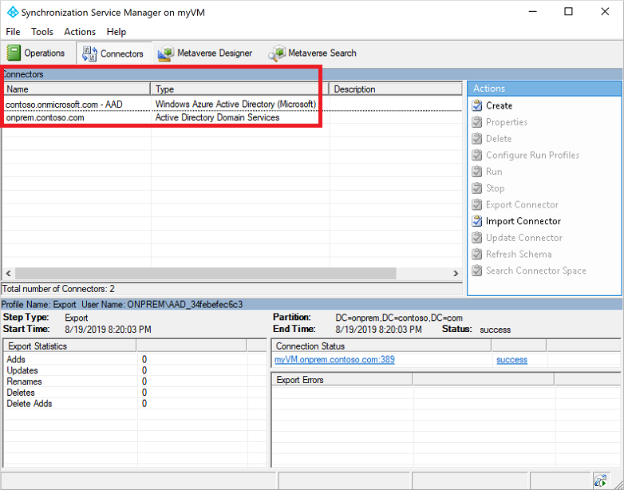

# Tutorial: Enable password synchronization in Azure Active Directory Domain Services for hybrid environments

For hybrid environments, an Azure Active Directory (Azure AD) tenant can be configured to synchronize with an on-premises Active Directory Domain Services (AD DS) environment using Azure AD Connect. By default, Azure AD Connect doesn't synchronize legacy NT LAN Manager (NTLM) and Kerberos password hashes that are needed for Azure Active Directory Domain Services (Azure AD DS).

To use Azure AD DS with accounts synchronized from an on-premises AD DS environment, you need to configure Azure AD Connect to synchronize those password hashes required for NTLM and Kerberos authentication. After Azure AD Connect is configured, an on-premises account creation or password change event also then synchronizes the legacy password hashes to Azure AD.

You don't need to perform these steps if you use cloud-only accounts with no on-premises AD DS environment.

In this tutorial, you learn:

> [!div class="checklist"]
> * Why legacy NTLM and Kerberos password hashes are needed
> * How to configure legacy password hash synchronization for Azure AD Connect

If you don’t have an Azure subscription, [create an account](https://azure.microsoft.com/free/?WT.mc_id=A261C142F) before you begin.

## Prerequisites

To complete this tutorial, you need the following resources:

* An active Azure subscription.
    * If you don’t have an Azure subscription, [create an account](https://azure.microsoft.com/free/?WT.mc_id=A261C142F).
* An Azure Active Directory tenant associated with your subscription that's synchronized with an on-premises directory using Azure AD Connect.
    * If needed, [create an Azure Active Directory tenant][create-azure-ad-tenant] or [associate an Azure subscription with your account][associate-azure-ad-tenant].
    * If needed, [enable Azure AD Connect for password hash synchronization][enable-azure-ad-connect].
* An Azure Active Directory Domain Services managed domain enabled and configured in your Azure AD tenant.
    * If needed, [create and configure an Azure Active Directory Domain Services managed domain][create-azure-ad-ds-instance].

## Password hash synchronization using Azure AD Connect

Azure AD Connect is used to synchronize objects like user accounts and groups from an on-premises AD DS environment into an Azure AD tenant. As part of the process, password hash synchronization enables accounts to use the same password in the on-prem AD DS environment and Azure AD.

To authenticate users on the managed domain, Azure AD DS needs password hashes in a format that's suitable for NTLM and Kerberos authentication. Azure AD doesn't store password hashes in the format that's required for NTLM or Kerberos authentication until you enable Azure AD DS for your tenant. For security reasons, Azure AD also doesn't store any password credentials in clear-text form. Therefore, Azure AD can't automatically generate these NTLM or Kerberos password hashes based on users' existing credentials.

Azure AD Connect can be configured to synchronize the required NTLM or Kerberos password hashes for Azure AD DS. Make sure that you have completed the steps to [enable Azure AD Connect for password hash synchronization][enable-azure-ad-connect]. If you had an existing instance of Azure AD Connect, [download and update to the latest version][azure-ad-connect-download] to make sure you can synchronize the legacy password hashes for NTLM and Kerberos. This functionality isn't available in early releases of Azure AD Connect or with the legacy DirSync tool. Azure AD Connect version *1.1.614.0* or later is required.

> [!IMPORTANT]
> Azure AD Connect should only be installed and configured for synchronization with on-premises AD DS environments. It's not supported to install Azure AD Connect in an Azure AD DS managed domain to synchronize objects back to Azure AD.

## Enable synchronization of password hashes

With Azure AD Connect installed and configured to synchronize with Azure AD, now configure the legacy password hash sync for NTLM and Kerberos. A PowerShell script is used to configure the required settings and then start a full password synchronization to Azure AD. When that Azure AD Connect password hash synchronization process is complete, users can sign in to applications through Azure AD DS that use legacy NTLM or Kerberos password hashes.

1. On the computer with Azure AD Connect installed, from the Start menu, open the **Azure AD Connect > Synchronization Service**.
1. Select the **Connectors** tab. The connection information used to establish the synchronization between the on-premises AD DS environment and Azure AD are listed.

    The **Type** indicates either *Windows Azure Active Directory (Microsoft)* for the Azure AD connector or *Active Directory Domain Services* for the on-premises AD DS connector. Make a note of the connector names to use in the PowerShell script in the next step.

    

    In this example screenshot, the following connectors are used:

    * The Azure AD connector is named *contoso.onmicrosoft.com - AAD*
    * The on-premises AD DS connector is named *onprem.contoso.com*

1. Copy and paste the following PowerShell script to the computer with Azure AD Connect installed. The script triggers a full password sync that includes legacy password hashes. Update the `$azureadConnector` and `$adConnector` variables with the connector names from the previous step.

    Run this script on each AD forest to synchronize on-premises account NTLM and Kerberos password hashes to Azure AD.

    ```powershell
    # Define the Azure AD Connect connector names and import the required PowerShell module
    $azureadConnector = "<CASE SENSITIVE AZURE AD CONNECTOR NAME>"
    $adConnector = "<CASE SENSITIVE AD DS CONNECTOR NAME>"
    
    Import-Module "C:\Program Files\Microsoft Azure AD Sync\Bin\ADSync\ADSync.psd1"
    Import-Module "C:\Program Files\Microsoft Azure Active Directory Connect\AdSyncConfig\AdSyncConfig.psm1"

    # Create a new ForceFullPasswordSync configuration parameter object then
    # update the existing connector with this new configuration
    $c = Get-ADSyncConnector -Name $adConnector
    $p = New-Object Microsoft.IdentityManagement.PowerShell.ObjectModel.ConfigurationParameter "Microsoft.Synchronize.ForceFullPasswordSync", String, ConnectorGlobal, $null, $null, $null
    $p.Value = 1
    $c.GlobalParameters.Remove($p.Name)
    $c.GlobalParameters.Add($p)
    $c = Add-ADSyncConnector -Connector $c

    # Disable and re-enable Azure AD Connect to force a full password synchronization
    Set-ADSyncAADPasswordSyncConfiguration -SourceConnector $adConnector -TargetConnector $azureadConnector -Enable $false
    Set-ADSyncAADPasswordSyncConfiguration -SourceConnector $adConnector -TargetConnector $azureadConnector -Enable $true
    ```

    Depending on the size of your directory in terms of number of accounts and groups, synchronization of the legacy password hashes to Azure AD may take some time. The passwords are then synchronized to the managed domain after they've synchronized to Azure AD.

## Next steps

In this tutorial, you learned:

> [!div class="checklist"]
> * Why legacy NTLM and Kerberos password hashes are needed
> * How to configure legacy password hash synchronization for Azure AD Connect

> [!div class="nextstepaction"]
> [Learn how synchronization works in an Azure AD Domain Services managed domain](synchronization.md)

<!-- INTERNAL LINKS -->
[create-azure-ad-tenant]: ../active-directory/fundamentals/sign-up-organization.md
[associate-azure-ad-tenant]: ../active-directory/fundamentals/active-directory-how-subscriptions-associated-directory.md
[create-azure-ad-ds-instance]: tutorial-create-instance.md
[enable-azure-ad-connect]: ../active-directory/hybrid/how-to-connect-install-express.md

<!-- EXTERNAL LINKS -->
[azure-ad-connect-download]: https://www.microsoft.com/download/details.aspx?id=47594
