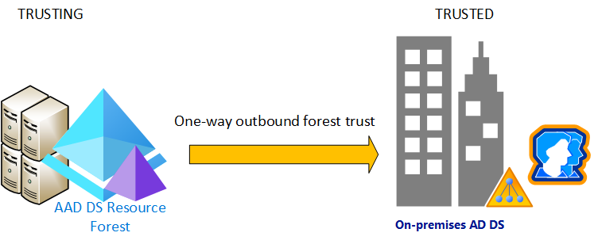

# Tutorial: Create an outbound forest trust to an on-premises domain in Azure Active Directory Domain Services (preview)

In environments where you can't synchronize password hashes, or you have users that exclusively sign in using smart cards so they don't know their password, you can use a resource forest in Azure Active Directory Domain Services (Azure AD DS). A resource forest uses a one-way outbound trust from Azure AD DS to one or more on-premises AD DS environments. This trust relationship lets users, applications, and computers authenticate against an on-premises domain from the Azure AD DS managed domain. Azure AD DS resource forests are currently in preview.



In this tutorial, you learn how to:

> [!div class="checklist"]
> * Configure DNS in an on-premises AD DS environment to support Azure AD DS connectivity
> * Create a one-way inbound forest trust in an on-premises AD DS environment
> * Create a one-way outbound forest trust in Azure AD DS
> * Test and validate the trust relationship for authentication and resource access

If you don't have an Azure subscription, [create an account](https://azure.microsoft.com/free/?WT.mc_id=A261C142F) before you begin.

## Prerequisites

To complete this tutorial, you need the following resources and privileges:

* An active Azure subscription.
    * If you don't have an Azure subscription, [create an account](https://azure.microsoft.com/free/?WT.mc_id=A261C142F).
* An Azure Active Directory tenant associated with your subscription, either synchronized with an on-premises directory or a cloud-only directory.
    * If needed, [create an Azure Active Directory tenant][create-azure-ad-tenant] or [associate an Azure subscription with your account][associate-azure-ad-tenant].
* An Azure Active Directory Domain Services managed domain created using a resource forest and configured in your Azure AD tenant.
    * If needed, [create and configure an Azure Active Directory Domain Services managed domain][create-azure-ad-ds-instance-advanced].
    
    > [!IMPORTANT]
    > Make sure that you create a managed domain using a *resource* forest. The default option creates a *user* forest. Only resource forests can create trusts to on-prem AD DS environments. You also need to use a minimum of *Enterprise* SKU for your managed domain. If needed, [change the SKU for a managed domain][howto-change-sku].

## Sign in to the Azure portal

In this tutorial, you create and configure the outbound forest trust from Azure AD DS using the Azure portal. To get started, first sign in to the [Azure portal](https://portal.azure.com).

## Networking considerations

The virtual network that hosts the Azure AD DS resource forest needs network connectivity to your on-premises Active Directory. Applications and services also need network connectivity to the virtual network hosting the Azure AD DS resource forest. Network connectivity to the Azure AD DS resource forest must be always on and stable otherwise users may fail to authenticate or access resources.

Before you configure a forest trust in Azure AD DS, make sure your networking between Azure and on-premises environment meets the following requirements:

* Use private IP addresses. Don't rely on DHCP with dynamic IP address assignment.
* Avoid overlapping IP address spaces to allow virtual network peering and routing to successfully communicate between Azure and on-premises.
* An Azure virtual network needs a gateway subnet to configure an [Azure site-to-site (S2S) VPN][vpn-gateway] or [ExpressRoute][expressroute] connection
* Create subnets with enough IP addresses to support your scenario.
* Make sure Azure AD DS has its own subnet, don't share this virtual network subnet with application VMs and services.
* Peered virtual networks are NOT transitive.
    * Azure virtual network peerings must be created between all virtual networks you want to use the Azure AD DS resource forest trust to the on-premises AD DS environment.
* Provide continuous network connectivity to your on-premises Active Directory forest. Don't use on-demand connections.
* Make sure there's continuous name resolution (DNS) between your Azure AD DS resource forest name and your on-premises Active Directory forest name.

## Configure DNS in the on-premises domain

To correctly resolve the managed domain from the on-premises environment, you may need to add forwarders to the existing DNS servers. If you haven't configure the on-premises environment to communicate with the managed domain, complete the following steps from a management workstation for the on-premises AD DS domain:

1. Select **Start | Administrative Tools | DNS**
1. Right-select DNS server, such as *myAD01*, select **Properties**
1. Choose **Forwarders**, then **Edit** to add additional forwarders.
1. Add the IP addresses of the managed domain, such as *10.0.2.4* and *10.0.2.5*.

## Create inbound forest trust in the on-premises domain

The on-premises AD DS domain needs an incoming forest trust for the managed domain. This trust must be manually created in the on-premises AD DS domain, it can't be created from the Azure portal.

To configure inbound trust on the on-premises AD DS domain, complete the following steps from a management workstation for the on-premises AD DS domain:

1. Select **Start | Administrative Tools | Active Directory Domains and Trusts**
1. Right-select domain, such as *onprem.contoso.com*, select **Properties**
1. Choose **Trusts** tab, then **New Trust**
1. Enter name on Azure AD DS domain name, such as *aaddscontoso.com*, then select **Next**
1. Select the option to create a **Forest trust**, then to create a **One way: incoming** trust.
1. Choose to create the trust for **This domain only**. In the next step, you create the trust in the Azure portal for the managed domain.
1. Choose to use **Forest-wide authentication**, then enter and confirm a trust password. This same password is also entered in the Azure portal in the next section.
1. Step through the next few windows with default options, then choose the option for **No, do not confirm the outgoing trust**.
1. Select **Finish**

## Create outbound forest trust in Azure AD DS

With the on-premises AD DS domain configured to resolve the managed domain and an inbound forest trust created, now created the outbound forest trust. This outbound forest trust completes the trust relationship between the on-premises AD DS domain and the managed domain.

To create the outbound trust for the managed domain in the Azure portal, complete the following steps:

1. In the Azure portal, search for and select **Azure AD Domain Services**, then select your managed domain, such as *aaddscontoso.com*
1. From the menu on the left-hand side of the managed domain, select **Trusts**, then choose to **+ Add** a trust.

   > [!NOTE]
   > If you don't see the **Trusts** menu option, check under **Properties** for the *Forest type*. Only *resource* forests can create trusts. If the forest type is *User*, you can't create trusts. There's currently no way to change the forest type of a managed domain. You need to delete and recreate the managed domain as a resource forest.

1. Enter a display name that identifies your trust, then the on-premises trusted forest DNS name, such as *onprem.contoso.com*
1. Provide the same trust password that was used when configuring the inbound forest trust for the on-premises AD DS domain in the previous section.
1. Provide at least two DNS servers for the on-premises AD DS domain, such as *10.1.1.4* and *10.1.1.5*
1. When ready, **Save** the outbound forest trust

    

## Validate resource authentication

The following common scenarios let you validate that forest trust correctly authenticates users and access to resources:

* [On-premises user authentication from the Azure AD DS resource forest](#on-premises-user-authentication-from-the-azure-ad-ds-resource-forest)
* [Access resources in the Azure AD DS resource forest using on-premises user](#access-resources-in-the-azure-ad-ds-resource-forest-using-on-premises-user)
    * [Enable file and printer sharing](#enable-file-and-printer-sharing)
    * [Create a security group and add members](#create-a-security-group-and-add-members)
    * [Create a file share for cross-forest access](#create-a-file-share-for-cross-forest-access)
    * [Validate cross-forest authentication to a resource](#validate-cross-forest-authentication-to-a-resource)

### On-premises user authentication from the Azure AD DS resource forest

You should have Windows Server virtual machine joined to the Azure AD DS resource domain. Use this virtual machine to test your on-premises user can authenticate on a virtual machine.

1. Connect to the Windows Server VM joined to the Azure AD DS resource forest using [Azure Bastion](https://docs.microsoft.com/azure/bastion/bastion-overview) and your Azure AD DS administrator credentials.
1. Open a command prompt and use the `whoami` command to show the distinguished name of the currently authenticated user:

    ```console
    whoami /fqdn
    ```

1. Use the `runas` command to authenticate as a user from the on-premises domain. In the following command, replace `userUpn@trusteddomain.com` with the UPN of a user from the trusted on-premises domain. The command prompts you for the user's password:

    ```console
    Runas /u:userUpn@trusteddomain.com cmd.exe
    ```

1. If the authentication is a successful, a new command prompt opens. The title of the new command prompt includes `running as userUpn@trusteddomain.com`.
1. Use `whoami /fqdn` in the new command prompt to view the distinguished name of the authenticated user from the on-premises Active Directory.

### Access resources in the Azure AD DS resource forest using on-premises user

Using the Windows Server VM joined to the Azure AD DS resource forest, you can test the scenario where users can access resources hosted in the resource forest when they authenticate from computers in the on-premises domain with users from the on-premises domain. The following examples show you how to create and test various common scenarios.

#### Enable file and printer sharing

1. Connect to the Windows Server VM joined to the Azure AD DS resource forest using [Azure Bastion](https://docs.microsoft.com/azure/bastion/bastion-overview) and your Azure AD DS administrator credentials.

1. Open **Windows Settings**, then search for and select **Network and Sharing Center**.
1. Choose the option for **Change advanced sharing** settings.
1. Under the **Domain Profile**, select **Turn on file and printer sharing** and then **Save changes**.
1. Close **Network and Sharing Center**.

#### Create a security group and add members

1. Open **Active Directory Users and Computers**.
1. Right-select the domain name, choose **New**, and then select **Organizational Unit**.
1. In the name box, type *LocalObjects*, then select **OK**.
1. Select and right-click **LocalObjects** in the navigation pane. Select **New** and then **Group**.
1. Type *FileServerAccess* in the **Group name** box. For the **Group Scope**, select **Domain local**, then choose **OK**.
1. In the content pane, double-click **FileServerAccess**. Select **Members**, choose to **Add**, then select **Locations**.
1. Select your on-premises Active Directory from the **Location** view, then choose **OK**.
1. Type *Domain Users* in the **Enter the object names to select** box. Select **Check Names**, provide credentials for the on-premises Active Directory, then select **OK**.

    > [!NOTE]
    > You must provide credentials because the trust relationship is only one way. This means users from the Azure AD DS can't access resources or search for users or groups in the trusted (on-premises) domain.

1. The **Domain Users** group from your on-premises Active Directory should be a member of the **FileServerAccess** group. Select **OK** to save the group and close the window.

#### Create a file share for cross-forest access

1. On the Windows Server VM joined to the Azure AD DS resource forest, create a folder and provide name such as *CrossForestShare*.
1. Right-select the folder and choose **Properties**.
1. Select the **Security** tab, then choose **Edit**.
1. In the *Permissions for CrossForestShare* dialog box, select **Add**.
1. Type *FileServerAccess* in **Enter the object names to select**, then select **OK**.
1. Select *FileServerAccess* from the **Groups or user names** list. In the **Permissions for FileServerAccess** list, choose *Allow* for the **Modify** and **Write** permissions, then select **OK**.
1. Select the **Sharing** tab, then choose **Advanced Sharing…**
1. Choose **Share this folder**, then enter a memorable name for the file share in **Share name** such as *CrossForestShare*.
1. Select **Permissions**. In the **Permissions for Everyone** list, choose **Allow** for the **Change** permission.
1. Select **OK** two times and then **Close**.

#### Validate cross-forest authentication to a resource

1. Sign in a Windows computer joined to your on-premises Active Directory using a user account from your on-premises Active Directory.
1. Using **Windows Explorer**, connect to the share you created using the fully qualified host name and the share such as `\\fs1.aaddscontoso.com\CrossforestShare`.
1. To validate the write permission, right-select in the folder, choose **New**, then select **Text Document**. Use the default name **New Text Document**.

    If the write permissions are set correctly, a new text document is created. The following steps will then open, edit, and delete the file as appropriate.
1. To validate the read permission, open **New Text Document**.
1. To validate the modify permission, add text to the file and close **Notepad**. When prompted to save changes, choose **Save**.
1. To validate the delete permission, right-select **New Text Document** and choose **Delete**. Choose **Yes** to confirm file deletion.

## Next steps

In this tutorial, you learned how to:

> [!div class="checklist"]
> * Configure DNS in an on-premises AD DS environment to support Azure AD DS connectivity
> * Create a one-way inbound forest trust in an on-premises AD DS environment
> * Create a one-way outbound forest trust in Azure AD DS
> * Test and validate the trust relationship for authentication and resource access

For more conceptual information about forest types in Azure AD DS, see [What are resource forests?][concepts-forest] and [How do forest trusts work in Azure AD DS?][concepts-trust]

<!-- INTERNAL LINKS -->
[concepts-forest]: concepts-resource-forest.md
[concepts-trust]: concepts-forest-trust.md
[create-azure-ad-tenant]: ../active-directory/fundamentals/sign-up-organization.md
[associate-azure-ad-tenant]: ../active-directory/fundamentals/active-directory-how-subscriptions-associated-directory.md
[create-azure-ad-ds-instance-advanced]: tutorial-create-instance-advanced.md
[howto-change-sku]: change-sku.md
[vpn-gateway]: ../vpn-gateway/vpn-gateway-about-vpngateways.md
[expressroute]: ../expressroute/expressroute-introduction.md
