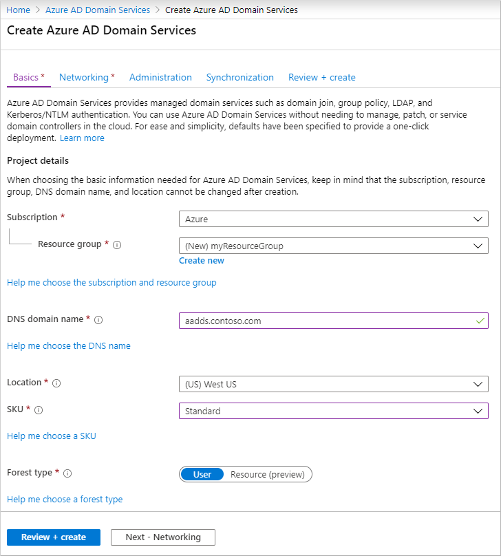
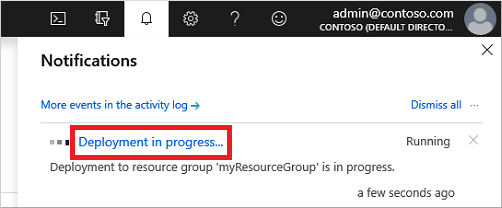
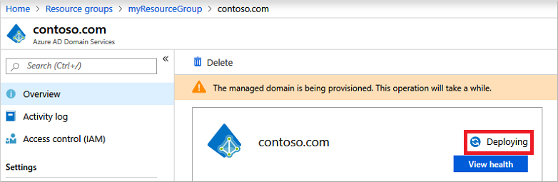
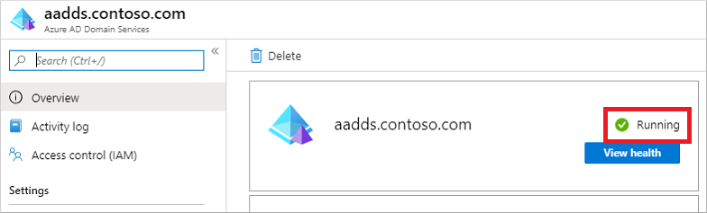
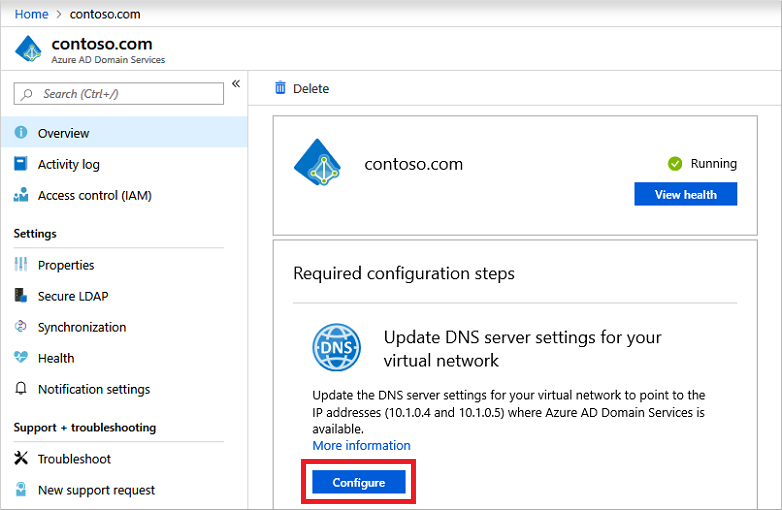
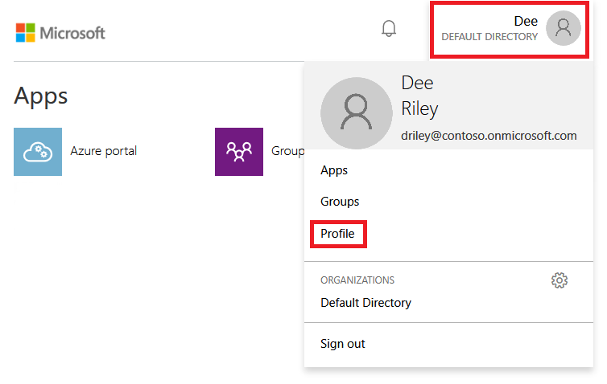

# Tutorial: Create and configure a Microsoft Entra Domain Services managed domain

Microsoft Entra Domain Services provides managed domain services such as domain join, group policy, LDAP, Kerberos/NTLM authentication that is fully compatible with Windows Server Active Directory. You consume these domain services without deploying, managing, and patching domain controllers yourself. Domain Services integrates with your existing Microsoft Entra tenant. This integration lets users sign in using their corporate credentials, and you can use existing groups and user accounts to secure access to resources.

You can create a managed domain using default configuration options for networking and synchronization, or [manually define these settings][tutorial-create-instance-advanced]. This tutorial shows you how to use default options to create and configure a Domain Services managed domain using the Microsoft Entra admin center.

In this tutorial, you learn how to:

> [!div class="checklist"]
> * Understand DNS requirements for a managed domain
> * Create a managed domain
> * Enable password hash synchronization

If you don't have an Azure subscription, [create an account](https://azure.microsoft.com/free/?WT.mc_id=A261C142F) before you begin.

## Prerequisites

To complete this tutorial, you need the following resources and privileges:

* An active Azure subscription.
    * If you don't have an Azure subscription, [create an account](https://azure.microsoft.com/free/?WT.mc_id=A261C142F).
* A Microsoft Entra tenant associated with your subscription, either synchronized with an on-premises directory or a cloud-only directory.
    * If needed, [create a Microsoft Entra tenant][create-azure-ad-tenant] or [associate an Azure subscription with your account][associate-azure-ad-tenant].
* You need [Application Administrator](/azure/active-directory/roles/permissions-reference#application-administrator) and [Groups Administrator](/azure/active-directory/roles/permissions-reference#groups-administrator) Microsoft Entra roles in your tenant to enable Domain Services.
* You need [Domain Services Contributor](/azure/role-based-access-control/built-in-roles#domain-services-contributor) Azure role to create the required Domain Services resources.
* A virtual network with DNS servers that can query necessary infrastructure such as storage. DNS servers that can't perform general internet queries might block the ability to create a managed domain. 

Although not required for Domain Services, it's recommended to [configure self-service password reset (SSPR)][configure-sspr] for the Microsoft Entra tenant. Users can change their password without SSPR, but SSPR helps if they forget their password and need to reset it.

> [!IMPORTANT]
> You can't move the managed domain to a different subscription, resource group, or region after you create it. Take care to select the most appropriate subscription, resource group, and region when you deploy the managed domain.

## Sign in to the Microsoft Entra admin center

In this tutorial, you create and configure the managed domain using the Microsoft Entra admin center. To get started, first sign in to the [Microsoft Entra admin center](https://entra.microsoft.com).

## Create a managed domain

To launch the **Enable Microsoft Entra Domain Services** wizard, complete the following steps:

1. On the Microsoft Entra admin center menu or from the **Home** page, select **Create a resource**.
1. Enter *Domain Services* into the search bar, then choose *Microsoft Entra Domain Services* from the search suggestions.
1. On the Microsoft Entra Domain Services page, select **Create**. The **Enable Microsoft Entra Domain Services** wizard is launched.
1. Select the Azure **Subscription** in which you would like to create the managed domain.
1. Select the **Resource group** to which the managed domain should belong. Choose to **Create new** or select an existing resource group.

When you create a managed domain, you specify a DNS name. There are some considerations when you choose this DNS name:

* **Built-in domain name:** By default, the built-in domain name of the directory is used (a *.onmicrosoft.com* suffix). If you wish to enable secure LDAP access to the managed domain over the internet, you can't create a digital certificate to secure the connection with this default domain. Microsoft owns the *.onmicrosoft.com* domain, so a Certificate Authority (CA) won't issue a certificate.
* **Custom domain names:** The most common approach is to specify a custom domain name, typically one that you already own and is routable. When you use a routable, custom domain, traffic can correctly flow as needed to support your applications.
* **Non-routable domain suffixes:** We generally recommend that you avoid a non-routable domain name suffix, such as *contoso.local*. The *.local* suffix isn't routable and can cause issues with DNS resolution.

> [!TIP]
> If you create a custom domain name, take care with existing DNS namespaces. Although it's supported, you may want to use a domain name separate from any existing Azure or on-premises DNS namespace.
>
> For example, if you have an existing DNS name space of *contoso.com*, create a managed domain with the custom domain name of *aaddscontoso.com*. If you need to use secure LDAP, you must register and own this custom domain name to generate the required certificates.
>
> You may need to create some additional DNS records for other services in your environment, or conditional DNS forwarders between existing DNS name spaces in your environment. For example, if you run a webserver that hosts a site using the root DNS name, there can be naming conflicts that require additional DNS entries.
>
> In these tutorials and how-to articles, the custom domain of *aaddscontoso.com* is used as a short example. In all commands, specify your own domain name.

The following DNS name restrictions also apply:

* **Domain prefix restrictions:** You can't create a managed domain with a prefix longer than 15 characters. The prefix of your specified domain name (such as *aaddscontoso* in the *aaddscontoso.com* domain name) must contain 15 or fewer characters.
* **Network name conflicts:** The DNS domain name for your managed domain shouldn't already exist in the virtual network. Specifically, check for the following scenarios that would lead to a name conflict:
    * If you already have an Active Directory domain with the same DNS domain name on the Azure virtual network.
    * If the virtual network where you plan to enable the managed domain has a VPN connection with your on-premises network. In this scenario, ensure you don't have a domain with the same DNS domain name on your on-premises network.
    * If you have an existing Azure cloud service with that name on the Azure virtual network.

Complete the fields in the *Basics* window of the Microsoft Entra admin center to create a managed domain:

1. Enter a **DNS domain name** for your managed domain, taking into consideration the previous points.
1. Choose the Azure **Location** in which the managed domain should be created. If you choose a region that supports Azure Availability Zones, the Domain Services resources are distributed across zones for additional redundancy.

    > [!TIP]
    > Availability Zones are unique physical locations within an Azure region. Each zone is made up of one or more datacenters equipped with independent power, cooling, and networking. To ensure resiliency, there's a minimum of three separate zones in all enabled regions.
    >
    > There's nothing for you to configure for Domain Services to be distributed across zones. The Azure platform automatically handles the zone distribution of resources. For more information and to see region availability, see [What are Availability Zones in Azure?][availability-zones]

1. The **SKU** determines the performance and backup frequency. You can change the SKU after the managed domain has been created if your business demands or requirements change. For more information, see [Domain Services SKU concepts][concepts-sku].

    For this tutorial, select the *Standard* SKU.
1. A *forest* is a logical construct used by Active Directory Domain Services to group one or more domains. 

    

To quickly create a managed domain, you can select **Review + create** to accept additional default configuration options. The following defaults are configured when you choose this create option:

* Creates a virtual network named *aadds-vnet* that uses the IP address range of *10.0.2.0/24*.
* Creates a subnet named *aadds-subnet* using the IP address range of *10.0.2.0/24*.
* Synchronizes *All* users from Microsoft Entra ID into the managed domain.

>[!NOTE]
>You shouldn't use public IP addresses for virtual networks and their subnets due to the following issues:
>
>- **Scarcity of the IP address**: IPv4 public IP addresses are limited, and their demand often exceeds the available supply. Also, there are potentially overlapping IPs with public endpoints.
>- **Security risks**: Using public IPs for virtual networks exposes your devices directly to the internet, increasing the risk of unauthorized access and potential attacks. Without proper security measures, your devices may become vulnerable to various threats.
>
>- **Complexity**: Managing a virtual network with public IPs can be more complex than using private IPs, as it requires dealing with external IP ranges and ensuring proper network segmentation and security.
>
>It is strongly recommended to use private IP addresses. If you use a public IP, ensure you are the owner/dedicated user of the chosen IPs in the public range you chose.

Select **Review + create** to accept these default configuration options.

## Deploy the managed domain

On the **Summary** page of the wizard, review the configuration settings for your managed domain. You can go back to any step of the wizard to make changes. To redeploy a managed domain to a different Microsoft Entra tenant in a consistent way using these configuration options, you can also **Download a template for automation**.

1. To create the managed domain, select **Create**. A note is displayed that certain configuration options such as DNS name or virtual network can't be changed once the Domain Services managed has been created. To continue, select **OK**.
1. The process of provisioning your managed domain can take up to an hour. A notification is displayed in the portal that shows the progress of your Domain Services deployment. Select the notification to see detailed progress for the deployment.

    

1. The page will load with updates on the deployment process, including the creation of new resources in your directory.
1. Select your resource group, such as *myResourceGroup*, then choose your managed domain from the list of Azure resources, such as *aaddscontoso.com*. The **Overview** tab shows that the managed domain is currently *Deploying*. You can't configure the managed domain until it's fully provisioned.

    

1. When the managed domain is fully provisioned, the **Overview** tab shows the domain status as *Running*.

    

> [!IMPORTANT]
> The managed domain is associated with your Microsoft Entra tenant. During the provisioning process, Domain Services creates two Enterprise Applications named *Domain Controller Services* and *AzureActiveDirectoryDomainControllerServices* in the Microsoft Entra tenant. These Enterprise Applications are needed to service your managed domain. Don't delete these applications.

## Update DNS settings for the Azure virtual network

With Domain Services successfully deployed, now configure the virtual network to allow other connected VMs and applications to use the managed domain. To provide this connectivity, update the DNS server settings for your virtual network to point to the two IP addresses where the managed domain is deployed.

1. The **Overview** tab for your managed domain shows some **Required configuration steps**. The first configuration step is to update DNS server settings for your virtual network. Once the DNS settings are correctly configured, this step is no longer shown.

    The addresses listed are the domain controllers for use in the virtual network. In this example, those addresses are *10.0.2.4* and *10.0.2.5*. You can later find these IP addresses on the **Properties** tab.

    

1. To update the DNS server settings for the virtual network, select the **Configure** button. The DNS settings are automatically configured for your virtual network.

> [!TIP]
> If you selected an existing virtual network in the previous steps, any VMs connected to the network only get the new DNS settings after a restart. You can restart VMs using the Microsoft Entra admin center, Azure PowerShell, or the Azure CLI.

## Enable user accounts for Domain Services

To authenticate users on the managed domain, Domain Services needs password hashes in a format that's suitable for NT LAN Manager (NTLM) and Kerberos authentication. Microsoft Entra ID doesn't generate or store password hashes in the format that's required for NTLM or Kerberos authentication until you enable Domain Services for your tenant. For security reasons, Microsoft Entra ID also doesn't store any password credentials in clear-text form. Therefore, Microsoft Entra ID can't automatically generate these NTLM or Kerberos password hashes based on users' existing credentials.

> [!NOTE]
> Once appropriately configured, the usable password hashes are stored in the managed domain. If you delete the managed domain, any password hashes stored at that point are also deleted.
>
> Synchronized credential information in Microsoft Entra ID can't be re-used if you later create a managed domain - you must reconfigure the password hash synchronization to store the password hashes again. Previously domain-joined VMs or users won't be able to immediately authenticate - Microsoft Entra ID needs to generate and store the password hashes in the new managed domain.
>
> [Microsoft Entra Connect Cloud Sync is not supported with Domain Services](/azure/active-directory/hybrid/cloud-sync/what-is-cloud-sync#comparison-between-azure-ad-connect-and-cloud-sync). On-premises users need to be synced using Microsoft Entra Connect in order to be able to access domain-joined VMs. For more information, see [Password hash sync process for Domain Services and Microsoft Entra Connect][password-hash-sync-process].

The steps to generate and store these password hashes are different for cloud-only user accounts created in Microsoft Entra ID versus user accounts that are synchronized from your on-premises directory using Microsoft Entra Connect.

A cloud-only user account is an account that was created in your Microsoft Entra directory using either the Microsoft Entra admin center or Azure AD PowerShell cmdlets. These user accounts aren't synchronized from an on-premises directory.

> In this tutorial, let's work with a basic cloud-only user account. For more information on the additional steps required to use Microsoft Entra Connect, see [Synchronize password hashes for user accounts synced from your on-premises AD to your managed domain][on-prem-sync].

> [!TIP]
> If your Microsoft Entra tenant has a combination of cloud-only users and users from your on-premises AD, you need to complete both sets of steps.

For cloud-only user accounts, users must change their passwords before they can use Domain Services. This password change process causes the password hashes for Kerberos and NTLM authentication to be generated and stored in Microsoft Entra ID. The account isn't synchronized from Microsoft Entra ID to Domain Services until the password is changed. Either expire the passwords for all cloud users in the tenant who need to use Domain Services, which forces a password change on next sign-in, or instruct cloud users to manually change their passwords. For this tutorial, let's manually change a user password.

Before a user can reset their password, the Microsoft Entra tenant must be [configured for self-service password reset][configure-sspr].

To change the password for a cloud-only user, the user must complete the following steps:

1. Go to the Microsoft Entra ID Access Panel page at [https://myapps.microsoft.com](https://myapps.microsoft.com).
1. In the top-right corner, select your name, then choose **Profile** from the drop-down menu.

    

1. On the **Profile** page, select **Change password**.
1. On the **Change password** page, enter your existing (old) password, then enter and confirm a new password.
1. Select **Submit**.

It takes a few minutes after you've changed your password for the new password to be usable in Domain Services and to successfully sign in to computers joined to the managed domain.

## Next steps

In this tutorial, you learned how to:

> [!div class="checklist"]
> * Understand DNS requirements for a managed domain
> * Create a managed domain
> * Add administrative users to domain management
> * Enable user accounts for Domain Services and generate password hashes

Before you domain-join VMs and deploy applications that use the managed domain, configure an Azure virtual network for application workloads.

> [!div class="nextstepaction"]
> [Configure Azure virtual network for application workloads to use your managed domain](tutorial-configure-networking.md)

<!-- INTERNAL LINKS -->
[tutorial-create-instance-advanced]: tutorial-create-instance-advanced.md
[create-azure-ad-tenant]: /azure/active-directory/fundamentals/sign-up-organization
[associate-azure-ad-tenant]: /azure/active-directory/fundamentals/how-subscriptions-associated-directory
[network-considerations]: network-considerations.md
[create-dedicated-subnet]: /azure/virtual-network/virtual-network-manage-subnet#add-a-subnet
[scoped-sync]: scoped-synchronization.md
[on-prem-sync]: tutorial-configure-password-hash-sync.md
[configure-sspr]: /azure/active-directory/authentication/tutorial-enable-sspr
[password-hash-sync-process]: /azure/active-directory/hybrid/connect/how-to-connect-password-hash-synchronization#password-hash-sync-process-for-azure-ad-domain-services
[tutorial-create-instance-advanced]: tutorial-create-instance-advanced.md
[skus]: overview.md
[resource-forests]: ./concepts-forest-trust.md
[availability-zones]: /azure/reliability/availability-zones-overview
[concepts-sku]: administration-concepts.md#azure-ad-ds-skus

<!-- EXTERNAL LINKS -->
[naming-prefix]: /windows-server/identity/ad-ds/plan/selecting-the-forest-root-domain#selecting-a-prefix
