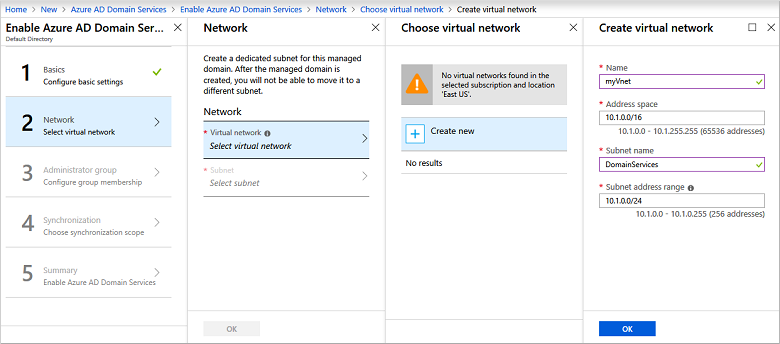
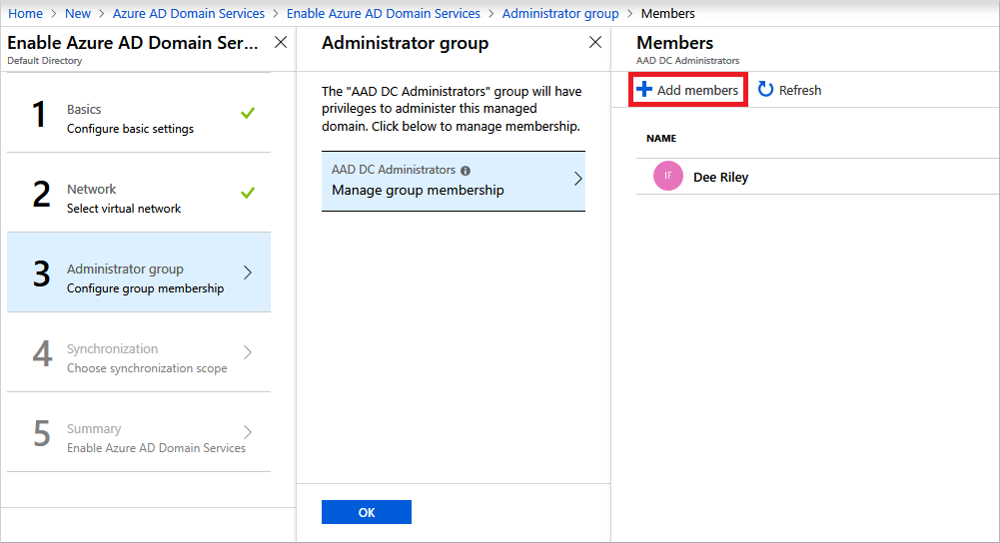
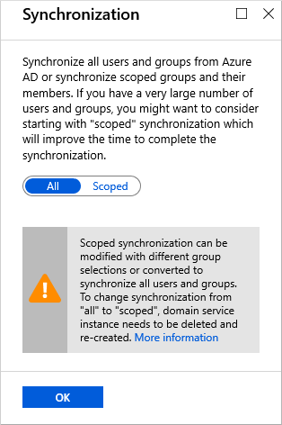

# Tutorial: Create and configure an Azure Active Directory (AD) Domain Services instance

In this tutorial, you learn how to:

> [!div class="checklist"]
> * Configure DNS and virtual network settings for a managed domain
> * Create an Azure AD Domain Services instance
> * Add administrative users to domain management
> * Enable password hash synchronization

If you don’t have an Azure subscription, create a [free account](https://azure.microsoft.com/free/?WT.mc_id=A261C142F) before you begin.

## Prerequisites

To complete this tutorial, you need the following resources and privileges:

* An active Azure subscription.
    * If you don’t have an Azure subscription, create a [free account](https://azure.microsoft.com/free/?WT.mc_id=A261C142F).
* An Azure Active Directory tenant associated with your subscription, either synchronized with an on-premises directory or a cloud-only directory.
    * If needed, [create an Azure Active Directory tenant][create-azure-ad-tenant] or [associate an Azure subscription with your account][associate-azure-ad-tenant].
* You need **global administrator** privileges in your Azure AD tenant to enable Azure AD Domain Services.

## Sign in to the Azure portal

In this tutorial, you create and configure the Azure AD Domain Services instance using the Azure portal. To get started, first sign in to the [Azure portal](https://portal.azure.com).

## Create an instance and configure basic settings

To launch the **Enable Azure AD Domain Services** wizard, complete the following steps:

1. In the upper left-hand corner of the Azure portal, select **+ Create a resource**.
1. Enter **Domain Services** into the search bar, then choose *Azure AD Domain Services* from the search suggestions.
1. On the Azure AD Domain Services page, select **Create**. The **Enable Azure AD Domain Services** wizard is launched.

When you create an Azure AD Domain Services instance, you specify a DNS name. There are some considerations when you choose this DNS name:

* **Built-in domain name:** By default, the built-in domain name of the directory is used (a *.onmicrosoft.com* suffix). If you wish to enable secure LDAP access to the managed domain over the internet, you can't create a digital certificate to secure the connection. Microsoft owns the *.onmicrosoft.com* domain, so a Certificate Authority (CA) won't issue a certificate for this domain.
* **Custom domain names:** You can specify a custom domain name, typically one that you already own and is routable. This tutorial uses the custom domain name *contoso100.com*.
* **Non-routable domain suffixes:** We generally recommend that you avoid a non-routable domain name suffix. Try to avoid a domain name such as *contoso.local*. The *.local* suffix isn't routable and can cause issues with DNS resolution.

The following DNS name restrictions also apply:

* **Domain prefix restrictions:** You can't create a managed domain with a prefix longer than 15 characters. The prefix of your specified domain name (such as *contoso100* in the *contoso100.com* domain name) must contain 15 or fewer characters.
* **Network name conflicts:** The DNS domain name for your managed domain shouldn't already exist in the virtual network. Specifically, check for the following scenarios that would lead to a name conflict:
    * If you already have an Active Directory domain with the same DNS domain name on the Azure virtual network.
    * If the virtual network where you plan to enable the managed domain has a VPN connection with your on-premises network. In this scenario, ensure you don't have a domain with the same DNS domain name on your on-premises network.
    * If you have an existing Azure cloud service with that name on the Azure virtual network.

Complete the fields in the *Basics* window of the Azure portal to create an Azure AD Domain Services instance:

1. Enter a **DNS domain name** for your managed domain.
1. Select the Azure **Subscription** in which you would like to create the managed domain.
1. Select the **Resource group** to which the managed domain should belong. Choose to **Create new** or **Use existing** options to select the resource group.
1. Choose the Azure **Location** in which the managed domain should be created. On the **Network** page of the wizard, you see only virtual networks that belong to the location you selected.
1. Click **OK** to move on to the **Network** section.

## Create and configure the virtual network

To provide connectivity, an Azure virtual network and a dedicated subnet are needed. Azure AD Domain Services is enabled in this virtual network subnet. In this tutorial, you create a virtual network, though you can choose to use an existing virtual network. In either approach, you must create a dedicated subnet for use by Azure AD Domain Services.

Some considerations for this dedicated virtual network subnet include the following areas:

* The subnet must have at least 3-5 available IP addresses in its address space to support the Azure AD Domain Services resources.
* Don't select the *Gateway* subnet for deploying Azure AD Domain Services. It's not supported to deploy Azure AD Domain Services into a *Gateway* subnet.
* Don't deploy any other virtual machines to the subnet. Applications and VMs often use network security groups to secure connectivity. Running these workloads in a separate subnet lets you apply those network security groups without disrupting connectivity to your managed domain.
* You can't move your managed domain to a different virtual network after you enable Azure AD Domain Services.

For more information on how to plan and configure the virtual network, see [networking considerations for Azure Active Directory Domain Services](network-considerations.md).

Complete the fields in the *Network* window of the Azure portal to create an Azure AD Domain Services instance:

1. On the **Network** window, select **Virtual network**.
1. For this tutorial, choose to **Create new** virtual network to deploy Azure AD Domain Services into. Enter a name for the virtual network, such as *Contoso100_Vnet*, then provide an address space, such as *10.1.0.0/16*. To make it easier for other administrators to understand what is deployed within the subnet, create a subnet named *DomainServices*, then provide an address space, such as *10.1.0.0/24*.

    

    Make sure to pick an address space that is within the private IP address space. IP Addresses that you don't own that are in the public address space cause errors within Azure AD Domain Services.

    > [!TIP]
    > On the **Choose virtual network** page, the existing virtual networks are displayed that belong to the resource group and Azure location you selected on the previous **Basics** page. You need to [create a dedicated subnet](../virtual-network/virtual-network-manage-subnet.md#add-a-subnet) before you deploy Azure AD Domain Services.

1. With the virtual network created, the subnet should be automatically selected, such as *DomainServices* that was created in the previous step. You can also choose an alternate existing subnet that's part of the selected virtual network:

    

1. Select **OK** to confirm the virtual network configuration.

## Configure an administrative group

A special administrative group named *AAD DC Administrators* is used for management of the Azure AD Domain Services domain. Members of this group are granted administrative permissions on VMs that are domain-joined to the managed domain. On domain-joined VMs, this group is added to the local administrators group. Members of this group can also use Remote Desktop to connect remotely to domain-joined VMs.

You don't have *Domain Administrator* or *Enterprise Administrator* permissions on a managed domain using Azure Active Directory Domain Services. These permissions are reserved by the service and aren't made available to users within the tenant. Instead, the *AAD DC Administrators* group lets you perform some privileged operations. These operations include joining computers to the domain, belonging to the administration group on domain-joined VMs, and configuring Group Policy.

The wizard automatically creates the *AAD DC Administrators* group in your Azure AD directory. If you have an existing group with this name in your Azure AD directory, the wizard selects this group.

1. To add additional users to this *AAD DC Administrators* group, select **Manage group membership**.
1. Select the **Add members** button, then search for and select users from your Azure AD directory. For example, search for your own account, and add it to the *AAD DC Administrators* group. Members can be also added to the group after the Azure AD Domain Services instance is created.

    

1. When you're done, select **OK**.

## Configure synchronization

Azure AD Domain Services lets you synchronize *all* users and groups available in Azure AD, or a *scoped* synchronization of only specific groups. If you choose to synchronize *all* users and groups, you can't later choose to only perform a scoped synchronization. For more information about scoped synchronization, see [Azure AD Domain Services scoped synchronization](scoped-synchronization.md).

1. For this tutorial, choose to synchronize **All**. This synchronization choice is also the default option. Select **OK**.

    

## Deploy your managed domain

On the **Summary** page of the wizard, review the configuration settings for the managed domain. You can go back to any step of the wizard to make changes.

1. To create the managed domain, select **OK**.
1. The process of provisioning your managed domain can take up to an hour. A notification is displayed in the portal that shows the progress of your Azure AD Domain Services deployment. Select the notification to see detailed progress for the deployment.

    

1. Select your resource group, such as *myResourceGroup*, then choose your Azure AD Domain Services instance from the list of Azure resources, such as *contoso100.com*. The **Overview** tab shows that the managed domain is currently *Deploying*. You can't configure the managed domain until it's fully provisioned.

    

1. When the managed domain is fully provisioned, the **Overview** tab shows the domain status as *Running*.

    

During the provisioning process, Azure AD Domain Services creates two Enterprise Applications named *Domain Controller Services* and *AzureActiveDirectoryDomainControllerServices* in your directory. These Enterprise Applications are needed to service your managed domain. It's imperative that these applications are not deleted at any time.

## Update DNS settings for the Azure virtual network

With Azure AD Domain Services successfully deployed, now configure the virtual network to allow other connected VMs and applications to use the managed domain. To provide this connectivity, update the DNS server settings for your virtual network to point to the two IP addresses where Azure Active Directory Domain Services  is deployed.

1. The **Overview** tab for your managed domain lists a set of **Required configuration steps**. The first configuration step is to update DNS server settings for your virtual network. Once the DNS settings are correctly configured, this step is no longer shown.

    The addresses listed are the domain controllers for use in the virtual network. In this example, those addresses are *10.1.0.4* and *10.1.0.5*. You can later find these IP addresses on the **Properties** tab.

    

1. To update the DNS server settings for the virtual network, select the **Configure** button. The DNS settings are automatically configured for your virtual network.

> [!TIP]
> If you selected an existing virtual network in the previous steps, any VMs connected to the network only get the new DNS settings after a restart. You can restart VMs using the Azure portal, Azure PowerShell, or the Azure CLI.

## Enable password hash synchronization to Azure Active Directory Domain Services

To authenticate users on the managed domain, Azure Active Directory Domain Services needs password hashes in a format that's suitable for NT LAN Manager (NTLM) and Kerberos authentication. Azure AD doesn't generate or store password hashes in the format that's required for NTLM or Kerberos authentication until you enable Azure Active Directory Domain Services for your tenant. For security reasons, Azure AD also doesn't store any password credentials in clear-text form. Therefore, Azure AD can't automatically generate these NTLM or Kerberos password hashes based on users' existing credentials.

Let's enable synchronization of password hashes required for NTLM and Kerberos authentication to Azure AD Domain Services. After you've set up password hash synchronization, users can sign in to the managed domain with their corporate credentials.

The steps are different for cloud-only user accounts created in Azure AD vs user accounts that are synchronized from your on-premises directory using Azure AD Connect. A cloud-only user account is an account that was created in your Azure AD directory using either the Azure portal or Azure AD PowerShell cmdlets. Such user accounts aren't synchronized from an on-premises directory.

In this tutorial, you set up password hash synchronization for cloud-only user accounts. For more information on the additional steps, see [Synchronize password hashes for user accounts synced from your on-premises AD to your managed domain](active-directory-ds-getting-started-password-sync-synced-tenant.md)

> [!TIP]
> If your Azure AD tenant has a combination of cloud-only users and users from your on-premises AD, you need to complete both sets of steps.

For cloud-only user accounts, all users who need to use Azure Active Directory Domain Services must change their passwords. This password change process causes the password hashes for Kerberos and NTLM authentication to be generated in Azure AD. You can either expire the passwords for all users in the tenant who need to use Azure Active Directory Domain Services, or instruct them to change their passwords. For this tutorial, let's change a user password.

Before a user can reset their password, the Azure AD tenant must be [configured for self-service password reset](../active-directory/authentication/quickstart-sspr.md).

To change the password for a cloud-only user, the user must complete the following steps:

1. Go to the Azure AD Access Panel page for your organization at [https://myapps.microsoft.com](https://myapps.microsoft.com).
1. In the top right corner, select your name, then choose **Profile** from the drop-down menu.

    

1. On the **Profile** page, select **Change password**.
1. On the **Change password** page, enter your existing (old) password, then enter and confirm a new password.
1. Select **Submit**.

It takes a few minutes after you've changed your password for the new password to be usable in Azure Active Directory Domain Services. After about 20 minutes, you can use the new password to sign in to computers joined to the managed domain.

## Clean up resources

If you're not going to continue to use this application, delete <resources> with the following steps:

1. From the left-hand menu...
2. ...click Delete, type...and then click Delete

## Next steps

> [!div class="nextstepaction"]
> [Join a Windows Server virtual machine to your managed domain](join-windows-vm.md)

<!-- INTERNAL LINKS -->
[create-azure-ad-tenant]: ../active-directory/fundamentals/sign-up-organization.md
[associate-azure-ad-tenant]: ../active-directory/fundamentals/active-directory-how-subscriptions-associated-directory.md