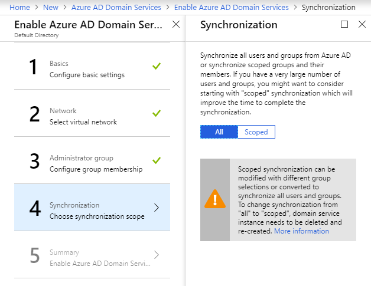
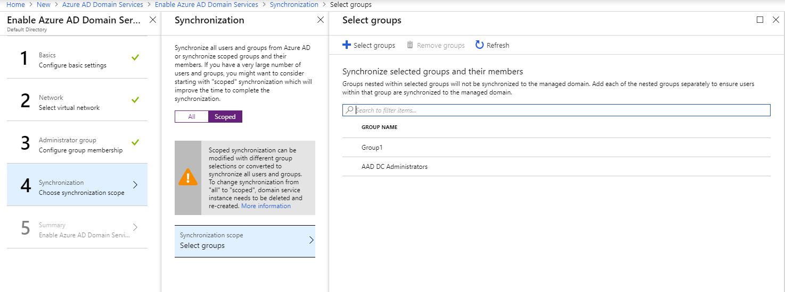
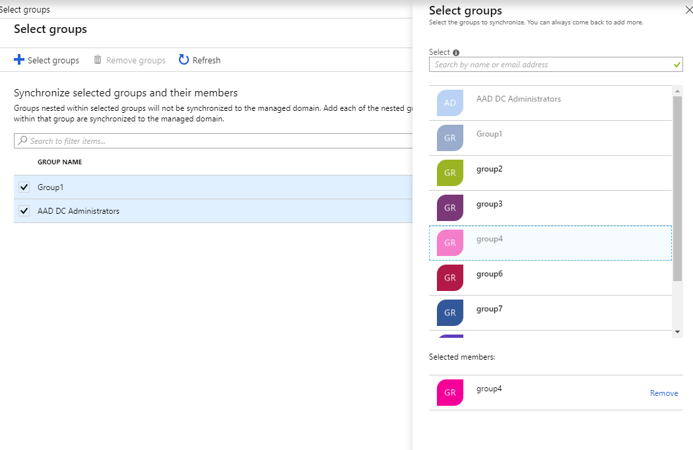

# Tutorial:

In this tutorial, you learn how to:

> [!div class="checklist"]
> *

If you don’t have an Azure subscription, create a [free account](https://azure.microsoft.com/free/?WT.mc_id=A261C142F) before you begin.

## Prerequisites

To complete this tutorial, you need the following resources and privileges:

* An active Azure subscription.
    * If you don’t have an Azure subscription, create a [free account](https://azure.microsoft.com/free/?WT.mc_id=A261C142F).
* An Azure Active Directory tenant associated with your subscription, either synchronized with an on-premises directory or a cloud-only directory.
    * If you need to create or associate a tenant, [create an Azure Active Directory tenant][create-azure-ad-tenant] or [associate an Azure subscription with your account][associate-azure-ad-tenant].
* You need **global administrator** privileges in your Azure AD tenant to enable Azure AD Domain Services.

## Sign in to Azure portal

In this tutorial, you create and configure the Azure AD Domain Services instance using the Azure portal. To get started, first sign in to the [Azure portal](https://portal.azure.com).

## Create instance and configure basic settings

To launch the **Enable Azure AD Domain Services** wizard, complete the following steps:

1. In the upper left-hand corner of the Azure portal, select **+ Create a resource**.
1. Enter **Domain Services** into the search bar, then choose *Azure AD Domain Services* from the search suggestions.
1. On the Azure AD Domain Services page, select **Create**. The **Enable Azure AD Domain Services** wizard is launched.

When you create an Azure AD Domain Services instance, you specify a DNS name. There are some considerations when you choose this DNS name:

* **Built-in domain name:** By default, the built-in domain name of the directory is used (a *.onmicrosoft.com* suffix). If you wish to enable secure LDAP access to the managed domain over the internet, you can't create a digital certificate to secure the connection. Microsoft owns the *.onmicrosoft.com* domain, so a Certificate Authority (CA) won't issue a certificate for this domain.
* **Custom domain names:** You can specify a custom domain name, typically one that you already own and is routable. This tutorial uses the custom domain name *contoso100.com*.
* **Non-routable domain suffixes:** We generally recommend that you avoid a non-routable domain name suffix. Try to avoid a domain name such as *contoso.local*. The *.local* suffix isn't routable and can cause issues with DNS resolution.

The following DNS name restrictions also apply:

* **Domain prefix restrictions:** You can't create a managed domain with a prefix longer than 15 characters. The prefix of your specified domain name (such as *contoso100* in the *contoso100.com* domain name) must contain 15 or fewer characters.
* **Network name conflicts:** The DNS domain name for your managed domain shouldn't already exist in the virtual network. Specifically, check for the following scenarios that would lead to a name conflict:
    * If you already have an Active Directory domain with the same DNS domain name on the Azure virtual network.
    * If the virtual network where you plan to enable the managed domain has a VPN connection with your on-premises network. In this scenario, ensure you don't have a domain with the same DNS domain name on your on-premises network.
    * If you have an existing Azure cloud service with that name on the Azure virtual network.

Complete the fields in the *Basics* window of the Azure portal to create an Azure AD Domain Services instance:

1. Enter a **DNS domain name** for your managed domain.
1. Select the Azure **Subscription** in which you would like to create the managed domain.
1. Select the **Resource group** to which the managed domain should belong. Choose to **Create new** or **Use existing** options to select the resource group.
1. Choose the Azure **Location** in which the managed domain should be created. On the **Network** page of the wizard, you see only virtual networks that belong to the location you have selected.
1. Click **OK** to move on to the **Network** section.

## Configure network settings

Refer to [Networking considerations for Azure Active Directory Domain Services](network-considerations.md).

The next configuration task is to create an Azure virtual network and a dedicated subnet within it. You enable Azure Active Directory Domain Services in this subnet within your virtual network. You may also pick an existing virtual network and create the dedicated subnet within it.

1. Click **Virtual network** to select a virtual network.
    > [!NOTE]
    > **Classic virtual networks are not supported for new deployments.** Classic virtual networks are not supported for new deployments. Existing managed domains deployed in classic virtual networks continue to be supported. Microsoft will enable you to migrate an existing managed domain from a classic virtual network to a Resource Manager virtual network in the near future.
    >

2. On the **Choose virtual network** page, you see all existing virtual networks. You see only the virtual networks that belong to the resource group and Azure location you have selected on the **Basics** wizard page.
3. Choose the virtual network in which Azure AD Domain Services should be enabled. You can either pick an existing virtual network or create a new one.

   > [!TIP]
   > **You cannot move your managed domain to a different virtual network after you enable Azure AD Domain Services.** Pick the right virtual network to enable your managed domain. After you create a managed domain, you cannot move it to a different virtual network, without deleting the managed domain. We recommend reviewing the [networking considerations for Azure Active Directory Domain Services](network-considerations.md) before you proceed.  
   >

4. **Create virtual network:** Click **Create new** to create a new virtual network. Use a dedicated subnet for Azure AD Domain Services. For example, create a subnet with the name 'DomainServices', making it easy for other administrators to understand what is deployed within the subnet. Click **OK** when you're done.

    

   > [!WARNING]
   > Make sure to pick an address space that is within the private IP address space. IP Addresses that you do not own that are in the public address space cause errors within Azure AD Domain Services.

5. **Existing virtual network:** If you plan to pick an existing virtual network, [create a dedicated subnet using the virtual networks extension](../virtual-network/virtual-network-manage-subnet.md#add-a-subnet), and then pick that subnet. Click **Virtual Network** to select the existing virtual network. Click **Subnet** to pick the dedicated subnet in your existing virtual network, within which to enable your new managed domain. Click **OK** when you're done.

    

   > [!NOTE]
   > **Guidelines for selecting a subnet**
   > 1. Use a dedicated subnet for Azure AD Domain Services. Do not deploy any other virtual machines to this subnet. This configuration enables you to configure network security groups (NSGs) for your workloads/virtual machines without disrupting your managed domain. For details, see [networking considerations for Azure Active Directory Domain Services](network-considerations.md).
   > 2. Do not select the Gateway subnet for deploying Azure AD Domain Services, because it is not a supported configuration.
   > 3. The subnet you've selected must have at least 3-5 available IP addresses in its address space.

6. When you are done, click **OK** to proceed to the **Administrator group** page of the wizard.

## Configure administrative group

In this configuration task, you create an administrative group in your Azure AD directory. This special administrative group is called *AAD DC Administrators*. Members of this group are granted administrative permissions on machines that are domain-joined to the managed domain. On domain-joined machines, this group is added to the administrators group. Additionally, members of this group can use Remote Desktop to connect remotely to domain-joined machines.

> [!NOTE]
> You do not have Domain Administrator or Enterprise Administrator permissions on the managed domain that you created by using Azure Active Directory Domain Services. On managed domains, these permissions are reserved by the service and are not made available to users within the tenant. However, you can use the special administrative group created in this configuration task to perform some privileged operations. These operations include joining computers to the domain, belonging to the administration group on domain-joined machines, and configuring Group Policy.
>

The wizard automatically creates the administrative group in your Azure AD directory. This group is called 'AAD DC Administrators'. If you have an existing group with this name in your Azure AD directory, the wizard selects this group. You can configure group membership using the **Administrator group** wizard page.

1. To configure group membership, click **AAD DC Administrators**.

    

2. Click the **Add members** button to add users from your Azure AD directory to the administrator group.

3. When you are done, click **OK** to move on to the **Summary** page of the wizard.

## Configure synchronization

Azure AD Domain Services allows for either full synchronization of all users and groups available in Azure AD, or you can select scoped synchronization to synchronize only specific groups. If you choose the full synchronization, you will **not** be able to choose scoped synchronization at a later time. To learn more about scoped synchronization, visit the [Azure AD Domain Services scoped synchronization article](scoped-synchronization.md).

### Full synchronization

1. For full synchronization, just click "OK" on the bottom of the screen, as full is already chosen.
    

### Scoped synchronization

1. Toggle the synchronization button to "Scoped" and a select groups page will appear. From this, you can see what groups are already selected to be synchronized to your managed domain.
    
2. Click **Select groups** in the top navigation bar. From here, a group picker will pop up on the side. Use this to select any additional groups to synchronize to Azure AD Domain Services. When finished, click **Select** to close the group picker and add those groups to the selected list.
    
3. Click **OK** to move to the summary page.

## Deploy your managed domain

1. On the **Summary** page of the wizard, review the configuration settings for the managed domain. You can go back to any step of the wizard to make changes, if necessary. When you are done, click **OK** to create the new managed domain.

    

2. You see a notification that shows the progress of your Azure AD Domain Services deployment. Click the notification to see detailed progress for the deployment.

    

## Check the deployment status of your managed domain

The process of provisioning your managed domain can take up to an hour.

1. While your deployment is in progress, you can search for 'domain services' in the **Search resources** search box. Select **Azure AD Domain Services** from the search result. The **Azure AD Domain Services** blade lists the managed domain that is being provisioned.

    

2. Click the name of the managed domain (for example, 'contoso100.com') to see more details about the managed domain.

    

3. The **Overview** tab shows that the managed domain is currently being provisioned. You cannot configure the managed domain until it is fully provisioned. It may take up to an hour for your managed domain to be fully provisioned.

    

4. When the managed domain is fully provisioned, the **Overview** tab shows the domain status as **Running**.

    
    >[!NOTE]
    >During the provisioning process, Azure AD Domain Services creates Enterprise Applications named "Domain Controller Services" and "AzureActiveDirectoryDomainControllerServices" within your directory. These Enterprise Applications are needed to service your managed domain. It is imperative that these are not deleted at any time.
    >

5. On the **Properties** tab, you see two IP addresses at which domain controllers are available for the virtual network.

    

### Need help?

It may take an hour or two for both domain controllers for your managed domain to be provisioned. If your deployment failed or is stuck in the 'Pending' state for more than a couple of hours, feel free to [contact the product team for help](contact-us.md).

## Update DNS settings for the Azure virtual network
In the preceding configuration tasks, you have successfully enabled Azure Active Directory Domain Services for your directory. Next, enable computers within the virtual network to connect and consume these services. In this article, you update the DNS server settings for your virtual network to point to the two IP addresses where Azure Active Directory Domain Services is available on the virtual network.

To update the DNS server settings for the virtual network in which you have enabled Azure Active Directory Domain Services, complete the following steps:

1. The **Overview** tab lists a set of **Required configuration steps** to be performed after your managed domain is fully provisioned. The first configuration step is **Update DNS server settings for your virtual network**.

    

    > [!TIP]
    > Dont see this configuration step? If the DNS server settings for your virtual network are up to date, you will not see the 'Update DNS server settings for your virtual network' tile on the Overview tab.
    >
    >

2. Click the **Configure** button to update the DNS server settings for the virtual network.

> [!NOTE]
> Virtual machines in the network only get the new DNS settings after a restart. If you need them to get the updated DNS settings right away, trigger a restart either by the portal, PowerShell, or the CLI.

## Enable password hash synchronization to Azure Active Directory Domain Services
In preceding tasks, you enabled Azure Active Directory Domain Services for your Azure Active Directory (Azure AD) tenant. The next task is to enable synchronization of password hashes required for NT LAN Manager (NTLM) and Kerberos authentication to Azure AD Domain Services. After you've set up password hash synchronization, users can sign in to the managed domain with their corporate credentials.

The steps involved are different for cloud-only user accounts vs user accounts that are synchronized from your on-premises directory using Azure AD Connect.

 

| **Type of user account** | **Steps to perform** |
| --- |---|
| **Cloud user accounts created in Azure AD** |**&#x2713;** [Follow the instructions in this article](active-directory-ds-getting-started-password-sync.md#task-5-enable-password-hash-synchronization-to-your-managed-domain-for-cloud-only-user-accounts) |
| **User accounts synchronized from an on-premises directory** |**&#x2713;** [Synchronize password hashes for user accounts synced from your on-premises AD to your managed domain](active-directory-ds-getting-started-password-sync-synced-tenant.md) | 

 

> [!TIP]
> **You may need to complete both sets of steps.**
> If your Azure AD tenant has a combination of cloud only users and users from your on-premises AD, you need to complete both sets of steps.

### Enable password hash synchronization to your managed domain for cloud-only user accounts
To authenticate users on the managed domain, Azure Active Directory Domain Services needs password hashes in a format that's suitable for NTLM and Kerberos authentication. Azure AD does not generate or store password hashes in the format that's required for NTLM or Kerberos authentication, until you enable Azure Active Directory Domain Services for your tenant. For obvious security reasons, Azure AD also does not store any password credentials in clear-text form. Therefore, Azure AD does not have a way to automatically generate these NTLM or Kerberos password hashes based on users' existing credentials.

> [!NOTE]
> **If your organization has cloud-only user accounts, all users who need to use Azure Active Directory Domain Services must change their passwords.** A cloud-only user account is an account that was created in your Azure AD directory using either the Azure portal or Azure AD PowerShell cmdlets. Such user accounts aren't synchronized from an on-premises directory.
>
>

This password change process causes the password hashes that are required by Azure Active Directory Domain Services for Kerberos and NTLM authentication to be generated in Azure AD. You can either expire the passwords for all users in the tenant who need to use Azure Active Directory Domain Services or instruct them to change their passwords.

### Enable NTLM and Kerberos password hash generation for a cloud-only user account
Here are the instructions you need to provide users, so they can change their passwords:

1. Go to the [Azure AD Access Panel](https://myapps.microsoft.com) page for your organization.

    

2. In the top right corner, click on your name and select **Profile** from the menu.

    

3. On the **Profile** page, click on **Change password**.

    

   > [!TIP]
   > If the **Change password** option is not displayed in the Access Panel window, ensure that your organization has configured [password management in Azure AD](../active-directory/authentication/quickstart-sspr.md).
   >
   >
4. On the **change password** page, type your existing (old) password, type a new password, and then confirm it.

    

5. Click **submit**.

A few minutes after you have changed your password, the new password is usable in Azure Active Directory Domain Services. After about 20 minutes, you can sign in to computers joined to the managed domain using the newly changed password.

## Clean up resources

If you're not going to continue to use this application, delete <resources> with the following steps:

1. From the left-hand menu...
2. ...click Delete, type...and then click Delete

## Next steps

> [!div class="nextstepaction"]
> 

<!-- INTERNAL LINKS -->
[create-azure-ad-tenant]: ../active-directory/fundamentals/sign-up-organization.md
[associate-azure-ad-tenant]: ../active-directory/fundamentals/active-directory-how-subscriptions-associated-directory.md