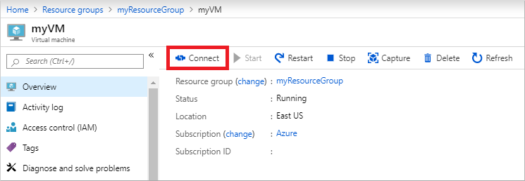

# Tutorial: Create a management VM to configure and administer an Azure Active Directory Domain Services managed domain

Azure Active Directory Domain Services (AD DS) provides managed domain services such as domain join, group policy, LDAP, and Kerberos/NTLM authentication that is fully compatible with Windows Server Active Directory. You administer this managed domain using the same Remote Server Administration Tools (RSAT) as with an on-premises Active Directory Domain Services domain. As Azure AD DS is a managed service, there are some administrative tasks that you can't perform, such as using remote desktop protocol (RDP) to connect to the domain controllers.

This tutorial shows you how to create a Windows Server VM in Azure and install the required tools to administer an Azure AD DS managed domain.

In this tutorial, you learn how to:

> [!div class="checklist"]
> * Understand the available administrative tasks in an Azure AD DS managed domain
> * Install the Active Directory administrative tools on a Windows Server VM
> * Use the Active Directory Administrative Center to perform common tasks

If you don’t have an Azure subscription, [create an account](https://azure.microsoft.com/free/?WT.mc_id=A261C142F) before you begin.

## Prerequisites

To complete this tutorial, you need the following resources and privileges:

* An active Azure subscription.
    * If you don’t have an Azure subscription, [create an account](https://azure.microsoft.com/free/?WT.mc_id=A261C142F).
* An Azure Active Directory tenant associated with your subscription, either synchronized with an on-premises directory or a cloud-only directory.
    * If needed, [create an Azure Active Directory tenant][create-azure-ad-tenant] or [associate an Azure subscription with your account][associate-azure-ad-tenant].
* An Azure Active Directory Domain Services managed domain enabled and configured in your Azure AD tenant.
    * If needed, the first tutorial [creates and configures an Azure Active Directory Domain Services instance][create-azure-ad-ds-instance].
* A Windows Server VM that is joined to the Azure AD DS managed domain.
    * If needed, the previous tutorial [creates a Windows Server VM and joins it to a managed domain][create-join-windows-vm].
* A user account that's a member of the *Azure AD DC administrators* group in your Azure AD tenant.

## Sign in to the Azure portal

In this tutorial, you create and configure a management VM using the Azure portal. To get started, first sign in to the [Azure portal](https://portal.azure.com).

## Available administrative tasks in Azure AD DS

Azure AD DS provides a managed domain for your users, applications, and services to consume. This approach changes some of the available management tasks you can do, and what privileges you have within the managed domain. These tasks and permissions may be different than what you experience with a regular on-premises Active Directory Domain Services environment. You also can't connect to domain controllers on the Azure AD DS managed domain using Remote Desktop.

### Administrative tasks you can perform on an Azure AD DS managed domain

Members of the *AAD DC Administrators* group are granted privileges on the Azure AD DS managed domain that enables them to do tasks such as:

* Join machines to the managed domain.
* Configure the built-in group policy object (GPO) for the *AADDC Computers* and *AADDC Users* containers in the managed domain.
* Administer DNS on the managed domain.
* Create and administer custom organizational units (OUs) on the managed domain.
* Gain administrative access to computers joined to the managed domain.

### Administrative privileges you don't have on an Azure AD DS managed domain

The Azure AD DS managed domain is locked down, so you don't have privileges to do certain administrative tasks on the domain. Some of the following examples are tasks you can't do:

* Extend the schema of the managed domain.
* Connect to domain controllers for the managed domain using Remote Desktop.
* Add domain controllers to the managed domain.
* You don't have *Domain Administrator* or *Enterprise Administrator* privileges for the managed domain.

## Sign in to the Windows Server VM

In the previous tutorial, a Windows Server VM was created and joined to the Azure AD DS managed domain. Let's use that VM to install the management tools. If needed, [follow the steps in the tutorial to create and join a Windows Server VM to a managed domain][create-join-windows-vm].

> [!NOTE]
> In this tutorial, you use a Windows Server VM in Azure that is joined to the Azure AD DS managed domain. You can also use a Windows client, such as Windows 10, that is joined to the managed domain.
>
> For more information on how to install the administrative tools on a Windows client, see [install Remote Server Administration Tools (RSAT)](https://social.technet.microsoft.com/wiki/contents/articles/2202.remote-server-administration-tools-rsat-for-windows-client-and-windows-server-dsforum2wiki.aspx)

To get started, connect to the Windows Server VM as follows:

1. In the Azure portal, select **Resource groups** on the left-hand side. Choose the resource group where your VM was created, such as *myResourceGroup*, then select the VM, such as *myVM*.
1. In the **Overview** windows of the VM, select **Connect**.

    

    You can also [create and use an Azure Bastion host (currently in preview)][azure-bastion] to allow access only through the Azure portal over SSL.

1. Select the option to *Download RDP File*. Save this RDP file in your web browser.
1. To connect to your VM, open the downloaded RDP file. If prompted, select **Connect**.
1. Enter the credentials of a user that's part of the *Azure AD DC administrators* group, such as *contoso\dee*
1. If you see a certificate warning during the sign in process, select **Yes** or **Continue** to connect.

## Install Active Directory administrative tools

Azure AD DS managed domains are managed using the same administrative tools as on-premises AD DS environments, such as the Active Directory Administrative Center (ADAC) or AD PowerShell. These tools can be installed as part of the Remote Server Administration Tools (RSAT) feature on Windows Server and client computers. Members of the *AAD DC Administrators* group can then administer Azure AD DS managed domains remotely using these AD administrative tools from a computer that is joined to the managed domain.

To install the Active Directory Administration tools on a domain-joined VM, complete the following steps:

1. If **Server Manager** doesn't open by default when you sign in to the VM, select the **Start** menu, then choose **Server Manager**.
1. In the *Dashboard* pane of the **Server Manager** window, select **Add Roles and Features**.
1. On the **Before You Begin** page of the *Add Roles and Features Wizard*, select **Next**.
1. For the *Installation Type*, leave the **Role-based or feature-based installation** option checked and select **Next**.
1. On the **Server Selection** page, choose the current VM from the server pool, such as *myvm.contoso.com*, then select **Next**.
1. On the **Server Roles** page, click **Next**.
1. On the **Features** page, expand the **Remote Server Administration Tools** node, then expand the **Role Administration Tools** node.

    Choose **AD DS and AD LDS Tools** feature from the list of role administration tools, then select **Next**.

    

1. On the **Confirmation** page, select **Install**. It may take a minute or two to install the administrative tools.
1. When feature installation is complete, select **Close** to exit the **Add Roles and Features** wizard.

## Use Active Directory administrative tools

With the administrative tools installed, let's see how to use them to administer the Azure AD DS managed domain. Make sure that you're signed in to the VM with a user account that's a member of the *AAD DC Administrators* group.

1. From the **Start** menu, select **Windows Administrative Tools**. The AD administrative tools installed in the previous step are listed.

    

1. Select **Active Directory Administrative Center**.
1. To explore the Azure AD DS managed domain, choose the domain name in the left pane, such as *contoso.com*. Two containers named *AADDC Computers* and *AADDC Users* are at the top of the list.

    

1. To see the users and groups that belong to the Azure AD DS managed domain, select the **AADDC Users** container. The user accounts and groups from your Azure AD tenant are listed in this container.

    In the following example output, a user account named *Contoso Admin* and a group for *AAD DC Administrators* are shown in this container.

    

1. To see the computers that are joined to the Azure AD DS managed domain, select the **AADDC Computers** container. An entry for the current virtual machine, such as *myVM*, is listed. Computer accounts for all computers that are joined to the Azure AD DS managed domain are stored in this *AADDC Computers* container.

Common Active Directory Administrative Center actions such as resetting a user account password or managing group membership are available. These actions only work for users and groups created directly in the Azure AD DS managed domain. Identity information only synchronizes *from* Azure AD to Azure AD DS. There's no write back from Azure AD DS to Azure AD. You can't change passwords or managed group membership for users synchronized from Azure AD and have those changes synchronized back.

You can also use the *Active Directory Module for Windows PowerShell*, installed as part of the administrative tools, to manage common actions in your Azure AD DS managed domain.

## Next steps

In this tutorial, you learned how to:

> [!div class="checklist"]
> * Understand the available administrative tasks in an Azure AD DS managed domain
> * Install the Active Directory administrative tools on a Windows Server VM
> * Use the Active Directory Administrative Center to perform common tasks

To safely interact with your Azure AD DS managed domain, enable secure Lightweight Directory Access Protocol (LDAPS).

> [!div class="nextstepaction"]
> [Configure secure LDAP for your managed domain](tutorial-configure-ldaps.md)

<!-- INTERNAL LINKS -->
[create-azure-ad-tenant]: ../active-directory/fundamentals/sign-up-organization.md
[associate-azure-ad-tenant]: ../active-directory/fundamentals/active-directory-how-subscriptions-associated-directory.md
[create-azure-ad-ds-instance]: tutorial-create-instance.md
[create-join-windows-vm]: join-windows-vm.md
[azure-bastion]: ../bastion/bastion-create-host-portal.md
