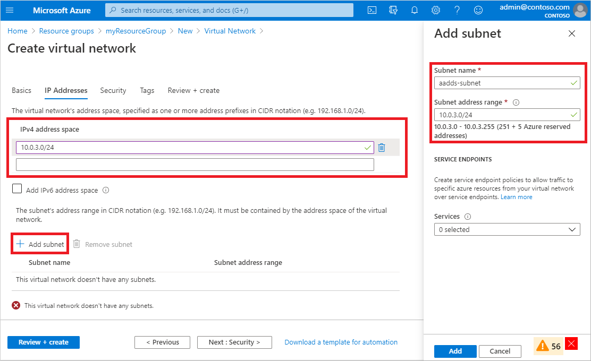
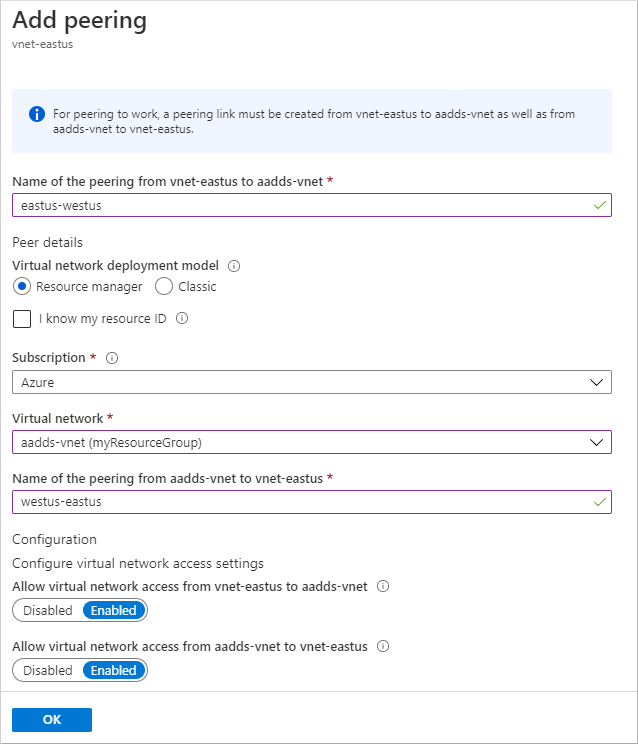

# Tutorial: Create and use replica sets for resiliency or geolocation in Azure Active Directory Domain Services (preview)

To improve the resiliency of an Azure Active Directory Domain Services (Azure AD DS) managed domain, or deploy to additional geographic locations close to your applications, you can use *replica sets*. Every Azure AD DS managed domain namespace, such as *aaddscontoso.com*, contains one initial replica set. The ability to create additional replica sets provides geographical disaster recover for a managed domain. You can add a replica set to any peered virtual network in any Azure region that supports Azure AD DS. Additional replica sets in different Azure regions provide geographical disaster recovery for legacy applications if an Azure region goes offline.

In this tutorial, you learn how to:

> [!div class="checklist"]
> * Configure virtual network peering
> * Create a replica set in a different geographic region
> * Delete a replica set

If you don't have an Azure subscription, [create an account](https://azure.microsoft.com/free/?WT.mc_id=A261C142F) before you begin.

## Prerequisites

To complete this tutorial, you need the following resources and privileges:

* An active Azure subscription.
    * If you don't have an Azure subscription, [create an account](https://azure.microsoft.com/free/?WT.mc_id=A261C142F).
* An Azure Active Directory tenant associated with your subscription, either synchronized with an on-premises directory or a cloud-only directory.
    * If needed, [create an Azure Active Directory tenant][create-azure-ad-tenant] or [associate an Azure subscription with your account][associate-azure-ad-tenant].
* An Azure Active Directory Domain Services managed domain created using replica sets and configured in your Azure AD tenant.
    * If needed, [create and configure an Azure Active Directory Domain Services managed domain][tutorial-create-instance].

    > [!IMPORTANT]
    > Make sure that you create a managed domain that uses replica sets. An existing managed domain created before this preview doesn't support replica sets. You also need to use a minimum of *Enterprise* SKU for your managed domain. If needed, [change the SKU for a managed domain][howto-change-sku].

## Sign in to the Azure portal

In this tutorial, you create and manage replica sets using the Azure portal. To get started, first sign in to the [Azure portal](https://portal.azure.com).

## Networking considerations

The virtual networks that host replica sets must be able to communicate with each other. Applications and services also need network connectivity to the virtual networks hosting the replica sets. Azure virtual network peering should be configured between all virtual networks to create a fully meshed network. These peerings let the underlying Active Directory Domain Services replication processes successfully

Before you can use replica sets in Azure AD DS, review the following Azure virtual network requirements:

* Avoid overlapping IP address spaces to allow virtual network peering and routing to successfully communicate.
* Create subnets with enough IP addresses to support your scenario.
* Make sure Azure AD DS has its own subnet. Don't share this virtual network subnet with application VMs and services.
* Peered virtual networks are NOT transitive.
    * Azure virtual network peerings must be created between all virtual networks you want to use the Azure AD DS resource forest trust to the on-premises AD DS environment.

## Create a virtual network

1. In the Azure portal, search for and select **virtual network**, then **+ Add** a virtual network.
1. Select your resource group, such as *myResourceGroup*, then enter name and region. This region needs to match where you want your replica set to be created.

    For this tutorial, enter a name of *vnet-eastus*, and select the *(US) East US* region.

1. Select **Next: IP Addresses >**.
1. The default address range for a managed domain is *10.0.2.0/24*. When you created your own managed domain, you may have provided a different address range. The address range for this new virtual network can't overlap what you currently have in use.

    For this tutorial, use the **IPv4 address space** of *10.0.3.0/24*. Then, **+ Add subnet** with a name of *aadds-subnet* and address range of *10.0.3.0/24*, as shown in the following example portal screenshot:

    

1. Select **Add** for the subnet, then **Review + create**. To create the virtual network and subnet, select **Create**.

It takes a minute or two to create the virtual network and subnet. When complete, select **Go to resource**.

## Create a virtual network peering

With a virtual network created for the replica set, you now need to create an Azure virtual network peering to the existing Azure AD DS virtual network subnet. This peering lets traffic flow between the two virtual networks. Without this peering, the replica sets can't communicate and allow the AD DS replication processes to successfully complete.

All virtual networks that use a replica set must be peered to each other. This mesh approach makes sure that if one virtual network has a problem, network connectivity between other replica sets isn't lost.

In this tutorial, you create one peering between the existing managed domain virtual network and the one created in the previous step. If you create additional replica sets in other regions and virtual networks, repeat the following steps to create more peerings:

1. From your virtual network, such as *vnet-eastus*, select **Peerings** from the menu on the left-hand side.
1. Select **+ Add**, then configure the peerings as follows:

    | Parameter                  | Value                                                              |
    |----------------------------|--------------------------------------------------------------------|
    | Name                       | *eastus-westus*                                                    |
    | Virtual network            | Existing replica set virtual network, such as *West US aadds-vnet* |
    | Peered name                | *westus-eastus*                                                    |
    | All virtual network access | *Enabled* in both directions                                       |

    The following example configuration creates the required peering:

    

1. To create the peering, select **OK**. It takes a few moments to create both peerings.

## Create a replica set

The two Azure virtual networks are now peered. You can now create an additional replica set for the existing managed domain. To create an additional replica set, complete the following steps:

1. In the Azure portal, search for and select **Azure AD Domain Services**.
1. Choose your managed domain, such as *aaddscontoso.com*.
1. On the left-hand side, select **Replica sets (preview)**. Each managed domain includes one initial replica set in the selected region, as shown in the following example screenshot:

    

    To create an additional replica set, select **+ Add**.

1. In the *Add a replica set* window, select the destination region, such as *East US*. This region must match where the virtual network and peering was created in the previous steps.

    Select the virtual network created in the previous section, such as *vnet-eastus*, then subnet such as *aadds-subnet*, as shown in the following example screenshot:

    

1. When ready, select **Save**. The process to create the replica set takes some time as the resources are created in the destination region and the managed domain itself is then replicated.

    The replica set shows as *Provisioning* as deployment continues. When complete, the replica set shows as *Running*:

    

## Delete a replica set

A managed domain is currently limited to four replicas - the initial replica set, and three replicas. If you don't need a replica set anymore, or you want to create a replica set in another region, you can delete one. You can't delete the last replica set in a managed domain.

To delete a replica set, complete the following steps:

1. In the Azure portal, search for and select **Azure AD Domain Services**.
1. Choose your managed domain, such as *aaddscontoso.com*.
1. On the left-hand side, select **Replica sets (preview)**. From the list of replica sets, select the **...** context menu next to the replica set you want to delete.
1. Select **Delete** from the context menu, then confirm you want to delete the replica set.

It takes some time to delete the selected replica set. If you no longer need the virtual network or peering used by the replica set, you can also delete those resources. Make sure no other application resources in the other region need the network connections before you delete them.

## Next steps

In this tutorial, you learned how to:

> [!div class="checklist"]
> * Configure virtual network peering
> * Create a replica set in a different geographic region
> * Delete a replica set

For more conceptual information about replica sets in Azure AD DS, see [Replica sets concepts and features][concepts-replica-sets].

<!-- INTERNAL LINKS -->
[replica-sets]: concepts-replica-sets.md
[tutorial-create-instance]: tutorial-create-instance-advanced.md
[create-azure-ad-tenant]: ../active-directory/fundamentals/sign-up-organization.md
[associate-azure-ad-tenant]: ../active-directory/fundamentals/active-directory-how-subscriptions-associated-directory.md
[howto-change-sku]: change-sku.md
