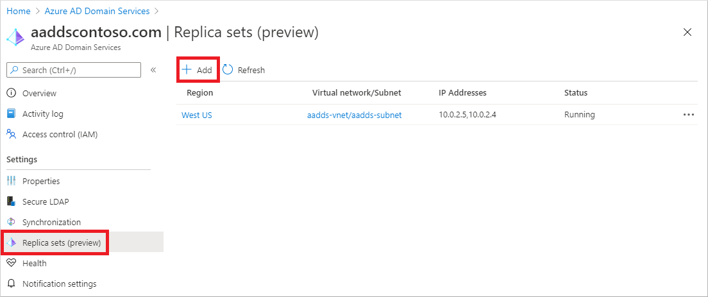
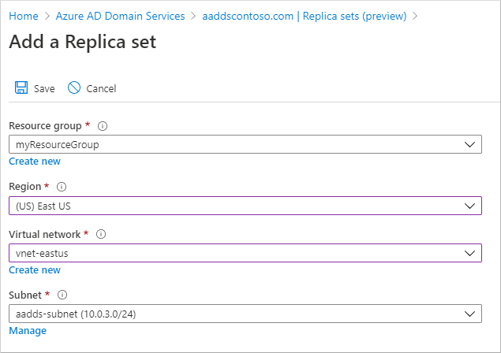
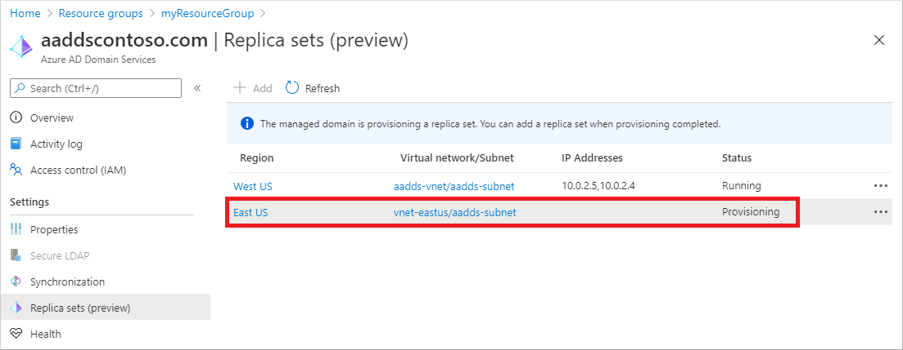

# Tutorial: Create and use replica sets for resiliency or geolocation in Microsoft Entra Domain Services

To improve the resiliency of a Microsoft Entra Domain Services managed domain, or deploy to additional geographic locations close to your applications, you can use *replica sets*. Every Domain Services managed domain namespace, such as *aaddscontoso.com*, contains one initial replica set. The ability to create additional replica sets in other Azure regions provides geographical resiliency for a managed domain.

You can add a replica set to any peered virtual network in any Azure region that supports Domain Services.

In this tutorial, you learn how to:

> [!div class="checklist"]
> * Understand the virtual network requirements
> * Create a replica set
> * Delete a replica set

If you don't have an Azure subscription, [create an account](https://azure.microsoft.com/free/?WT.mc_id=A261C142F) before you begin.

## Prerequisites

To complete this tutorial, you need the following resources and privileges:

* An active Azure subscription.
    * If you don't have an Azure subscription, [create an account](https://azure.microsoft.com/free/?WT.mc_id=A261C142F).
* A Microsoft Entra tenant associated with your subscription, either synchronized with an on-premises directory or a cloud-only directory.
    * If needed, [create a Microsoft Entra tenant][create-azure-ad-tenant] or [associate an Azure subscription with your account][associate-azure-ad-tenant].
* A Microsoft Entra Domain Services managed domain created using the Azure Resource Manager deployment model and configured in your Microsoft Entra tenant.
    * If needed, [create and configure a Microsoft Entra Domain Services managed domain][tutorial-create-instance].

    > [!IMPORTANT]
    > You need to use a minimum of *Enterprise* SKU for your managed domain to support replica sets. If needed, [change the SKU for a managed domain][howto-change-sku].

## Sign in to the Microsoft Entra admin center

In this tutorial, you create and manage replica sets using the Microsoft Entra admin center. To get started, first sign in to the [Microsoft Entra admin center](https://entra.microsoft.com).

## Networking considerations

The virtual networks that host replica sets must be able to communicate with each other. Applications and services that depend on Domain Services also need network connectivity to the virtual networks hosting the replica sets. Azure virtual network peering should be configured between all virtual networks to create a fully meshed network. These peerings enable effective intra-site replication between replica sets.

Before you can use replica sets in Domain Services, review the following Azure virtual network requirements:

* Avoid overlapping IP address spaces to allow for virtual network peering and routing.
* Create subnets with enough IP addresses to support your scenario.
* Make sure Domain Services has its own subnet. Don't share this virtual network subnet with application VMs and services.
* Peered virtual networks are NOT transitive.

> [!TIP]
> When you create a replica set in the Microsoft Entra admin center, the network peerings between virtual networks is created for you.
>
> If needed, you can create a virtual network and subnet when you add a replica set in the Microsoft Entra admin center. Or, you can choose existing virtual network resources in the destination region for a replica set and let the peerings be created automatically if they don't already exist.

## Create a replica set

When you create a managed domain, such as *aaddscontoso.com*, an initial replica set is created. Additional replica sets share the same namespace and configuration. Changes to Domain Services, including configuration, user identity and credentials, groups, group policy objects, computer objects, and other changes are applied to all replica sets in the managed domain using AD DS replication.

In this tutorial, you create an additional replica set in an Azure region different than the initial Domain Services replica set.

To create an additional replica set, complete the following steps:

1. In the Microsoft Entra admin center, search for and select **Microsoft Entra Domain Services**.
1. Choose your managed domain, such as *aaddscontoso.com*.
1. On the left-hand side, select **Replica sets**. Each managed domain includes one initial replica set in the selected region, as shown in the following example screenshot:

    

    To create an additional replica set, select **+ Add**.

1. In the *Add a replica set* window, select the destination region, such as *East US*.

    Select a virtual network in the destination region, such as *vnet-eastus*, then choose a subnet such as *aadds-subnet*. If needed, choose **Create new** to add a virtual network in the destination region, then **Manage** to create a subnet for Domain Services.

    If they don't already exist, the Azure virtual network peerings are automatically created between your existing managed domain's virtual network and the destination virtual network.

    The following example screenshot shows the process to create a new replica set in *East US*:

    

1. When ready, select **Save**.

The process to create the replica set takes some time as the resources are created in the destination region. The managed domain itself is then replicated using AD DS replication.

The replica set reports as *Provisioning* as deployment continues, as shown in the following example screenshot. When complete, the replica set shows as *Running*.

## Delete a replica set

A managed domain is currently limited to five replicas - the initial replica set, and four additional replica sets. If you don't need a replica set anymore, or if you want to create a replica set in another region, you can delete unneeded replica sets.

> [!IMPORTANT]
> You can't delete either the last replica set or the initial replica set in a managed domain.

To delete a replica set, complete the following steps:

1. In the Microsoft Entra admin center, search for and select **Microsoft Entra Domain Services**.
1. Choose your managed domain, such as *aaddscontoso.com*.
1. On the left-hand side, select **Replica sets**. From the list of replica sets, select the **...** context menu next to the replica set you want to delete.
1. Select **Delete** from the context menu, then confirm you want to delete the replica set.
1. In the Domain Services management VM, access the DNS console and manually delete DNS records for the domain controllers from the deleted replica set.

> [!NOTE]
> Replica set deletion may be a time-consuming operation.

If you no longer need the virtual network or peering used by the replica set, you can also delete those resources. Make sure no other application resources in the other region need the network connections before you delete them.

## Next steps

In this tutorial, you learned how to:

> [!div class="checklist"]
> * Configure virtual network peering
> * Create a replica set in a different geographic region
> * Delete a replica set

For more conceptual information, learn how replica sets work in Domain Services.

> [!div class="nextstepaction"]
> [Replica sets concepts and features][concepts-replica-sets]

<!-- INTERNAL LINKS -->
[replica-sets]: concepts-replica-sets.md
[tutorial-create-instance]: tutorial-create-instance-advanced.md
[create-azure-ad-tenant]: /azure/active-directory/fundamentals/sign-up-organization
[associate-azure-ad-tenant]: /azure/active-directory/fundamentals/how-subscriptions-associated-directory
[howto-change-sku]: change-sku.md
[concepts-replica-sets]: concepts-replica-sets.md
