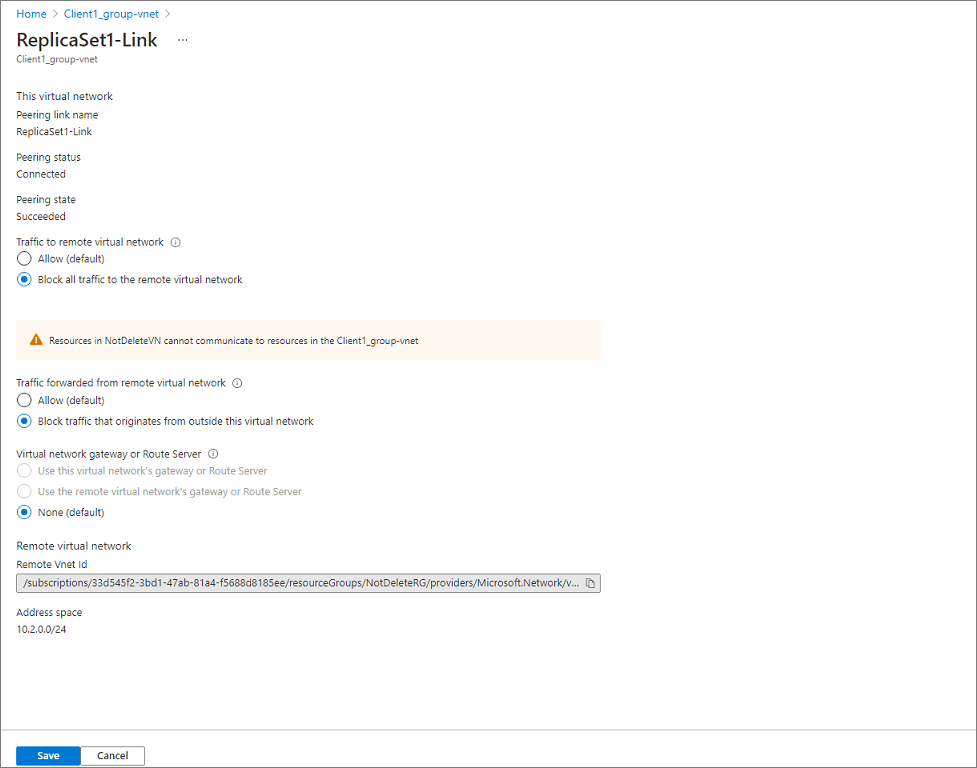

# Tutorial: Perform a disaster recovery drill using replica sets in Azure Active Directory Domain Services

This topic shows how to perform a disaster recovery (DR) drill for Azure AD Domain Services (Azure AD DS) using replica sets.  This will simulate one of the replica sets going offline by making changes to the network virtual network properties to block client access to it.  It is not a true DR drill in that the replica set will not be taken offline. 

The DR drill will cover: 

1. A client machine is connected to a given replica set. It can authenticate to the domain and perform LDAP queries.
1. The client’s connection to the replica set will be terminated. This will happen by restricting network access.
1. The client will then establish a new connection with the other replica set. Once that happens, the client will be able to authenticate to the domain and perform LDAP queries. 
1. The domain member will be rebooted, and a domain user will be able to log in post reboot.
1. The network restrictions will be removed, and the client will be able to connect to original replica set. 

## Prerequisites 

The following requirements must be in place to complete the DR drill: 

- An active Azure AD DS instance deployed with at least one extra replica set in place. The domain must be in a healthy state. 
- A client machine that is joined to the Azure AD DS hosted domain.  The client must be in its own virtual network, virtual network peering enabled with both replica set virtual networks, and the virtual network must have the IP addresses of all domain controllers in the replica sets listed in DNS. 

## Environment validation 

1. Log in to the client machine with a domain account. 
1. Install the Active Directory Domain Services RSAT tools. 
1. Start an elevated PowerShell window.
1. Perform basic domain validation checks: 
   - Run `nslookup [domain]` to ensure DNS resolution is working properly 
   - Run `nltest /dsgetdc:` to return a success and say which domain controller is currently being used
   - Run `nltest /dclist:` to return the full list of domain controllers in the directory 
1. Perform basic domain controller validation on each domain controller in the directory (you can get the full list from the output of “nltest /dclist:”): 
   - Run `nltest /sc_reset:[domain name]\[domain controller name]` to establish a secure connection with the domain controller. 
   - Run `Get-AdDomain` to retrieve the basic directory settings. 

## Perform the disaster recovery drill 

You will be performing these operations for each replica set in the Azure AD DS instance. This will simulate an outage for each replica set. When domain controllers are not reachable, the client will automatically fail over to a reachable domain controller and this experience should be seamless to the end user or workload. Therefore it is critical that applications and services don't point to a specific domain controller. 

1. Identify the domain controllers in the replica set that you want to simulate going offline. 
1. On the client machine, connect to one of the domain controllers using `nltest /sc_reset:[domain]\[domain controller name]`. 
1. In the Azure portal, go to the client virtual network peering and update the properties so that all traffic between the client and the replica set is blocked. 
   1. Select the peered network that you want to update. 
   1. Select to block all network traffic that enters or leaves the virtual network. 
      
1. On the client machine, attempt to reestablish a secure connection with both domain controllers from step 2 using the same nltest command. These operations should fail as network connectivity has been blocked. 
1. Run `Get-AdDomain` and `Get-AdForest` to get basic directory properties. These calls will succeed because they are automatically going to one of the domain controllers in the other replica set. 
1. Reboot the client and login with the same domain account. This shows that authentication is still working as expected and logins are not blocked. 
1. In the Azure portal, go to the client virtual network peering and update the properties so that all traffic is unblocked. This reverts the changes that were made in step 3. 
1. On the client machine, attempt to reestablish a secure connection with the domain controllers from step 2 using the same nltest command. These operations should succeed as network connectivity has been unblocked. 

These operations demonstrate that the domain is still available even though one of the replica sets is unreachable by the client. Perform this set of steps for each replica set in the Azure AD DS instance. 

## Summary 

After you complete these steps, you will see domain members continue to access the directory if one of the replica sets in the Azure AD DS is not reachable. You can simulate the same behavior by blocking all network access for a replica set instead of a client machine, but we don't recommend it. It won’t change the behavior from a client perspective, but it will impact the health of your Azure AD DS instance until the network access is restored. 

## Next steps

In this tutorial, you learned how to:

> [!div class="checklist"]
> * Validate client connectivity to domain controllers in a replica set
> * Block network traffic between the client and the replica set
> * Validate client connectivity to domain controllers in another replica set

For more conceptual information, learn how replica sets work in Azure AD DS.

> [!div class="nextstepaction"]
> [Replica sets concepts and features][concepts-replica-sets]

<!-- INTERNAL LINKS -->
[replica-sets]: concepts-replica-sets.md
[tutorial-create-instance]: tutorial-create-instance-advanced.md
[create-azure-ad-tenant]: ../active-directory/fundamentals/sign-up-organization.md
[associate-azure-ad-tenant]: ../active-directory/fundamentals/active-directory-how-subscriptions-associated-directory.md
[howto-change-sku]: change-sku.md
[concepts-replica-sets]: concepts-replica-sets.md
