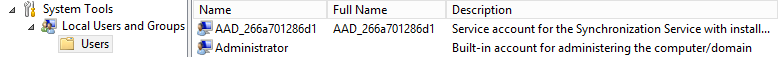
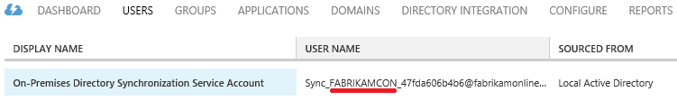
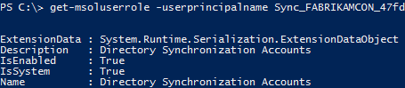

<properties
   pageTitle="Azure AD Connect: Accounts and permissions | Microsoft Azure"
   description="This topic describes the accounts used and created and permissions required."
   services="active-directory"
   documentationCenter=""
   authors="AndKjell"
   manager="stevenpo"
   editor=""/>

<tags
   ms.service="active-directory"  
   ms.workload="identity"
   ms.tgt_pltfrm="na"
   ms.devlang="na"
   ms.topic="article"
   ms.date="06/27/2016"
   ms.author="andkjell;billmath"/>

# Azure AD Connect: Accounts and permissions

The Azure AD Connect installation wizard offers two different paths:

- In Express Settings, we require more privileges so that we can setup your configuration easily, without requiring you to create users or configure permissions separately.

- In Custom Settings we offer you more choices and options, but there are some situations in which you’ll need to ensure you have the correct permissions yourself.

## Related documentation
If you did not read the documentation on [Integrating your on-premises identities with Azure Active Directory](active-directory-aadconnect.md), the following table provides links to related topics.

Topic |  
--------- | ---------
Install using Express settings | [Express installation of Azure AD Connect](active-directory-aadconnect-get-started-express.md)
Install using Customized settings | [Custom installation of Azure AD Connect](active-directory-aadconnect-get-started-custom.md)
Upgrade from DirSync | [Upgrade from Azure AD sync tool (DirSync)](active-directory-aadconnect-dirsync-upgrade-get-started.md)

## Express settings installation
In Express settings the installation wizard will ask for AD DS Enterprise Admin credentials so your on-premises Active Directory can be configured with required permissions for Azure AD Connect. If you are upgrading from DirSync the AD DS Enterprise Admins credentials are used to reset the password for the account used by DirSync. You will also need Azure AD Global Administrator credentials.

Wizard Page  | Credentials Collected | Permissions Required| Used For
------------- | ------------- |------------- |-------------
N/A|User running the installation wizard| Administrator of the local server| <li>Creates the local account that will be used as the [sync engine service account](#azure-ad-connect-sync-service-account).
Connect to Azure AD| Azure AD directory credentials | Global administrator role in Azure AD | <li>Enabling sync in the Azure AD directory.</li>  <li>Creation of the [Azure AD account](#azure-ad-service-account) that will be used for on-going sync operations in Azure AD.</li>
Connect to AD DS | On-premises Active Directory credentials | Member of the Enterprise Admins (EA) group in Active Directory| <li>Creates an [account](#active-directory-account) in Active Directory and grants permissions to it. This created account is used to read and write directory information during synchronization.</li>

### Enterprise Admin credentials
These credentials are only used during the installation and will not be used after the installation has completed. It is Enterprise Admin, and not Domain Admin, to make sure the permissions in Active Directory can be set in all domains.

### Global Admin credentials
These credentials are only used during the installation and will not be used after the installation has completed. It is used to create the [Azure AD account](#azure-ad-service-account) used for synchronizing changes to Azure AD. The account will also enable sync as a feature in Azure AD.

### Permissions for the created AD DS account for express settings
The [account](#active-directory-account) created for reading and writing to AD DS will have the following permissions when created by express settings:

Permission | Used for
---- | ----
<li>Replicate Directory Changes</li><li>Replicate Directory Changes All | Password sync
Read/Write all properties User | Import and Exchange hybrid
Read/Write all properties iNetOrgPerson | Import and Exchange hybrid
Read/Write all properties Group | Import and Exchange hybrid
Read/Write all properties Contact | Import and Exchange hybrid
Reset password | Preparation for enabling password writeback

## Custom settings installation
When using custom settings the account used to connect to Active Directory must be created before the installation. The permissions you must grant this account can be found in [create the AD DS account](#create-the-ad-ds-account).

Wizard Page  | Credentials Collected | Permissions Required| Used For
------------- | ------------- |------------- |-------------
N/A|User running the installation wizard|<li>Administrator of the local server</li><li>If using a full SQL Server, the user must be System Administrator (SA) in SQL</li>| By default, creates the local account that will be used as the [sync engine service account](#azure-ad-connect-sync-service-account). The account is only created  if the admin does not specify a particular account.
Install synchronization services, Service account option | AD or local user account credentials | User, permissions will be granted by the installation wizard|If the admin specifies an account, this account is used as the service account for the sync service.
Connect to Azure AD|Azure AD directory credentials| Global administrator role in Azure AD| <li>Enabling sync in the Azure AD directory.</li>  <li>Creation of the [Azure AD account](#azure-ad-service-account) that will be used for on-going sync operations in Azure AD.</li>
Connect your directories|On-premises Active Directory credentials for each forest that will be connected to Azure AD | The permissions will depend on which features you enable and can be found in [Create the AD DS account](#create-the-ad-ds-account) |This account is used to read and write directory information during synchronization.
AD FS Servers|For each server in the list, the wizard collects credentials if the logon credentials of the user running the wizard are insufficient to connect|Domain Administrator|Installation and configuration of the AD FS server role.
Web application proxy servers |For each server in the list, the wizard collects credentials if the logon credentials of the user running the wizard are insufficient to connect|Local admin on the target machine|Installation and configuration of WAP server role.
Proxy trust credentials |Federation service trust credentials (the credentials the proxy will use to enroll for a trust certificate from the FS |Domain account that is a local administrator of the AD FS server|Inital enrollment of FS-WAP trust certificate.
AD FS Service Account page, "Use a domain user account option"|AD user account credentials|Domain user|The AD user account whose credentials are provided will be used as the logon account of the AD FS service.

### Create the AD DS account
When you install Azure AD Connect the account you specify on the **Connect your directories** page must be present in Active Directory and have required permissions granted. The installation wizard will not verify the permissions and any issues will only be found during synchronization.

Which permissions you require depends on the optional features you enable. If you have multiple domains, the permissions must be granted for all domains in the forest. If you do not enable any of these features the default **Domain User** permissions will be sufficient.

Feature | Permissions
------ | ------
Password sync | <li>Replicate Directory Changes</li>  <li>Replicate Directory Changes All
Exchange hybrid deployment | Write permissions to the attributes documented in [Exchange hybrid writeback](active-directory-aadconnectsync-attributes-synchronized.md#exchange-hybrid-writeback) for users, groups, and contacts.
Password writeback | Write permissions to the attributes documented in [Getting started with password management](active-directory-passwords-getting-started.md#step-4-set-up-the-appropriate-active-directory-permissions) for users.
Device writeback | Permissions granted with a PowerShell script as described in [device writeback](active-directory-aadconnect-feature-device-writeback.md).
Group writeback | Read, Create, Update, and Delete group objects in the OU where the distributions groups should be located.

## Upgrade
When you upgrade from one version of Azure AD Connect to a new release, you will need the following permissions:

Principal | Permissions required | Used for
---- | ---- | ----
User running the installation wizard | Administrator of the local server | Update binaries.
User running the installation wizard | Member of ADSyncAdmins | Make changes to Sync Rules and other configuration.
User running the installation wizard | If using a full SQL server: DBO (or similar) of the sync engine database | Make database level changes, such as updating tables with new columns.

## More about the created accounts

### Active Directory account

If you use express settings, then an account will be created in Active Directory which will be used for synchronization. The created account will be located in the forest root domain in the Users container and will have its name prefixed with **MSOL_**. The account is created with a long complex password which does not expire. If you have a password policy in your domain, make sure long and complex passwords would be allowed for this account.

### Azure AD Connect sync service accounts
A local service account is created by the installation wizard (unless you specify the account to use in custom settings). The account is prefixed **AAD_** and used for the actual sync service to run as. If you install Azure AD Connect on a Domain Controller, the account is created in the domain. If you use a remote server running SQL server or if you use a proxy which requires authentication, the **AAD_** service account must be located in the domain.

The account is created with a long complex password which does not expire.

This account is used to store the passwords for the other accounts in a secure way. These other accounts passwords are stored encrypted in the database. The private keys for the encryption keys are protected with the cryptographic services secret-key encryption using Windows Data Protection API (DPAPI). You should not reset the password on the service account since Windows will then destroy the encryption keys for security reasons.

If you use a full SQL Server then the service account will be the DBO of the created database for the sync engine. The service will not function as intended with any other permissions. A SQL login will also be created.

The account is also granted permissions to files, registry keys, and other objects related to the Sync Engine.

### Azure AD service account
An account in Azure AD will be created for the sync service's use. This account can be identified by its display name.

The name of the server the account is used on can be identified in the second part of the user name. In the picture above the server name is FABRIKAMCON. If you have staging servers, each server will have its own account. There is a limit of 10 sync service accounts in Azure AD.

The service account is created with a long complex password which does not expire. It is granted a special role **Directory Synchronization Accounts** which has only permissions to perform directory synchronization tasks. This special built-in role cannot be granted outside the Azure AD Connect wizard and the Azure portal will only show this account with the role **User**.

## Next steps

Learn more about [Integrating your on-premises identities with Azure Active Directory](active-directory-aadconnect.md).
