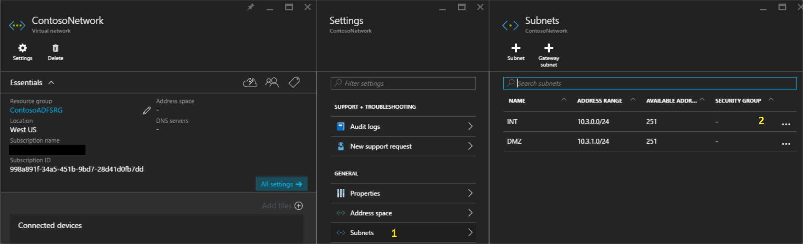
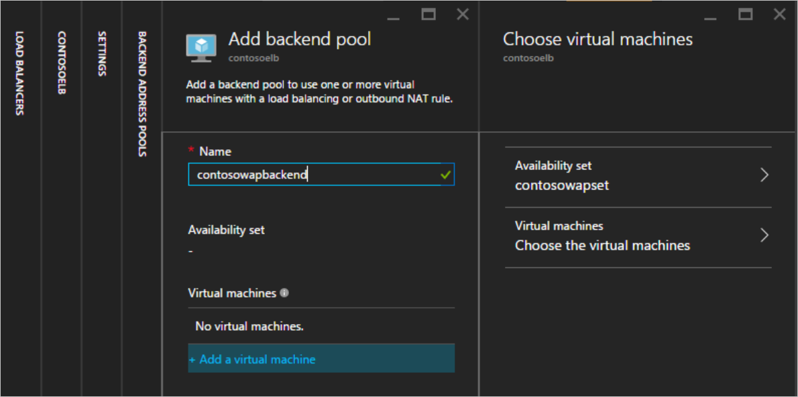

<properties
	pageTitle="Active Directory Federation Services in Azure | Microsoft Azure"
	description="In this document you will learn how to deploy AD FS in Azure for high availablity."
    keywords="introduction to AD FS, Azure, Azure AD Connect overview, AD FS in Azure, iaas, ADFS"
	services="active-directory"
	documentationCenter=""
	authors="anandyadavmsft"
	manager="femila"
	editor=""/>

<tags
	ms.service="active-directory"
	ms.workload="identity"
	ms.tgt_pltfrm="na"
	ms.devlang="na"
	ms.topic="get-started-article"
	ms.date="07/13/2016"
	ms.author="anandy;billmath"/>

# AD FS deployment in Azure 

AD FS provides simplified, secured identity federation and Web single sign-on (SSO) capabilities. Federation with Azure AD or O365 enables users to authenticate using on-premises credentials and access all resources in cloud. As a result, it becomes important to have a highly available AD FS infrastructure to ensure access to resources both on-premises and in the cloud. Deploying AD FS in Azure can help achieve the high availability required with minimal efforts.
There are several advantages of deploying AD FS in Azure, a few of them are listed below:

* **High Availability** - With the power of Azure Availability Sets, you ensure a highly available infrastructure.
* **Easy to Scale** – Need more performance? Easily migrate to more powerful machines by just a few clicks in Azure
* **Cross-Geo Redundancy** – With Azure Geo Redundancy you can be assured that your infrastructure is highly available across the globe
* **Easy to Manage** – With highly simplified management options in Azure portal, managing your infrastructure is very easy and hassle-free 

## Design principles

The diagram above shows the recommended basic topology to start deploying your AD FS infrastructure in Azure. The principles behind the various components of the topology are listed below:

* **DC / ADFS Servers**: If you have fewer than 1,000 users you can simply install AD FS role on your domain controllers. If you do not want any performance impact on the domain controllers or if you have more than 1,000 users, then deploy AD FS on separate servers.
* **WAP Server** – it is necessary to deploy Web Application Proxy servers, so that users can reach the AD FS when they are not on the company network also.
* **DMZ**: The Web Application Proxy servers will be placed in the DMZ and ONLY TCP/443 access is allowed between the DMZ and the internal subnet.
* **Load Balancers**: To ensure high availability of AD FS and Web Application Proxy servers, we recommend using an internal load balancer for AD FS servers and Azure Load Balancer for Web Application Proxy  servers.
* **Availability Sets**: To provide redundancy to your AD FS deployment, it is recommended that you group two or more virtual machines in an Availability Set for similar workloads. This configuration ensures that during either a planned or unplanned maintenance event, at least one virtual machine will be available
* **Storage Accounts**: It is recommended to have two storage accounts. Having a single storage account can lead to creation of a single point of failure and can cause the deployment to become unavailable in an unlikely scenario where the storage account goes down. Two storage accounts will help associate one storage account for each fault line.
* **Network segregation**:  Web Application Proxy servers should be deployed in a separate DMZ network. You can divide one virtual network into two subnets and then deploy the Web Application Proxy server(s) in an isolated subnet. You can simply configure the network security group settings for each subnet and allow only required communication between the two subnets. More details are given per deployment scenario below

##Steps to deploy AD FS in Azure

The steps mentioned in this section outline the guide to deploy the below depicted AD FS infrastructure in Azure.

### 1. Deploying the network

As outlined above, you can either create two subnets in a single virtual network or else create two completely different virtual networks (VNet). This article will focus on deploying a single virtual network and divide it into two subnets. This is currently an easier approach as two separate VNets would require a VNet to VNet gateway for communications.

**1.1 Create virtual network**

	
In the Azure portal, select virtual network and you can deploy the virtual network and one subnet immediately with just one click. INT subnet is also defined and is ready now for VMs to be added.
The next step is to add another subnet to the network, i.e. the DMZ subnet. To create the DMZ subnet, simply

* Select the newly created network
* In the properties select subnet
* In the subnet panel click on the add button
* Provide the subnet name and address space information to create the subnet

**1.2. Creating the network security groups**

A Network security group (NSG) contains a list of Access Control List (ACL) rules that allow or deny network traffic to your VM instances in a Virtual Network. NSGs can be associated with either subnets or individual VM instances within that subnet. When an NSG is associated with a subnet, the ACL rules apply to all the VM instances in that subnet.
For the purpose of this guidance, we will create two NSGs: one each for an internal network and a DMZ. They will be labeled NSG_INT and NSG_DMZ respectively.

After the NSG is created, there will be 0 inbound and 0 outbound rules. Once the roles on the respective servers are installed and functional, then the inbound and outbound rules can be made according to the desired level of security.

After the NSGs are created, associate NSG_INT with subnet INT and NSG_DMZ with subnet DMZ. An example screenshot is given below:

* Click on Subnets to open the panel for subnets
* Select the subnet to associate with the NSG 

After configuration, the panel for Subnets should look like below:

**1.3. Create Connection to on-premises**

We will need a connection to on-premises in order to deploy the domain controller (DC) in azure. Azure offers various connectivity options to connect your on-premises infrastructure to your Azure infrastructure.

* Point-to-site
* Virtual Network Site-to-site
* ExpressRoute

It is recommended to use ExpressRoute. ExpressRoute lets you create private connections between Azure datacenters and infrastructure that’s on your premises or in a co-location environment. ExpressRoute connections do not go over the public Internet. They offer more reliability, faster speeds, lower latencies and higher security than typical connections over the Internet.
While it is recommended to use ExpressRoute, you may choose any connection method best suited for your organization. To learn more about ExpressRoute and the various connectivity options using ExpressRoute, read [ExpressRoute technical overview](https://aka.ms/Azure/ExpressRoute).

### 2. Create storage accounts

In order to maintain high availability and avoid dependence on a single storage account, you can create two storage accounts. Divide the machines in each availability set into two groups and then assign each group a separate storage account. Remember, you are only billed for the actual usage of the storage.

### 3. Create availability sets

For each role (DC/AD FS and WAP), create availability sets that will contain 2 machines each at the minimum. This will help achieve higher availability for each role. 
While creating the availability sets, it is essential to decide on the following:
* **Fault Domains**: Virtual machines in the same fault domain share the same power source and physical network switch. A minimum of 2 fault domains are recommended. The default value is 3 and you can leave it as is for the purpose of this deployment
* **Update domains**: Machines belonging to the same update domain are restarted together during an update. You want to have minimum of 2 update domains. The default value is 5 and you can leave it as is for the purpose of this deployment

Create the following availability sets

| Availability Set | Role | Fault domains | Update domains |
|:----------------:|:----:|:-----------:|:-----------|
| contosodcset | DC/ADFS | 3 | 5 |
| contosowapset | WAP | 3 | 5 |

### 4.	Deploy virtual machines
The next step is to deploy virtual machines that will host the different roles in your infrastructure. A minimum of two machines are recommended in each availability set. Create six virtual machines for the basic deployment.

| Machine | Role | Subnet | Availability set | Storage account | IP Address |
|:-----:|:-----:|:-----:|:-----:|:-----:|:-----:|
|contosodc1|DC/ADFS|INT|contosodcset|contososac1|Static|
|contosodc2|DC/ADFS|INT|contosodcset|contososac2|Static|
|contosowap1|WAP|DMZ|contosowapset|contososac1|Static|
|contosowap2|WAP|DMZ|contosowapset|contososac2|Static|

As you might have noticed, no NSG has been specified. This is because azure lets you use NSG at the subnet level. Then, you can control machine network traffic by using the individual NSG associated with either the subnet or else the NIC object. Read more on [What is a Network Security Group (NSG)](https://aka.ms/Azure/NSG).
Static IP address is recommended if you are managing the DNS. You can use Azure DNS and instead in the DNS records for your domain, refer to the new machines by their Azure FQDNs.
Your virtual machine pane should look like below after the deployment is completed:

### 5. Configuring the domain controller / AD FS servers
 In order to authenticate any incoming request, AD FS will need to contact the domain controller. To save the costly trip from Azure to on-premises DC for authentication, it is recommended to deploy a replica of the domain controller in Azure. In order to attain high availability, it is recommended to create an availability set of at-least 2 domain controllers.

|Domain controller|Role|Storage account|
|:-----:|:-----:|:-----:|
|contosodc1|Replica|contososac1|
|contosodc2|Replica|contososac2|

* Promote the two servers as replica domain controllers with DNS
* Configure the AD FS servers by installing the AD FS role using the server manager.

###6.	Deploying Internal Load Balancer (ILB)

**6.1.	Create the ILB**

To deploy an ILB, select Load Balancers in the Azure portal and click on add (+).
>[AZURE.NOTE] if you do not see **Load Balancers** in your menu, click **Browse** in the lower left of the portal and scroll until you see **Load Balancers**.  Then click the yellow star to add it to your menu. Now select the new load balancer icon to open the panel to begin configuration of the load balancer.

* **Name**: Give any suitable name to the load balancer
* **Scheme**: Since this load balancer will be placed in front of the AD FS servers and is meant for internal network connections ONLY, select “Internal”
* **Virtual Network**: Choose the virtual network where you are deploying your AD FS
* **Subnet**: Choose the internal subnet here
* **IP Address assignment**: Dynamic

 
After you click create and the ILB is deployed, you should see it in the list of load balancers:

 
Next step is to configure the backend pool and the backend probe.

**6.2.	Configure ILB backend pool**

Select the newly created ILB in the Load Balancers panel. It will open the settings panel. 
1.	Select backend pools from the settings panel
2.	In the add backend pool panel, click on add virtual machine
3.	You will be presented with a panel where you can choose availability set
4.	Choose the AD FS availability set

 
**6.3.	Configuring probe**

In the ILB settings panel, select Probes.
1.	Click on add
2.	Provide details for probe
  a. **Name**: Probe name
  b. **Protocol**: TCP
  c. **Port**: 443 (HTTPS)
  d. **Interval**: 5 (default value) – this is the interval at which ILB will probe the machines in the backend pool
  e. **Unhealthy threshold limit**: 2 (default val ue) – this is the threshold of consecutive probe failures after which ILB will declare a machine in the backend pool non-responsive and stop sending traffic to it.

 
**6.4.	Create load balancing rules**

In order to effectively balance the traffic, the ILB should be configured with load balancing rules. In order to create a load balancing rule, 
1.	Select Load balancing rule from the settings panel of the ILB
2.	Click on Add in the Load balancing rule panel
3.	In the Add load balancing rule panel
  a. **Name**: Provide a name for the rule
  b. **Protocol**: Select TCP
  c. **Port**: 443
  d. **Backend port**: 443
  e. **Backend pool**: Select the pool you created for the AD FS cluster earlier
  f. **Probe**: Select the probe created for AD FS servers earlier

**6.5.	Update DNS with ILB**

Go to your DNS server and create a CNAME for the ILB. The CNAME should be for the federation service with the IP address pointing to the IP address of the ILB. For example if the ILB DIP address is 10.3.0.8, and the federation service installed is fs.contoso.com, then create a CNAME for fs.contoso.com pointing to 10.3.0.8.
This will ensure that all communication regarding fs.contoso.com end up at the ILB and are appropriately routed.

###7.	Configuring the Web Application Proxy server

**7.1.	Configuring the Web Application Proxy servers to reach AD FS servers**

In order to ensure that Web Application Proxy servers are able to reach the AD FS servers behind the ILB, create a record in the %systemroot%\system32\drivers\etc\hosts for the ILB. Note that the distinguished name (DN) should be the federation service name, for example fs.contoso.com. And the IP entry should be that of the ILB’s IP address (10.3.0.8 as in the example).

**7.2.	Installing the Web Application Proxy role**

After you ensure that Web Application Proxy servers are able to reach the AD FS servers behind ILB, you can next install the Web Application Proxy servers. 
Web Application Proxy servers do not be joined to the domain. Install the Web Application Proxy roles on the two Web Application Proxy servers by selecting the Remote Access role. The server manager will guide you to complete the WAP installation.
For more information on how to deploy WAP, read [Install and Configure the Web Application Proxy Server](https://technet.microsoft.com/library/dn383662.aspx).

###8.	Deploying the Internet Facing (Public) Load Balancer

**8.1.	Create Internet Facing (Public) Load Balancer**
 
In the Azure portal, select Load balancers and then click on Add. In the Create load balancer panel, enter the following information
1. **Name**: Name for the load balancer
2. **Scheme**: Public – this option tells Azure that this load balancer will need a public address.
3. **IP Address**: Create a new IP address (dynamic)

After deployment, the load balancer will appear in the Load balancers list.

 
**8.2.	Assign a DNS label to the public IP**

Click on the newly created load balancer entry in the Load balancers panel to bring up the panel for configuration. Follow below steps to configure the DNS label for the public IP:
1.	Click on the public IP address. This will open the panel for the public IP and its settings
2.	Click on Configuration
3.	Provide a DNS label. This will become the public DNS label that you can access from anywhere, for example contosofs.westus.cloudapp.azure.com. You can add an entry in the external DNS for the federation service (like fs.contoso.com) that resolves to the DNS label of the external load balancer (contosofs.westus.cloudapp.azure.com).

 

**8.3.	Configure backend pool for Internet Facing (Public) Load Balancer** 

Follow the same steps as in creating the internal load balancer, to configure the backend pool for Internet Facing (Public) Load Balancer as the availability set for the WAP servers. For example, contosowapset.

 
**8.4.	Configure probe**

Follow the same steps as in configuring the internal load balancer  to configure the probe for the backend pool of WAP servers.

 
**8.5.	Create load balancing rule(s)**

Follow the same steps as in ILB to configure the load balancing rule for TCP 443.

 
###9.	Securing the network

**9.1.	Securing the internal subnet**

Overall, you need the following rules to efficiently secure your internal subnet (in the order as listed below)

|Rule|Description|Flow|
|:----|:----|:------:|
|AllowHTTPSFromDMZ| Allow the HTTPS communication from DMZ | Inbound |
|DenyAllFromDMZ| This rule will block all traffic from DMZ to internal subnet. The rule AllowHTTPSFromDMZ already takes care of ensuring that HTTPS communication goes through and anything else is blocked by this rule | Inbound |
|DenyInternetOutbound| No access to internet | Outbound |

[comment]: <> ()
[comment]: <> ()
 
**9.2.	Securing the DMZ subnet**

|Rule|Description|Flow|
|:----|:----|:------:|
|AllowHttpsFromVirtualNetwork| Allow HTTPS from virtual network | Inbound |
|AllowHTTPSInternet| Allow HTTPS from internet to the DMZ | Inbound|
|DenyingressexceptHTTPS| Block anything other than HTTPS from internet | Inbound |
|DenyOutToInternet|	Anything except HTTPS to internet is blocked | Outbound |

[comment]: <> ()
[comment]: <> ()

>[AZURE.NOTE] If client user certificate authentication (clientTLS authentication using X509 user certificates) is required, then AD FS requires TCP port 49443 be enabled for inbound access.

###10.	Test the AD FS sign-in

The easiest way is to test AD FS is by using the IdpInitiatedSignon.aspx page. In order to be able to do that, it is required to enable the IdpInitiatedSignOn on the AD FS properties. Follow the steps below to verify your AD FS setup
1.	Run the below cmdlet on the AD FS server, using PowerShell, to set it to enabled.
	Set-AdfsProperties -EnableIdPInitiatedSignonPage $true 
2.	From any external machine access https://adfs.thecloudadvocate.com/adfs/ls/IdpInitiatedSignon.aspx  
3.	You should see the AD FS page like below:

On successful sign-in, it will provide you with a success message as shown below:

## Additional resources
* [Availability Sets](https://aka.ms/Azure/Availability ) 
* [Azure Load Balancer](https://aka.ms/Azure/ILB)
* [Internal Load Balancer](https://aka.ms/Azure/ILB/Internal)
* [Internet Facing Load Balancer](https://aka.ms/Azure/ILB/Internet)
* [Storage Accounts](https://aka.ms/Azure/Storage )
* [Azure Virtual Networks](https://aka.ms/Azure/VNet)
* [AD FS and Web Application Proxy Links](http://aka.ms/ADFSLinks) 

## Next steps

* [Integrating your on-premises identities with Azure Active Directory](active-directory-aadconnect.md)
* [Configuring and managing your AD FS using Azure AD Connect](active-directory-aadconnectfed-whatis.md)

