<properties
   pageTitle="Microsoft Azure AD Connect - Upgrade from Windows Azure AD sync tool (DirSync) | Microsoft Azure"
   description="Learn how to upgrade from DirSync to Azure AD Connect.  This articles describes the steps for upgrading your current Windows Azure AD sync tool (DirSync) to Azure AD Connect."
   services="active-directory"
   documentationCenter=""
   authors="andkjell"
   manager="stevenpo"
   editor=""/>

<tags
   ms.service="active-directory"
   ms.workload="identity"
   ms.tgt_pltfrm="na"
   ms.devlang="na"
   ms.topic="article"
   ms.date="10/26/2015"
   ms.author="shoatman;billmath"/>

# Upgrading Windows Azure Active Directory sync (DirSync) to Azure Active Directory Connect

The following documentation will help you upgrade your existing DirSync installation to Azure AD Connect.

## Related documentation
If you did not read the documentation on [Integrating your on-premises identities with Azure Active Directory](active-directory-aadconnect.md), the following table provides links to related topics. The first two topics in bold are required before you start the upgrade from DirSync.

| Topic |  |
| --------- | --------- |
| **Download Azure AD Connect** | [Download Azure AD Connect](http://go.microsoft.com/fwlink/?LinkId=615771) |
| **Hardware and prerequisites** | [Azure AD Connect: Hardware and prerequisites](active-directory-aadconnect-prerequisites.md) |
| Accounts used for installation | [More about Azure AD Connect accounts and permissions](active-directory-aadconnect-accounts-permissions.md) |

## Upgrade from DirSync
Depending on your current DirSync deployment there are different options for the upgrade. If the expected upgrade time is less than 3 hours then we recommend to do an in-place upgrade. If the expected upgrade time is more than 3 hours we recommend to do a parallel deployment on another server. It is estimated that if you have more than 50,000 objects it will take more than 3 hours to do the upgrade.

| Scenario | |
| ---- | ---- |
| [In-place upgrade](#in-place-upgrade)  | Preferred option if the upgrade is expected to take less than 3 hours. |
| [Parallel deployment](#parallel-deployment) | Preferred option if the upgrade is expected to take more than 3 hours. |

>[AZURE.NOTE] When you plan to upgrade from DirSync to Azure AD Connect, do not uninstall DirSync yourself before the upgrade. Azure AD Connect will read and migrate the configuration from DirSync and uninstall after inspecting the server.

**In-place upgrade**

The expected time to complete the upgrade is displayed by the wizard.  This estimate is based on the assumption it will take 3 hours to complete an upgrade for a database with 50,000 objects (users, contacts, and groups).  Azure AD Connect will analyze your current DirSync settings and recommend an in-place upgrade if the number of objects in your database is less than 50,000.  If you decide to continue, your current settings will be automatically applied during upgrade and your server will automatically resume active synchronization.

If you want to do a configuration migration and do a parallel deployment you can override the in-place upgrade recommendation. You might for example take the opportunity to refresh the hardware and operating system. See the [parallel deployment](#parallel-deployment) section for more information.

**Parallel deployment**

Using a parallel deployment is recommended if you have more than 50,000 objects. This will avoid any operational delays experienced by your users. The Azure AD Connect installation will attempt to estimate the downtime for the upgrade, but if you've upgraded DirSync in the past, your own experience is likely to be the best guide.

### Supported DirSync configurations to be upgraded
The following configuration changes are supported with DirSync and will be upgraded:

- Domain and OU filtering
- Alternate ID (UPN)
- Password sync and Exchange hybrid settings
- Your forest/domain and Azure AD settings

The following changes cannot be upgraded. If you have made any of these changes the upgrade will be blocked. In those cases the recommendation is to install a new Azure AD Connect server in [staging mode](active-directory-aadconnectsync-operations.md#staging-mode) and verify the old DirSync and new Azure AD Connect configuration.

- Unsupported DirSync changes, e.g. removed attributes and using a custom extension DLL
- Filtering based on user attributes

The passwords used by DirSync for the service accounts cannot be retrieved and will not be migrated. These passwords will be reset during the upgrade.

### High-level steps for upgrading from DirSync to Azure AD Connect

1. Welcome to Azure AD Connect
2. Analysis of current DirSync configuration
3. Collect Azure AD global admin password
4. Collect credentials for an enterprise admin account (only used during the installation of Azure AD Connect)
5. Installation of Azure AD Connect
    * Uninstall DirSync
	* Install Azure AD Connect
	* Optionally begin synchronization

Additional steps are required when:

* You're currently using Full SQL Server - local or remote
* You have more than 50,000 objects in scope for synchronization

## In-place upgrade

1. Launch the Azure AD Connect installer (MSI).
2. Review and agree to license terms and privacy notice.
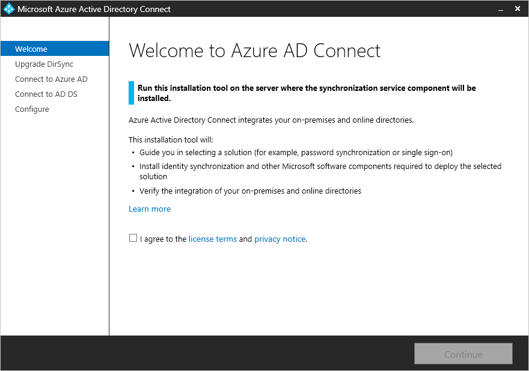
3. Click next to begin analysis of your existing DirSync installation.
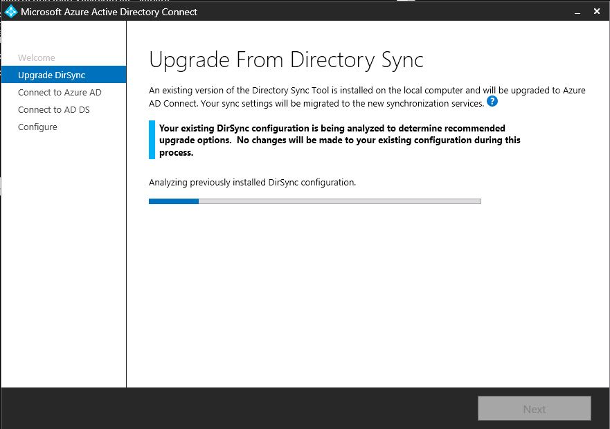
4. When the analysis completes, we will make recommendations on how to proceed.  
    - If you use SQL Server Express and have less than 50,000 objects, the following screen is shown:
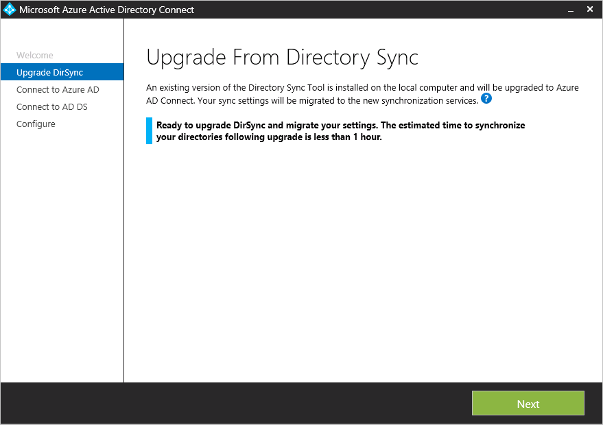
    - If you use a full SQL Server for DirSync you will see this page instead:
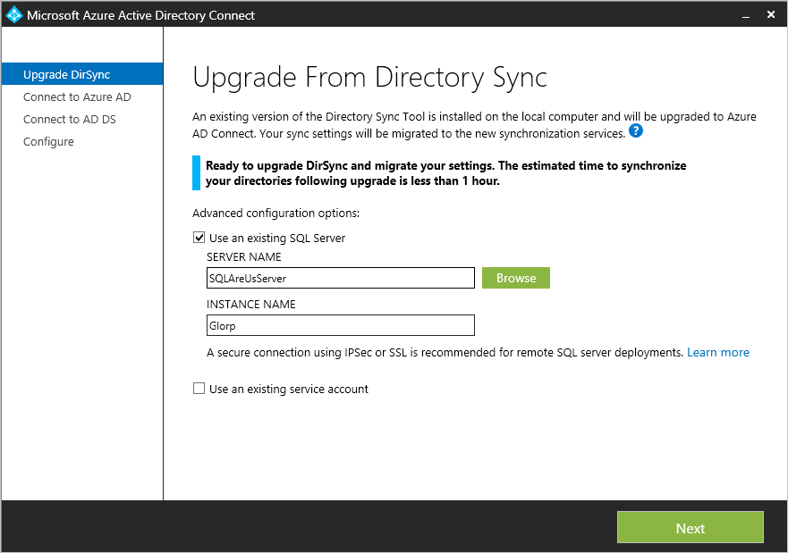 
The information regarding the existing SQL Server database server being used by DirSync is displayed. Make appropriate adjustments if needed. Click **Next** to continue the installation.
    - If you have more than 50,000 objects you will see this screen instead:
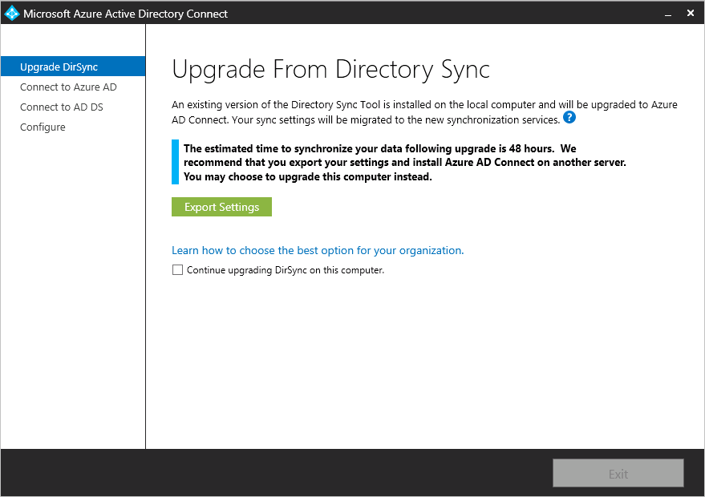 
To proceed with an in-place upgrade, click the checkbox next to this message: **Continue upgrading DirSync on this computer.**
To do a [parallel deployment](#parallel-deployment) instead you will export the DirSync configuration settings and move those to the new server.
5. Provide the password for the account you currently use to connect to Azure AD. This must be the account currently used by DirSync.
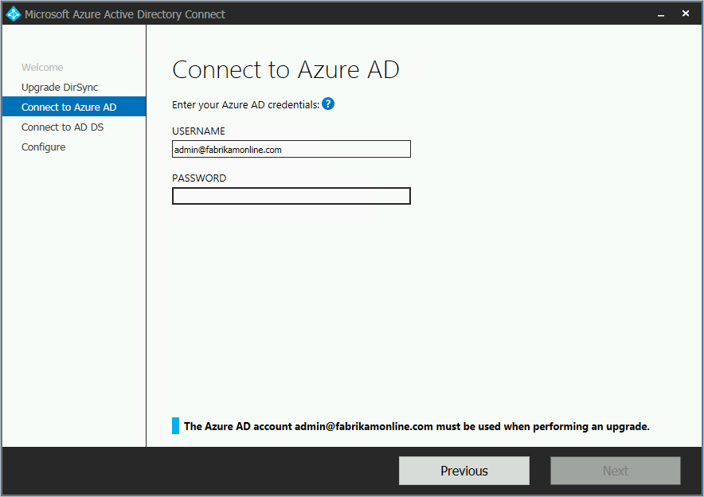
6. Provide an enterprise admin account for Active Directory.
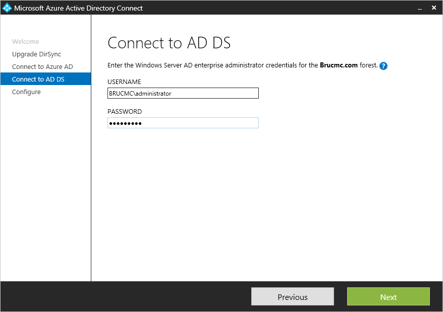
7. You're now ready to configure.  When you click **Upgrade**, DirSync will be uninstalled and Azure AD Connect will be configured and begin synchronizing.
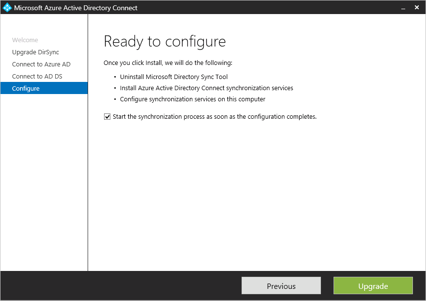

## Parallel deployment

### Export the DirSync configuration
**Parallel deployment with more than 50,000 objects**

If you have more than 50,000 objects the Azure AD Connect installation will recommend a parallel deployment.

A screen similar to the following will be displayed:

If you want to proceed with parallel deployment you will need to perform the following steps:

- Click the **Export settings** button.  When you install Azure AD Connect on a separate server these settings will be imported to migrate any settings from your current DirSync to your new Azure AD Connect installation.

Once your settings have been successfully exported, you can exit the Azure AD Connect wizard on the DirSync server. Continue with the next step to [install Azure AD Connect on a separate server](#installation-of-azure-ad-connect-on-separate-server)

**Parallel deployment with less than 50,000 objects**

If you have less than 50,000 objects but still want to do a parallel deployment, then do the following:

1. Run the Azure AD Connect installer (MSI).
2. When you see the **Welcome to Azure AD Connect** screen, exit the installation wizard by clicking the "X" in the top right corner of the window.
3. Open a command prompt.
4. From the install location of Azure AD Connect (Default: C:\Program Files\Microsoft Azure Active Directory Connect) execute the following command:
    `AzureADConnect.exe /ForceExport`.
5. Click the **Export settings** button.  When you install Azure AD Connect on a separate server these settings will be imported to migrate any settings from your current DirSync to your new Azure AD Connect installation.

Once your settings have been successfully exported, you can exit the Azure AD Connect wizard on the DirSync server. Continue with the next step to [install Azure AD Connect on a separate server](#installation-of-azure-ad-connect-on-separate-server)

### Install Azure AD Connect on separate server

When you install Azure AD Connect on a new server it will assume that you want to perform a clean install of Azure AD Connect. Since you want to use the DirSync configuration there are some extra steps to take:

1. Run the Azure AD Connect installer (MSI).
2. When you see the **Welcome to Azure AD Connect** screen, exit the installation wizard by clicking the "X" in the top right corner of the window.
3. Open a command prompt.
4. From the install location of Azure AD Connect (Default: C:\Program Files\Microsoft Azure Active Directory Connect) execute the following command:
    `AzureADConnect.exe /migrate`.
    The Azure AD Connect installation wizard starts and presents you with the following screen:
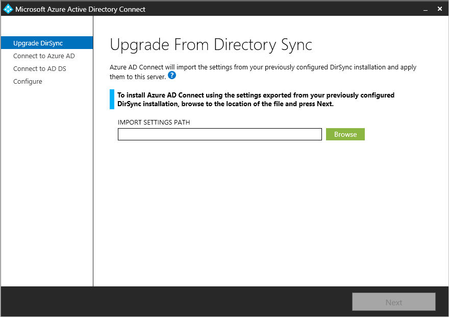
5. Select the settings file that exported from your DirSync installation.
6. Configure any advanced options including:
    - A custom installation location for Azure AD Connect.
	- An existing instance of SQL Server (Default: Azure AD Connect installs SQL Server 2012 Express). Do not use the same database instance as your DirSync server.
	- A service account used to connect to SQL Server (If your SQL Server database is remote then this account must be a domain service account).
These options can be seen on this screen:
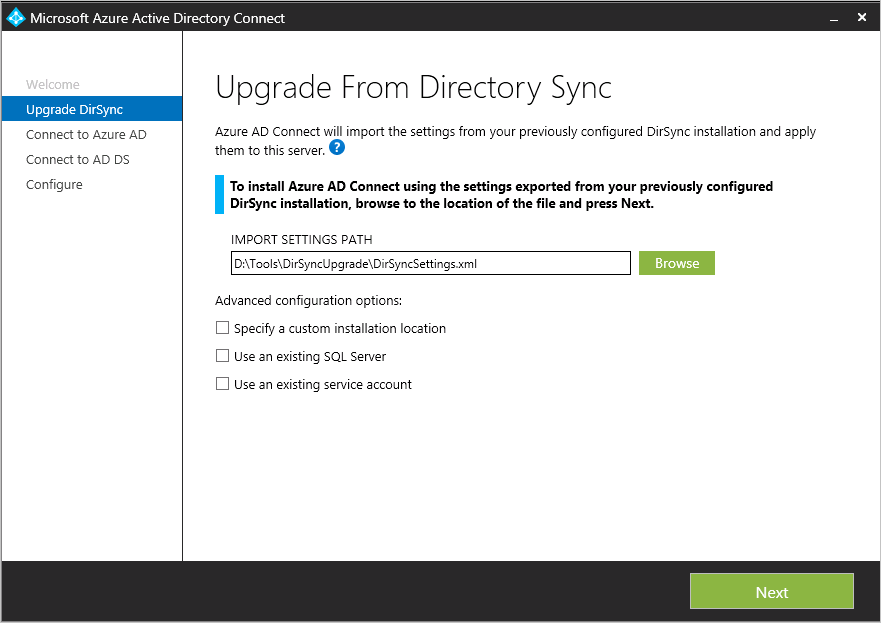
7. Click **Next**.
8. On the **Ready to configure** page, leave the **Start the synchronization process as soon as the configuration completes** checked. The server will be in [staging mode](active-directory-aadconnectsync-operations.md#staging-mode) so changes will not be exported to Azure AD at this time.
9. Click **Install**.

>[AZURE.NOTE] Synchronization between Windows Server Active Directory and Azure Active Directory will begin, but no changes will be exported to Azure AD.  Only one synchronization tool can be actively exporting changes at a time. This is called [staging mode](active-directory-aadconnectsync-operations.md#staging-mode).

### Verify that Azure AD Connect is ready to begin synchronization

In order to verify that Azure AD Connect is ready to take over from DirSync you will need to open  **Synchronization Service Manager** in the group **Azure AD Connect** from the start menu.

Within the application you will need to view the **Operations** tab. On this tab you are looking to confirm that the following operations have been completed:

- Import on the AD Connector
- Import on the Azure AD Connector
- Full Sync on the AD Connector
- Full Sync on the Azure AD Connector

Review the result from these operations and ensure there are no errors.

If you want to see and inspect which changes are about to be exported to Azure AD, then read how to verify the configuration under [staging mode](active-directory-aadconnectsync-operations.md#staging-mode). Make required configuration changes until you do not see anything unexpected.

Once these 4 operations have been completed, there are no errors, and you are satisfied with the changes which are about to be exported, you are ready to uninstall DirSync and enable Azure AD Connect synchronization. Complete the next two steps to complete the migration.

### Uninstall DirSync (old server)

- From **Programs and features** locate **Windows Azure Active Directory sync tool**
- Uninstall **Windows Azure Active Directory sync tool**
- Note that the uninstallation might take up to 15 minutes to complete.

With DirSync uninstalled, there is no active server exporting to Azure AD. The next step must be completed before any changes in your on-premises Active Directory will continue to be synchronized to Azure AD.

### Enable Azure AD Connect (new server)
After installation, re-opening Azure AD connect will allow you to make additional configuration changes. Start **Azure AD Connect** from the start menu or from the shortcut on the desktop. Make sure you do not try to run the installation MSI again.

You should see the following:

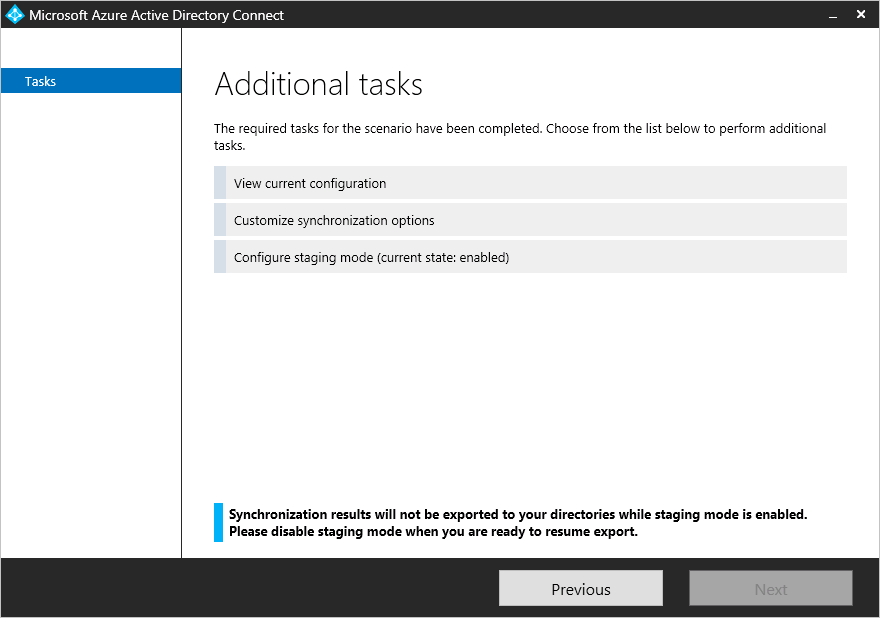

- Select **Configure staging mode**.
- Turn off staging by unchecking the **Enabled staging mode** checkbox.

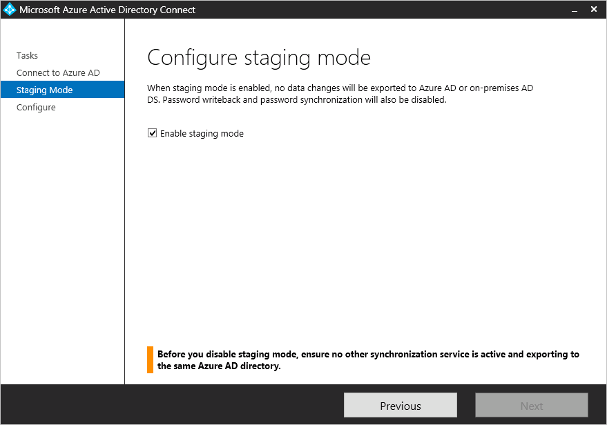

- Click the **Next** button
- On the confirmation page, click on the **install** button.

Azure AD Connect is now your active server.

## Next steps
Now that you have Azure AD Connect installed you can [verify the installation and assign licenses](active-directory-aadconnect-whats-next.md).

Learn more about [Integrating your on-premises identities with Azure Active Directory](active-directory-aadconnect.md).
