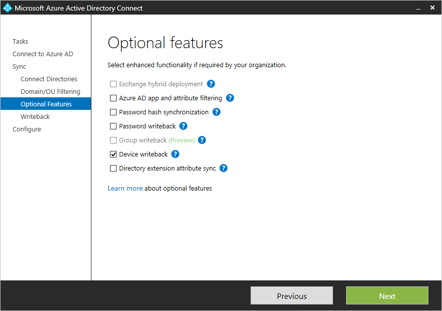
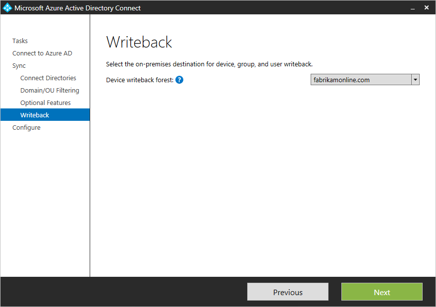

<properties
	pageTitle="Azure AD Connect: Enabling device writeback | Microsoft Azure"
	description="This document details how to enable device writeback using Azure AD Connect"
	services="active-directory"
	documentationCenter=""
	authors="billmath"
	manager="StevenPo"
	editor="curtand"/>

<tags
	ms.service="active-directory"  
	ms.workload="identity"
	ms.tgt_pltfrm="na"
	ms.devlang="na"
	ms.topic="article"
	ms.date="05/10/2016"
	ms.author="billmath;andkjell"/>

# Azure AD Connect: Enabling device writeback

>[AZURE.NOTE] A subscription to Azure AD Premium is required for device writeback.

The following documentation provides information on how to enable the device writeback feature in Azure AD Connect. Device Writeback is used in the following scenarios:

- Enable conditional access based on devices to ADFS (2012 R2 or higher) protected applications (relying party trusts).

This provides additional security and assurance that access to applications is granted only to trusted devices. For more information on conditional access, see [Managing Risk with Conditional Access](active-directory-conditional-access.md) and [Setting up On-premises Conditional Access using Azure Active Directory Device Registration](https://msdn.microsoft.com/library/azure/dn788908.aspx).

>[AZURE.IMPORTANT]
<li>Devices must be located in the same forest as the users. Since devices must be written back to a single forest, this feature does not currently support a deployment with multiple user forests.</li>
<li>Only one device registration configuration object can be added to the on-premises Active Directory forest. This feature is not compatible with a topology where the on-premises Active Directory is synchronized to multiple Azure AD directories.</li>

## Part 1: Install Azure AD Connect
1. Install Azure AD Connect using Custom or Express settings. Microsoft recommends to start with all users and groups successfully synchronized before you enable device writeback.

## Part 2: Prepare Active Directory
Use the following steps to prepare for using device writeback.

1.	From the machine where Azure AD Connect is installed, launch PowerShell in elevated mode.

2.	If the Active Directory PowerShell module is NOT installed, install it using the following command:

	`Install-WindowsFeature –Name AD-Domain-Services –IncludeManagementTools`

3. If the Azure Active Directory PowerShell module is NOT installed, then download and install it from [Azure Active Directory Module for Windows PowerShell (64-bit version)](http://go.microsoft.com/fwlink/p/?linkid=236297). This component has a dependency on the sign-in assistant, which is installed with Azure AD Connect.

4.	With enterprise admin credentials, run the following commands and then exit PowerShell.

	`Import-Module 'C:\Program Files\Microsoft Azure Active Directory Connect\AdPrep\AdSyncPrep.psm1'`

	`Initialize-ADSyncDeviceWriteback {Optional:–DomainName [name] Optional:-AdConnectorAccount [account]}`

Enterprise admin credentials are required since changes to the configuration namespace are needed. A domain admin will not have enough permissions.

Description:

- If not existent, it creates and configures new containers and objects under CN=Device Registration Configuration,CN=Services,CN=Configuration,[forest-dn].
- If not existent, it creates and configures new containers and objects under CN=RegisteredDevices,[domain-dn]. Device objects will be created in this container.
- Sets necessary permissions on the Azure AD Connector account, to manage devices on your Active Directory.
- Only needs to run on one forest, even if Azure AD Connect is being installed on multiple forests.

Parameters:

- DomainName: Active Directory Domain where device objects will be created. Note: All devices for a given Active Directory forest will be created in a single domain.
- AdConnectorAccount: Active Directory account that will be used by Azure AD Connect to manage objects in the directory. This is the account used by Azure AD Connect sync to connect to AD. If you installed using express settings, it is the account prefixed with MSOL_.

## Part 3: Enable device writeback in Azure AD Connect
Use the following procedure to enable device writeback in Azure AD Connect.

1.	Run the installation wizard again. Select **customize synchronization options** from the Additional Tasks page and click **Next**.

2.	In the Optional Features page, device writeback will no longer be grayed out. Please note that if the Azure AD Connect prep steps are not completed device writeback will be grayed out in the Optional features page. Check the box for device writeback and click **next**. If the checkbox is still disabled, see the [troubleshooting section](#the-writeback-checkbox-is-still-disabled).

3.	On the writeback page, you will see the supplied domain as the default Device writeback forest.

4.	Complete the installation of the Wizard with no additional configuration changes. If needed, refer to [Custom installation of Azure AD Connect.](active-directory-aadconnect-get-started-custom.md)

## Enable conditional access
Detailed instructions to enable this scenario are available within [Setting up On-premises Conditional Access using Azure Active Directory Device Registration](https://msdn.microsoft.com/library/azure/dn788908.aspx).

## Verify Devices are synchronized to Active Directory
Device writeback should now be working properly. Be aware that it can take up to 3 hours for device objects to be written-back to AD.  To verify that your devices are being synced properly, do the following after the sync rules complete:

1.	Launch Active Directory Administrative Center.
2.	Expand RegisteredDevices, within the Domain that is being federated.

3.	Current registered devices will be listed there.

## Troubleshooting

### The writeback checkbox is still disabled
If the checkbox for device writeback is not enabled even though you have followed the steps above, the following steps will guide you through what the installation wizard is verifying before the box is enabled.

First things first:

- Make sure at least one forest has Windows Server 2012R2. The device object type must be present.
- If the installation wizard is already running, then any changes will not be detected. In this case, complete the installation wizard and run it again.
- Make sure the account you provide in the initialization script is actually the correct user used by the Active Directory Connector. To verify this, follow these steps:
	- From the start menu, open **Synchronization Service**.
	- Open the **Connectors** tab.
	- Find the Connector with type Active Directory Domain Services and select it.
	- Under **Actions**, select **Properties**.
	- Go to **Connect to Active Directory Forest**. Verify that the domain and user name specified on this screen match the account provided to the script.

Verify configuration in Active Directory:
- Verify that the Device Registration Service is located in the location below (CN=DeviceRegistrationService,CN=Device Registration Services,CN=Device Registration Configuration,CN=Services,CN=Configuration) under configuration naming context.

- Verify there is only one configuration object by searching the configuration namespace. If there is more than one, delete the duplicate.

- On the Device Registration Service object, make sure the attribute msDS-DeviceLocation is present and has a value. Lookup this location and make sure it is present with the objectType msDS-DeviceContainer.

- Verify the account used by the Active Directory Connector has required permissions on the Registered Devices container found by the previous step. This is the expected permissions on this container:

- Verify the Active Directory account has permissions on the CN=Device Registration Configuration,CN=Services,CN=Configuration object.

## Additional Information
- [Managing Risk With Conditional Access](active-directory-conditional-access.md)
- [Setting up On-premises Conditional Access using Azure Active Directory Device Registration](https://msdn.microsoft.com/library/azure/dn788908.aspx)

## Next steps
Learn more about [Integrating your on-premises identities with Azure Active Directory](active-directory-aadconnect.md).
