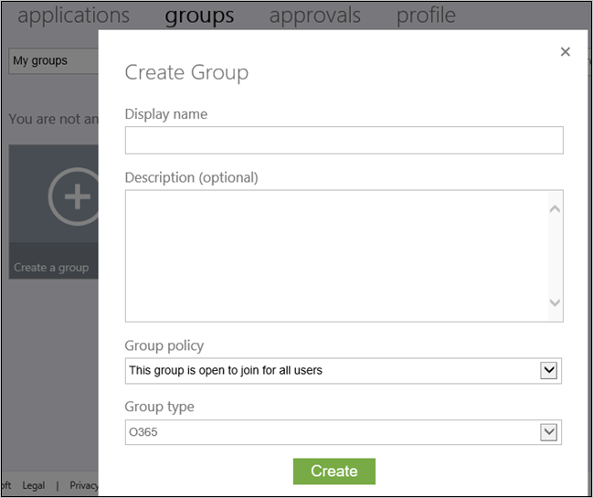
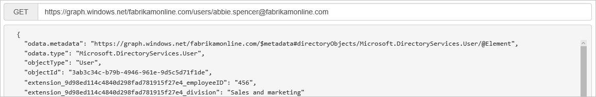

<properties
   pageTitle="Azure AD Connect features in preview | Microsoft Azure"
   description="This topic describes in more detail features which are in preview in Azure AD Connect."
   services="active-directory"
   documentationCenter=""
   authors="andkjell"
   manager="stevenpo"
   editor=""/>

<tags
   ms.service="active-directory"  
   ms.workload="identity"
   ms.tgt_pltfrm="na"
   ms.devlang="na"
   ms.topic="article"
   ms.date="09/29/2015"
   ms.author="andkjell;billmath"/>

# More details about features in preview
This topic describes how to use features currently in preview.

## User writeback
>[Azure.Important] The user writeback preview feature was temporarily removed in the August update to AAD Connect. If you have enabled it, then you should disable this feature.

>[Azure.Important] This feature should only be tested in a test environment and should not be used in an Azure AD directory used for production usage.

User writeback is in early preview. It can only be used when Azure AD is the source for all user objects and on-premises Active Directory is empty before you enable the feature.

## Group writeback
The option for group writeback in optional features will allow you to writeback “Groups in Office 365” to a forest with Exchange installed. This is a new group type which is always mastered in the cloud. You can find this in outlook.office365.com or on myapps.microsoft.com as shown here:

This group will be represented as a distribution group in on-premises AD DS. Your on-premises Exchange server must be on Exchange 2013 cumulative update 8 (released in March 2015) to recognize this new group type.

**Note**

- The address book attribute is currently not populated in the preview. The easiest way to do this is to use the Exchange PowerShell cmdlet update-recipient.
- Only forests with the Exchange schema are valid targets for groups. If no Exchange was detected, then group writeback will not be possible to enable.
- The Group writeback feature does not currently handle security groups or distribution groups.

More information about Groups for Office 365 can be found [here](http://blogs.office.com/2014/09/25/delivering-first-chapter-groups-office-365/ ).

## Directory extensions
Directory extensions allows you to extend the schema in Azure AD with your own attributes from on-premises Active Directory.

Only single-valued attributes are supported and the values in the attributes cannot be longer than 250 characters. The metaverse and Azure AD schema will be extended with the attributes selected. In Azure AD a new application is added with the attributes.

These attributes will now be available through Graph:

## Next steps\

Continue your [Custom installation of Azure AD Connect](active-directory-aadconnect-get-started-custom.md)
