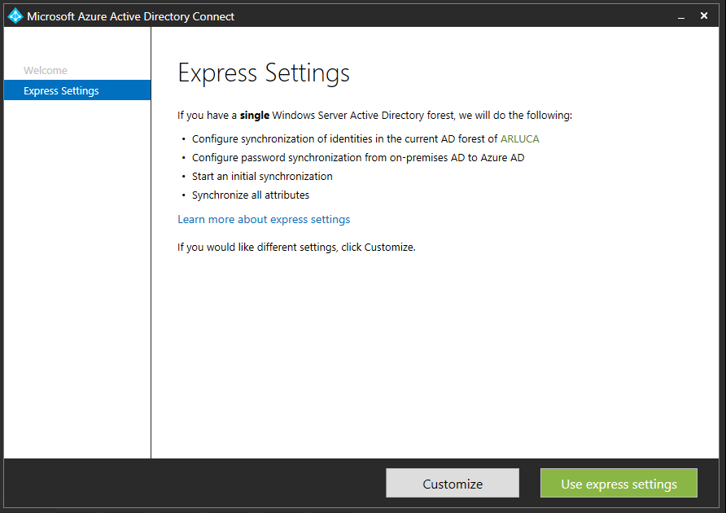
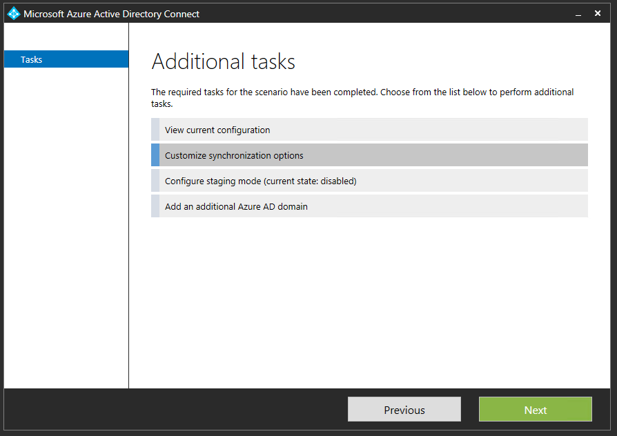
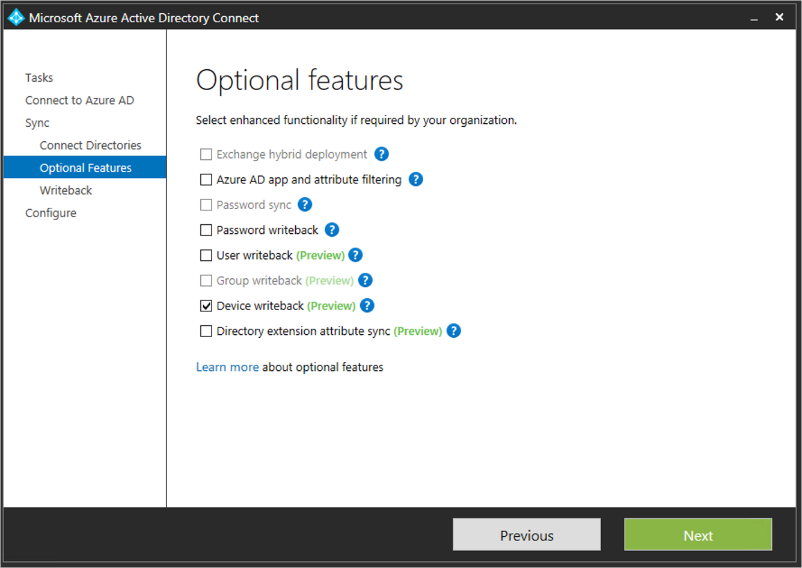
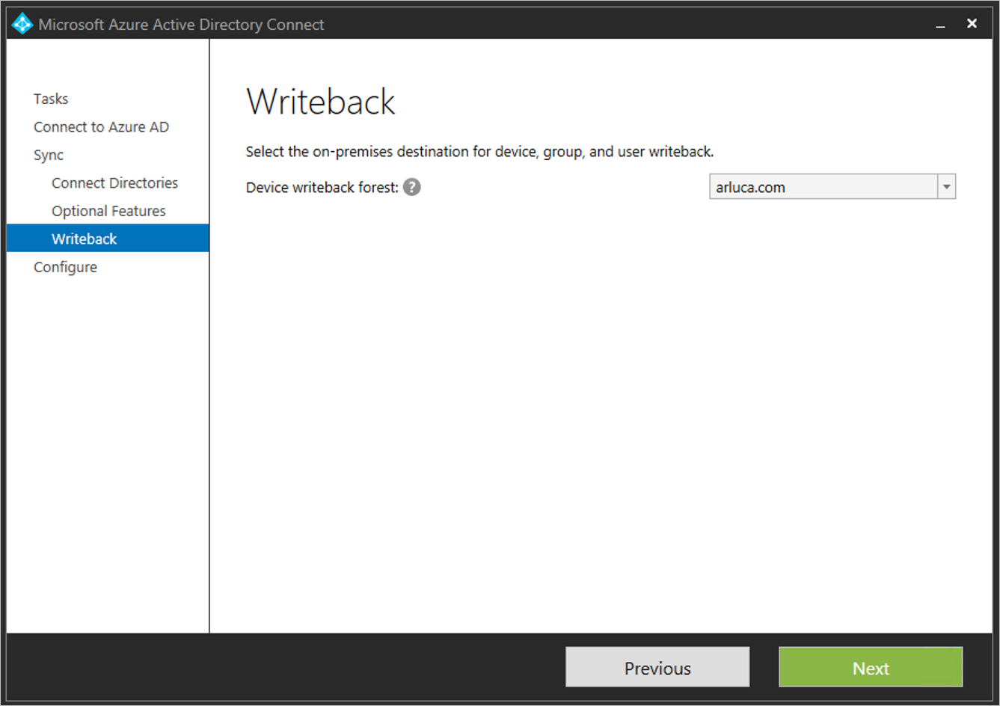
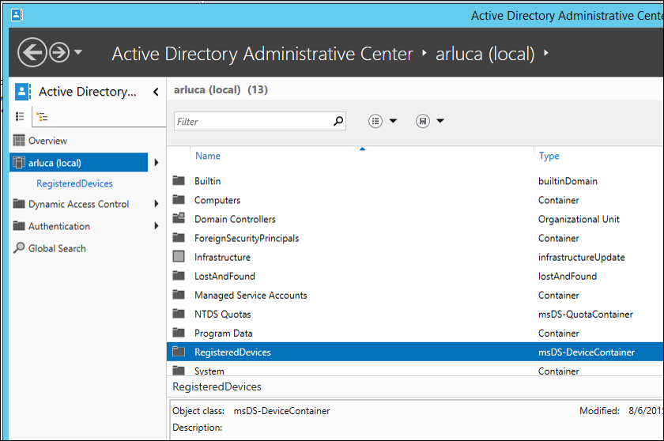
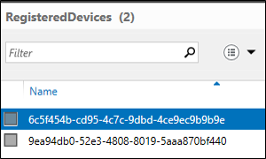

<properties
	pageTitle="Enabling device writeback in Azure AD Connect | Microsoft Azure"
	description="This document details how to enable device writeback using Azure AD Connect"
	services="active-directory"
	documentationCenter=""
	authors="billmath"
	manager="StevenPo"
	editor="curtand"/>

<tags
	ms.service="active-directory"  
	ms.workload="identity"
	ms.tgt_pltfrm="na"
	ms.devlang="na"
	ms.topic="article"
	ms.date="09/15/2015"
	ms.author="billmath"/>

# Enabling device writeback in Azure AD Connect

The following documentation provides information on how to enable the device writeback feature in Azure AD Connect. Device Writeback is used in the following scenarios:

Enable conditional access based on devices to ADFS (2012 R2 or higher) protected applications (relying party trusts).

This provides additional security and assurance that access to applications is granted only to trusted devices. For more information on conditional access, see [Managing Risk with Conditional Access](active-directory-conditional-access.md) and [Setting up On-premises Conditional Access using Azure Active Directory Device Registration](https://msdn.microsoft.com/library/azure/dn788908.aspx).

>[AZURE.Note] A subscription to Office 365 or Azure AD Premium is required when using devices registered in Azure Active Directory Device Registration service conditional access policies. This includes policies enforced by Active Directory Federation Services (AD FS) to on-premises resources.

## Part 1: Prepare Azure AD Connect
Use the following steps to prepare for using device writeback.

1.	From the machine where Azure AD Connect is installed, launch PowerShell in elevated mode.

2.	If the Active Directory PowerShell module is NOT installed. Install it using the following command:

	Install-WindowsFeature –Name AD-DOMAIN-Services –IncludeManagementTools

3.	With enterprise admin credentials, run the following commands and then exit PowerShell.

	Import-Module ‘C:\Program Files\Microsoft Azure Active Directory Connect\AdPrep\AdSyncAdPrep.psm1’

	Initialize-ADSyncDeviceWriteback –DomainName <name> -AdConnectorAccount <account>

Description:

- If not existent, it creates and configures new containers and objects under CN=Device Registration Configuration,CN=Services,CN=Configureation,<forest-dn>.

- If not existent, it creates and configures new containers and objects under CN=RegisteredDevices,<domain-dn>. Device objects will be created in this container.

- Sets necessary permissions on the Azure AD Connector account, to manage devices on your Active Directory.

- Only needs to run on one forest, even if Azure AD Connect is being installed on multiple forests.

Parameters:

- DomainName: Active Directory Domain where device objects will be created. Note: All devices for a given Active Directory forest will be created in a single domain.

- AdConnectorAccount: Active Directory account that will be used by Azure AD Connect to manage objects in the directory.

## Part 2: Enable device writeback
Use the following procedure to enable device writeback in Azure AD Connect.

1.	Run AAD Connect Wizard. If this is the first time using the wizard, perform a custom install by selecting Customize from the Express Settings screen

2.	If this is not the first time, select customize synchronization options from the Additional Tasks page and click Next.

3.	In the Optional Features page, device writeback will no longer be grayed out. Please note that if the Azure AD Connect prep steps are not completed device writeback will be grayed out in the Optional features page. Check the box for device writeback and click next.

4.	On the writeback page, you will see the supplied domain as the default Device writeback forest.

5.	Complete the installation of the Wizard with no additional configuration changes. If needed, refer to [Custom installation of Azure AD Connect.](active-directory-aadconnect-get-started-custom.md)

## Enable conditional access
Detailed instructions to enable this scenario are available within [Setting up On-premises Conditional Access using Azure Active Directory Device Registration](https://msdn.microsoft.com/library/azure/dn788908.aspx).

## Verify Devices are synchronized to Active Directory
Device writeback should now be working properly. Be aware that it can take up to 3 hours for device objects to be written-back to AD.  To verify that your devices are being synced properly, do the following after the sync rules complete:

1.	Launch Active Directory Administrative Center.
2.	Expand RegisteredDevices, within the Domain that is being federated.

3.	Current registered devices will be listed there.

## Additional Information
- [Managing Risk With Conditional Access](active-directory-conditional-access.md)
- [Setting up On-premises Conditional Access using Azure Active Directory Device Registration](https://msdn.microsoft.com/library/azure/dn788908.aspx)

## Next steps
Learn more about [Integrating your on-premises identities with Azure Active Directory](active-directory-aadconnect.md).
