<properties 
	pageTitle="Custom installation of Azure AD Connect" 
	description="This document details the custom installation options for Azure AD Connect." 
	services="active-directory" 
	documentationCenter="" 
	authors="billmath" 
	manager="swadhwa" 
	editor="curtand"/>

<tags 
	ms.service="active-directory"  
	ms.workload="identity" 
	ms.tgt_pltfrm="na" 
	ms.devlang="na" 
	ms.topic="article" 
	ms.date="05/28/2015" 
	ms.author="billmath"/>

# Custom installation of Azure AD Connect

The following documentation provides information on using the custom installation option for Azure AD Connect.  You can use this option if you have additional configuration options or need optional features that are not covered in the express installation.

For information on an Express Installation see [Express Installation](active-directory-aadconnect-get-started/#express-installation-of-azure-ad-connect).   For information on upgrading from DirSync to Azure AD Connect see [Upgrading DirSync to Azure Active Directory Connect.](active-directory-aadconnect-dirsync-upgrade-get-started.md)

## Install required components

When you install the synchronization services, you can leave the optional configuration section unchecked and Azure AD Connect will set everything up automatically.  This includes setting up a SQL Server 2012 Express instance and creating the appropriate groups and assigning them permissions.  If you wish to change the defaults you can use the table below to understand the optional configuration options that are available.

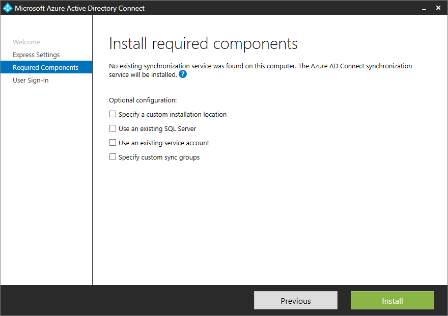

Optional Configuration  | Description 
------------- | ------------- |
SQL Server Name  |Allows you to specify the SQL Server name and the instance name.  Choose this option if you already have ad database server that you would like to use.
Service Account  |By default Azure AD Connect will create a local service account for the synchronization services to use. The problem that arises is that the password is generated automatically and unknown to the person installing Azure AD Connect. In most scenarios this is okay but if you wish to do some advanced configurations such as scoping the organizational units that are synchronized, you will want to create an account and choose your own password.but if you use a remote SQL server you need a service account in the domain and know the password. In those cases, enter the service account to use. |
Permissions | By default Azure AD Connect will create four groups local to the server when the synchronization services are installed.  These groups are: Administrators group, Operators group, Browse group, and the Password Reset Group.  If you wish to specify your own groups you can do so here.

## User sign-in
After installing the required components you will be asked to specify how the single sign-on method that users will use.  The table below provides a brief description of the available options.

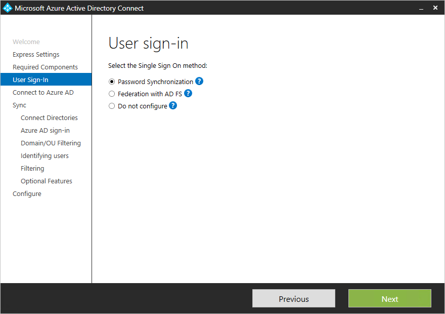

Single Sign On option | Description 
------------- | ------------- |
Password Synch |Users will be able to sign into Microsoft cloud services, such as Office 365, Dynamics CRM, and Windows InTune, using the same password as they use when logging into their on-premises network.  The users password is synchronized to Azure via a password hash and authentication occurs in the cloud.
Federation with AD FS|Users will be able to sign into Microsoft cloud services, such as Office 365, Dynamics CRM, and Windows InTune, using the same password as they use when logging into their on-premises network.  The users are redirected to their on-premises ad fs instance for signing in and authentication is done on-premises.
Do not configure| Neither feature will be installed and configured.  Choose this option if you already have a 3rd party federation server or another existing solution in place.

## Connect to Azure AD
On the Connect to Azure AD screen, enter a global admin account and password. Make sure this account does not have multi-factor authentication enabled.  This will cause it to fail authentication.
Be aware that this account is only used to create a service account in Azure AD and is not used after the wizard has completed.

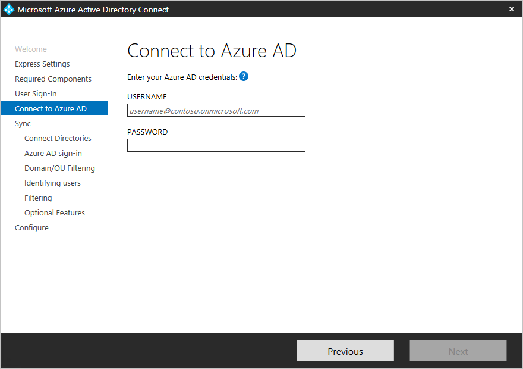

### Connect your directories
To connect to your Active Directory Domain Service, Azure AD Connect needs the credentials of an account with sufficient permissions.  This account can be a regular user account because it only needs the default read permissions.  However, depending on your scenario, you may need additional permissions.  For more information see [Azure AD Connect Account Summary](active-directory-addconnect-account-summary.md)

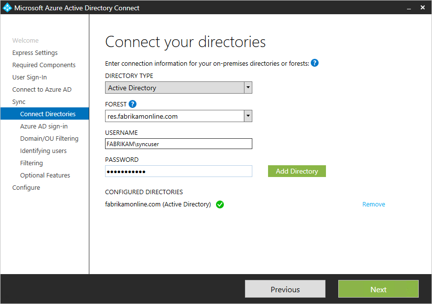

### Uniquely identifying your users

The Matching across forests feature allows you to define how users from your AD DS forests are represented in Azure AD.  A user might either be represented only once across all forests or have a combination of enabled and disabled accounts.

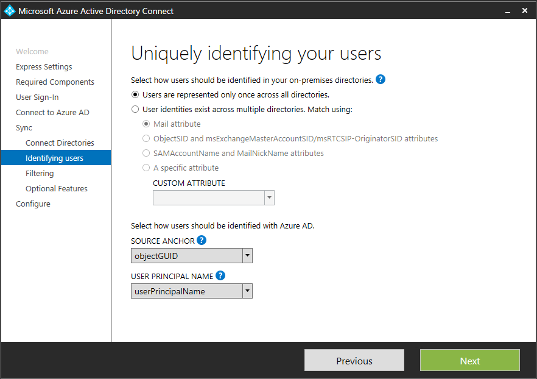

Setting | Description 
------------- | ------------- |
My users are only represented once across all forests| All users are created as individual objects in Azure AD.  The objects are not joined in the metaverse.
Mail attribute | This option joins users and contacts if the mail attribute has the same value in different forests. It is recommended to use this option when your contacts have been created using GALSync.
ObjectSID and msExchangeMasterAccountSID|This option joins an enabled user in an account forest with a disabled user in an Exchange resource forest. This is also known as linked mailbox in Exchange.
sAMAccountName and MailNickName|This option joins on attributes where it is expected the login ID for the user can be found.
My own attribute|This option allows you to select your own attribute.  **Limitation:** Make sure to pick an attribute which will already exist in the metaverse. If you pick a custom attribute the wizard will not be able to complete.

- **Source Anchor** - The attribute sourceAnchor is an attribute which is immutable during the lifetime of a user object. It is the primary key linking the on-premises user with the user in Azure AD. Since the attribute cannot be changed, you must plan for a good attribute to use. A good candidate is objectGUID. This attribute will not change unless the user account is moved between forests/domains. In a multi-forest environment where you move accounts between forests, another attribute must be used, such as an attribute with the employeeID. Attributes to avoid are those which would change if a person marries or change assignments. You cannot use attributes with an @-sign, so email and userPrincipalName cannot be used. The attribute is also case sensitive so if you move an object between forests, make sure to preserve the upper/lower case. For binary attributes the value is base64-encoded, but for other attribute types it will remain in its un-encoded state. In federation scenarios and some Azure AD interfaces this attribute is also known as immutableID.

- **UserPrincipalName** - The attribute userPrincipalName is the attribute users will use when they login to Azure AD and Office 365. The domains used, also known as the UPN-suffix, should be verified in Azure AD before the users are synchronized. It is strongly recommended to keep the default attribute userPrincipalName. If this attribute is non-routable and cannot be verified then it is possible to select another attribute, for example email, as the attribute holding the login ID. Warning: Using an Alternate ID is not compatible with all Office 365 workloads. For more information, please refer to https://technet.microsoft.com/en-us/library/dn659436.aspx.

### Sync filtering  based on groups
The filtering on groups feature allows you to run a small pilot where only a small subset of objects should be created in Azure AD and Office 365. To use this feature, created a group in your Active Directory and add the users and groups which should be synchronized with Azure AD as direct members. You can later add and remove users to this group to maintain the list of objects which should be present in Azure AD.
To use this feature, in the customized path you will see this page: 

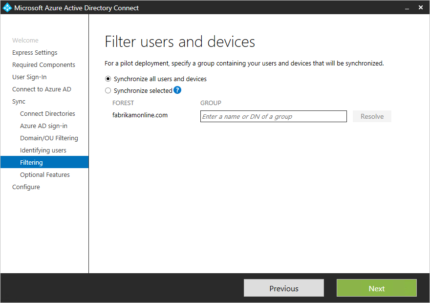

### Optional Features

This screen allows you to select the optional features for your specific scenarios.  Below is a brief explanations of each of the individual features.

Optional Features      | Description
-------------------    | ------------- | 
Exchange Hybrid Deployment |The Exchange Hybrid Deployment feature allows for the co-existence of Exchange mailboxes both on-premises and in Azure by synchronizing a specific set of attributes from Azure AD back into your on-premises directory.
Azure AD app and attribute filtering|By enabling Azure AD app and attribute filtering, the set of synchronized attributes can be tailored to a specific set on a subsequent page of the wizard.  This opens two additional configuration pages in the wizard.  
Password writeback|By enabling password writeback, password changes that originate with Azure AD will be written back to your on-premises directory.
User writeback|By enabling user writeback, users created in Azure AD will be written back to your on-premises directory.  This opens an additional configuration page in the wizard.  
Directory extension attribute sync|By enabling directory extensions attribute sync, attributes specified will be synced to Azure AD.  This opens an additional configuration page in the wizard.  

For additional configuration options such as changing the default configuration, using the Synchronization Rules Editor and Declarative Provisioning see [Manage Azure AD Connect](active-directory-aadconnect-whats-next.md)

Add the name of the group containing the users and groups. Only members of this group will be synchronized to Azure AD.

## Directory Extension attribute sync
With directory extensions you can extend the schema in Azure AD with custom attributes added by your organization or other attributes in Active Directory. To use this feature select “Directory Extension attribute sync” on the “Optional Features” page. This will give you this page where you can select your additional attributes.

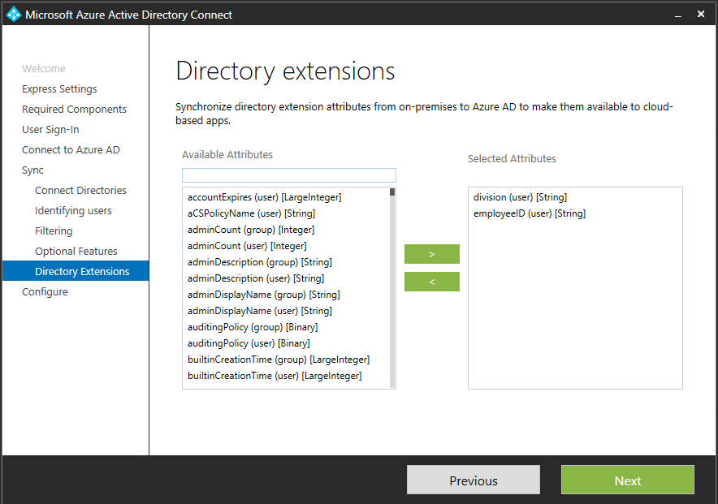

Only single-valued attributes are supported and the value cannot be longer than 250 characters. The metaverse and Azure AD schema will be extended with the attributes selected. In Azure AD a new application is added with the attributes.

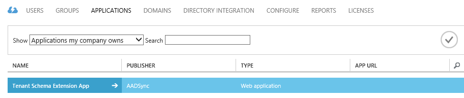

These attributes will now be available through Graph:

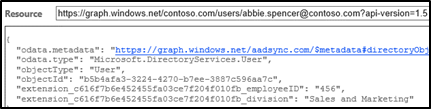

## User writeback (preview)
User writeback allows you to take a user created in Azure AD (through the portal, graph, PowerShell, or any other method) and write the user back to on-premises ADDS. To enable the feature, select “User writeback” on the optional features page. You will now be presented with the location where you want these users to be created. The default configuration will create all users in one location in AD DS.

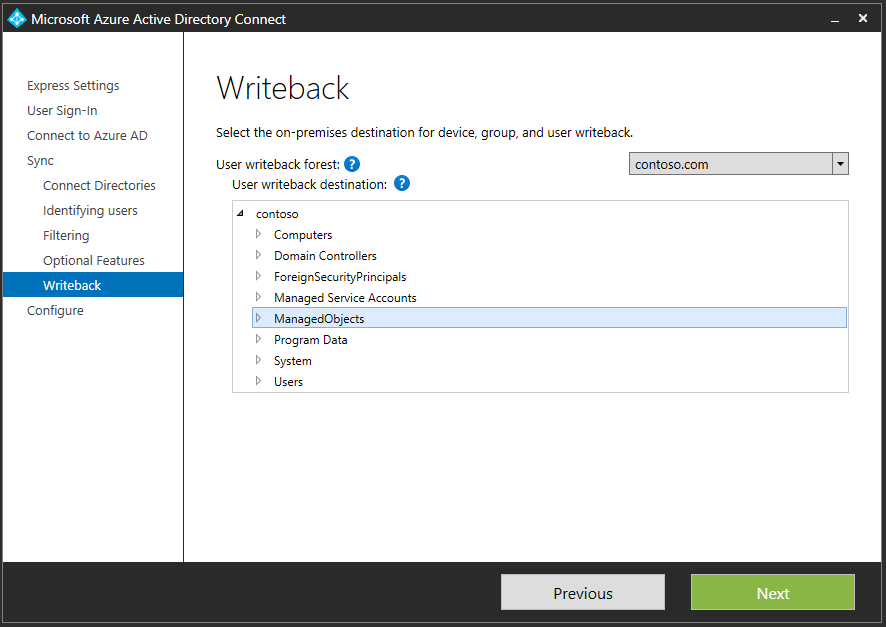

The users will be created with a random password so you have to reset the password in AD DS for the user to actually be able to login.

>[AZURE.NOTE] Password sync and Password writeback are not compatible with this preview feature.

## Group writeback (preview)
The option for group writeback in optional features will allow you to writeback “Groups in Office 365” to a forest with Exchange installed. This is a new group type which is always mastered in the cloud. You can find this in outlook.office365.com or on myapps.microsoft.com as shown here:

This group will be represented as a distribution group in on-premises AD DS. Your on-premises Exchange server must be on Exchange 2013 cumulative update 8 (released in March 2015) to recognize this new group type.

**Note**

- The address book attribute is currently not populated. The easiest is to find the address book property from another group in your org and populate this outside the sync engine.  **The easiest way to do this is to use the PowerShell cmdlet update-recipient.**
- Only forests with the Exchange schema are valid targets for groups. If no Exchange was detected, then group writeback will not be possible to enable.
- The Group writeback feature does not currently handle security groups or distribution groups.

More information can be found [here](http://blogs.office.com/2014/09/25/delivering-first-chapter-groups-office-365/ ). 

## Device writeback (preview)
The device writeback feature will allow you take a device registered in the cloud, for example in Intune, and have it in AD DS for conditional access. To enable the feature, AD DS must be prepared. If you install AD FS and the device registration service (DRS), DRS provides PowerShell cmdlets to prepare AD for device writeback. If you do not have DRS installed, then you can run C:\Program Files\Microsoft Azure Active Directory Connect\AdPrep\AdSyncAdPrep.psm1 as an enterprise admin.

Before you can run the PowerShell cmdlet it must be imported first.

	Import-Module 'C:\Program Files\Microsoft Azure Active Directory Connect\AdPrep\AdSyncPrep.psm1'

In order to do this you will need Active Directory and MSOnline PowerShell installed locally.

## Staging mode
With staging mode the process to setup a new sync server in parallel with an existing server is possible. It is only supported to have one sync server connected to one directory in the cloud. But if we want to move from another server, for example one running DirSync, then we can enable Azure AD Connect in staging mode. When enabled the sync engine will import and synchronize data as normal, but it will not export anything to Azure AD and will turn off password sync and password writeback. 

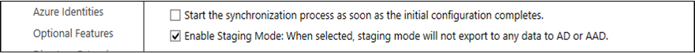

While in staging mode, it is possible to make required changes to the sync engine and review what is about to be exported. When the configuration looks good, run the installation wizard again and disable staging mode. This will enable data to be exported to Azure AD. Make sure to disable the other server at the same time so only one server is actively exporting.

### Preventing accidental deletions
When installing Azure AD Connect the feature preventing accidental deletions will be enabled by default and configured to not allow an export with more than 500 deletes. The 500 is a default value and can be changed. With this feature enabled, if there are too many deletes, the export will not continue and you will receive an email like this:

If this was unexpected, then investigate and take any corrective actions. 

To temporarily disable this protection and let these deletes go through, run:
Disable-ADSyncExportDeletionThreshold

To re-enable the protection or to change the default threshold setting, run:
Enable-ADSyncExportDeletionThreshold

## Configuring Federation with AD FS
Configuring AD FS with Azure AD Connect is simple with just a few clicks. The following is required prior to setup.

- A Windows Server 2012 R2 server for the federation server with remote management enabled
- A Windows Server 2012 R2 server for the Web Application Proxy server with remote management enabled
- An SSL certificate for the federation service name you intend to use (e.g. adfs.contoso.com)

### Create a new AD FS farm or use an existing AD FS farm
You can use an exiting AD FS farm or you can choose to create a new AD FS farm. If you choose to create a new one, you will be required to provide the SSL certificate. If the SSL certificate is protected by a password, you will be prompted to provide the password. 

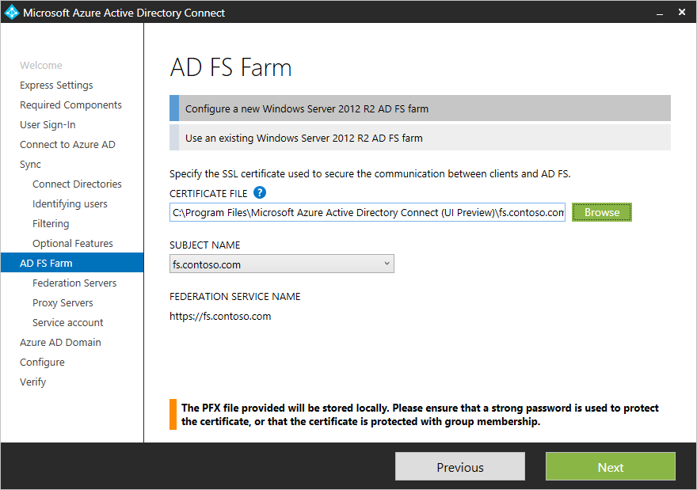

 
**Note:** If you choose to use an existing AD FS farm, you will skip a few pages and be taken directly to  a configuring the trust relationship between AD FS and Azure AD screen.

### Specify the AD FS servers

Here you will enter the specific servers that you want to install AD FS on. You can add one or more servers based on your capacity planning needs. These servers must all be joined to an Active Directory domain prior to performing this configuration. We recommend installing a single AD FS server for test and pilot deployments and deploying additional servers by opening up Azure AD Connect and deploying AD FS to additional servers to meet your scaling needs.

> [AZURE.NOTE] Ensure that all of the servers are joined to an AD domain prior to performing this configuration.

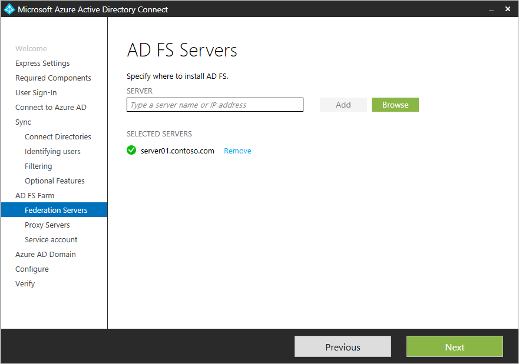

 
### Specify the Web Application Proxy servers
Here you will enter the specific servers that you want as your Web Application proxy servers. The web application proxy server is deployed in your DMZ (extranet facing) and supports authentication requests from the extranet. You can add one or more servers based on your capacity planning needs. We recommend installing a single Web Application proxy server for test and pilot deployments and deploying additional servers by opening up Azure AD Connect and deploying Web Application Proxy to additional servers. We typically recommend having an equivalent number of proxy servers to satisfy authentication from the intranet. 

> [AZURE.NOTE] <li>If the account you are using to install Azure AD Connect is not a local admin on the AD FS server(s) then you will be prompted for credentials for an account that has sufficient permissions.</li><li>Ensure that there is HTTP/HTTPS connectivity between the Azure AD Connect server and the Web Application Proxy server prior to configuring this step.</li><li> In addition, ensure that there is HTTP/HTTPS connectivity between the Web Application Server and the AD FS server to allow authentication requests to flow through.</li> 

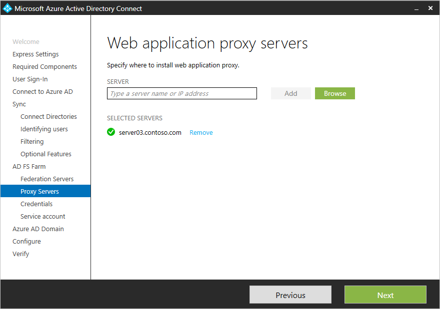

 

You will be prompted to enter credentials so that the web application server can establish a secure connection to the AD FS server. These credentials need to be a local administrator on the AD FS server. 

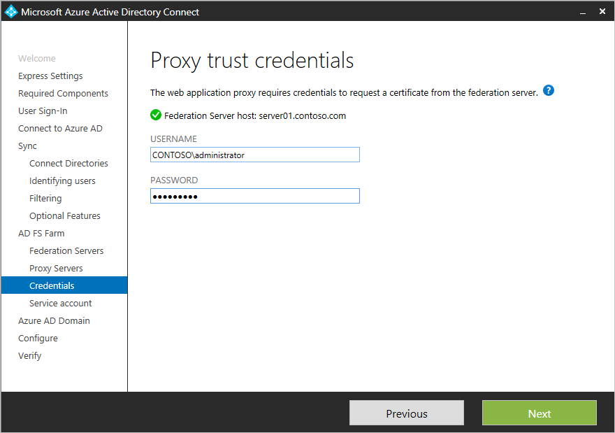

 
 
### Specify the service account for the AD FS service
The AD FS service requires a domain service account to authenticate users and lookup user information in Active Directory. It can support 2 types of service accounts:

- **Group Managed Service Accounts** - This is a type of service account introduced in Active Directory Domain Service with Windows Server 2012. This type of account provides services such as AD FS to use a single account without needing to update the account password on a regular basis. Use this option if you already have Windows Server 2012 domain controllers in the domain that AD FS servers will belong to.
- **Domain User Account** - This type of account will require you to provide a password and regularly update the password when the password changes. Use this only when you do not have Windows Server 2012 domain controllers in the domain that AD FS servers will belong to.

Azure AD Connect will auto create the group managed service account if you are logged in as a domain administrator. 
 

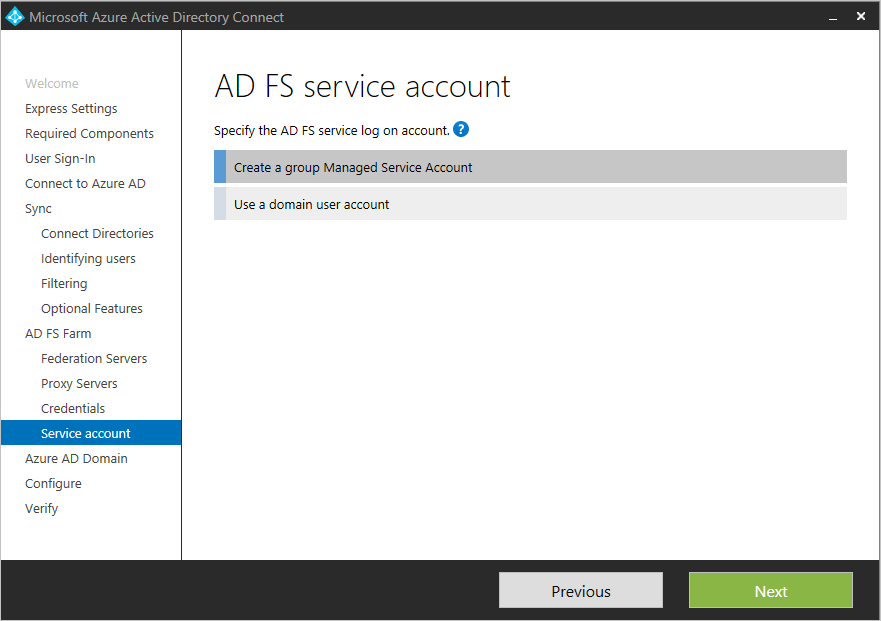

 

### Select the Azure AD domain that you wish to federate
This configuration is used to setup the federation relationship between AD FS and Azure AD. It configures AD FS to issue security tokens to Azure AD and configures Azure AD to trust the tokens from this specific AD FS instance. This page will only allow you to configure a single domain in the first time experience. You can configure additional domains at any time by opening up Azure AD Connect again and performing this task. 

 

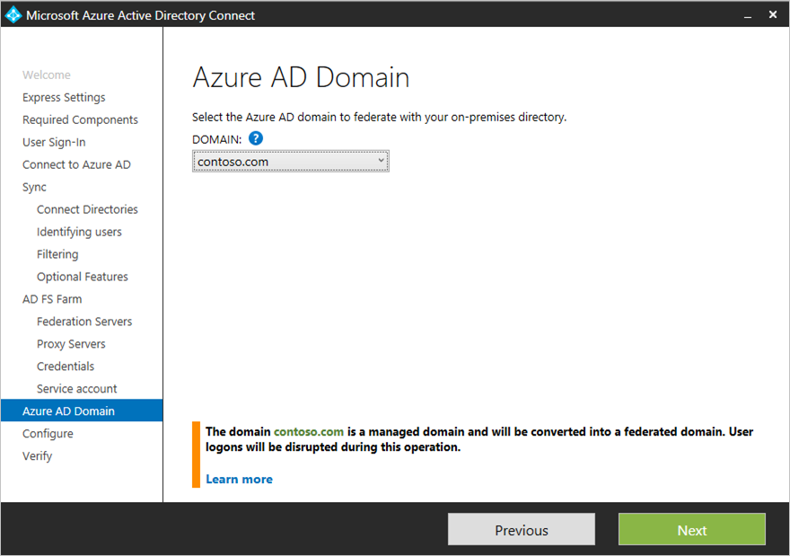

 
 
### Perform additional tasks to complete the federation configuration
The following additional tasks will need to be completed to finish the federation configuration.

- Set up DNS records for the AD FS federation service name (e.g. adfs.contoso.com) for both the intranet (your internal DNS server) and the extranet (public DNS through your domain registrar). For the intranet DNS record ensure that you use A records and not CNAME records. This is required for windows authentication to work correctly from your domain joined machine.
- If you are deploying more than one AD FS server or Web Application Proxy server, ensure that you have configured your load balancer and that the DNS records for the AD FS federation service name (e.g. adfs.contoso.com) point to the load balancer.
- For windows integrated authentication to work for browser applications using Internet Explorer in your intranet, ensure that the AD FS federation service name (e.g. adfs.contoso.com) is added to the intranet zone in IE. This can be controlled via group policy and deployed to all you domain joined computers. 

### Verify your federation configuration

Azure AD Connect will verify the DNS settings for you when you click on the Verify button. 

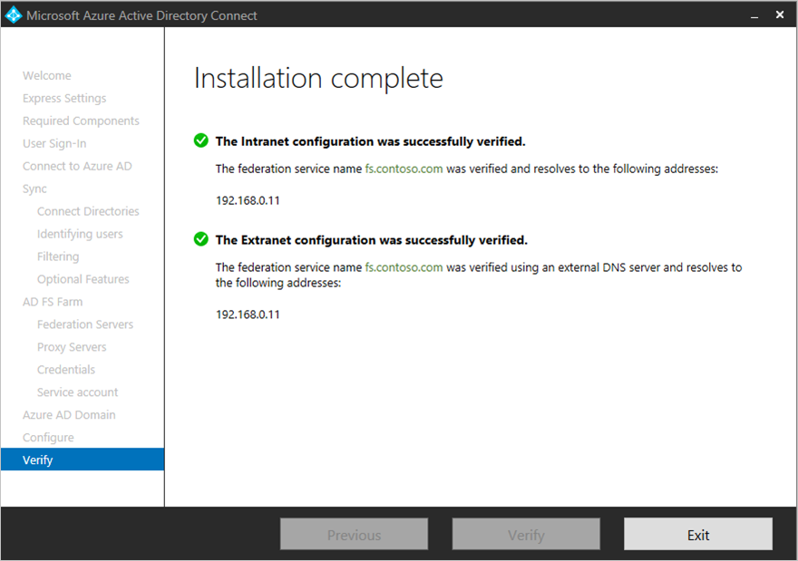

 
 
In addition, perform the following verification steps:

- Validate browser login from a domain joined machine from Internet Explorer from the intranet: Connect to https://myapps.microsoft.com and verify the login with your logged in account.
- Validate browser login from any device from the extranet: On a home machine or a mobile device, connect to https://myapps.microsoft.com and supply your login ID and your password credential.
- Validate rich client login: Connect to https://testconnectivity.microsoft.com, choose the ‘Office 365’ tab and choose the ‘Office 365 Single Sign-On Test’.

### Optional configuration on your AD FS service
You can customize the illustration and logo image for your AD FS login pages by logging into the AD FS and using PSH to make this configuration. 
	
	Set-AdfsWebTheme -TargetName default -Logo @{path="c:\Contoso\logo.png"} –Illustration @{path=”c:\Contoso\illustration.png”}

**Additional Resources**

* [Use your on-premises identity infrastructure in the cloud](active-directory-aadconnect.md)
* [How Azure AD Connect works](active-directory-aadconnect-how-it-works.md)
* [Whats Next with Azure AD Connect](active-directory-aadconnect-whats-next.md)
* [Learn More](active-directory-aadconnect-learn-more.md)
* [Azure AD Connect on MSDN](https://msdn.microsoft.com/library/azure/dn832695.aspx) 