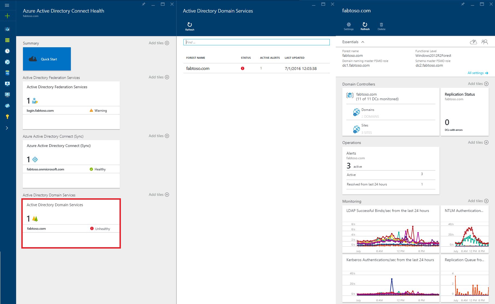
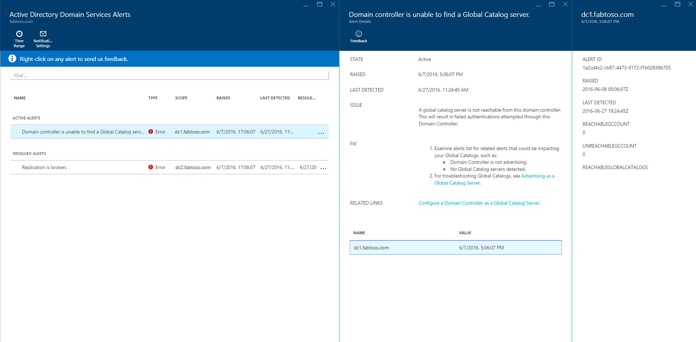
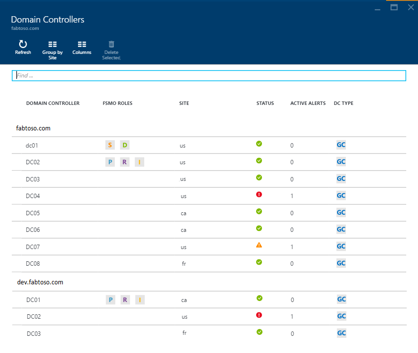
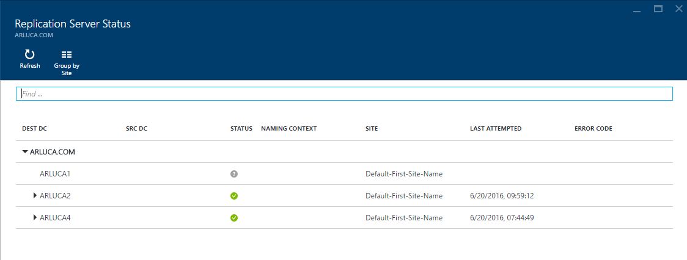

<properties
	pageTitle="Using Azure AD Connect Health with AD DS | Microsoft Azure"
	description="This is the Azure AD Connect Health page that will discuss how to monitor AD DS."
	services="active-directory"
	documentationCenter=""
	authors="arluca"
	manager="samueld"
	editor="curtand"/>

<tags
	ms.service="active-directory"
	ms.workload="identity"
	ms.tgt_pltfrm="na"
	ms.devlang="na"
	ms.topic="get-started-article"
	ms.date="07/01/2016"
	ms.author="arluca"/>

# Using Azure AD Connect Health with AD DS
The following documentation is specific to monitoring Active Directory Domain Services with Azure AD Connect Health. For information on monitoring AD FS with Azure AD Connect Health see [Using Azure AD Connect Health with AD FS](active-directory-aadconnect-health-adfs.md). Additionally, for information on monitoring Azure AD Connect (Sync) with Azure AD Connect Health see [Using Azure AD Connect Health for Sync](active-directory-aadconnect-health-sync.md).

## Alerts for Azure AD Connect Health for AD DS
The Alerts section within Azure AD Connect Health for AD DS, provides you a list of active and resolved alerts, related to your Domain Controllers. Selecting an active or resolved alert will open a new blade with additional information, along with resolution steps, and links to supporting documentation. 

Enabling email notifications for alerts is available within this blade, as well as changing the time range in view. Expanding the time range will allow you to see prior resolved alerts.

## Domain Controllers
This dashboard provides a topological view of your environment, along with key operational metrics from each of your monitored domain controllers. The presented metrics help to quickly identify, any domain controllers that might require further investigation. By default, only a subset of columns are displayed; however, you can click on the columns command and select other columns of interest. 

Additionally, Domain Controllers can be grouped by their respective domain or site, which is helpful for understanding the environment topology. 

## Replication Status
This dashboard provides a view of the replication status and replication topology of your monitored domian controllers. The status of the most recent replication attempt is listed, along with helpful documentation for any error that is found. Selecting a domain controller with an error, will open a new blade with additional information, along with resolution steps, and links to troubleshooting documentation. 

## Monitoring
This feature provides graphical trends of different performance counters, which are continously collected from each of the monitored domain controllers. Performance of a domain controller can easily be compared across all other monitored domain controllers in your forest. Additionally, you can see various performance counters side by side, which is helpful when troubleshooting issues in your environment. 

By default, we have preselected four performance counters; however, you can include others by clicking the filter command and selecting or deselecting any desired performance counters. Additionally, if you click on a particular performance counter graph a new blade will open, which includes the respective data points for each of the monitored domain controllers.

## Related links

* [Azure AD Connect Health](active-directory-aadconnect-health.md)
* [Azure AD Connect Health Agent Installation](active-directory-aadconnect-health-agent-install.md)
* [Azure AD Connect Health Operations](active-directory-aadconnect-health-operations.md)
* [Using Azure AD Connect Health with AD FS](active-directory-aadconnect-health-adfs.md)
* [Using Azure AD Connect Health for sync](active-directory-aadconnect-health-sync.md)
* [Azure AD Connect Health FAQ](active-directory-aadconnect-health-faq.md)
* [Azure AD Connect Health Version History](active-directory-aadconnect-health-version-history.md)
