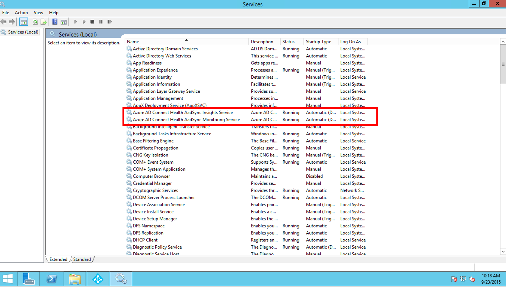

<properties
	pageTitle="Azure AD Connect Health Agent installation | Microsoft Azure"
	description="This is the Azure AD Connect Health page that describes the agent installation for AD FS and Sync."
	services="active-directory"
	documentationCenter=""
	authors="billmath"
	manager="stevenpo"
	editor="curtand"/>

<tags
	ms.service="active-directory"
	ms.workload="identity"
	ms.tgt_pltfrm="na"
	ms.devlang="na"
	ms.topic="article"
	ms.date="10/15/2015"
	ms.author="billmath"/>

# Azure AD Connect Health Agent Installation 

This document will walk you through installing and configuring the Azure AD Connect Health Agent for AD FS and sync.

>[AZURE.NOTE]Remember that before you see any AD FS data in your instance of Azure AD Connect Health, you will need to install the Azure AD Connect Health Agent on your targeted servers.  Be sure to complete the requirements [here](active-directory-aadconnect-health.md#requirements) prior to installing the agent.  You can download the agent [here](http://go.microsoft.com/fwlink/?LinkID=518973).

## Installing the  Azure AD Connect Health Agent for AD FS
To start the agent installation, double-click on the .exe file that you downloaded. On the first screen, click Install.

Once the installation is finished, click Configure Now.

This will launch a command prompt followed by some PowerShell that will execute Register-AzureADConnectHealthADFSAgent. You will be prompted to sign in to Azure. Go ahead and sign in.

After signing in, PowerShell will continue. Once it completes you can close PowerShell and the configuration is complete.

At this point, the services should be started automatically and the agent will be now monitoring and gathering data.  Be aware that you will see warnings in the PowerShell window if you have not met all of the pre-requisites that were outlined in the previous sections. Be sure to complete the requirements [here](active-directory-aadconnect-health.md#requirements) prior to installing the agent. The following screenshot below is an example of these errors.

To verify the agent has been installed, open services and look for the following. These services should be running if you completed the configuration. Otherwise, they will not start until the configuration is complete.

- Azure AD Connect Health AD FS Diagnostics Service
- Azure AD Connect Health AD FS Insights Service
- Azure AD Connect Health AD FS Monitoring Service

### Agent installation on Windows Server 2008 R2 Servers

For Windows Server 2008 R2 servers do the following:

1. Ensure that the server is running at Service Pack 1 or higher.
1. Turn off IE ESC for agent installation:
1. Install Windows PowerShell 4.0 on each of the servers prior to installing the AD Health agent.  To install Windows PowerShell 4.0:
 - Install [Microsoft .NET Framework 4.5](https://www.microsoft.com/download/details.aspx?id=40779) using the following link to download the offline installer.
 - Install PowerShell ISE (From Windows Features)
 - Install the [Windows Management Framework 4.0.](https://www.microsoft.com/download/details.aspx?id=40855)
 - Install Internet Explorer version 10 or above on the server. This is required by the Health Service to authenticate you using your Azure Admin credentials.
1. For additional information on installing Windows PowerShell 4.0 on Windows Server 2008 R2 see the wiki article [here](http://social.technet.microsoft.com/wiki/contents/articles/20623.step-by-step-upgrading-the-powershell-version-4-on-2008-r2.aspx).

### Enable Auditing for AD FS

In order for the Usage Analytics feature to gather and analyze data, the Azure AD Connect Health agent needs the information in the AD FS Audit Logs. These logs are not enabled by default. This only applies to AD FS federation servers. You do not need to enable auditing on AD FS Proxy servers or Web Application Proxy servers. Use the following procedures to enable AD FS auditing and to locate the AD FS audit logs.

#### To enable auditing for AD FS 2.0

1. Click **Start**, point to **Programs**, point to **Administrative Tools**, and then click **Local Security Policy**.
2. Navigate to the **Security Settings\Local Policies\User Rights Management** folder, and then double-click Generate security audits.
3. On the **Local Security Setting** tab, verify that the AD FS 2.0 service account is listed. If it is not present, click **Add User or Group** and add it to the list, and then click **OK**.
4. Open a command prompt with elevated privileges and run the following command to enable auditing.<code>auditpol.exe /set /subcategory:"Application Generated" /failure:enable /success:enable</code>
5. Close Local Security Policy, and then open the Management snap-in.  To open the Management snap-in, click **Start**, point to **Programs**, point to **Administrative Tools**, and then click AD FS 2.0 Management.
6. In the Actions pane, click Edit Federation Service Properties.
7. In the **Federation Service Properties** dialog box, click the **Events** tab.
8. Select the **Success audits** and **Failure audits** check boxes.
9. Click **OK**.

#### To enable auditing for AD FS on Windows Server 2012 R2

1. Open **Local Security Policy** by opening **Server Manager** on the Start screen, or Server Manager in the taskbar on the desktop, then click **Tools/Local Security Policy**.
2. Navigate to the **Security Settings\Local Policies\User Rights Assignment** folder, and then double-click **Generate security audits**.
3. On the **Local Security Setting** tab, verify that the AD FS service account is listed. If it is not present, click **Add User or Group** and add it to the list, and then click **OK**.
4. Open a command prompt with elevated privileges and run the following command to enable auditing: <code>auditpol.exe /set /subcategory:"Application Generated" /failure:enable /success:enable.</code>
5. Close **Local Security Policy**, and then open the **AD FS Management** snap-in (in Server Manager, click Tools, and then select AD FS Management).
6. In the Actions pane, click **Edit Federation Service Properties**.
7. In the Federation Service Properties dialog box, click the **Events** tab.
8. Select the **Success audits and Failure audits** check boxes and then click **OK**.

#### To locate the AD FS audit logs

1. Open **Event Viewer**.
2. Go to Windows Logs and select **Security**.
3. On the right, click **Filter Current Logs**.
4. Under Event Source, select **AD FS Auditing**.

> [AZURE.WARNING] If you have a group policy that is disabling AD FS auditing then the Azure AD Connect Health Agent will not be able to collect information. Ensure that you don’t have a group policy that may be disabling auditing.

[//]: # (Start of Agent Proxy Configuration Section)

## Installing the Azure AD Connect Health agent for sync
The Azure AD Connect Health agent for sync is installed automatically in the latest build of Azure AD Connect.  To use Azure AD Connect for sync you will need to download the latest version of Azure AD Connect and install it.  You can download the latest version [here](http://www.microsoft.com/download/details.aspx?id=47594).

To verify the agent has been installed, open services and look for the following. These services should be running if you completed the configuration. Otherwise, they will not start until the configuration is complete.

- Azure AD Connect Health AadSync Insights Service
- Azure AD Connect Health AadSync Monitoring Service
 

>[Azure.NOTE] Remember that using Azure AD Connect Health requires Azure AD Premium.  If you do not have Azure AD Premium you will not be able to complete the configuration in the Azure portal.  For more information see the requirements [here](active-directory-aadconnect-health.md#requirements). 

## Configure Azure AD Connect Health Agents to use HTTP Proxy
You can configure Azure AD Connect Health Agents to work with an HTTP Proxy.

>[AZURE.NOTE]
- Using “Netsh WinHttp set ProxyServerAddress” will not work as the agent uses System.Net to make web requests instead of Microsoft Windows HTTP Services.
- The configured Http Proxy address will be used to pass-through encrypted Https messages.
- Authenticated proxies (using HTTPBasic) are not supported.

### Change Health Agent Proxy Configuration
You have the following options to configure Azure AD Connect Health Agent to use an HTTP Proxy.

>[AZURE.NOTE] You must restart all Azure AD Connect Health Agent services for the proxy settings to be updated. Run the following command: 
    Restart-Service AdHealth*

#### Import existing proxy Settings

##### Import from Internet Explorer
You can import your Internet Explorer HTTP proxy settings and use them for Azure AD Connect Health Agents by executing the following PowerShell command on each server running the Health Agent.

	Set-AzureAdConnectHealthProxySettings -ImportFromInternetSettings

##### Import from WinHTTP
You can import you WinHTTP proxy settings by executing the following PowerShell command on each server running the Health Agent.

	Set-AzureAdConnectHealthProxySettings -ImportFromWinHttp

#### Specify Proxy addresses manually
You can specify a proxy server manually by executing the following PowerShell command on each server running the Health Agent.

	Set-AzureAdConnectHealthProxySettings -HttpsProxyAddress address:port

Example: *Set-AzureAdConnectHealthProxySettings -HttpsProxyAddress myproxyserver:443*

- "address" can be a DNS resolvable server name or an IPv4 address
- "port" can be omitted. If omitted then 443 is chosen as default port.

#### Clear existing proxy configuration
You can clear the existing proxy configuration by running the following command.

	Set-AzureAdConnectHealthProxySettings -NoProxy

### Read current proxy settings
You can use the following command to read the currently configured proxy settings.

	Get-AzureAdConnectHealthProxySettings

[//]: # (End of Agent Proxy Configuration Section)

## Related links

* [Azure AD Connect Health](active-directory-aadconnect-health.md)
* [Azure AD Connect Health Operations](active-directory-aadconnect-health-operations.md)
* [Using Azure AD Connect Health with AD FS](active-directory-aadconnect-health-adfs.md)
* [Azure AD Connect Health FAQ](active-directory-aadconnect-health-faq.md)
