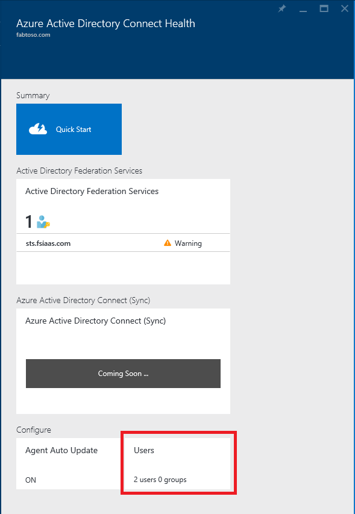
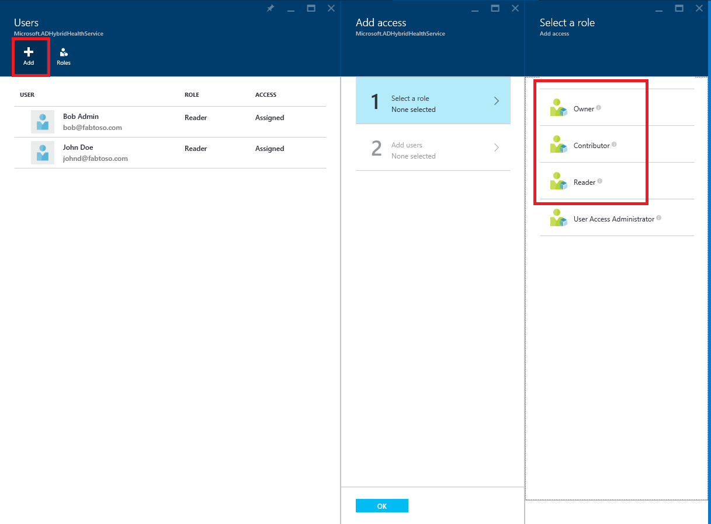
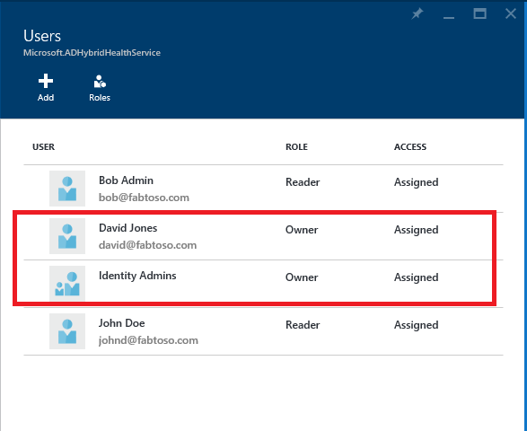
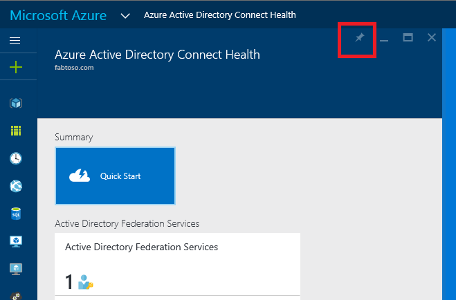

<properties
	pageTitle="Azure AD Connect Health Operations."
	description="This article describes additional operations that can be performed once you have deployed Azure AD Connect Health."
	services="active-directory"
	documentationCenter=""
	authors="karavar"
	manager="stevenpo"
	editor="curtand"/>

<tags
	ms.service="active-directory"
	ms.workload="identity"
	ms.tgt_pltfrm="na"
	ms.devlang="na"
	ms.topic="article"
	ms.date="07/14/2016"
	ms.author="vakarand"/>

# Azure AD Connect Health Operations

The following topic describes the various operations that can be performed using Azure AD Connect Health.

## Enable Email Notifications
You can configure the Azure AD Connect Health Service to send email notifications when alerts are generated indicating your identity  infrastructure is not healthy. This will occur when an alert is generated, as well as when it is marked as resolved. Follow the instructions below to configure email notifications.

>[AZURE.NOTE] Email notifications are disabled by default.

### To enable Azure AD Connect Health Email Notifications

1. Open the Alerts Blade for the service for which you wish to receive email notification.
2. Click on the "Notification Settings" button from the action bar.
3. Turn the Email Notification switch to ON.
4. Select the check box to configure all the Global Admins to receive email notifications.
5. If you wish to receive email notifications on any other email addresses, you can specify them in the Additional Email Recipient box. To remove an email address from this list, right click on the entry and select Delete.
6. To finalize the changes click on "Save". All changes will take effects only after you select "Save".

## Delete a server or service instance

### Delete a server from Azure AD Connect Health Service
In some instances, you may wish to remove a server from being monitored. Follow the instructions below to remove a server from Azure AD Connect Health Service.

When deleting a server, be aware of the following:

- This action will STOP collecting any further data from that server. This server will be removed from the monitoring service. After this action, you will not be able to view new alerts, monitoring or usage analytics data for this server.
- This action will NOT uninstall or remove the Health Agent from your server. If you have not uninstalled the Health Agent before performing this step, you may see error events on the server related to the Health Agent.
- This action will NOT delete the data already collected from this server. That data will be deleted as per the Microsoft Azure Data Retention Policy.
- After performing this action, if you wish to start monitoring the same server again, you will need to uninstall and re-install the health agent on this server.

#### To delete a server from Azure AD Connect Health Service

Azure AD Connect Health for AD FS & Azure AD Connect (Sync):

1. Open the Server Blade from the Server List Blade by selecting the server name to be removed.
2. On the Server Blade, click on the "Delete" button from the action bar.
3. Confirm the action to delete the server by typing the server name in the confirmation box.
4. Click on the "Delete" button.

Azure AD Connect Health for AD DS:

1. Open the Domain Controllers dashboard. 
2. Select the domain controller to be removed.
3. Click on the "Delete Selected" button from the action bar. 
4. Confirm the action to delete the server.
5. Click on the "Delete" button.

### Delete a service instance from Azure AD Connect Health Service

In some instances, you may wish to remove a service instance. Follow the instructions below to remove a service instance from Azure AD Connect Health Service.

When deleting a service instance, be aware of the following:

- This action will remove the current service instance from the monitoring service.
- This action will NOT uninstall or remove the Health Agent from any of the servers that were monitored as part of this service instance. If you have not uninstalled the Health Agent before performing this step, you may see error events on the server(s) related to the Health Agent.
- All data from this service instance will be deleted as per the Microsoft Azure Data Retention Policy.
- After performing this action, if you wish to start monitoring the service, please uninstall and re-install the health agent on all the servers that will be monitored. After performing this action, if you wish to start monitoring the same server again, you will need to uninstall and re-install the health agent on this server.

#### To delete a service instance from Azure AD Connect Health Service

1. Open the Service Blade from the Service List Blade by selecting the service identifier (farm name) that you wish to remove.
2. On the Server Blade, click on the "Delete" button from the action bar.
3. Confirm the service name by typing it in the confirmation box. (for example: sts.contoso.com)
4. Click on the "Delete" button.
  

[//]: # (Start of RBAC section)
## Manage Access With Role Based Access Control
### Overview
[Role Based Access Control](role-based-access-control-configure.md) for Azure AD Connect Health provides access Azure AD Connect Health service to users and/or groups outside of global administrators. This is achieved by assigning roles to the intended users and\or groups and provides a mechanism to limit the global administrators within your directory.

#### Roles
Azure AD Connect Health supports the following built-in roles.

| Role | Permissions |
| ----------- | ---------- |
| Owner | Owners can ***manage access*** (e.g. assign role to a user/group), ***view all information*** (e.g. view alerts) from the portal and ***change settings*** (e.g. email notifications) within Azure AD Connect Health.  By default, Azure AD global administrators are assigned this role and this cannot be changed.  |
|Contributor|  Contributors can ***view all information*** (e.g. view alerts) from the portal and ***change settings*** (e.g. email notifications) within Azure AD Connect Health.|
|Reader| Readers can ***view all information*** (e.g. view alerts) from the portal within Azure AD Connect Health.|

All other roles (such as ‘User Access Administrators’ or ‘DevTest Labs Users’), even if available in the portal experience, have no impact to access within Azure AD Connect Health.

#### Access Scope

Azure AD Connect supports managing access at two levels:

- ***All service instances***: This is the recommended path for most customers and controls access for all service instances (e.g. an ADFS farm) across all role types that are being monitored by Azure AD Connect Health.

- ***Service Instance***: In some cases, you may need to segregate access based on role types or by a service instance. In this case, you can manage access at the service instance level.  

Permission is granted if an end user has access either at the Directory or Service Instance level.

### How to allow users or groups access to Azure AD Connect Health
#### Steps 1: Select the appropriate access scope
To allow a user access at the *all service instances* level within Azure AD Connect Health, open the main blade in Azure AD Connect Health. 
#### Step 2: Add users, groups and assign roles
1. Click on the "Users" part from the Configure section. 

2. Select "Add"
3. Select the "Role" such as "Owner" 

4. Type the name or identifier of the targeted user or group. You can select one or more users or groups at the same time. Click "select".

5. Select "Ok". 

6. Once the role assignment is complete, the users and/or groups will appear in the list. 

These steps will allow the listed users and group access as per their assigned roles.
>[AZURE.NOTE]
- Global Administrators always have full access to all the operations but global administrator accounts will not be present in the above list.
- "Invite Users" feature is NOT supported within Azure AD Connect Health.

#### Step 3: Share the blade location with users or groups
1. After assigning permissions, a user can access Azure AD Connect Health by going to [http://aka.ms/aadconnecthealth](http://aka.ms/aadconnecthealth).
2. Once on the blade, the user can pin the blade or different parts to the dashboard by simply clicking "Pin to dashboard" 

>[AZURE.NOTE] A user with the "Reader" role assigned will not be able to perform the "create" operation to get Azure AD Connect Health extension from the Azure Marketplace. This user can still get to the blade by going to the above link. For subsequent usage, the user can pin the blade to the dashboard.

### Remove users and/or groups
You can remove a user or a group added to Azure AD Connect Health Role Based Access Control part by right clicking and selecting remove. 

[//]: # (End of RBAC section)

## Related links

* [Azure AD Connect Health](active-directory-aadconnect-health.md)
* [Azure AD Connect Health Agent Installation](active-directory-aadconnect-health-agent-install.md)
* [Using Azure AD Connect Health with AD FS](active-directory-aadconnect-health-adfs.md)
* [Using Azure AD Connect Health for sync](active-directory-aadconnect-health-sync.md)
* [Using Azure AD Connect Health with AD DS](active-directory-aadconnect-health-adds.md)
* [Azure AD Connect Health FAQ](active-directory-aadconnect-health-faq.md)
* [Azure AD Connect Health Version History](active-directory-aadconnect-health-version-history.md)
