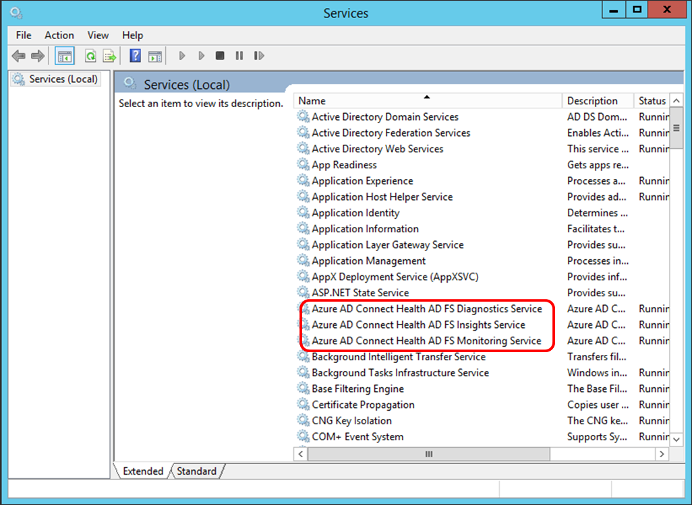

<properties 
	pageTitle="Azure AD Connect Health requirements." 
	description="This is the Azure AD Connect Health page that describes requirements and agent installation." 
	services="active-directory" 
	documentationCenter="" 
	authors="billmath" 
	manager="swadhwa" 
	editor="curtand"/>

<tags 
	ms.service="active-directory" 
	ms.workload="identity" 
	ms.tgt_pltfrm="na" 
	ms.devlang="na" 
	ms.topic="article" 
	ms.date="07/12/2015" 
	ms.author="billmath"/>

# Azure Active Directory Connect Health Requirements
The following documentation is a list of requirements that must be met before you can get going with Azure AD Connect Health.

## An Azure AD Premium License

Azure AD Connect Health is an Azure AD Premium feature and requires an Azure AD Premium license. To get a license, see Getting started with Azure AD Premium.
 

## You must be a global administrator of your Azure AD tenant.

By default, global administrators have access to the information that is provided by Azure AD Connect Health. If you are not a global administrator of your Azure AD tenant that is federated with your on-premises Active Directory, you will not be able to create a service instance of Azure AD Connect Health. Ensure that you are a global administrator. For additional information see [Administering your Azure AD directory](https://msdn.microsoft.com/library/azure/hh967611.aspx).
 

## The Azure AD Connect Health Agent installed on each targeted server

Azure AD Connect Health requires that an agent be installed on targeted servers in order to provide the data that is viewed in the Azure AD Connect Health portal. This means that in order to get data on your AD FS on-premises infrastructure, the agent must be installed on the AD FS servers.  This includes AD FS Proxy servers and Web Application Proxy servers. For information on installing the Azure AD Connect Health Agent see the Azure AD Connect Health Agent Installation Steps.

## Azure AD Connect Health Agent Requirements

The following sections describe the Azure AD Connect Health Agent specific requirements.
 

### Download the Azure AD Connect Health Agent

To get started using Azure AD Connect Health you can download the latest version of the agent here:  [Download Azure AD Connect Health Agent.](http://go.microsoft.com/fwlink/?LinkID=518973) Ensure that you’ve added the service from Marketplace before installing the agents.

 
### Outbound connectivity to the Azure service endpoints
During installation and runtime, the agent requires connectivity to the Azure AD Connect Health service end points listed below. If you block outbound connectivity make sure that the following are added to the allowed list:

- *.servicebus.windows.net - Port: 5671
- https://*.adhybridhealth.azure.com/
- https://*.table.core.windows.net/
- https://policykeyservice.dc.ad.msft.net/
- https://login.windows.net
- https://login.microsoftonline.com
- https://secure.aadcdn.microsoftonline-p.com 

## Allow the following websites if IE Enhanced Security is enabled
The following websites need to be allowed if IE Enhanced Security is enabled on the server that is going to have the agent installed.

- https://login.microsoftonline.com 
- https://secure.aadcdn.microsoftonline-p.com
- https://login.windows.net
- The federation server for your organization trusted by Azure Active Directory For example: https://sts.contoso.com 

### For AD FS, AD FS auditing must be enabled to use Usage Analytics

In order for the Usage Analytics feature to gather data and analyze the Azure AD Connect Health agent needs the information in the AD FS Audit Logs. These logs are not enabled by default. This only applies to AD FS federation servers. You do not need to enable auditing on AD FS Proxy servers or Web Application Proxy servers. Use the following procedures to enable AD FS auditing and to locate the AD FS audit logs.

#### To enable auditing for AD FS 2.0

1. Click **Start**, point to **Programs**, point to **Administrative Tools**, and then click **Local Security Policy**.
1. Navigate to the **Security Settings\Local Policies\User Rights Management** folder, and then double-click Generate security audits.
1. On the **Local Security Setting** tab, verify that the AD FS 2.0 service account is listed. If it is not present, click **Add User or Group** and add it to the list, and then click **OK**.
1. Open a command prompt with elevated privileges and run the following command to enable auditing.
 `auditpol.exe /set /subcategory:"Application Generated" /failure:enable /success:enable`
1. Close Local Security Policy, and then open the Management snap-in.  To open the Management snap-in, click **Start**, point to **Programs**, point to **Administrative Tools**, and then click AD FS 2.0 Management.
1. In the Actions pane, click Edit Federation Service Properties.
1. In the **Federation Service Properties** dialog box, click the **Events** tab.
1. Select the **Success audits** and **Failure audits** check boxes.
1. Click **OK**.

#### To enable auditing for AD FS on Windows Server 2012 R2

1. Open **Local Security Policy** by opening **Server Manager** on the Start screen, or Server Manager in the taskbar on the desktop, then click **Tools/Local Security Policy**.
1. Navigate to the **Security Settings\Local Policies\User Rights Assignment** folder, and then double-click **Generate security audits**.
1. On the **Local Security Setting** tab, verify that the AD FS service account is listed. If it is not present, click **Add User or Group** and add it to the list, and then click **OK**.
1. Open a command prompt with elevated privileges and run the following command to enable auditing:
`auditpol.exe /set /subcategory:"Application Generated" /failure:enable /success:enable.`
1. Close **Local Security Policy**, and then open the **AD FS Management** snap-in (in Server Manager, click Tools, and then select AD FS Management).
1. In the Actions pane, click **Edit Federation Service Properties**.
1. In the Federation Service Properties dialog box, click the **Events** tab.
1. Select the **Success audits and Failure audits** check boxes and then click **OK**.

#### To locate the AD FS audit logs

1. Open **Event Viewer**.</li>
1. Go to Windows Logs and select **Security**.
1. On the right, click **Filter Current Logs**.
1. Under Event Source, select **AD FS Auditing**.

> [AZURE.WARNING] If you have a group policy that is disabling AD FS auditing then the Azure AD Connect Health Agent will not be able to collect information. Ensure that you don’t have a group policy that may be disabling auditing.

### Agent installation on Windows Server 2008 R2 Servers

For Windows Server 2008 R2 servers do the following:

1. Ensure that the server is running at Service Pack 1 or higher.
1. Turn off IE ESC for agent installation:
1. Install Windows PowerShell 4.0 on each of the servers prior to installing the AD Health agent.  To install Windows PowerShell 4.0:
 - Install [Microsoft .NET Framework 4.5](https://www.microsoft.com/download/details.aspx?id=40779) using the following link to download the offline installer.
 - Install PowerShell ISE (From Windows Features)
 - Install the [Windows Management Framework 4.0.](https://www.microsoft.com/download/details.aspx?id=40855)
 - Install Internet Explorer version 10 or above on the server. This is required by the Health Service to authenticate you using your Azure Admin credentials.
1. For additional information on installing Windows PowerShell 4.0 on Windows Server 2008 R2 see the wiki article [here](http://social.technet.microsoft.com/wiki/contents/articles/20623.step-by-step-upgrading-the-powershell-version-4-on-2008-r2.aspx).

## Azure AD Connect Health Agent Deployment
This section will walk you through installing and configuring the Azure AD Connect Health Agent on your servers. Remember that before you see any data in your instance of Azure AD Connect Health, you will need to install the Azure AD Connect Health Agent on your targeted servers.  Be sure to complete the requirements above prior to installing the agent.  You can download the agent using the link above and then follow the steps below.

Double-click on the .exe file that you downloaded. On the first screen, click Install.

Once the installation is finished, click Configure Now.

This will launch a command prompt followed by some PowerShell that will execute Register-AzureADConnectHealthADFSAgent. You will be prompted to sign in to Azure. Go ahead and sign in.

After signing in, PowerShell will continue. Once it completes you can close PowerShell and the configuration is complete.

At this point, the services should be started automatically and the agent will be now monitoring and gathering data.  Be aware that you will see warnings in the PowerShell window if you have not met all of the pre-requisites that were outlined in the previous sections. The following screenshot below is an example.

To verify the agent has been installed, open services and look for the following. These services should be running if you completed the configuration. Otherwise, they will not start until the configuration is complete.

- Azure AD Connect Health AD FS Diagnostics Service
- Azure AD Connect Health AD FS Insights Service
- Azure AD Connect Health AD FS Monitoring Service
 

