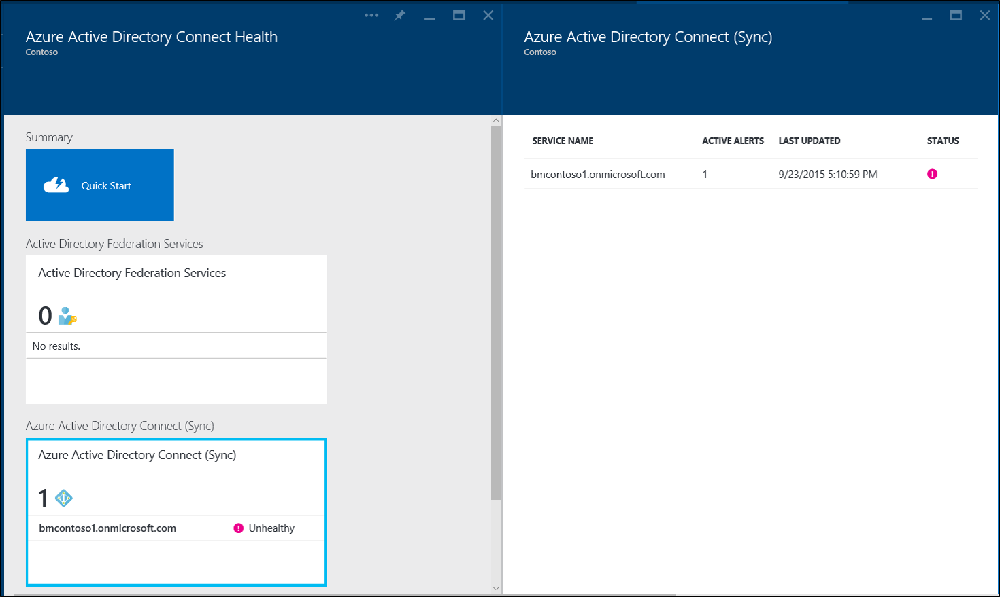
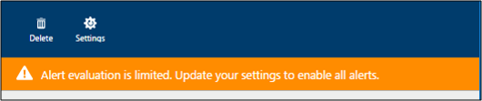
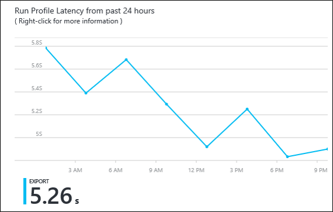
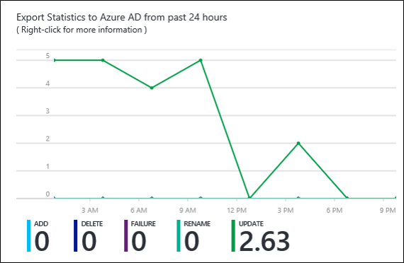

<properties
	pageTitle="Using Azure AD Connect Health with sync | Microsoft Azure"
	description="This is the Azure AD Connect Health page that will discuss how to monitor Azure AD Connect sync."
	services="active-directory"
	documentationCenter=""
	authors="billmath"
	manager="stevenpo"
	editor="curtand"/>

<tags
	ms.service="active-directory"
	ms.workload="identity"
	ms.tgt_pltfrm="na"
	ms.devlang="na"
	ms.topic="get-started-article"
	ms.date="08/08/2016"
	ms.author="billmath"/>

# Using Azure AD Connect Health for sync
The following documentation is specific to monitoring Azure AD Connect (Sync) with Azure AD Connect Health.  For information on monitoring AD FS with Azure AD Connect Health see [Using Azure AD Connect Health with AD FS](active-directory-aadconnect-health-adfs.md). Additionally, for information on monitoring Active Directory Domain Services with Azure AD Connect Health see [Using Azure AD Connect Health with AD DS](active-directory-aadconnect-health-adds.md).

## Alerts for Azure AD Connect Health for sync
The Azure AD Connect Health Alerts for sync section provides you the list of active alerts. Each alert includes relevant information, resolution steps, and links to related documentation. By selecting an active or resolved alert you will see a new blade with additional information, as well as steps you can take to resolve the alert, and links to additional documentation. You can also view historical data on alerts that were resolved in the past.

By selecting an alert you will be provided with additional information as well as steps you can take to resolve the alert and links to additional documentation.

### Limited Evaluation of Alerts
If Azure AD Connect is NOT using the default configuration (for example, if Attribute Filtering is changed from the default configuration to a custom configuration), then the Azure AD Connect Health agent will not upload the error events related to Azure AD Connect. 

This limits the evaluation of alerts by the service. You'd will see a banner that indicates this condition in the Azure Portal under your service.

You can change this by clicking "Settings" and allowing Azure AD Connect Health agent to upload all error logs.

## Sync Insight
With the latest release of Azure AD Connect Health for sync the following new capabilities have been added:

- Latency of sync operations
- Object Change trend

### Sync Latency
This feature provides a graphical trend of latency of the sync operations (import, export, etc.) for connectors.  This provides a quick and easy way to understand not only the latency of your operations (great if you have a large set of changes occurring) but also a way to detect anomalies in the latency that may require further investigation.

By default, only the latency of the 'Export' operation for the Azure AD connector is shown.  To see more operations on the connector or to view operations from other connectors, right-click on the chart and choose the specific operation and connector.

### Sync Object Changes
This feature provides a graphical trend of the number of changes that are being evaluated and exported to Azure AD.  Today, trying to gather this information from the sync logs is difficult.  The chart gives you, not only a simpler way of monitoring the number of changes that are occurring in your environment, but also a visual view of the failures that are occurring.

## Related links

* [Azure AD Connect Health](active-directory-aadconnect-health.md)
* [Azure AD Connect Health Agent Installation](active-directory-aadconnect-health-agent-install.md)
* [Azure AD Connect Health Operations](active-directory-aadconnect-health-operations.md)
* [Using Azure AD Connect Health with AD FS](active-directory-aadconnect-health-adfs.md)
* [Using Azure AD Connect Health with AD DS](active-directory-aadconnect-health-adds.md)
* [Azure AD Connect Health FAQ](active-directory-aadconnect-health-faq.md)
* [Azure AD Connect Health Version History](active-directory-aadconnect-health-version-history.md)

