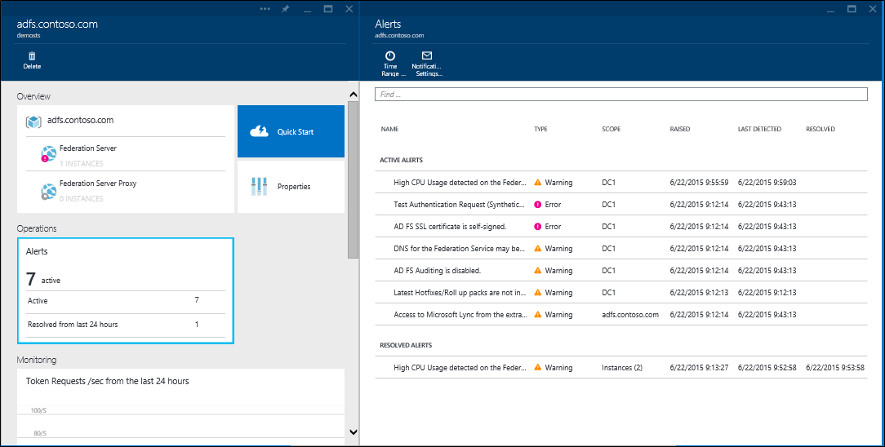

<properties 
	pageTitle="Monitor your on-premises identity infrastructure in the cloud." 
	description="This is the Azure AD Connect Health page that describes what it is and why you would use it." 
	services="active-directory" 
	documentationCenter="" 
	authors="billmath" 
	manager="swadhwa" 
	editor="curtand"/>

<tags 
	ms.service="active-directory" 
	ms.workload="identity" 
	ms.tgt_pltfrm="na" 
	ms.devlang="na" 
	ms.topic="article" 
	ms.date="07/12/2015" 
	ms.author="billmath"/>

# Monitor your on-premises identity infrastructure in the cloud

Azure AD Connect Health helps you monitor and gain insight into your on-premises identity infrastructure. It offers you the ability to view alerts, performance, usage patterns, configuration settings, enables you to maintain a reliable connection to Office 365 and much more. This is accomplished using an agent that is installed on the targeted servers.  For information on Azure AD Connect Health requirements and installation see [Azure AD Connect Health Requirements](active-directory-aadconnect-health-requirements.md).  

This information is all presented in the Azure AD Connect Health portal.  Using the Azure AD Connect Health portal you can view alerts, performance monitoring, and usage analytics.  This information is presented all in one easy to use place so that you do not have to waste time digging for the information you need.

Future updates to Azure AD Connect Health will include additional monitoring and insight into other identity components and services such as Azure AD Connect Sync services. Thus providing you a single dash board through the lens of identity, enabling you to have an even more robust, healthy, and integrated environment that your users can take advantage of to increase their ability to get things done.

## Why use Azure AD Connect Health

Integrating your on-premises directories with Azure AD makes your users more productive by providing a common identity for accessing both cloud and on-premises resources. However, with this integration comes the challenges of ensuring that this environment is healthy so that users can reliably access resources both on-premises and in cloud from any device. Azure AD Connect Health provides an easy cloud based approach to monitor and gain insights into your on-premises identity infrastructure is used to access Office 365 or other Azure AD applications. It is as simple as installing an agent on each of your on-premises identity servers. 

Azure AD Connect Health for AD FS supports AD FS 2.0 in Windows Server 2008/2008 R2, AD FS in Windows Server 2012/2012R2. These also include any AD FS Proxy or Web Application Proxy servers that provide authentication support for extranet access. Azure AD Connect Health for AD FS provides the following set of key capabilities:

- View and take action on alerts for reliable access to AD FS protected applications including Azure AD
- Email notifications for critical alerts
- View performance data to determine capacity planning
- Detailed views of your AD FS login patterns to determine anomalies or establish baselines for capacity planning

The following video will provide an overview of Azure AD Connect Health:

[AZURE.VIDEO azure-ad-connect-health--monitor-you-identity-bridge]

## Using Azure Active Directory Connect Health for the first time from the Azure Portal
To get started with Azure Active Directory Connect Health, follow the steps below. Remember that before you see any data in your instance of Azure AD Connect Health, you will need to install the Azure AD Connect Health Agent on your targeted servers. To download the Azure AD Connect Health Agent, from the first blade, select Quick Start and Get Tools. You can also download the agent directly using the link below.  To use Azure Active Directory Connect Health do the following:

1. Sign in to the [Microsoft Azure portal.](https://portal.azure.com/)
2. Azure Active Directory Connect Health can be access by going to Marketplace and searching for it or by selecting Marketplace, and selecting Security + Identity.
3. On the introductory blade (A blade is one piece of the overall view. You can think of a blade as a window or fly out), click Create. This will open another blade with your directory information.
4. On directory blade, click Create. If you do not have an Azure Active Directory Premium License you will need one to use Azure AD Connect Health. For information on Azure AD Premium see Getting started with Azure AD Premium.

## The Azure Active Directory Connect Health Portal
The Azure AD Connect Health portal allows you to view alerts, performance monitoring, and usage analytics. Upon first accessing Azure AD Connect Health you will be presented with the first blade. A blade is one piece of the overall view. You can think of a blade as a window. The first blade you see shows Quick Start, Services and Configure. Below the screenshot is a brief explanation of each of these.

- **Quick Start** – by selecting this you will open the Quick Start blade. Here you will be able to download the Azure AD Connect Health agent by choosing Get Tools, access documentation, and provide feedback.
- **Active Directory Federation Services** – this represents all of the AD FS services that Azure AD Connect Health is currently monitoring. The options that appear in this section will be discussed in the section below. See Azure Active Directory Connect Health Services.
- Configure – this allows you to turn the following on or off:
<ol>
1. Auto update to automatically update the Azure AD Connect Health agent to the latest version - This means that you will be automatically updated to the latest version of the Azure AD Connect Health Agent when they become available. This is enabled by default.
2. Allow Microsoft access to your Azure AD directory’s health data for troubleshooting purposes only - This means that if this is enabled, Microsoft will be able to see the same data that you are seeing. This can help with troubleshooting and assistance with issues. This is disabled by default.

## Azure Active Directory Connect Health Services
This section represents the active services and instances of those services that Azure AD Connect Health is monitoring. By clicking the ellipses, a blade will open up that will show all of the instances.

By selecting one of the instances, Azure AD Connect Health will open a blade with information about that services instance. Here you will find a wealth of information about your instance. This information includes an overview, properties, alerts, monitoring, and usage analytics. For information on these, see the links to the subsequent sections at the top of this page.

----------------------------------------------------------------------------------------------------------
## Download the Azure AD Connect Health Agent

To get started using Azure AD Connect Health you can download the latest version of the agent here:  [Download Azure AD Connect Health Agent.](http://go.microsoft.com/fwlink/?LinkID=518973) Ensure that you’ve added the service from Marketplace before installing the agents.

----------------------------------------------------------------------------------------------------------

## Azure Active Directory Connect Health Alerts
The Azure AD Connect Health Alerts section provides you the list of active alerts. Each alert includes relevant information, resolution steps, and links to related documentation. By selecting an active or resolved alert you will see a new blade with additional information, as well as steps you can take to resolve the alert, and links to additional documentation. You can also view historical data on alerts that were resolved in the past.

By selecting an alert you will be provided with additional information as well as steps you can take to resolve the alert and links to additional documentation.

## Azure Active Directory Connect Health Performance Monitoring
Azure AD Connect Health Performance Monitoring provides monitoring information on metrics. By selecting the Monitoring box, a blade will open up that provides detailed information on the metrics.

By selecting the Filter option at the top of the blade, you can filter by server to see an individual server’s metrics. To change metrics, simply right-click on the monitoring chart under the monitoring blade and select Edit Chart. Then, from the new blade that opens up, you can select additional metrics from the drop-down and specify a time range for viewing the performance data.

## Azure Active Directory Connect Health Usage Analytics and Reports
Azure AD Connect Health Usage Analytics analyzes the authentication traffic of your federation servers. Selecting the usage analytics box will open the usage analytics blade, which will show you the metrics and groupings.

>[AZURE.NOTE] In order to use Usage Analytics with AD FS, you must ensure that AD FS auditing is enabled. For more information, see Azure AD Connect Health Requirements. 

To select additional metrics, specify a time range, or to change the grouping, simply right-click on the usage analytics chart and select Edit Chart. Then you can specify the time range, change or select metrics and change the grouping. You can view the distribution of the authentication traffic based on different "metrics" and group each metric using relevant "group by" parameters described below.

| Metric | Group By | What the grouping means and why it's useful? |
| ------ | -------- | -------------------------------------------- |
| Total Requests: The total number of request processed by the federation service | All | This will show the count of total number of requests without grouping. |
|  | Application | This option will group the total requests based on the targeted relying party. This grouping is useful to understand which application is receiving how much percentage of the total traffic. |
|  | Server | This option will group the total requests based on the server that processed the request. This grouping is useful to understand the load distribution of the total traffic. |
|  | Workplace Join | This option will group the total requests based on if the requests are coming from devices that are workplace joined (known). This grouping is useful to understand if your resources are accessed using devices that are unknown to the identity infrastructure. |
|  | Authentication Method | This option will group the total requests based on the authentication method used for authentication. This grouping is useful to understand the common authentication method that gets used for authentication. Following are the possible authentication methods <ol> <li>Windows Integrated Authentication (Windows)</li> <li>Forms Based Authentication (Forms)</li> <li>SSO (Single Sign On)</li> <li>X509 Certificate Authentication (Certificate)</li>  Please note that a request is counted as SSO (Single Sign On) if the federation servers receive the request with an SSO Cookie. In such cases, if the cookie is valid, the user is not asked to provide credentials and gets seamless access to the application. This is common if you have multiple relying parties protected by the federation servers. |
|  | Network Location | This option will group the total requests based on the network location of the user. It can be either intranet or extranet. This grouping is useful to know what percentage of the traffic is coming from the intranet verses extranet. |
| Total Failed Requests: The total number failed requests processed by the federation service.   (This metric is only available on AD FS for Windows Server 2012 R2)| Error Type | This will show the number of errors based on predefined error types. This grouping is useful to understand the common types of errors. <ul><li>Incorrect Username or Password: Errors due to incorrect username or password.</li> <li>"Extranet Lockout": Failures due to the requests received from a user that was locked out from extranet </li><li> "Expired Password": Failures due to users logging in with an expired password.</li><li>"Disabled Account": Failures due to users logging with a disabled account.</li><li>"Device Authentication": Failures due to users failing to authenticate using Device Authentication.</li><li>"User Certificate Authentication": Failures due to users failing to authenticate because of an invalid certificate.</li><li>"MFA": Failures due to user failing to authenticate using Multi Factor Authentication.</li><li>"Other Credential": "Issuance Authorization": Failures due to authorization failures.</li><li>"Issuance Delegation": Failures due to issuance delegation errors.</li><li>"Token Acceptance": Failures due to ADFS rejecting the token from a 3rd party Identity Provider.</li><li>"Protocol": Failure due to protocol errors.</li><li>"Unknown": Catch all. Any other failures that do not fit into the defined categories.</li> |
|  | Server | This will group the errors based on the server. This is useful to understand the error distribution across servers. Uneven distribution could be an indicator of a server in a faulty state. |
|  | Network Location | This will group the errors based on the network location of the requests (intranet vs extranet). This is useful to understand the type of requests that are failing. |
|  | Application | This will group the failures based on the targeted application (relying party). This is useful to understand which targeted application is seeing most number of errors. |
| User Count: Average number of unique users active in the system | All | This provides a count of average number of users using the federation service in the selected time slice. The users are not grouped.  The average will depend on the time slice selected. |
|  | Application | This will group the average number of users based on the targeted application (relying party). This is useful to understand how many users are using which application. |

## What's Next
To get going with Azure AD Connect Health see [Azure AD Connect Health Requirements](active-directory-aadconnect-health-requirements.md).  Once you have the agent installed and are collecting data, see [Azure AD Connect Health Operations](active-directory-aadconnect-health-operations.md) for more information on configuring Azure AD Connect Health or checkout the [FAQ.](active-directory-aadconnect-health-faq.md)

**Additional Resources**

* [Azure AD Connect Health on MSDN](https://msdn.microsoft.com/library/azure/dn906722.aspx)

 