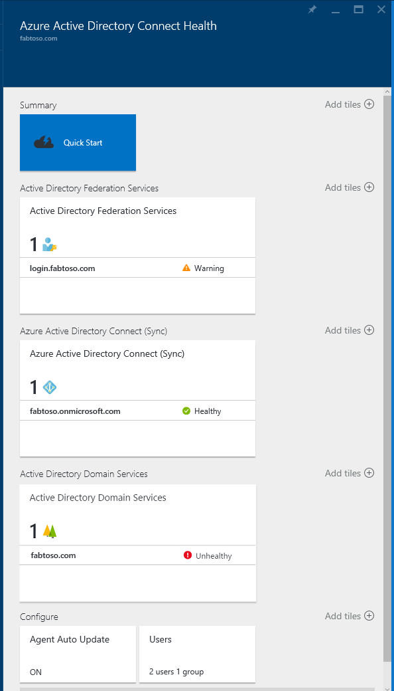

<properties
	pageTitle="Monitor your on-premises identity infrastructure in the cloud."
	description="This is the Azure AD Connect Health page that describes what it is and why you would use it."
	services="active-directory"
	documentationCenter=""
	authors="karavar"
	manager="stevenpo"
	editor="karavar"/>

<tags
	ms.service="active-directory"
	ms.workload="identity"
	ms.tgt_pltfrm="na"
	ms.devlang="na"
	ms.topic="get-started-article"
	ms.date="07/14/2016"
	ms.author="vakarand"/>

# Monitor your on-premises identity infrastructure and synchronization services in the cloud

Azure AD Connect Health helps you monitor and gain insight into your on-premises identity infrastructure and the synchronization services.  It enables you to maintain a reliable connection to Office 365 and Microsoft Online Services by providing monitoring capabilities for your key identity components such as AD FS Servers, Azure AD Connect servers (aka Sync Engine), Active Directory Domain Controllers etc. It also makes the key data points about these components easily accessible, making it easy to get usage and other important insights.

The information is presented to you in the [Azure AD Connect Health Portal](https://aka.ms/aadconnecthealth). Using the Azure AD Connect Health portal you can view alerts, performance monitoring, usage analytics and much more. Azure AD Connect Health enables the single lens of health for your key identity components, all at one place.

Future updates to Azure AD Connect Health will include additional monitoring and insight into additional identity components. Thus providing you a single dash board through the lens of identity, enabling you to have an even more robust, healthy, and integrated environment that your users can take advantage of to increase their ability to get things done.

<!-- 

 -->

## Why use Azure AD Connect Health

Integrating your on-premises directories with Azure AD makes your users more productive by providing a common identity for accessing both cloud and on-premises resources. However, with this integration comes the challenges of ensuring that this environment is healthy so that users can reliably access resources both on-premises and in cloud from any device. Azure AD Connect Health provides an easy cloud based approach to monitor and gain insights into your on-premises identity infrastructure that is used to access Office 365 or other Azure AD applications. It is as simple as installing an agent on each of your on-premises identity servers.

## [Azure AD Connect Health for AD FS](active-directory-aadconnect-health-adfs.md)

Azure AD Connect Health for AD FS supports AD FS 2.0 on Windows Server 2008 R2, AD FS in Windows Server 2012 and Windows Server 2012R2. This also includes AD FS Proxy or Web Application Proxy servers that provide authentication support for extranet access. With a very easy and low cost installation of the health agent, Azure AD Connect Health for AD FS provides the following set of key capabilities:

- Monitoring with alerts to know when AD FS and AD FS Proxy servers are not healthy
- Email notifications for critical alerts
- View trends in performance data, useful for capacity planning of AD FS
- Usage analytics for AD FS logins with different pivot (apps, users, network location etc), useful in understand how AD FS is getting utilized.
- Reports for AD FS such as Top 50 users with bad Username/Password attempts

The following video will provide an overview of Azure AD Connect Health for AD FS

>[AZURE.VIDEO azure-ad-connect-health--monitor-you-identity-bridge]

## [Azure AD Connect Health for Sync](active-directory-aadconnect-health-sync.md)

Azure AD Connect Health for Sync monitors and provides information on the synchronizations that occur between your on-premises Active Directory and Azure Active Directory. Azure AD Connect Health for Sync provides the following set of key capabilities:

- Monitoring with alerts to know when Azure AD Connect servers aka the Sync Engine is not healthy
- Email notifications for critical alerts
- Sync operational insights including latency charts for Sync Operations and trends in sync operations such as adds, updates, deletes.
- Quick glance information about sync properties, last successful export to Azure AD

The following video will provide an overview of Azure AD Connect Health for sync

>[AZURE.VIDEO azure-active-directory-connect-health-monitoring-the-sync-engine]

## [Azure AD Connect Health for AD DS (preview)](active-directory-aadconnect-health-adds.md)

Azure AD Connect Health for AD DS provides monitoring for Domain Controllers installed on Windows Server 2008 R2, Windows Server 2012 and Windows Server 2012 R2. An easy and low cost health agent installation, enables you to monitor your on-premises AD DS environenment straight from the cloud. Azure AD Connect Health for AD DS provides the following set of key capabilities:

- Monitoring alerts to detect when domain controllers are unhealthy, along with email notifications for critical alerts.
- Domain Controllers dashboard which provides a quick view into the health and operational status of your domain controllers.
- Replication Status dashboard with latest replication information, along with links to troubleshooting guides when errors are detected.
- Quick anywhere access to performance data graphs of popular performance counters, necessary for troubleshooting and monitoring purposes.

The following video will provide an overview of Azure AD Connect Health for AD DS

>[AZURE.VIDEO azure-ad-connect-health-monitors-on-premises-ad-domain-services]

## Get started with Azure AD Connect Health
It is very easy to get started with Azure AD Connect Health. Follow the steps below:

1. [Get Azure AD Premium](active-directory-get-started-premium.md) or [start a trial](https://azure.microsoft.com/trial/get-started-active-directory/)

2. [Download and Install Azure AD Connect Health agents](#download-and-install-azure-ad-connect-health-agent) on your identity servers.

3. View Azure AD Connect Health dashboard at [https://aka.ms/aadconnecthealth](https://aka.ms/aadconnecthealth)

>[AZURE.NOTE]Remember that before you see any data in your Azure AD Connect Health Dashboard, you will need to install the Azure AD Connect Health Agents on your targeted servers.

## Download and Install Azure AD Connect Health Agent

- See the [Requirements](active-directory-aadconnect-health-agent-install.md#Requirements) for Azure AD Connect Health

- To get started using Azure AD Connect Health for AD FS you can download the latest version of the agent here:  [Download Azure AD Connect Health Agent for AD FS.](http://go.microsoft.com/fwlink/?LinkID=518973)

- To get started using Azure AD Connect Health for sync, download and install the [latest version of Azure AD Connect](http://go.microsoft.com/fwlink/?linkid=615771).  The health agent will be installed as part of the Azure AD Connect installation (version 1.0.9125.0 or higher).  Azure AD Connect supports an in-place upgrade from previous versions.

- To get started using Azure AD Connect Health for AD DS you can download the latest version of the agent here:  [Download Azure AD Connect Health Agent for AD DS.](http://go.microsoft.com/fwlink/?LinkID=820540)

## Azure AD Connect Health Portal
The Azure AD Connect Health portal allows you to view alerts, performance monitoring, and usage analytics. https://aka.ms/aadconnecthealth takes you to the main blade of Azure AD Connect Health.  You can think of a blade as a window. On The main blade you see Quick Start, Services within Azure AD Connect Health and additional configuration options. Below the screenshot is a brief explanation of each of these.  After you've deployed the agents, the health service automatically identifies for the services Azure AD Connect Health is monitoring.

- **Quick Start** – by selecting this you will open the Quick Start blade. Here you will be able to download the Azure AD Connect Health agent by choosing Get Tools, access documentation, and provide feedback.

- **Active Directory Federation Services** – this represents all of the AD FS services that Azure AD Connect Health is currently monitoring. By selecting one of the instances, a blade will open with information about that services instance.  This information includes an overview, properties, alerts, monitoring, and usage analytics. Read more about the capabilities [here.](active-directory-aadconnect-health-adfs.md)

- **Azure Active Directory Connect (Sync)** – this represents your Azure AD Connect servers that Azure AD Connect Health is currently monitoring. By selecting the entry, a blade will open with information about your Azure AD Connect servers. Read more about the capabilities [here.](active-directory-aadconnect-health-sync.md)
 
- **Active Directory Domain Services** – this represents all of the AD DS forests that Azure AD Connect Health is currently monitoring. By selecting one of the forests, a blade will open with information about that forest.  This information includes an overview of essential information, Domain Controllers dashboard, Replication Status dashboard, alerts and monitoring. Read more about the capabilities [here.](active-directory-aadconnect-health-adds.md)

- **Configure** – this allows you to turn the following on or off:

	1. Auto update to automatically update the Azure AD Connect Health agent to the latest version - This means that you will be automatically updated to the latest version of the Azure AD Connect Health Agent when they become available. This is enabled by default.

	2. Allow Microsoft access to your Azure AD directory’s health data for troubleshooting purposes only - This means that if this is enabled, Microsoft will be able to see the same data that you are seeing. This can help with troubleshooting and assistance with issues. This is disabled by default.

## Related links

* [Azure AD Connect Health Agent Installation](active-directory-aadconnect-health-agent-install.md)
* [Azure AD Connect Health Operations](active-directory-aadconnect-health-operations.md)
* [Using Azure AD Connect Health with AD FS](active-directory-aadconnect-health-adfs.md)
* [Using Azure AD Connect Health for Sync](active-directory-aadconnect-health-sync.md)
* [Using Azure AD Connect Health with AD DS](active-directory-aadconnect-health-adds.md)
* [Azure AD Connect Health FAQ](active-directory-aadconnect-health-faq.md)
* [Azure AD Connect Health Version History](active-directory-aadconnect-health-version-history.md)
