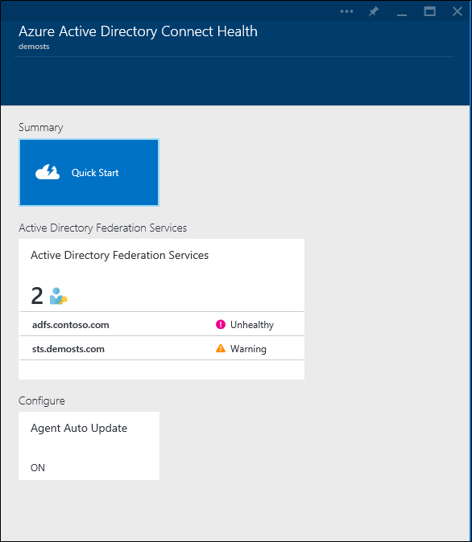

<properties
	pageTitle="Monitor your on-premises identity infrastructure in the cloud."
	description="This is the Azure AD Connect Health page that describes what it is and why you would use it."
	services="active-directory"
	documentationCenter=""
	authors="billmath"
	manager="stevenpo"
	editor="curtand"/>

<tags
	ms.service="active-directory"
	ms.workload="identity"
	ms.tgt_pltfrm="na"
	ms.devlang="na"
	ms.topic="get-started-article"
	ms.date="10/15/2015"
	ms.author="billmath"/>

# Monitor your on-premises identity infrastructure and synchronization services in the cloud

Azure AD Connect Health helps you monitor and gain insight into your on-premises identity infrastructure and the synchronization services available through Azure AD Connect.  It offers you the ability to view alerts, performance, usage patterns, configuration settings, enables you to maintain a reliable connection to Office 365 and much more. This is accomplished using an agent that is installed on the targeted servers.  

This information is all presented in the Azure AD Connect Health portal.  Using the Azure AD Connect Health portal you can view alerts, performance monitoring, and usage analytics.  This information is presented all in one easy to use place so that you do not have to waste time digging for the information you need.

Future updates to Azure AD Connect Health will include additional monitoring and insight into other identity components. Thus providing you a single dash board through the lens of identity, enabling you to have an even more robust, healthy, and integrated environment that your users can take advantage of to increase their ability to get things done.

## Why use Azure AD Connect Health

Integrating your on-premises directories with Azure AD makes your users more productive by providing a common identity for accessing both cloud and on-premises resources. However, with this integration comes the challenges of ensuring that this environment is healthy so that users can reliably access resources both on-premises and in cloud from any device. Azure AD Connect Health provides an easy cloud based approach to monitor and gain insights into your on-premises identity infrastructure is used to access Office 365 or other Azure AD applications. It is as simple as installing an agent on each of your on-premises identity servers. 

Azure AD Connect Health for AD FS supports AD FS 2.0 in Windows Server 2008/2008 R2, AD FS in Windows Server 2012/2012R2. These also include any AD FS Proxy or Web Application Proxy servers that provide authentication support for extranet access. Azure AD Connect Health for AD FS provides the following set of key capabilities:

- View and take action on alerts for reliable access to AD FS protected applications including Azure AD
- Email notifications for critical alerts
- View performance data to determine capacity planning
- Detailed views of your AD FS login patterns to determine anomalies or establish baselines for capacity planning

Azure AD Connect Health for Sync monitors and provides information on the synchronizations that occur between your on-premises Active Directory and Azure Active Directory. Azure AD Connect Health for Sync provides the following set of key capabilities:

- View and take action on alerts to ensure reliable synchronizations between your on-premises infrastructure and Azure Active Directory.
- Email notifications for critical alerts
- View performance data

The following video will provide an overview of Azure AD Connect Health:

[AZURE.VIDEO azure-ad-connect-health--monitor-you-identity-bridge]

## Get started in the Azure Portal
To get started with Azure Active Directory Connect Health, follow the steps below. 

1. Sign in to the [Microsoft Azure portal.](https://portal.azure.com/)
2. Azure Active Directory Connect Health can be access by going to Marketplace and searching for it or by selecting Marketplace, and selecting Security + Identity.
3. On the introductory blade (A blade is one piece of the overall view. You can think of a blade as a window or fly out), click **Create**. This will open another blade with your directory information.
4. On directory blade, click **Create**. If you do not have an Azure Active Directory Premium License you will need one to use Azure AD Connect Health. For information on Azure AD Premium see Getting started with Azure AD Premium.

>[AZURE.NOTE]Remember that before you see any data in your instance of Azure AD Connect Health, you will need to install the Azure AD Connect Health Agent on your targeted servers. To download the Azure AD Connect Health Agent, from the first blade, select Quick Start and Get Tools. You can also download the agent directly using the [link](#download-the-agent) below.  To use Azure Active Directory Connect Health do the following:

### The Azure AD Connect Health Portal and Services
The Azure AD Connect Health portal allows you to view alerts, performance monitoring, and usage analytics. Upon first accessing Azure AD Connect Health you will be presented with the first blade.  You can think of a blade as a window. The first blade you see shows Quick Start, Services and Configure. Below the screenshot is a brief explanation of each of these.  The services section shows the active services and instances of those services that Azure AD Connect Health is monitoring. 

- **Quick Start** – by selecting this you will open the Quick Start blade. Here you will be able to download the Azure AD Connect Health agent by choosing Get Tools, access documentation, and provide feedback.
- **Active Directory Federation Services** – this represents all of the AD FS services that Azure AD Connect Health is currently monitoring. By selecting one of the instances, a blade will open with information about that services instance.  This information includes an overview, properties, alerts, monitoring, and usage analytics. 
- Configure – this allows you to turn the following on or off:
<ol>
1. Auto update to automatically update the Azure AD Connect Health agent to the latest version - This means that you will be automatically updated to the latest version of the Azure AD Connect Health Agent when they become available. This is enabled by default.
2. Allow Microsoft access to your Azure AD directory’s health data for troubleshooting purposes only - This means that if this is enabled, Microsoft will be able to see the same data that you are seeing. This can help with troubleshooting and assistance with issues. This is disabled by default.

## Requirements
The following table is a list of requirements that must be met before you can get going with Azure AD Connect Health.

| Requirement | Description|
| ----------- | ---------- |
|Azure AD Premium| Azure AD Connect Health is an Azure AD Premium feature and requires Azure AD Premium.   For more information see [Getting started with Azure AD Premium](active-directory-get-started-premium.md).  To start a free 30 day trial see [Start a trial.](https://azure.microsoft.com/trial/get-started-active-directory/)|.
|You must be a global administrator of your Azure AD to enable (create) Azure AD Connect Health|By default, only the global administrators can enable (create), access all the information and perform all the operations within Azure AD Connect Health. For additional information see [Administering your Azure AD directory](active-directory-administer.md).    Using Role Based Access Control you can allow access to Azure AD Connect Health to other users in your organization. For more information see [Role Based Access Control for Azure AD Connect Health.](active-directory-aadconnect-health-operations.md#manage-access-with-role-based-access-control)   **Important:** The account you use when installing the agents must be a work or organizational account and cannot be a Microsoft account. For more information see [Sign up for Azure as an organization](sign-up-organization.md)|
|For AD FS, AD FS auditing must be enabled to use Usage Analytics| If you plan on using Usage Analytics with AD FS, then AD FS auditing must be enabled.    See [Enable Auditing for AD FS.](active-directory-aadconnect-health-agent-install-adfs.md#enable-auditing-for-ad-fs)
|Meet the Azure AD Connect Health Agent Requirements|See the table below for agent specific requirements.

The following table is a list of agent requirements that must be met before you can get going with Azure AD Connect Health.

| Requirement | Description|
| ----------- | ---------- |
|The Azure AD Connect Health Agent installed on each targeted server| Azure AD Connect Health requires that an agent be installed on targeted servers in order to provide the data that is viewed in the portal.   For example, in order to get data on your AD FS on-premises infrastructure, the agent must be installed on the AD FS servers.  This includes AD FS Proxy servers and Web Application Proxy servers.     For information on installing the agent see the [Azure AD Connect Health Agent Installation](active-directory-aadconnect-health-agent-install.md).  **Important:** The account you use when installing the agents must be a work or organizational account and cannot be a Microsoft account.   For more information see [Sign up for Azure as an organization](sign-up-organization.md)|
|Azure AD Connect Health Agent for Sync| This agent is installed automatically with the latest version of Azure AD Connect.    If you are just starting out then you do not need to do anything else.  The Agent will be installed when you install Azure AD Connect.   If you already have Azure AD Connect installed, you will need to upgrade to the latest version which can be downloaded [here](http://www.microsoft.com/download/details.aspx?id=47594).
|Outbound connectivity to the Azure service endpoints|During installation and runtime, the agent requires connectivity to the Azure AD Connect Health service end points listed below. If you block outbound connectivity make sure that the following are added to the allowed list:   <li>**new**: &#42;.blob.core.windows.net </li><li>**new**: &#42;.queue.core.windows.net</li><li>&#42;.servicebus.windows.net - Port: 5671</li><li>https://&#42;.adhybridhealth.azure.com/</li><li>https://&#42;.table.core.windows.net/</li><li>https://policykeyservice.dc.ad.msft.net/</li><li>https://login.windows.net</li><li>https://login.microsoftonline.com</li><li>https://secure.aadcdn.microsoftonline-p.com</li> |
|Firewall ports on the server running the agent.| The agent requires the following firewall ports to be open in order for the agent to communicate with the Azure AD Health service endpoints.  <li>TCP/UDP port 80</li><li>TCP/UDP port 443</li><li>TCP/UDP port 5671</li>
|Allow the following websites if IE Enhanced Security is enabled|The following websites need to be allowed if IE Enhanced Security is enabled on the server that is going to have the agent installed.  <li>https://login.microsoftonline.com</li><li>https://secure.aadcdn.microsoftonline-p.com</li><li>https://login.windows.net</li><li>The federation server for your organization trusted by Azure Active Directory For example: https://sts.contoso.com</li>

## Download the Agent

To get started using Azure AD Connect Health you can download the latest version of the agent here:  [Download Azure AD Connect Health Agent.](http://go.microsoft.com/fwlink/?LinkID=518973) Ensure that you’ve added the service from Marketplace before installing the agents.

## Related links

* [Azure AD Connect Health Agent Installation](active-directory-aadconnect-health-agent-install.md)
* [Azure AD Connect Health Operations](active-directory-aadconnect-health-operations.md)
* [Using Azure AD Connect Health with AD FS](active-directory-aadconnect-health-adfs.md)
* [Using Azure AD Connect Health for Sync](active-directory-aadconnect-health-sync.md)
* [Azure AD Connect Health FAQ](active-directory-aadconnect-health-faq.md)
