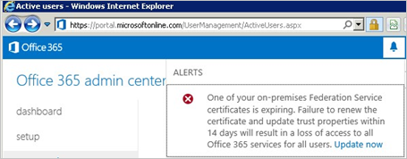

<properties
	pageTitle="Certificate renewal guidance for Office 365 and Azure AD users. | Microsoft Azure"
	description="This article explains to Office 365 users how to resolve issues with emails that notify them about renewing a certificate."
	services="active-directory"
	documentationCenter=""
	authors="billmath"
	manager="stevenpo"
	editor="curtand"/>

<tags
	ms.service="active-directory"
	ms.workload="identity"
	ms.tgt_pltfrm="na"
	ms.devlang="na"
	ms.topic="article"
	ms.date="05/19/2016"
	ms.author="billmath"/>

#Managing Federation Certificates for Office 365 and Azure AD

##Overview

In order for successful federation between Azure AD and AD FS, the certificates used by AD FS to sign security tokens to Azure AD should match what is configured in Azure AD. Any mismatch can lead to the trust between AD FS and AAD be broken. Azure AD ensures that this information is kept in sync when deploying AD FS and Web Application Proxy (for extranet access). 

This article provides you additional information to manage your token signing certificates and keep them in sync with Azure AD in the cases of: 

* You are not deploying the Web Application Proxy and therefore the federation metadata is not available in extranet
* You are not using the default configuration of AD FS for token signing certificates
* You are using a third party identity provider

## How does default configuration of AD FS for token signing certificates work?

The token signing and token decrypting certificates are usually self-signed certificates and are good for one year. Default configuration of the AD FS regarding token signing and token decrypting certificates includes an auto-renewal process called **AutoCertificateRollover**. If you are using AD FS 2.0 or later, Office 365 and Azure AD will automatically update your certificate before it expires. 

### Renewal notification - O365 portal and email notification

>[AZURE.NOTE] If you received an email or a portal notification asking you to renew your certificate for Office you can follow the steps mentioned below in [Managing changes to token signing certificates](#managecerts) to check if you need to take any action. Microsoft is aware of a possible issue that can lead to notifications being given to user for certificate renewal even when no action is required.

Azure AD attempts to monitor the federation metadata and update the token signing certificates as indicated by the federation metadata. 30 days before the expiry of the token signing certificates, Azure AD will check if new certificates are available by polling the federation metadata.

* If it can successfully poll the federation metadata and retrieve the new certificates, then there is no email notification or O365 portal warning given to the user
* If it cannot retrieve the new token signing certificates, either because the federation metdata is not reachable or automatic certificate rollover is not enabled - then it will issue an email notification and an warning would be shown in the O365 portal

>[AZURE.IMPORTANT] If you are using AD FS, to ensure business continuity, please verify that your servers have the following patches so that authentication failures for known issues are not experienced.  This will mitigate known AD FS proxy server issues for this renewal and future renewal periods:
Server 2012 R2 - [Windows Server May 2014 rollup](http://support.microsoft.com/kb/2955164)
>
>Server 2008 R2 and 2012 - [Authentication through proxy fails in Windows Server 2012 or Windows 2008 R2 SP1](http://support.microsoft.com/kb/3094446)

## How to check if the certificates need update? 

### Step 1: Check AutoCertificateRollover state

On your AD FS Server, open Microsoft Powershell.  Check that AutoCertRollover value is set to TRUE

	Get-Adfsproperties

### Step 2: Confirm that AD FS and Azure AD are in sync

On your AD FS Server, Open the Azure Powershell prompt and connect to Azure AD.

>[AZURE.NOTE] You can download Azure Powershell if not already installed from [here](https://azure.microsoft.com/en-us/downloads/).

	Connect-MsolService

Check the certificates configured in AD FS and Azure AD trust properties for the specified domain.

	Get-MsolFederationProperty -DomainName <domain.name> | FL Source, TokenSigningCertificate

If the thumbprints in both the outputs match, then it confirms that your certificates are in sync with Azure AD.

### Step 3: Check if your certificate is about to expire

In the output of either Get-MsolFederationProperty or Get-AdfsCertificate check for the date against "Not after". If the date is less than 30 days away, then you need to take action.

### Next Step

| AutoCertificateRollover | Certificates in sync with Azure AD | Federation Metadata is publically accessible | Validity | Action |
|:-----------------------:|:-----------------------:|:-----------------------:|:-----------------------:|:-----------------------:|
| X | X | X | - | No Action needed. See [Renew token signing certificate automatically](#autorenew) |
| X |   | - | Less than 15 days | Renew immediately. See [Renew token signing certifcate manually](#manualrenew) |
|  | - | Less than 30 days | - | Renew immediately. See [Renew token signing certifcate manually](#manualrenew) |

\[X]  True  \[-]  Does not matter  \[ ]  False

## Renew token signing certificate automatically (Recommended) 

If you have deployed Web Application Proxy which can enable acecess to the federation metadata from extranet and you are using AD FS default configuration, i.e. AutoCertificateRollover is enabled, then **you do not need to perform any manual steps.**  Check the following to confirm that automatic update of the certificate can happen:

**#1 The AD FS property AutoCertificateRollover must be set to True**

This indicates that AD FS will automatically generate new token signing and token decryption certificates before the old ones expire.

_How to check if AutoCertificateRollover is enabled:_

Verify that your AD FS installation is using automatic certificate rollover by executing the following command in a PowerShell command window on your primary federation server:

	PS C:\> Get-ADFSProperties

[Azure.Note] If you are using AD FS 2.0, you will need to run Add-Pssnapin Microsoft.Adfs.Powershell first.

In the resulting output, check for the following setting:
	
	AutoCertificateRollover :True

**#2 The AD FS federation metadata is publicly accessible**

Check that your federation metadata is publicly accessible by navigating to the following URL from a computer on the public internet (off of the corporate network):

https://(your_FS_name)/federationmetadata/2007-06/federationmetadata.xml

where `(your_FS_name) `is replaced with the federation service host name your organization uses, such as fs.contoso.com.  If you are able to verify both of these settings successfully, you do not have to do anything else.  

Example: https://fs.contoso.com/federationmetadata/2007-06/federationmetadata.xml 

## Renew token signing certifcate manually 

You may chose to renew the token signing certificates manually. Some of the common scenarios where you might want to update the token signing certificates manually are:
* Token signing certificates are not self signed certitifcates. The most common reason for this is that your organization manages AD FS certificates enrolled from an organizational certificate authority. 
* Network security does not allow the federation metadata to be publically available.

In these scenarios, everytime you update the token signing certificates, you must update your Office 365 domain using the PowerShell command Update-MsolFederatedDomain also. 

### Steps to renew the token signing certificate and update O365 federation trust

**Step 1: Ensure that AD FS has new token signing certificates**

### Non-default configuration
If you are in a non-default configuration of AD FS where **AutoCertificateRollover** is set to **False** then you are probably using custom certificates (not self-signed). Please read [Guidance for customers not using AD FS self-signed certificates](https://msdn.microsoft.com/library/azure/JJ933264.aspx#BKMK_NotADFSCert) for comprehensive guidance on how to renew the AD FS token signing certificates.

### Federation metadata is not publicly available
On the other hand if **AutoCertificateRollover** is set to **True** but your federation metadata is not publicly accessible, then first make sure that new token signing certificates have been generated by AD FS. Follow the below steps to confirm you have new token signing certificates

1. verify that you are logged on to the primary AD FS server.
2. Check the current signing certificates in AD FS by opening a PowerShell command window and running the following command:

	PS C:\>Get-ADFSCertificate –CertificateType token-signing

[Azure.Note] If you are using AD FS 2.0, you will need to run Add-Pssnapin Microsoft.Adfs.Powershell first.

3. Look at the command output at any certificates listed.  If AD FS has generated a new certificate, you should see two certificates in the output:  One for which the IsPrimary value is True and the NotAfter date is within 5 days, and one for which IsPrimary is False and NotAfter is about a year in the future.

4. If you only see one certificate, and the NotAfter date is within 5 days, you need to generate a new certificate by executing the following steps.

5. To generate a new certificate, execute the following command at a PowerShell command prompt: `PS C:\>Update-ADFSCertificate –CertificateType token-signing`.

6. Verify the update by running the following command again: PS C:\>Get-ADFSCertificate –CertificateType token-signing

Two certificates should be listed now, one of which has a NotAfter date of approximately one year in the future and for which the IsPrimary value is False.

**Step 2: Update the new toke signing certificates for the O365 trust**

Follow the steps given below to update O365 with the new token signing certificates to be used for the trust.

1.	Open the Microsoft Azure Active Directory Module for Windows PowerShell.
2.	Run $cred=Get-Credential. When this cmdlet prompts you for credentials, type your cloud service administrator account credentials.
3.	Run Connect-MsolService –Credential $cred. This cmdlet connects you to the cloud service. Creating a context that connects you to the cloud service is required before running any of the additional cmdlets installed by the tool.
4.	If you are running these commands on a computer that is not the AD FS primary federation server, run Set-MSOLAdfscontext -Computer <AD FS primary server>, where <AD FS primary server> is the internal FQDN name of the primary AD FS server. This cmdlet creates a context that connects you to AD FS.
5.	Run Update-MSOLFederatedDomain –DomainName <domain>. This cmdlet updates the settings from AD FS into the cloud service and configures the trust relationship between the two.

>[AZURE.NOTE] If you need to support multiple top-level domains, such as contoso.com and fabrikam.com, you must use the SupportMultipleDomain switch with any cmdlets. For more information, see [Support for Multiple Top Level Domains](active-directory-aadconnect-multiple-domains.md).
Finally, ensure all Web Application Proxy servers are updated with [Windows Server May 2014](http://support.microsoft.com/kb/2955164) rollup, otherwise the proxies may fail to update themselves with the new certificate, resulting in an outage.

## Repair Azure AD trust using AAD Connect 

If you had installed you configured your AD FS farm / Azure AD trust using Azure AD Connect, then you can use Azure AD Connect to detect if any action is needed to be taken for your token signing certificates. If you need to renew the certificates, you can use Azure AD Connect to do the needful with a few simple click.

For more information, read [Repairing the trust](./active-directory-aadconnect-federation-management.md#repairing-the-trust)

