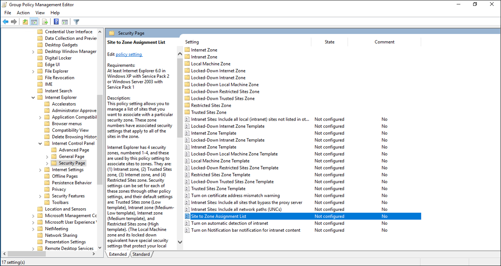

# What is Single Sign On (SSO) (preview)
Single sign on is an option that can be enabled in Azure Active Directory Connect with either [password hash synchronization](active-directory-aadconnectsync-implement-password-synchronization.md) or [pass-through authentication](active-directory-aadconnect-pass-through-authentication.md).  When enabled, users need not type their password to sign in to Azure Active Directory (Azure AD) or other cloud services when they are on their corporate machines and connected on the corporate network.  

By enabling single sign-on, when your users access resources connected to Azure Active Directory services (such as Office 365, Microsoft Intune, CRM Online, and SaaS services), user don’t need to type their password but instead use a Kerberos ticket acquired automatically from your on-premises Active Directory.

By providing your end users with SSO, access to cloud based services is more familiar and provides the organization with a secure and simple process that doesn’t require any additional on-premises components.

SSO is a feature that is enabled through AAD Connect and works with password hash sync or pass-through authentication and your on-premises Active Directory.  For your end users to use single sign on in your environment, you need to ensure that users are:

- On a domain joined machine
- Have a direct connection to a domain controller, for example on the corporate wired or wireless network or via a remote access connection such as a VPN connection.
- Define the Kerberos end-points in the cloud as part of the intranet zone.

If any of the above items are missing, for example the machine is off the corporate network, Active Directory is not available then the user will simply be prompted to enter their password as they would without single sign on.

## Supported Clients
Single sign on is supported via web browser based clients and Office clients that support modern authentication, on machines that are capable of Kerberos authentication such as (Windows desktops).  The matrix below provides details of the browser based clients on various operating systems.

| OS\Browser |Internet Explorer|Chrome|Firefox|Edge
| --- | --- |--- | --- |--- |
|Windows 10|Yes|Yes|Yes*|No
|Windows 8.1|Yes|Yes|Yes*|N/A
|Windows 8|Yes|Yes|Yes*|N/A
|Windows 7|Yes|Yes|Yes*|N/A
|Mac|N/A|N/A|N/A|N/A

*Requires separate configuration.

>[!NOTE]
>For Windows 10 based clients the recommendation is to use [Azure AD join](active-directory-azureadjoin-overview.md) for the best experience with Azure AD. 

## How single sign on works

When you enable single sign on in Azure AD Connect, a computer account named AZUREADSSOACCT is created in the on-premises Active Directory and the Kerberos key decryption key is shared with Azure AD.  In addition, two Kerberos service principal names (SPNs) are created to represent the cloud URLs that are used in communications with the client.  

Once this setup is complete, the process of authentication is the same as any other Integrated Windows Authentication (IWA) based application.  If you are familiar with how IWA works, then you already know how single sign on works with Azure AD.  If you’re not familiar, the process for IWA is as follows.

First the user attempts to access a resource.  A resource and be either a machine or a URL.  In the case of Azure AD, it is URL for a service such as SharePoint online, described below as the “Azure AD resource”.

1.	The Azure AD resource challenges the client, via a 401, to provide a Kerberos ticket.
2.	The client requests a ticket from Active Directory for the Azure AD resource. 
3.	Active Directory locates the machine account associated with the Azure AD resource and returns a Kerberos ticket to the client, encrypted with the machines secret. The ticket includes the identity of the user currently signed into the computer.
4.	The client sends the Kerberos ticket it acquired from Active Directory to the Azure AD.

Azure AD decrypts the Kerberos ticket using the previously shared key, and then either returns a token to the user or asks the user to provide additional proofs such as multi-factor authentication as required by the resource.
Single sign on is an opportunistic feature, meaning that should if fail for some reason the user simply need only enter their password in the login page.

## Enabling SSO with PTA or PHS
Azure AD Connect provides a simple process to enable single sign on with pass-through authentication or Password hash sync.  You will need to ensure that you have domain administrator rights to one of the domains within each forest you synchronize allow the configuration of the Kerberos service principal names (SPNs) on the machine account.  The username and password are not stored in Azure AD Connect or Azure AD and are used only for this operation.

When installing Azure AD Connect select a custom installation so that you are able to configure single sign on, on the user sign-in page. For more details, see [Custom installation of Azure AD Connect](connect\active-directory-aadconnect-get-started-custom.md).

Once single sign on is enabled you can continue through the wizard until you get to the Single sign on page.

For each forest listed provide the appropriate account details and single sign on will be enabled for your Azure directory.

## Ensuring Clients sign-in automatically
By default, browsers do not attempt to send credentials to web servers unless the URL is defined as being in the intranet zone.  Generally, the browser can calculate the right zone by looking at the URL.  For example if the URL is http://intranet/ the browser will automatically send credentials as it will map the URL to the intranet zone.  However, if the URL contains a period for example http://intranet.contoso.com/ the server will not automatically send credentials and will treat the URL as it would any internet site.

Because the URLs used for single sign on in Azure AD contain a period, they need to be the intranet zone, so that the browser will automatically send the currently logged in users credential in the form of a Kerberos ticket to Azure AD.  The easiest way to add the required URLs to the intranet zone is to simply create a group policy in Active Directory.

1.	Open the Group Policy Management tools
2.	Edit the Group policy that will be applied to all users.  For example, the Default Domain Policy.
3.	Navigate to **User Configuration\Administrative Templates\Windows Components\Internet Explorer\Internet Control Panel\Security Page** and select **Site to Zone Assignment List**.
  
4.	Enable the policy, and enter the following values/data in the dialog box. 
    	
		Value: https://autologon.microsoftazuread-sso.com
    	Data: 1
    	Value: https://aadg.windows.net.nsatc.net 
    	Data: 1'
5.	It should look similar to the following:

6.	Click Ok and Ok again.

Your users are now ready for single sign on.

>[!NOTE]
>By default, Chrome will use the same set of trusted site URLs as Internet Explorer.  If you have configured different settings for Chrome you will need to update these separately.

## Troubleshooting single sign on issues
It is important to make sure the client is correctly configured for single sign on including the following:

1.	Both https://autologon.microsoftazuread-sso.com and https://aadg.windows.net.nsatc.net are defined within the Intranet zone.  
2.	Ensure the workstation is joined to the domain.
3.	Ensure the user is logged on with a domain account.
4.	Ensure the machine is connected to the corporate network
5.	Ensure that the machines time is synchronized with the active directory and the domain controllers time is within 5 minutes of the correct time.

If you have been able to confirm the above requirements you can review the console logs of the browser for additional information.  The console logs can be found under developer tools.  This will help you determine the potential problem.

## Event log entries
Every time a user logs in with single sign on an entry is recorded in the event log of the domain controller, if success auditing is enabled.  To find these events, you can review the Event logs for the security Event 4769 associated with computer account AzureADSSOAcc$.  The filter below finds all security events associated with the computer account:

	<QueryList>
	  <Query Id="0" Path="Security">
	<Select Path="Security">*[EventData[Data[@Name='ServiceName'] and (Data='AZUREADSSOACC$')]]</Select>
	  </Query>
	</QueryList>

