<properties
    pageTitle="Azure AD Connect: Supported topologies | Microsoft Azure"
    description="This topic details supported and unsupported topologies for Azure AD Connect"
    services="active-directory"
    documentationCenter=""
    authors="AndKjell"
    manager="stevenpo"
    editor=""/>
<tags
    ms.service="active-directory"
    ms.devlang="na"
    ms.tgt_pltfrm="na"
    ms.workload="identity"
	ms.topic="article"
    ms.date="06/27/2016"
    ms.author="andkjell"/>

# Topologies for Azure AD Connect

The objective of this topic is to describe different on-premises and Azure AD topologies with Azure AD Connect sync as the key integration solution. It describes both supported and unsupported configurations.

Legend for pictures in the document:

Description | Icon
-----|-----
On-premises Active Directory forest| 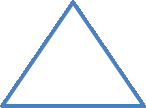
Active Directory with filtered import| 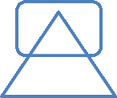
Azure AD Connect sync server| 
Azure AD Connect sync server “Staging mode”| 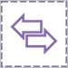
GALSync with FIM2010 or MIM2016| 
Azure AD Connect sync server, detailed| 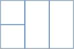
Azure AD directory |
Unsupported scenario | 

## Single forest, single Azure AD directory
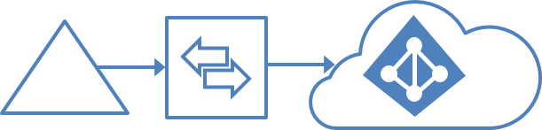

The most common topology is a single forest on-premises, with one or multiple domains, and a single Azure AD directory (a.k.a. tenant). For Azure AD authentication, password synchronization is used. The express installation of Azure AD Connect supports only this topology.

### Single forest, multiple sync servers to one Azure AD directory
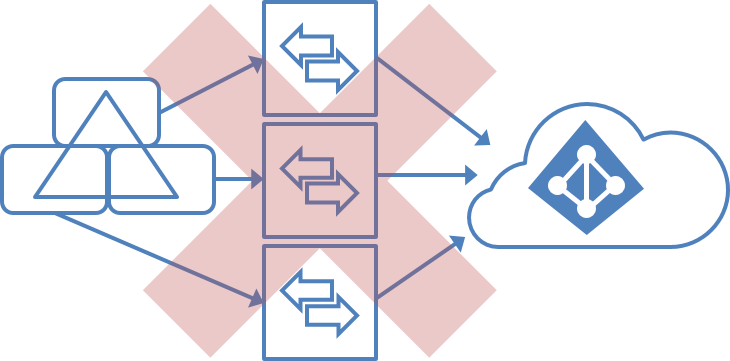

It is not supported to have multiple Azure AD Connect sync servers connected to the same Azure AD directory, except for a [staging server](#staging-server). It is unsupported even if these are configured to synchronize mutually exclusive set of objects. You might have considered this if you cannot reach all domains in the forest from a single server or to distribute load across several server.

## Multiple forests, single Azure AD directory
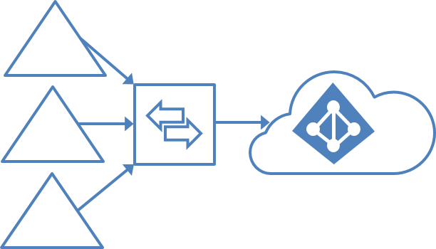

Many organizations have environments with multiple on-premises Active Directory forests. There are various reasons for having more than one on-premises Active Directory forest. Typical examples are designs with account-resource forests and as a result after a merger or acquisition.

When you have multiple forests, all forests must be reachable by single Azure AD Connect sync server. You do not have to join the server to a domain. The server can be placed in a network DMZ if necessary to reach all forest.

The Azure AD Connect installation wizard offers several options to consolidate users represented in multiple forests. The goal is that a user is only represented once in Azure AD. There are some common topologies you can configure in the custom installation path in the installation wizard. Select the corresponding option representing your topology on the page **Uniquely identifying your users**. The consolidation is only configured for users. Duplicated groups are not consolidated with the default configuration.

Common topologies are discussed in the next section: [Separate topologies](#multiple-forests-separate-topologies), [Full mesh](#multiple-forests-full-mesh-with-optional-galsync), and [Account-Resource](#multiple-forests-account-resource-forest).

The default configuration in Azure AD Connect sync assumes:

1. Users have only one enabled account and the forest where this account is located is used to authenticate the user. This assumption is for both password sync and for federation. UserPrincipalName and sourceAnchor/immutableID come from this forest.
2. Users have only one mailbox.
3. The forest that hosts the mailbox for a user has the best data quality for attributes visible in the Exchange Global Address List (GAL). If there is no mailbox on the user, then any forest can be used to contribute these attribute values.
4. If you have a linked mailbox, then there is also another account in different forest used for login.

If your environment does not match these assumptions, the following happens:

- If you have more than one active account or more than one mailbox, the sync engine picks one and ignore the other.
- A linked mailbox with no other active account is not exported to Azure AD. The user account is not represented as a member in any group. A linked mailbox in DirSync would always be represented as a normal mailbox so this change is intentionally a different behavior to better support multi-forest scenarios.

More details can be found in [understanding the detault configuation](active-directory-aadconnectsync-understanding-default-configuration.md).

### Multiple forests, multiple sync servers to one Azure AD directory
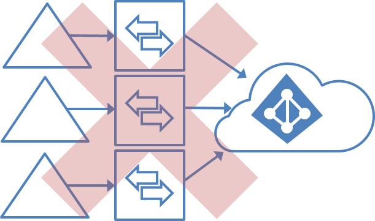

It is not supported to have more than one Azure AD Connect Sync server connected to a single Azure AD directory. The exception is the use of a [staging server](#staging-server).

### Multiple forests – separate topologies
**Users are represented only once across all directories**

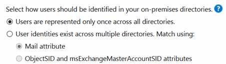

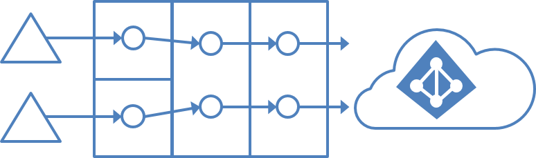

In this environment, all forests on-premises are treated as separate entities and no user would be present in any other forest.
Each forest has its own Exchange organization and there is no GALSync between the forests. This topology could be the situation after a merger/acquisition or in an organization where each business unit is operating isolated from each other. These forests are in the same organization in Azure AD and appear with a unified GAL.
In this picture, each object in every forest is represented once in the metaverse and aggregated in the target Azure AD directory.

### Multiple forests – match users
**User identities exist across multiple directories**

Common for all these scenarios is that distribution and security groups can contain a mix of users, contacts, and FSPs (Foreign Security Principals)

FSPs are used in ADDS to represent members from other forests in a security group. All FSPs are resolved to the real object in Azure AD.

### Multiple forests – full mesh with optional GALSync
**User identities exist across multiple directories. Match using: Mail attribute**

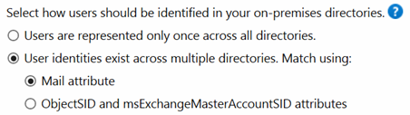

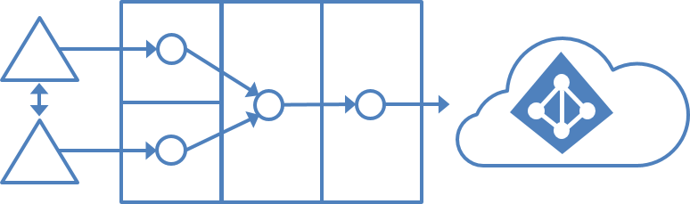

A full mesh topology allows users and resources to be located in any forest and commonly there would be two-way trusts between the forests.

If Exchange is present in more than one forest, there could optionally be an on-premises GALSync solution. Every user would be represented as a contact in all other forests. GALSync is commonly implemented using Forefront Identity Manager 2010 or Microsoft Identity Manager 2016. Azure AD Connect cannot be used for on-premises GALSync.

In this scenario, identity objects are joined using the mail attribute. A user with a mailbox in one forest is joined with the contacts in the other forests.

### Multiple Forests – Account-Resource Forest
**User identities exist across multiple directories. Match using: ObjectSID and msExchMasterAccountSID attributes**

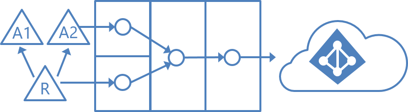

In an account-resource forest topology, you have one or more account forests with active user accounts. You will also have one or more resource forests with disabled accounts.

In this scenario one (or more) **resource forest** trusts all **account forests**. The resource forest has typically an extended AD schema with Exchange and Lync. All Exchange and Lync services as well as other shared services are located in this forest. Users have a disabled user account in this forest and the mailbox is linked to the account forest.

## Office 365 and topology considerations
Some Office 365 workloads have certain restrictions to supported topologies. If you plan to use any of these, then read the supported topologies topic for the workload.

Workload |  
--------- | ---------
Exchange Online | If there is more than one Exchange organization on-premises (i.e. Exchange has been deployed to more than one forest) then you must use Exchange 2013 SP1 or later. Details can be found here: [Hybrid deployments with multiple Active Directory forests](https://technet.microsoft.com/library/jj873754.aspx)
Skype for Business | When using multiple forests on-premises then only the account-resource forest topology is supported. Details for supported topologies can be found here: [Environmental requirements for Skype for Business Server 2015](https://technet.microsoft.com/library/dn933910.aspx)

## Staging server
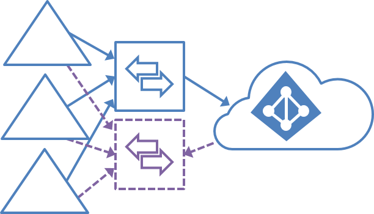

Azure AD Connect supports installing a second server in **Staging mode**. A server in this mode reads data from all connected directories but will not write anything. It is using the normal synchronization cycle and therefore has an updated copy of the identity data. In a disaster where the primary server fails you can fail over to the staging server. You do this in the Azure AD Connect wizard. This second server can preferably be located in a different datacenter since no infrastructure is shared with the primary server. You must manually copy any configuration change made on the primary server to the second server.

A staging server can also be used to test a new custom configuration and the effect it has on your data. You can preview the changes and adjust the configuration. When you are happy with the new configuration, you can make the staging server the active server and set the old active server in staging mode.

This method can also be used to replace the active sync server. Prepare the new server and set it in staging mode. Make sure it is in good state, disable staging mode (making it active), and shut down the currently active server.

It is possible to have more than one staging server when you want to have multiple backups in different data centers.

## Multiple Azure AD directories
Microsoft recommends having a single directory in Azure AD for an organization.
Before you plan to use multiple Azure AD directories, these topics cover common scenarios allowing you to use a single directory.

Topic |  
--------- | ---------
Delegation using administrative units | [Administrative units management in Azure AD ](active-directory-administrative-units-management.md)

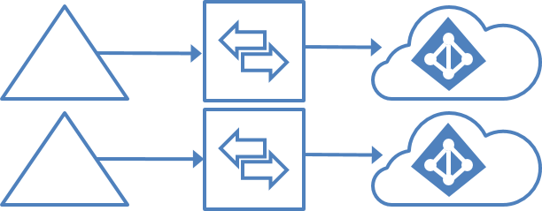

There is a 1:1 relationship between an Azure AD Connect sync server and an Azure AD directory. For each Azure AD directory, you need one Azure AD Connect sync server installation. The Azure AD directory instances are by design isolated and users in one cannot see users in the other directory. If this separation is intended, then this is a supported configuration, but otherwise you should use the single Azure AD directory model.

### Each object only once in an Azure AD directory
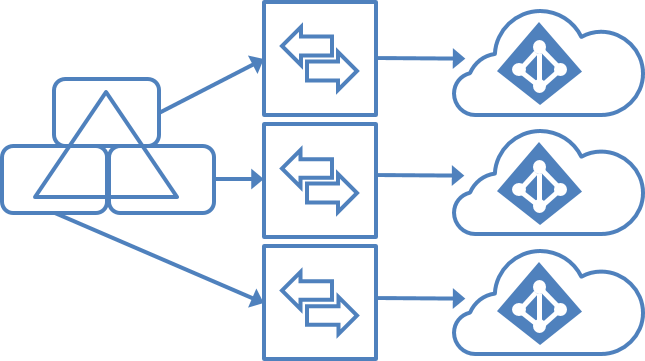

In this topology, one Azure AD Connect sync server is connected to each Azure AD directory. The Azure AD Connect sync servers must be configured for filtering so each have a mutually exclusive set of objects to operate on. You can for example scope each server to a particular domain or OU. A DNS domain can only be registered in a single Azure AD directory. The UPNs of the users in the on-premises AD must use separate namespaces as well. For example, in the picture above three separate UPN suffixes are registered in the on-premises AD: contoso.com, fabrikam.com, and wingtiptoys.com. The users in each on-premises AD domain use a different namespace.

There is no GALsync between the Azure AD directory instances. The address book in Exchange Online and Skype for Business only shows users in the same directory.

This topology has the following restrictions to otherwise supported scenarios:

- Only one of the Azure AD directories can enable Exchange hybrid with the on-premises Active Directory.
- Windows 10 devices can only be associated with one Azure AD directory.

The requirement for mutually exclusive set of objects also applies to writeback. Some writeback features are not supported with this topology since these features assume a single configuration on-premises:

-	Group writeback with default configuration
-	Device writeback

### Each object multiple times in an Azure AD directory
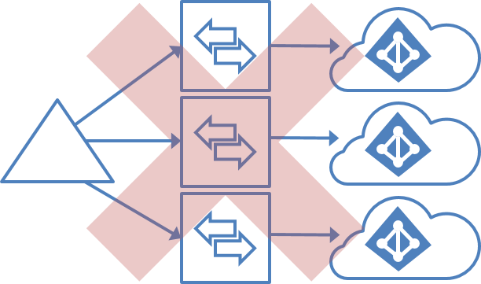 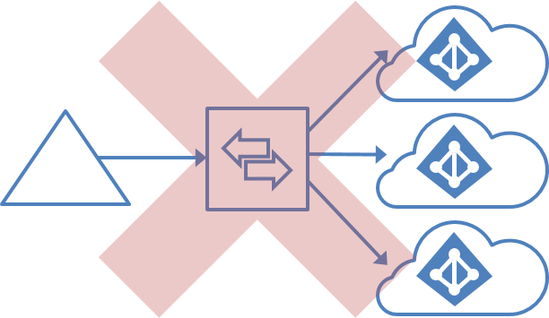

- It is unsupported to sync the same user to multiple Azure AD directories.
- It is unsupported to make a configuration change to make users in one Azure AD appear as contacts in another Azure AD directory.
- It is unsupported to modify Azure AD Connect sync to connect to multiple Azure AD directories.

### GALsync by using writeback
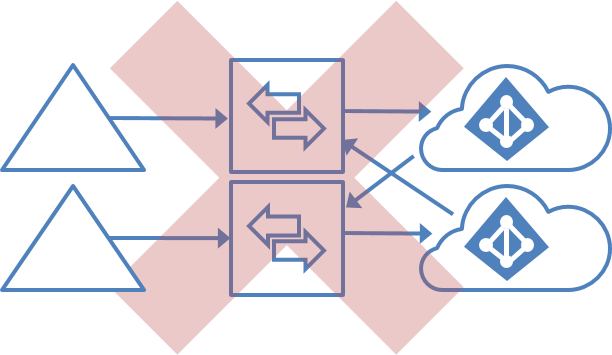 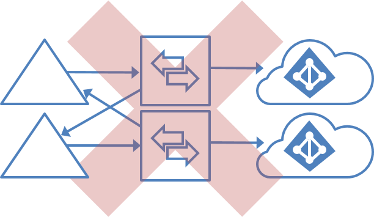

Azure AD directories are by design isolated.

- It is unsupported to change the configuration of Azure AD Connect sync to read data from another Azure AD directory.
- It is unsupported to export users as contacts to another on-premises AD using Azure AD Connect sync.

### GALsync with on-premises sync server
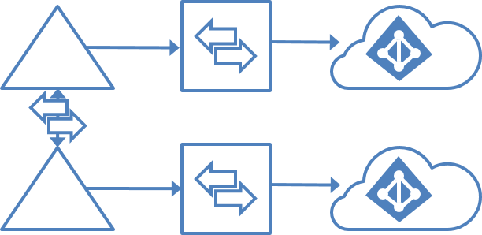

It is supported to use FIM2010/MIM2016 on-premises to GALsync users between two Exchange organizations. The users in one organization shows up as foreign users/contacts in the other organization. These different on-premises ADs can then be synchronized to their own Azure AD directories.

## Next steps
To learn how to install Azure AD Connect for these scenarios, see [Custom installation of Azure AD Connect](active-directory-aadconnect-get-started-custom.md).

Learn more about the [Azure AD Connect sync](active-directory-aadconnectsync-whatis.md) configuration.

Learn more about [Integrating your on-premises identities with Azure Active Directory](active-directory-aadconnect.md).
