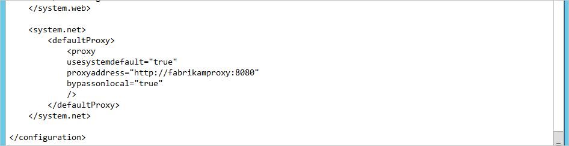
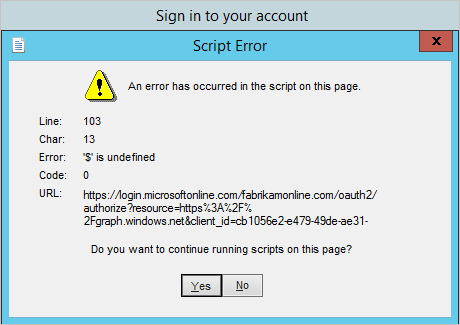

<properties
	pageTitle="Azure AD Connect: Troubleshoot connectivity issues | Microsoft Azure"
	description="Explains how to troubleshoot connectivity issues with Azure AD Connect."
	services="active-directory"
	documentationCenter=""
	authors="andkjell"
	manager="stevenpo"
	editor=""/>

<tags
	ms.service="active-directory"
	ms.workload="identity"
	ms.tgt_pltfrm="na"
	ms.devlang="na"
	ms.topic="article"
	ms.date="06/27/2016"
	ms.author="andkjell"/>

# Troubleshoot connectivity issues with Azure AD Connect
This article explains how connectivity between Azure AD Connect and Azure AD works and how to troubleshoot connectivity issues. These issues are most likely to be seen in an environment with a proxy server.

## Troubleshoot connectivity issues in the installation wizard
Azure AD Connect is using Modern Authentication (using the ADAL library) for authentication. The installation wizard and the sync engine proper require machine.config to be properly configured since these are .NET applications.

In this article we will show how Fabrikam connects to Azure AD through its proxy. The proxy server is named fabrikamproxy and is using port 8080.

First we need to make sure [**machine.config**](active-directory-aadconnect-prerequisites.md#connectivity) is correctly configured.  

>[AZURE.NOTE]
In some non-Microsoft blogs it is documented that changes should be made to miiserver.exe.config instead. However, this file is overwritten on every upgrade so even if it works during initial install, the system will stop working on first upgrade. For that reason the recommendation is to update machine.config instead.

The proxy server must also have the required URLs opened. The official list is documented in [Office 365 URLs and IP address ranges ](https://support.office.com/article/Office-365-URLs-and-IP-address-ranges-8548a211-3fe7-47cb-abb1-355ea5aa88a2).

Of these, the following table is the absolute bare minimum to be able to connect to Azure AD at all. This list does not include any optional features, such as password writeback, or Azure AD Connect Health. It is documented here to help in troubleshooting for the initial configuration.

URL | Port | Description
---- | ---- | ----
mscrl.microsoft.com | HTTP/80 | Used to download CRL lists.
\*.verisign.com | HTTP/80 | Used to download CRL lists.
\*.entrust.com | HTTP/80 | Used to download CRL lists for MFA.
\*.windows.net | HTTPS/443 | Used to sign in to Azure AD.
secure.aadcdn.microsoftonline-p.com | HTTPS/443 | Used for MFA.
\*.microsoftonline.com | HTTPS/443 | Used to configure your Azure AD directory and import/export data.

## Errors in the wizard
The installation wizard is using two different security contexts. On the page **Connect to Azure AD** it is using the currently signed in user. On the page **Configure** it is changing to the [account running the service for the sync engine](active-directory-aadconnect-accounts-permissions.md#azure-ad-connect-sync-service-accounts). The proxy configurations we make are global to the machine so if there is an issue, the issue will most likely appear already at the **Connect to Azure AD** page in the wizard.

These are the most common errors you will see in the installation wizard.

### The installation wizard has not been correctly configured
This error will appear when the wizard itself cannot reach the proxy.

- If you see this, verify the [machine.config](active-directory-aadconnect-prerequisites.md#connectivity) has been correctly configured.
- If that looks correct, follow the steps in [Verify proxy connectivity](#verify-proxy-connectivity) to see if the issue is present outside the wizard as well.

### The MFA endpoint cannot be reached
This error will appear if the endpoint **https://secure.aadcdn.microsoftonline-p.com** cannot be reached and your global admin has MFA enabled.  

- If you see this, verify that the endpoint secure.aadcdn.microsoftonline-p.com has been added to the proxy.

### The password cannot be verified
If the installation wizard is successful in connecting to Azure AD, but the password itself cannot be verified you will see this:

- Is the password a temporary password and must be changed? Is it actually the correct password? Try to sign in to https://login.microsoftonline.com (on another computer than the Azure AD Connect server) and verify the account is usable.

### Verify proxy connectivity
To verify if the Azure AD Connect server has actual connectivity with the Proxy and Internet we will use some PowerShell to see if the proxy is allowing web requests or not. In a PowerShell prompt, run `Invoke-WebRequest -Uri https://adminwebservice.microsoftonline.com/ProvisioningService.svc`. (Technically the first call is to https://login.microsoftonline.com and this will work as well, but the other URI is faster to respond.)

PowerShell will use the configuration in machine.config to contact the proxy. The settings in winhttp/netsh should not impact these cmdlets.

If the proxy is correctly configured, you should get a success status:

If you receive **Unable to connect to the remote server** then PowerShell is trying to make a direct call without using the proxy or DNS is not correctly configured. Make sure the **machine.config** file is correctly configured.

If the proxy is not correctly configured, we will get an error:

Error | Error Text | Comment
---- | ---- | ---- |
403 | Forbidden | The proxy has not been opened for the requested URL. Revisit the proxy configuration and make sure the [URLs](https://support.office.com/article/Office-365-URLs-and-IP-address-ranges-8548a211-3fe7-47cb-abb1-355ea5aa88a2) have been opened.
407 | Proxy Authentication Required | The proxy server required sign in and none was provided. If your proxy server requires authentication, make sure to have this configured in the machine.config. Also make sure you are using domain accounts for the user running the wizard as well as for the service account.

## The communication pattern between Azure AD Connect and Azure AD
If you have followed all these steps above and still cannot connect you might at this point start looking at network logs. This section is documenting a normal and successful connectivity pattern. It is also listing common red herrings which can be ignored if you are reading the network logs.

- There will be calls to https://dc.services.visualstudio.com. It is not required to have this open in the proxy for the installation to succeed and these can be ignored.
- You will see that dns resolution will list the actual hosts to be in the DNS name space nsatc.net and other namespaces not under microsoftonline.com. However, there will not be any web service requests on the actual server names and you do not have to add these to the proxy.
- The endpoints adminwebservice and provisioningapi (see below in the logs) are discovery endpoints and used to find the actual endpoint to use and will be differed depending on your region.

### Reference proxy logs
Here is a dump from an actual proxy log and the installation wizard page from where it was taken (duplicate entries to the same endpoint have been removed). This can be used as a reference for your own proxy and network logs. The actual endpoints might be different in your environment (in particular those in *italic*).

**Connect to Azure AD**

Time | URL
--- | ---
1/11/2016 8:31 | connect://login.microsoftonline.com:443
1/11/2016 8:31 | connect://adminwebservice.microsoftonline.com:443
1/11/2016 8:32 | connect://*bba800-anchor*.microsoftonline.com:443
1/11/2016 8:32 | connect://login.microsoftonline.com:443
1/11/2016 8:33 | connect://provisioningapi.microsoftonline.com:443
1/11/2016 8:33 | connect://*bwsc02-relay*.microsoftonline.com:443

**Configure**

Time | URL
--- | ---
1/11/2016 8:43 | connect://login.microsoftonline.com:443
1/11/2016 8:43 | connect://*bba800-anchor*.microsoftonline.com:443
1/11/2016 8:43 | connect://login.microsoftonline.com:443
1/11/2016 8:44 | connect://adminwebservice.microsoftonline.com:443
1/11/2016 8:44 | connect://*bba900-anchor*.microsoftonline.com:443
1/11/2016 8:44 | connect://login.microsoftonline.com:443
1/11/2016 8:44 | connect://adminwebservice.microsoftonline.com:443
1/11/2016 8:44 | connect://*bba800-anchor*.microsoftonline.com:443
1/11/2016 8:44 | connect://login.microsoftonline.com:443
1/11/2016 8:46 | connect://provisioningapi.microsoftonline.com:443
1/11/2016 8:46 | connect://*bwsc02-relay*.microsoftonline.com:443

**Initial Sync**

Time | URL
--- | ---
1/11/2016 8:48 | connect://login.windows.net:443
1/11/2016 8:49 | connect://adminwebservice.microsoftonline.com:443
1/11/2016 8:49 | connect://*bba900-anchor*.microsoftonline.com:443
1/11/2016 8:49 | connect://*bba800-anchor*.microsoftonline.com:443

## Authentication errors
This section covers errors which can be returned from ADAL (the authentication library used by Azure AD Connect) and PowerShell. The error explained should help you in understand your next steps.

### Invalid Grant
Invalid username or password. See [The password cannot be verified](#the-password-cannot-be-verified) for more information.

### Unknown User Type
Your Azure AD directory cannot be found or resolved. Maybe you try to login with a username in an unverified domain?

### User Realm Discovery Failed
Network or proxy configuration issues. The network cannot be reached, see [Troubleshoot connectivity issues in the installation wizard](#troubleshoot-connectivity-issues-in-the-installation-wizard).

### User Password Expired
Your credentials have expired. Change your password.

### AuthorizationFailure
Unknown issue.

### Authentication Cancelled
The multi-factor authentication (MFA) challenge was cancelled.

### ConnectToMSOnline
Authentication was successful, but Azure AD PowerShell has an authentication problem.

### AzureRoleMissing
Authentication was successful. You are not a global administrator.

### PrivilegedIdentityManagement
Authentication was successful. Privileged identity management has been enabled and you are currently not a global administrator. See [Privileged Identity Management](active-directory-privileged-identity-management-getting-started.md) for more information.

### CompanyInfoUnavailable
Authentication was successful. Could not retrieve company information from Azure AD.

### RetrieveDomains
Authentication was successful. Could not retrieve domain information from Azure AD.

## Troubleshooting steps for previous releases.
With releases starting with build number 1.1.105.0 (released February 2016) the sign-in assistant was retired. This section and the configuration should no longer be required, but is kept as reference.

For the single-sign in assistant to work, winhttp must be configured. This can be done with [**netsh**](active-directory-aadconnect-prerequisites.md#connectivity).  

### The Sign-in assistant has not been correctly configured
This error appear when the Sign-in assistant cannot reach the proxy or the proxy is not allowing the request.

- If you see this, look at the proxy configuration in [netsh](active-directory-aadconnect-prerequisites.md#connectivity) and verify it is correct.

- If that looks correct, follow the steps in [Verify proxy connectivity](#verify-proxy-connectivity) to see if the issue is present outside the wizard as well.

## Next steps
Learn more about [Integrating your on-premises identities with Azure Active Directory](active-directory-aadconnect.md).
