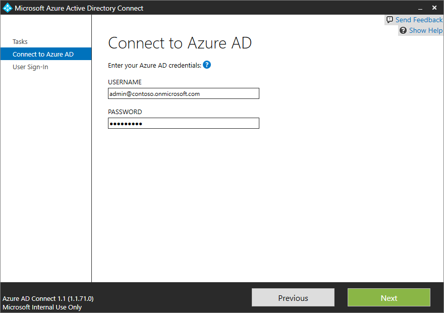
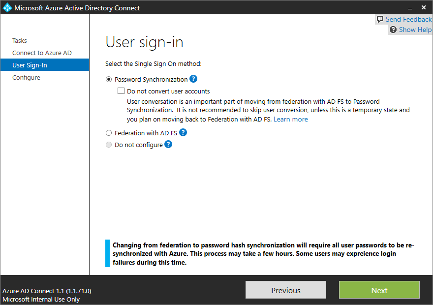

<properties
	pageTitle="Azure AD Connect: User Sign In | Microsoft Azure"
	description="Azure AD Connect user sign in for custom settings."
	services="active-directory"
	documentationCenter=""
	authors="billmath"
	manager="stevenpo"
	editor="curtand"/>

<tags
	ms.service="active-directory"
	ms.workload="identity"
	ms.tgt_pltfrm="na"
	ms.devlang="na"
	ms.topic="article"
	ms.date="08/05/2016"
	ms.author="billmath"/>

# Azure AD Connect User Sign on options

Azure AD Connect allows your users to sign on to both cloud and on-premises resources using the same passwords.  You can choose from several different ways to enable this.

## Choosing a user sign-in method
For most organizations who just want to enable user sign on to Office 365, SaaS applications and other Azure AD based resources, the default Password synchronization option is recommended.
Some organizations, however, have particular reasons for using a federated sign on option such as AD FS.  These include:

- Your organization already has AD FS or a 3rd party federation provider deployed
- Your security policy prohibits synchronizing password hashes to the cloud
- You require that users experience seamless SSO (without additional password prompts) when accessing cloud resources from domain joined machines on the corporate network
- You require some specific capabilities AD FS has
	- On-premises multi-factor authentication using a third party provider or smart cards (learn about third party MFA providers for AD FS in Windows Server 2012 R2)
	- Active Directory integration features such as soft account lockout or AD password and work hours policy
	- Conditional access to both on-premises and cloud resources using device registration, Azure AD join, or Intune MDM policies

### Password synchronization
With password synchronization, hashes of user passwords are synchronized from your on-premises Active Directory to Azure AD.  When passwords are changed or reset on premises, the new passwords are synchronized immediately to Azure AD so that your users can always use the same password for cloud resources as they do on-premises.  The passwords are never sent to Azure AD nor stored in Azure AD in clear text.
Password synchronization can be used together with password write-back to enable self service password reset in Azure AD.

[More information about password synchronization](active-directory-aadconnectsync-implement-password-synchronization.md)

### Federation using a new or existing AD FS in Windows Server 2012 R2 farm
With federated sign on, your users can sign on to Azure AD based services with their on-premises passwords and, while on the corporate network, without having to enter their passwords again.  The federation option with AD FS allows you to deploy a new or specify an existing AD FS in Windows Server 2012 R2 farm.  If you choose to specify an existing farm, Azure AD Connect will configure the trust between your farm and Azure AD so that your users can sign on.

#### To deploy Federation with AD FS in Windows Server 2012 R2, you will need the following

If you are deploying a new farm:

- A Windows Server 2012 R2 server for the federation server.
- A Windows Server 2012 R2 server for the Web Application Proxy.
- a .pfx file with one SSL certificate for your intended federation service name, such as fs.contoso.com.

If you are deploying a new farm or using an existing farm:

- Local administrator credentials on your federation servers.
- Local administrator credentials on any workgroup (non-domain joined) servers on which you intend to deploy the Web Application Proxy role.
- The machine on which you execute the wizard must be able to connect to any other machines on which you want to install AD FS or Web Application Proxy via Windows Remote Management.

#### Sign on using an earlier version of AD FS or a third party solution

If you have already configured cloud sign on using an earlier version of AD FS (such as AD FS 2.0) or a third party federation provider, you can choose to skip user sign in configuration via Azure AD Connect.  This will enable you to get the latest synchronization and other capabilities of Azure AD Connect while still using your existing solution for sign on.

## User sign-in and user principal name (UPN)

### Understanding user principal name

In Active Directory, the default UPN suffix is the DNS name of the domain in which user account created. In most cases, this is the domain name registered as the enterprise domain on the Internet. However, you can add more UPN suffixes using Active Directory Domains and Trusts.

The UPN of the user is of the format username@domai. For example, for an active directory contoso.com user John might have UPN john@contoso.com. The UPN of the user is based on RFC 822. Although UPN and email share the same format, the value of UPN for a user may or may not be equal to the email address of the user.

### User principal name in Azure AD

Azure AD Connect wizard will use the userPrincipalName attribute or let you specify the attribute (in custom install) to be used from on-premises as the user principal name in Azure AD. This is the value that will be used for signing in to Azure AD. If the value of the user principal name attribute does not correspond to a verified domain in Azure AD, then Azure AD will replace it with a default .onmicrosoft.com value.

Every directory in Azure Active Directory comes with a built-in domain name in the form contoso.onmicrosoft.com that lets you get started using Azure or other Microsoft services. You can improve and simplify sign-in experience using custom domains. For information on custom domain names in Azure AD and how to verify a domain, please read [Add your custom domain name to Azure Active Directory](active-directory-add-domain.md#add-your-custom-domain-name-to-azure-active-directory)

## Azure AD sign-in configuration

### Azure AD sign-in configuration with Azure AD Connect
Azure AD sign-in experience is dependent on whether Azure AD is able to match the user principal name suffix of a user being synced to one of the custom domains verified in the Azure AD directory. Azure AD Connect provides help while configuring Azure AD sign-in settings, so that user sign-in experience in cloud is similar to the on-premises experience. Azure AD Connect lists the UPN suffixes defined for the domain(s) and tries to match them with a custom domain in Azure AD and helps you with the appropriate action that needs to be taken.
The Azure AD sign-in page lists out the UPN suffixes defined for the on-premises Active Directory and displays the corresponding status against each suffix. The status values can be one of the below:

* Verified : Azure AD Connect could find a matching verified domain in Azure AD and no action is needed
* Not verified : Azure AD Connect could find a matching custom domain in Azure AD but it is not verified. User should verify the custom domain in order to ensure that the UPN suffix of the users is not changed to default .onmicrosoft.com suffix after sync.
* Not added : Azure AD Connect could not find a custom domain corresponding to the UPN suffix. User must add and verify a custom domain corresponding to the UPN suffix in order to ensure that the UPN suffix of the user is not changed to default .onmicrosoft.com suffix after sync.

Azure AD sign-in page lists the  UPN suffix(s) defined for the on-premises Active Directory and the corresponding custom domain in Azure AD with the current verification status. In custom installation, you can now select the attribute for user principal name on the **Azure AD sign-in** page.

You can click on the refresh button to re-fetch the latest status of the custom domains from Azure AD.

###Selecting attribute for user principal name in Azure AD

UserPrincipalName - The attribute userPrincipalName is the attribute users will use when they sign-in to Azure AD and Office 365. The domains used, also known as the UPN-suffix, should be verified in Azure AD before the users are synchronized. It is strongly recommended to keep the default attribute userPrincipalName. If this attribute is non-routable and cannot be verified then it is possible to select another attribute, for example email, as the attribute holding the sign-in ID. This is known as Alternate ID. The Alternate ID attribute value must follow the RFC822 standard. An Alternate ID can be used with both password Single Sign-On (SSO) and federation SSO as the sign-in solution.

>[AZURE.NOTE] Using an Alternate ID is not compatible with all Office 365 workloads. For more information, please refer to [Configuring Alternate Login ID](https://technet.microsoft.com/library/dn659436.aspx).

#### Different custom domain states and effect on Azure sign-in experience
It is very important to understand the relationship between the custom domain states in your Azure AD directory and the UPN suffixes defined on-premises. Let us go through the different possible Azure sign-in experiences when you are setting up sycnhronization using Azure AD Connnect.

For the information below, let us assume that we are concerned with the UPN suffix contoso.com which is used in the on-premises directory as part of UPN, for example user@contoso.com.

###### Express Settings / Password Synchronization
| State         | Effect on user Azure sign-in experience |
|:-------------:|:----------------------------------------|
| Not added | In this case no custom domain for contoso.com has been added in Azure AD directory. Users who have UPN on-premises with suffix @contoso.com, will not be able to use their on-premises UPN to sign-in to Azure. They will instead have to use a new UPN provided to them by Azure AD by adding the suffix for default Azure AD directory. For example, if you are syncing users to Azure AD directory azurecontoso.onmicrosoft.com then the on-premises user user@contoso.com will be given a UPN of user@azurecontoso.onmicrosoft.com|
| Not verified | In this case we have a custom domain contoso.com added in Azure AD directory, however it is not yet verified. If you go ahead with syncing users without verifying the domain, then the users will be assigned a new UPN by Azure AD just like it did in the 'Not added' scenario.|
| Verified | In this case we have a custom domain contoso.com already added and verified in Azure AD for the UPN suffix. Users will be able to use their on-premises user principal name, e.g. user@contoso.com, to sign-in to Azure after they are synced to Azure AD|

###### AD FS Federation
You cannot create a federation with the default .onmicrosoft.com domain in Azure AD, or an unverified custom domain in Azure AD. When you are running the Azure AD Connect wizard, if you select an unverified domain to create a federation with then Azure AD Connect will prompt you with necessary records to be created where your DNS is hosted for the domain. For more information see [here](active-directory-aadconnect-get-started-custom.md#verify-the-azure-ad-domain-selected-for-federation).

If you selected User sign-in option as "Federation with AD FS", then you must have a custom domain to continue with creating a federation in Azure AD. For our discussion, this means that we should have a custom domain contoso.com added in Azure AD directory.

| State         | Effect on user Azure sign-in experience |
|:-------------:|:----------------------------------------|
| Not added | In this case Azure AD Connect could not find a matching custom domain for the UPN suffix contoso.com in Azure AD directory. You need to add a custom domain contoso.com if you need users to sign-in using AD FS with their on-premises UPN like user@contoso.com.|
| Not verified | In this case Azure AD Connect will prompt you with appropriate details on how you can verify your domain at a later stage|
| Verified | In this case you can go ahead with the configuration without any further action|  

## Changing user sign-in method

You can change the user sign-in method from Federation to Password Sync using the tasks avaialble in Azure AD Connect after the initial configuration of Azure AD Connect using the wizard. Run the Azure AD Connect wizard again and you will be presented with a list of tasks that you can perform. Select **Change user sign-in** from the list of tasks. 

On the next page, you will be asked to provide the credentials for Azure AD.

On the **User sign-in** page, select **Password Synchronization**. This will change the directory from federated to a managed one.

>[AZURE.NOTE] If you are making only a temporary switch to password synchronization, then check the **Do not convert user accounts**. Not checking on the option will lead to conversion of each user to federated and it can take several hours.
  
## Next steps
Learn more about [Integrating your on-premises identities with Azure Active Directory](active-directory-aadconnect.md).

Learn more about [Azure AD Connect: Design concepts](active-directory-aadconnect-design-concepts.md)

