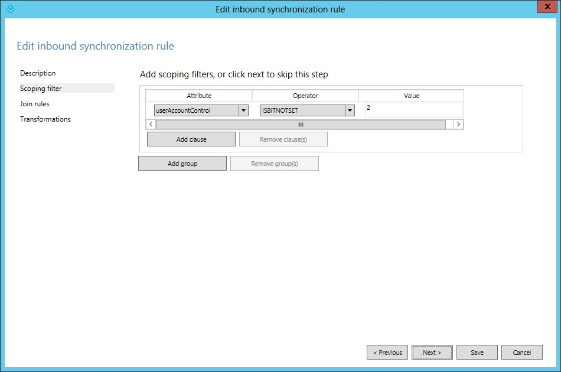
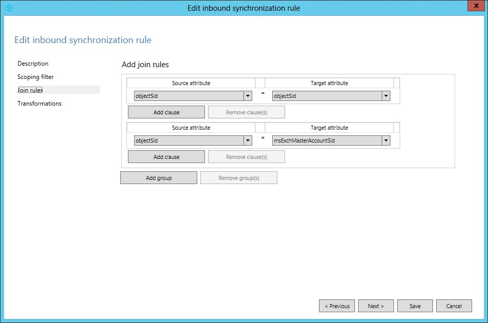
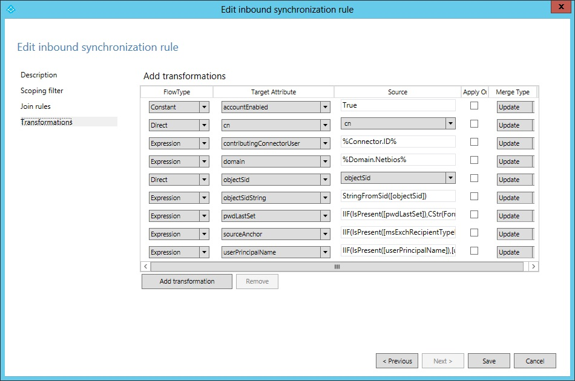

<properties 
	pageTitle="Using the Azure AD Connect Synchronization Rules Editor" 
	description="Learn how to use the Azure AD Connect Synchronization Rules Editor." 
	services="active-directory" 
	documentationCenter="" 
	authors="billmath" 
	manager="swadhwa" 
	editor="curtand"/>

<tags 
	ms.service="active-directory" 
	ms.workload="identity" 
	ms.tgt_pltfrm="na" 
	ms.devlang="na" 
	ms.topic="article" 
	ms.date="05/28/2015" 
	ms.author="billmath"/>

# Azure AD Connect Synchronization rules editor

## Using the synchronization rules editor

In Azure AD Connect, you can configure and fine-tune the object and attribute flow between Azure AD and your on-premises directories by configuring synchronization rules.  

A Synchronization Rule is a configuration object with a set of attributes flowing when a condition is satisfied. It is also used to describe how an object in a connector space is related to an object in the metaverse, known as join or match. The Synchronization Rules have a precedence indicating how they relate to each other. A Synchronization Rule with a lower numeric value in precedence has a higher precedence and in case of an attribute flow conflict, higher precedence will win the conflict resolution.Synchronization rules can be configured using the Synchronization Rules Editor.  

As an example we will look at the Synchronization Rule “In from AD – User AccountEnabled”. We will mark this line in the SRE and select Edit.A Synchronization Rule has four configuration sections: Description, Scoping filter, Join rules, and Transformations.

### Description
The first section provides basic information such as a name and description.

We also find information about which connected system this rule is related to, which object type in the connected system it applies to, and the metaverse object type. The metaverse object type is always person regardless if the source object type is a user, iNetOrgPerson, or contact. The metaverse object type should never change so it is created as a generic type. The Link Type can be set to Join, StickyJoin, or Provision. This setting works together with the Join Rules section and we will cover this later.

### Scoping Filter

The Scoping Filter section is used to configure when a Synchronization Rule should apply. Since the name of the Synchronization Rule we are looking at indicates it should only be applied for enabled users, the scope is configured so the AD attribute userAccountControl must not have the bit 2 set. When we find a user in AD we will apply this rule if userAccountControl is set to the decimal value 512 (enabled normal user) but it will not apply if the user we find has userAccountControl set to 514 (disabled normal user).

The scoping filter has Groups and Clauses which can be nested. All clauses inside a group must be satisfied for a Synchronization Rule to apply. When multiple groups are defined then at least one group must be satisfied for the rule to apply. I.e. a logical OR is evaluated between groups and a logical AND is evaluated inside a group. An example of this can be found in the outbound Synchronization Rule Out to AAD – Group Join, shown below. There are two synchronization filter groups, one for security groups (securityEnabled EQUAL True) and one for distribution groups (securityEnabled EQUAL False).

This rule is used to define which Groups should be provisioned to AAD. Distribution Groups must be mail enabled to be synchronized with AAD, but for security groups this is not required. As you can also see, a lot of additional attributes are evaluated as well.

###Join Rules
The third section is used to configure how objects in the connector space relate to objects in the metaverse. The rule we have looked at earlier does not have any configuration for Join Rules, so instead we are going to look at In from AD – User Join. 

The content of the join rules will depend on the matching option selected in the installation wizard. For an inbound rule the evaluation starts with an object in the source connector space and each group in join rules is evaluated in sequence. If a source object is evaluated to match exactly one object in the metaverse using one of the join rules, the objects are joined together. If all rules have been evaluated and there is no match, then the Link Type on the description page is used. If this setting is set to Provision then a new object is created in the target, the metaverse. To provision a new object to the metaverse is also known as to project an object to the metaverse. The join rules are only evaluated once. When a connector space object and a metaverse object are joined together, they will remain joined as long as the scope of the Synchronization Rule is still satisfied. When evaluating Synchronization Rules only one Synchronization Rule with join rules defined must be in scope. If multiple Synchronization Rules with join rules are found for one object, an error is thrown. For this reason the best practice is to have only one Synchronization Rule with join defined when multiple Synchronization Rules are in scope for an object. In the out-of-box configuration for Azure AD Connect these rules can be found by looking at the name and find those with the word Join at the end of the name. A Synchronization Rule without any join rules defined will apply the attribute flows if another Synchronization Rule joined the objects together or provisioned a new object in the target.

###Transformations
The transformation section defines all attribute flows which will apply to the target object when the objects are joined and the scope filter is satisfied. Going back to our In from AD – User AccountEnabled Synchronization Rule we will find the following transformations:

To put this in context, in an Account-Resource forest deployment we expect to find an enabled account in the account forest and a disabled account in the resource forest with Exchange and Lync settings. The Synchronization Rule we are looking at contains the attributes required for login and we want these to flow from the forest where we found an enabled account. All these attribute flows are put together in one Synchronization Rule.A transformation can have different types: Constant, Direct, and Expression. A constant flow will always flow a particular value, in the case above we will always set the value True in the metaverse attribute named accountEnabled. A Direct flow will flow the value of the attribute in the source to the target attribute. The third flow type is Expression and it allows for more advanced configurations. The expression language is VBA (Visual Basic for Applications) so user with experience of Microsoft Office or VBScript will recognize the format. Attributes are enclosed in square brackets, [attributeName]. Attribute names and function names are case sensitive, but the Synchronization Rules Editor will evaluate the expressions and provide a warning if the expression is not valid.All expressions are expressed on a single line with nested functions. To show the power of the configuration language, here is the flow for pwdLastSet, but with additional comments inserted:

		// If-then-else
		IIF(
		// (The evaluation for IIF) Is the attribute pwdLastSet present in AD? 
		IsPresent([pwdLastSet]),
		// (The True part of IIF) If it is, then from right to left, convert the AD time format to a .Net datetime, change it to the time format used by AAD, and finally convert it to a string.
		CStr(FormatDateTime(DateFromNum([pwdLastSet]),"yyyyMMddHHmmss.0Z")),
		// (The False part of IIF) Nothing to contribute
		NULL
		)

The topic of transformation is large and it provides a large portion of the custom configuration possible with Azure AD Connect. Custom configuration will not be covered in this overview document but we will look at some additional attribute flows later in this document.
 