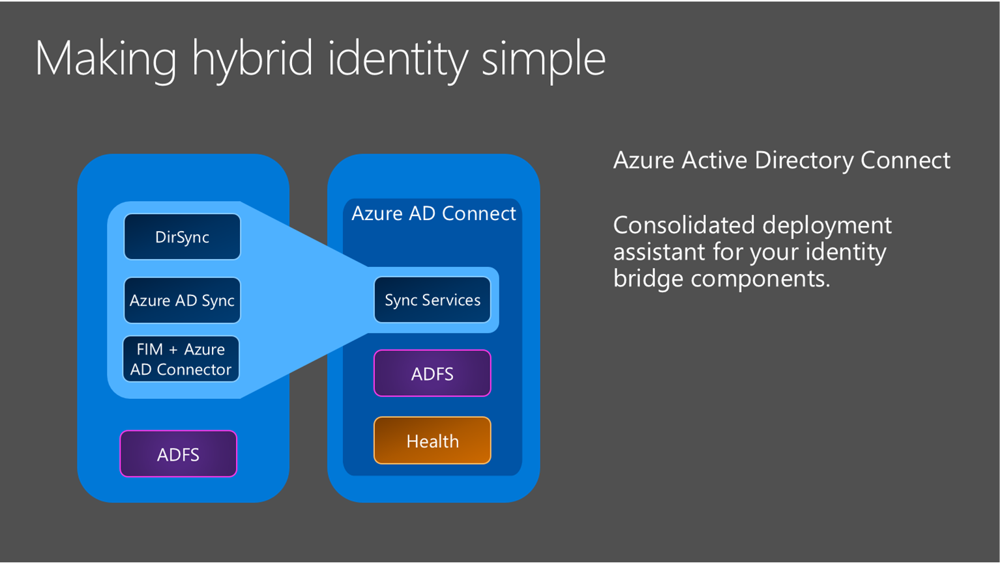

<properties
	pageTitle="Azure AD Connect: Integrating your on-premises identities with Azure Active Directory. | Microsoft Azure"
	description="Azure AD Connect will integrate your on-premises directories with Azure Active Directory. This allows you to provide a common identity for Office 365, Azure, and SaaS applications integrated with Azure AD."
    keywords="introduction to Azure AD Connect, Azure AD Connect overview, what is Azure AD Connect, install active directory"
	services="active-directory"
	documentationCenter=""
	authors="andkjell"
	manager="stevenpo"
	editor=""/>

<tags
	ms.service="active-directory"
	ms.workload="identity"
	ms.tgt_pltfrm="na"
	ms.devlang="na"
	ms.topic="get-started-article"
	ms.date="07/14/2016"
	ms.author="andkjell;billmath"/>

# Integrating your on-premises identities with Azure Active Directory
Azure AD Connect will integrate your on-premises directories with Azure Active Directory. This allows you to provide a common identity for your users for Office 365, Azure, and SaaS applications integrated with Azure AD. This topic will guide you through the planning, deployment, and operation steps. It is a collection of links to the topics related to this area.

<!-- The hardcoded link is a workaround for campaign ids not working in acom links-->

> [AZURE.IMPORTANT] [Azure AD Connect is the best way to connect your on-premises directory with Azure AD and Office 365. This is a great time to upgrade to Azure AD Connect from Windows Azure Active Directory Sync (DirSync) or Azure AD Sync as these tools are now deprecated and will reach end of support on April 13, 2017.](https://azure.microsoft.com/documentation/articles/active-directory-aadconnect-dirsync-deprecated/?WT.mc_id=DirSyncDepACOM)

## Why use Azure AD Connect
Integrating your on-premises directories with Azure AD makes your users more productive by providing a common identity for accessing both cloud and on-premises resources. Users and organizations can take advantage of the following:

- Users can use a single identity to access on-premises applications and cloud services such as Office 365.

- Single tool to provide an easy deployment experience for synchronization and sign-in.

- Provides the newest capabilities for your scenarios. Azure AD Connect replaces older versions of identity integration tools such as DirSync and Azure AD Sync. For more information, see [Hybrid Identity directory integration tools comparison](active-directory-hybrid-identity-design-considerations-tools-comparison.md).

### How Azure AD Connect works
Azure Active Directory Connect is made up of three primary components: the synchronization services, the optional Active Directory Federation Services component, and the monitoring component named [Azure AD Connect Health](active-directory-aadconnect-health.md).

- Synchronization - This component is responsible for creating users, groups, and other objects. It is also responsible for making sure identity information for your on-premises users and groups is matching the cloud.
- AD FS - Federation is an optional part of Azure AD Connect and can be used to configure a hybrid environment using an on-premises AD FS infrastructure. This can be used by organizations to address complex deployments, such as domain join SSO, enforcement of AD sign-in policy, and smart card or 3rd party MFA.
- Health Monitoring - Azure AD Connect Health can provide robust monitoring and provide a central location in the Azure portal to view this activity. For additional information, see [Azure Active Directory Connect Health](active-directory-aadconnect-health.md).

## Install Azure AD Connect

You can find the download for Azure AD Connect on [Microsoft Download Center](http://go.microsoft.com/fwlink/?LinkId=615771).

Solution | Scenario
----- | ----- |
Before you start - [Hardware and prerequisites](active-directory-aadconnect-prerequisites.md) | <li>Steps to complete before you start to install Azure AD Connect.</li>
[Express settings](active-directory-aadconnect-get-started-express.md) | <li>If you have a single forest AD then this is the recommended option to use.</li> <li>User sign in with the same password using password synchronization.</li>
[Customized settings](active-directory-aadconnect-get-started-custom.md) | <li>Used when you have multiple forests. Supports many on-premises [topologies](active-directory-aadconnect-topologies.md).</li> <li>Customize your sign-in option, such as ADFS for federation or use a 3rd party identity provider.</li> <li>Customize synchronization features, such as filtering and writeback.</li>
[Upgrade from DirSync](active-directory-aadconnect-dirsync-upgrade-get-started.md) | <li>Used when you have an existing DirSync server already running.</li>
[Upgrade from Azure AD Sync or Azure AD Connect](active-directory-aadconnect-upgrade-previous-version.md)| <li>There are several different methods depending on your preference.</li>

[After installation](active-directory-aadconnect-whats-next.md) you should verify it is working as expected and assign licenses to the users.

### Next steps to Install Azure AD Connect

Topic |  
--------- | ---------
Download Azure AD Connect | [Download Azure AD Connect](http://go.microsoft.com/fwlink/?LinkId=615771)
Install using Express settings | [Express installation of Azure AD Connect](active-directory-aadconnect-get-started-express.md)
Install using Customized settings | [Custom installation of Azure AD Connect](active-directory-aadconnect-get-started-custom.md)
Upgrade from DirSync | [Upgrade from Azure AD sync tool (DirSync)](active-directory-aadconnect-dirsync-upgrade-get-started.md)
After installation | [Verify the installation and assign licenses ](active-directory-aadconnect-whats-next.md)

### Learn more about Install Azure AD Connect

You also want to prepare for [operational](active-directory-aadconnectsync-operations.md) concerns. You might want to have a stand-by server so you easily can fall over if there is a [disaster](active-directory-aadconnectsync-operations.md#disaster-recovery). If you plan to make frequent configuration changes, you should plan for a [staging mode](active-directory-aadconnectsync-operations.md#staging-mode) server.

Topic |  
--------- | ---------
Supported topologies | [Topologies for Azure AD Connect](active-directory-aadconnect-topologies.md)
Design concepts | [Azure AD Connect design concepts](active-directory-aadconnect-design-concepts.md)
Accounts used for installation | [More about Azure AD Connect credentials and permissions](active-directory-aadconnect-accounts-permissions.md)
Operational planning | [Azure AD Connect sync: Operational tasks and considerations](active-directory-aadconnectsync-operations.md)
User sign-in options | [Azure AD Connect User sign-in options](active-directory-aadconnect-user-signin.md)

## Configure sync features
Azure AD Connect comes with several features you can optionally turn on or are enabled by default. Some features might sometimes require more configuration in certain scenarios and topologies.

[Filtering](active-directory-aadconnectsync-configure-filtering.md) is used when you want to limit which objects are synchronized to Azure AD. By default all users, contacts, groups, and Windows 10 computers are synchronized. You can change the filtering based on domains, OUs, or attributes.

[Password synchronization](active-directory-aadconnectsync-implement-password-synchronization.md) synchronizes the password hash in Active Directory to Azure AD. The  end-user can use the same password on-premises and in the cloud but only manage it in one location. Since it uses your on-premises Active Directory as the authority, you can also use your own password policy.

[Password writeback](active-directory-passwords-getting-started.md) will allow your users to change and reset their passwords in the cloud and have your on-premises password policy applied.

[Device writeback](active-directory-aadconnect-feature-device-writeback.md) will allow a device registered in Azure AD to be written back to on-premises Active Directory so it can be used for conditional access.

The [prevent accidental deletes](active-directory-aadconnectsync-feature-prevent-accidental-deletes.md) feature is turned on by default and protects your cloud directory from numerous deletes at the same time. By default it allows 500 deletes per run. You can change this setting depending on your organization size.

[Automatic upgrade](active-directory-aadconnect-feature-automatic-upgrade.md) is enabled by default for express settings installations and ensures your Azure AD Connect is always up to date with the latest release.

### Next steps to configure sync features

Topic |  
--------- | --------- |
Configure filtering | [Azure AD Connect sync: Configure filtering](active-directory-aadconnectsync-configure-filtering.md)
Password synchronization | [Azure AD Connect sync: Implement password synchronization](active-directory-aadconnectsync-implement-password-synchronization.md)
Password writeback | [Getting started with password management](active-directory-passwords-getting-started.md)
Device writeback | [Enabling device writeback in Azure AD Connect](active-directory-aadconnect-feature-device-writeback.md)
Prevent accidental deletes | [Azure AD Connect sync: Prevent accidental deletes](active-directory-aadconnectsync-feature-prevent-accidental-deletes.md)
Automatic upgrade | [Azure AD Connect: Automatic upgrade](active-directory-aadconnect-feature-automatic-upgrade.md)

## Customize Azure AD Connect sync
Azure AD Connect sync comes with a default configuration that is intended to work for most customers and topologies. But there are always situations where the default configuration does not work and must be adjusted. It is supported to make changes as documented in this section and linked topics.

If you have not worked with a synchronization topology before you want to start to understand the basics and the terms used as described in the [technical concepts](active-directory-aadconnectsync-technical-concepts.md). Azure AD Connect is the evolution of MIIS2003, ILM2007, and FIM2010. Even if some things are identical, a lot has changed as well.

The [default configuration](active-directory-aadconnectsync-understanding-default-configuration.md) assumes there might be more than one forest in the configuration. In those topologies a user object might be represented as a contact in another forest. The user might also have a linked mailbox in another resource forest. The behavior of the default configuration is described in [users and contacts](active-directory-aadconnectsync-understanding-users-and-contacts.md).

The configuration model in sync is called [declarative provisioning](active-directory-aadconnectsync-understanding-declarative-provisioning-expressions.md). The advanced attribute flows are using [functions](active-directory-aadconnectsync-functions-reference.md) to express attribute transformations. You can see and examine the entire configuration using tools which comes with Azure AD Connect. If you need to make configuration changes, make sure you follow the [best practices](active-directory-aadconnectsync-best-practices-changing-default-configuration.md) so it is easier to adopt new releases.

### Next steps to customize Azure AD Connect sync

Topic |  
--------- | ---------
All Azure AD Connect sync articles | [Azure AD Connect sync](active-directory-aadconnectsync-whatis.md)
Technical concepts | [Azure AD Connect sync: Technical Concepts](active-directory-aadconnectsync-technical-concepts.md)
Understanding the default configuration | [Azure AD Connect sync: Understanding the default configuration](active-directory-aadconnectsync-understanding-default-configuration.md)
Understanding users and contacts | [Azure AD Connect sync: Understanding Users and Contacts](active-directory-aadconnectsync-understanding-users-and-contacts.md)
Declarative provisioning | [Azure AD Connect Sync: Understanding Declarative Provisioning Expressions](active-directory-aadconnectsync-understanding-declarative-provisioning-expressions.md)
Change the default configuration | [Best practices for changing the default configuration](active-directory-aadconnectsync-best-practices-changing-default-configuration.md)

## Configure federation features
ADFS can be configured to support [multiple domains](active-directory-aadconnect-multiple-domains.md). For example you might have multiple top domains you need to use for federation.

if your ADFS server has not been configured to automatically update certificates from Azure AD or if you use a non-ADFS solution, then you will be notified when you have to [update certificates](active-directory-aadconnect-o365-certs.md).

### Next steps to configure federation features

Topic |  
--------- | ---------
All AD FS articles | [Azure AD Connect and federation](active-directory-aadconnectfed-whatis.md)
Configure ADFS with subdomains | [Multiple Domain Support for Federating with Azure AD](active-directory-aadconnect-multiple-domains.md)
Manage AD FS farm | [AD FS management and customizaton with Azure AD Connect](active-directory-aadconnect-federation-management.md)
Manually updating federation certificates | [Renewing Federation Certificates for Office 365 and Azure AD](active-directory-aadconnect-o365-certs.md)

## More information and references

Topic |  
--------- | --------- |
Version history | [Version history](active-directory-aadconnect-version-history.md)
Compare DirSync, Azure ADSync, and Azure AD Connect | [Directory integration tools comparison](active-directory-hybrid-identity-design-considerations-tools-comparison.md)
Non-ADFS compatibility list for Azure AD | [Azure AD federation compatibility list](active-directory-aadconnect-federation-compatibility.md)
Attributes synchronized | [Attributes synchronized](active-directory-aadconnectsync-attributes-synchronized.md)
Monitoring using Azure AD Connect Health | [Azure AD Connect Health](active-directory-aadconnect-health.md)
Frequently Asked Questions | [Azure AD Connect FAQ](active-directory-aadconnect-faq.md)

**Additional Resources**

Ignite 2015 presentation on extending your on-premises directories to the cloud.

>[AZURE.VIDEO microsoft-ignite-2015-extending-on-premises-directories-to-the-cloud-made-easy-with-azure-active-directory-connect]
