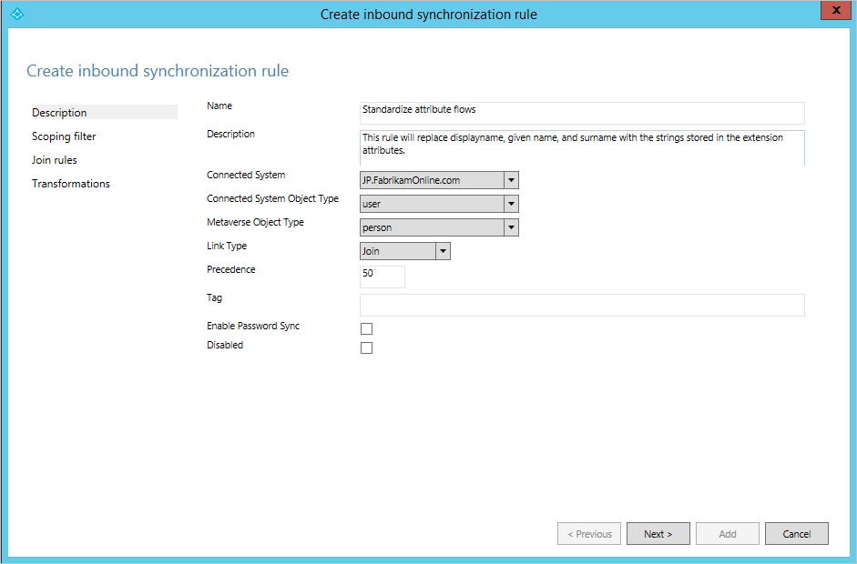
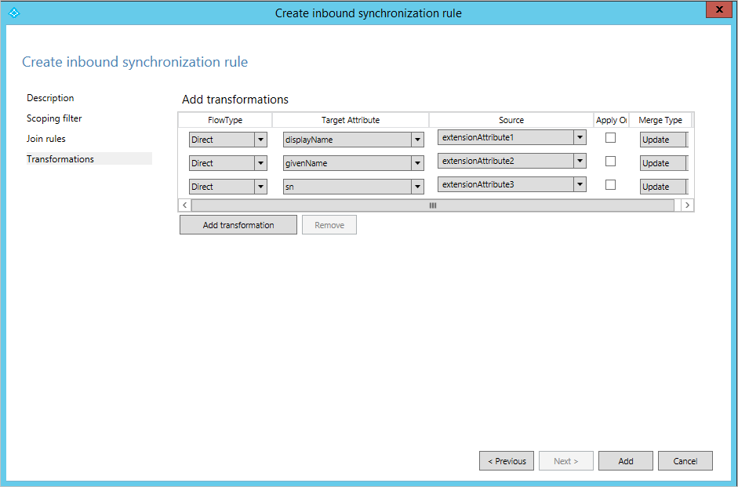
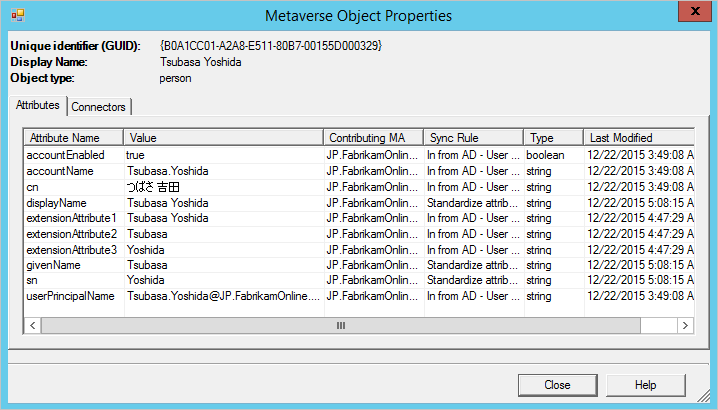
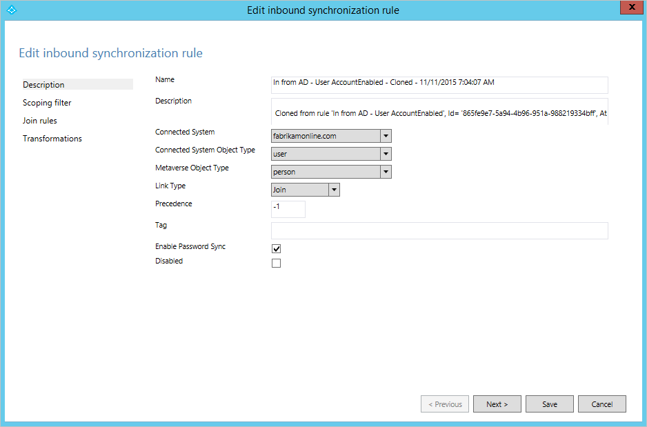

<properties
	pageTitle="Azure AD Connect sync: Best practices for changing the default configuration | Microsoft Azure"
	description="Provides best practices for changing the default configuration of Azure AD Connect sync."
	services="active-directory"
	documentationCenter=""
	authors="andkjell"
	manager="stevenpo"
	editor=""/>

<tags
	ms.service="active-directory"
	ms.workload="identity"
	ms.tgt_pltfrm="na"
	ms.devlang="na"
	ms.topic="article"
	ms.date="06/27/2016"
	ms.author="markvi;andkjell"/>

# Azure AD Connect sync: Best practices for changing the default configuration
The purpose of this topic is to describe supported and unsupported changes to Azure AD Connect sync.

The configuration created by Azure AD Connect works “as is” for the majority of environments that synchronize on-premises Active Directory with Azure AD. However, in some cases, it is necessary to apply some changes to a configuration to satisfy a particular need or requirement.

## Changes to the service account
Azure AD Connect sync is running under a service account created by the installation wizard. This service account holds the encryption keys to the database used by sync. It is created with a 127 characters long password and the password is set to not expire.

- It is **unsupported** to change or reset the password of the service account. Doing so will destroy the encryption keys and the service will not be able to access the database and will not be able to start.

## Changes to the scheduler
Starting with the releases from build 1.1 (February 2016) you can configure the [scheduler](active-directory-aadconnectsync-feature-scheduler.md) to have a different sync cycle than the default 30 minutes.

## Changes to Synchronization Rules
The installation wizard provides a configuration which is supposed to work for the most common scenarios. In case you need to make changes to the configuration, then you must follow these rules to still have a supported configuration.

- You can [change attribute flows](#change-attribute-flows) if the default direct attribute flows are not suitable for your organization.
- If you want to [not flow an attribute](#do-not-flow-an-attribute) and remove any existing attribute values in Azure AD, then you need to create a rule for this.
- [Disable an unwanted Sync Rule](#disable-an-unwanted-sync-rule) rather than deleting it. A deleted rule will be recreated during un upgrade.
- To [change an out-of-box rule](#change-an-out-of-box-rule) you should make a copy of the original rule and disable the out-of-box rule. The Sync Rule Editor will prompt you and help you with this.
- Export your custom synchronization rules using the Synchronization Rules Editor. This provides you with a PowerShell script you can use to easily recreate them in the case of a disaster recovery scenario.

>[AZURE.WARNING] The out-of-box sync rules have a thumbprint. If you make a change to these rules, the thumbprint will no longer match and you might have problems in the future when you try to apply a new release of Azure AD Connect. Only make changes the way it is described in this article.

### Change attribute flows
In some cases the default attribute flows are not working for an organization.

You should follow these rules:

- Create a new sync rule with your attribute flows. By giving it a higher precedence (lower numeric value) your rules will override any out-of-box attribute flows.
- Do not add additional flows to an out-of-box rule. These changes will be lost on upgrade.

At Fabrikam there is a forest where the local alphabet is used for given name, surname, and display name. The Latin character representation of these attributes are stored in the extension attributes. When building the global address list in Azure AD and Office 365, the organization wants these to be used instead.

With a default configuration, an object from the local forest looks like this:

To create a rule with other attribute flows, do the following:

- Start **Synchronization Rule Editor** from the start menu.
- With **Inbound** still selected to the left, click on the button **Add new rule**.
- Give the rule a name and description. Select the on-premises Active Directory and the relevant object types.  In **Link Type**, select **Join**. For precedence pick a number which is not used by another rule. The out-of-box rules start with 100, so the value 50 can be used in this example.

- Leave scope empty (i.e. should apply to all user objects in the forest).
- Leave join rules empty (i.e. let the out-of-box rule handle any joins).
- In Transformations, create the following flows.

- Click on **Add** to save the rule.
- Go to **Synchronization Service Manager**. On **Connectors**, select the Connector where we added the rule. Select **Run**, and **Full Synchronization**. A Full Synchronization will re-calculate all objects using the current rules.

This is the end result for the same object with this custom rule:

### Do not flow an attribute
There are two ways to not flow an attribute. The first is available in the installation wizard and allows you to [remove selected attributes](active-directory-aadconnect-get-started-custom.md#azure-ad-app-and-attribute-filtering). This option works if you have never synchronized the attribute before. However if you have started to synchronize this attribute and later remove it with this feature, then the sync engine will stop managing the attribute and the existing values will be left in Azure AD.

If you want to remove the value of an attribute and make sure it will not flow in the future, you will need create a custom rule instead.

At Fabrikam we have realized that some of the attributes we synchronize to the cloud should not be there. We want to make sure these attributes are removed from Azure AD.

- Create a new inbound Synchronization Rule and populate the description

- Create attribute flows of type **Expression** and with the source **AuthoritativeNull**. The literal **AuthoritativeNull** indicates that the value should be empty in the MV even if a lower precedence sync rule tries to populate the value.

- Save the Sync Rule. Start **Synchronization Service**, find the Connector, select **Run**, and **Full Synchronization**. This will recalculate all attribute flows.
- Verify that the intended changes are about to be exported by searching the connector space.

### Disable an unwanted Sync Rule
Do not delete an out-of-box sync rule; it will be recreated during next upgrade.

In some cases the installation wizard has produced a configuration which will not work for your topology. For example if you have an account-resource forest topology but you have extended the schema in the account forest with the Exchange schema then rules for Exchange will be created for the account forest as well as the resource forest. In this case we need to disable the Sync Rule for Exchange.

In the picture above the installation wizard has found an old Exchange 2003 schema in the account forest. This was added before the resource forest was introduced in Fabrikam's environment. To ensure no attributes from the old Exchange implementation are synchronized the sync rule should be disabled as shown.

### Change an out-of-box rule
If you need to make changes to an out-of-box rule then you should make a copy of the out-of-box rule and disable the original rule. Then make the changes to the cloned rule. The Sync Rule Editor will help you with this. When you open an out-of-box rule you will be presented with this dialog box:

Select **Yes** to create a copy of the rule. The cloned rule is then opened.

On this cloned rule, make any necessary changes to scope, join, and transformations.

## Next steps
Learn more about the [Azure AD Connect sync](active-directory-aadconnectsync-whatis.md) configuration.

Learn more about [Integrating your on-premises identities with Azure Active Directory](active-directory-aadconnect.md).
