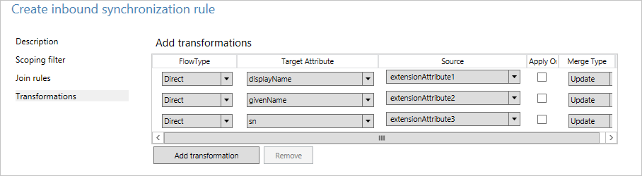

<properties
	pageTitle="Azure AD Connect sync: How to make a change to the default configuration | Microsoft Azure"
	description="Walks you through how to make a change to the configuration in Azure AD Connect sync."
	services="active-directory"
	documentationCenter=""
	authors="andkjell"
	manager="femila"
	editor=""/>

<tags
	ms.service="active-directory"
	ms.workload="identity"
	ms.tgt_pltfrm="na"
	ms.devlang="na"
	ms.topic="article"
	ms.date="08/31/2016"
	ms.author="andkjell"/>

# Azure AD Connect sync: How to make a change to the default configuration
The purpose of this topic is to walk you through how to make changes to the default configuration in Azure AD Connect sync. It provides steps for some common scenarios. With this knowledge, you should be able to make some simple changes to your own configuration based on your own business rules.

## Synchronization Rules Editor
The Synchronization Rules Editor is used to see and change the default configuration. You can find it in the Start Menu under the **Azure AD Connect** group.  

When you open it, you see the default out-of-box rules.

### Navigating in the editor
The drop-downs at the top of the editor allow you to quickly find a particular rule. For example, if you want to see the rules where the attribute proxyAddresses is included, you would change the drop-downs to the following:  
  
To reset filtering and load a fresh configuration, press **F5** on the keyboard.

To the top right, you have a button **Add new rule**. This button is used to create your own custom rule.

At the bottom, you have buttons for acting on a selected sync rule. **Edit** and **Delete** do what you expect them to. **Export** produces a PowerShell script for recreating the sync rule. This procedure allows you to move a sync rule from one server to another.

## Create your first custom rule
The most common change is changes to the attribute flows. The data in your source directory might not be as in Azure AD. In the example in this section, you want to make sure the given name of a user is always in **Proper case**.

### Disable the scheduler
The [scheduler](active-directory-aadconnectsync-feature-scheduler.md) runs every 30 minutes by default. You want to make sure it is not starting while you are making changes and troubleshoot your new rules. To temporarily disable the scheduler, start PowerShell, and run `Set-ADSyncScheduler -SyncCycleEnabled $false`

  

### Create the rule

1. Click **Add new rule**.
2. On the **Description** page enter the following:  
  
	- Name: Give the rule a descriptive name.
	- Description: Some clarification so someone else can understand what the rule is for.
	- Connected system: The system the object can be found in. In this case, we select the Active Directory Connector.
	- Connected System/Metaverse Object Type: Select **User** and **Person** respectively.
	- Link Type: Change this value to **Join**.
	- Precedence: Provide a value that is unique in the system. A lower numeric value indicates higher precedence.
	- Tag: Leave empty. Only out-of-box rules from Microsoft should have this box populated with a value.
3. On the **Scoping filter** page, enter **givenName ISNOTNULL**.  
  
This section is used to define which objects the rule should apply to. If left empty, the rule would apply to all user objects. But that would include conference rooms, service accounts, and other non-people user objects.
4. On the **Join rules**, leave it empty.
5. On the **Transformations** page, change the FlowType to **Expression**. Select the Target Attribute **givenName**, and in Source enter `PCase([givenName])`.
  
The sync engine is case-sensitive both on the function name and the name of the attribute. If you type something wrong, you see a warning when you add the rule. The editor allows you to save and continue, so you would have to reopen the rule and correct the rule.
6. Click **Add** to save the rule.

Your new custom rule should be visible with the other sync rules in the system.

### Verify the change
With this new change, you want to make sure it is working as expected and is not throwing any errors. Depending on the number of objects you have, there are two different ways to do this step.

1. Run a full sync on all objects
2. Run a preview and full sync on a single object

Start **Synchronization Service** from the start menu. The steps in this section are all in this tool.

1. **Full sync on all objects**  
Select **Connectors** at the top. Identify the Connector you made a change to in the previous section, in this case the Active Directory Domain Services, and select it. Select **Run** from Actions and select **Full Synchronization** and **OK**.
  
The objects are now updated in the metaverse. You now want to look at the object in the metaverse.

2. **Preview and full sync on a single object**  
Select **Connectors** at the top. Identify the Connector you made a change to in the previous section, in this case the Active Directory Domain Services, and select it. Select **Search Connector Space**. Use scope to find an object you want to use to test the change. Select the object and click **Preview**. In the new screen, select **Commit Preview**.
  
The change is now committed to the metaverse.

**Look at the object in the metaverse**  
You now want to pick a few sample objects to make sure the value is expected and that the rule applied. Select **Metaverse Search** from the top. Add any filter you need to find the relevant objects. From the search result, open an object. Look at the attribute values and also verify in the **Sync Rules** column that the rule applied as expected.  
  
### Enable the scheduler
If everything is as expected, you can enable the scheduler again. From PowerShell, run `Set-ADSyncScheduler -SyncCycleEnabled $true`.

## Other common attribute flow changes
The previous section described how to make changes to an attribute flow. In this section, some additional examples are provided. The steps for how to create the sync rule is abbreviated, but you can find the full steps in the previous section.

### Use another attribute than the default
At Fabrikam, there is a forest where the local alphabet is used for given name, surname, and display name. The Latin character representation of these attributes can be found in the extension attributes. When building the global address list in Azure AD and Office 365, the organization wants these attributes to be used instead.

With a default configuration, an object from the local forest looks like this:  

To create a rule with other attribute flows, do the following:

- Start **Synchronization Rule Editor** from the start menu.
- With **Inbound** still selected to the left, click the button **Add new rule**.
- Give the rule a name and description. Select the on-premises Active Directory and the relevant object types.  In **Link Type**, select **Join**. For precedence, pick a number that is not used by another rule. The out-of-box rules start with 100, so the value 50 can be used in this example.

- Leave scope empty (that is, should apply to all user objects in the forest).
- Leave join rules empty (that is, let the out-of-box rule handle any joins).
- In Transformations, create the following flows:  

- Click **Add** to save the rule.
- Go to **Synchronization Service Manager**. On **Connectors**, select the Connector where we added the rule. Select **Run**, and **Full Synchronization**. A Full Synchronization recalculates all objects using the current rules.

This is the result for the same object with this custom rule:  

### Length of attributes
String attributes are by default set to be indexable and the maximum length is 448 characters. If you are working with string attributes that might contain more, then make sure to include the following in the attribute flow:  
`attributeName` <- `Left([attributeName],448)`

### Changing the userPrincipalSuffix
The userPrincipalName attribute in Active Directory is not always known by the users and might not be suitable as the sign-in ID. The Azure AD Connect sync installation wizard allows picking a different attribute, for example mail. But in some cases the attribute must be calculated. For example, the company Contoso has two Azure AD directories, one for production and one for testing. They want the users in their test tenant to use another suffix in the sign-in ID.  
`userPrincipalName` <- `Word([userPrincipalName],1,"@") & "@contosotest.com"`

In this expression, take everything left of the first @-sign (Word) and concatenate with a fixed string.

### Convert a multi-value to a single-value
Some attributes in Active Directory are multi-valued in the schema even though they look single valued in Active Directory Users and Computers. An example is the description attribute.  
`description` <- `IIF(IsNullOrEmpty([description]),NULL,Left(Trim(Item([description],1)),448))`

In this expression in case the attribute has a value, we take the first item (Item) in the attribute, remove leading and trailing spaces (Trim), and then keep the first 448 characters (Left) in the string.

### Do not flow an attribute
For background on the scenario for this section, see [Control the attribute flow process](active-directory-aadconnectsync-understanding-declarative-provisioning.md#control-the-attribute-flow-process).

There are two ways to not flow an attribute. The first is available in the installation wizard and allows you to [remove selected attributes](active-directory-aadconnect-get-started-custom.md#azure-ad-app-and-attribute-filtering). This option works if you have never synchronized the attribute before. However, if you have started to synchronize this attribute and later remove it with this feature, then the sync engine stops managing the attribute and the existing values are left in Azure AD.

If you want to remove the value of an attribute and make sure it does not flow in the future, you need create a custom rule instead.

At Fabrikam, we have realized that some of the attributes we synchronize to the cloud should not be there. We want to make sure these attributes are removed from Azure AD.  

- Create a new inbound Synchronization Rule and populate the description

- Create attribute flows of type **Expression** and with the source **AuthoritativeNull**. The literal **AuthoritativeNull** indicates that the value should be empty in the MV even if a lower precedence sync rule tries to populate the value.

- Save the Sync Rule. Start **Synchronization Service**, find the Connector, select **Run**, and **Full Synchronization**. This step recalculates all attribute flows.
- Verify that the intended changes are about to be exported by searching the connector space.

## Next steps

- Read more about the configuration model in [Understanding Declarative Provisioning](active-directory-aadconnectsync-understanding-declarative-provisioning.md).
- Read more about the expression language in [Understanding Declarative Provisioning Expressions](active-directory-aadconnectsync-understanding-declarative-provisioning-expressions.md).

**Overview topics**

- [Azure AD Connect sync: Understand and customize synchronization](active-directory-aadconnectsync-whatis.md)
- [Integrating your on-premises identities with Azure Active Directory](active-directory-aadconnect.md)
