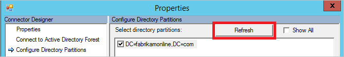
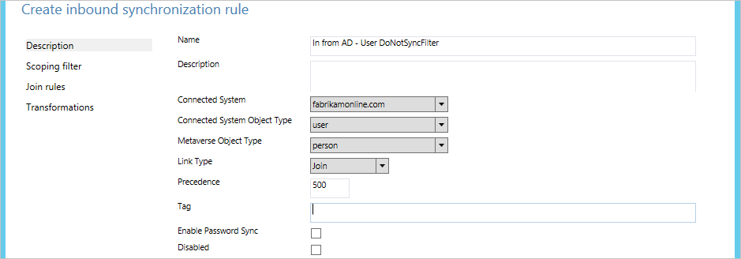
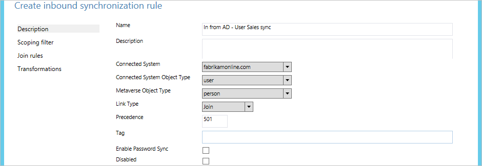
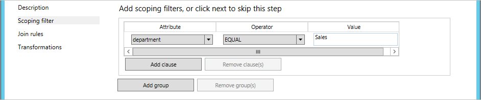
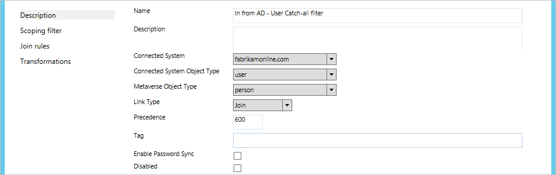

<properties
	pageTitle="Azure AD Connect sync: Configure filtering | Microsoft Azure"
	description="Explains how to configure filtering in Azure AD Connect sync."
	services="active-directory"
	documentationCenter=""
	authors="andkjell"
	manager="stevenpo"
	editor=""/>

<tags
	ms.service="active-directory"
	ms.workload="identity"
	ms.tgt_pltfrm="na"
	ms.devlang="na"
	ms.topic="article"
	ms.date="06/27/2016"
	ms.author="andkjell;markvi"/>

# Azure AD Connect sync: Configure Filtering
With filtering you can control which objects should appear in Azure AD from your on-premises directory. The default configuration will take all objects in all domains in the configured forests. In general, this is the recommended configuration. For example, end users using Office 365 workloads such as Exchange Online and Skype for Business will benefit from a complete Global Address List so they can send email and call everyone. With the default configuration they would get the same experience they would with an on-premises implementation of Exchange or Lync.

In some cases it is required to make some changes to the default configuration. Here are some examples:

- You plan to use the [multi-Azure AD-directory topology](active-directory-aadconnect-topologies.md#each-object-only-once-in-an-azure-ad-directory). Then you need to apply a filter to control which object should be synchronized to a particular Azure AD directory.
- You run a pilot for Azure or Office 365 and only want a subset of users in Azure AD. In the small pilot it is not important to have a complete Global Address List to demonstrate the functionality.
- You have very many service accounts and other non-personal accounts you do not want in Azure AD.
- For compliance reasons you do not delete any user accounts on-premises; you only disable them. But in Azure AD you only want active accounts to be present.

This article will cover how to configure the different filtering methods.

> [AZURE.IMPORTANT]Microsoft does not support modification or operation of the Azure AD Connect sync outside of those actions formally documented. Any of these actions may result in an inconsistent or unsupported state of Azure AD Connect sync and as a result, Microsoft cannot provide technical support for such deployments.

## Basics and important notes
In Azure AD Connect sync, you can enable filtering at any time. If you start with a default configuration of directory synchronization and then configure filtering, the objects that are filtered out are no longer synchronized to Azure AD. As a result of this, any objects in Azure AD that were previously synchronized but were then filtered are deleted in Azure AD.

Before you start making changes to filtering, make sure you [disable the scheduled task](#disable-scheduled-task) so you do not accidently export changes which you have not yet verified to be correct.

Since filtering can remove very many objects at the same time, you want to make sure your new filters are correct before you start exporting any changes to Azure AD. After you have completed the configuration steps, it is strongly recommended you follow the [verification steps](#apply-and-verify-changes) before you export and make changes to Azure AD.

To protect you from deleting many objects by accident, the feature [prevent accidental deletes](active-directory-aadconnectsync-feature-prevent-accidental-deletes.md) is on by default. If you delete many objects due to filtering (500 by default) you need to follow the steps in this article to allow the deletes to go through to Azure AD.

If you use a build before November 2015 ([1.0.9125](active-directory-aadconnect-version-history.md#1091250)), make a change to filter configuration and you use password synchronization then you need to trigger a full sync of all passwords after you have completed the configuration. For steps on how to trigger a password full sync see [Trigger a full sync of all passwords](active-directory-aadconnectsync-implement-password-synchronization.md#trigger-a-full-sync-of-all-passwords). If you are on 1.0.9125 or later, then the regular **full synchronization** action will also calculate if passwords should be synchronized and this extra step is no longer required.

If **user** objects were inadvertently deleted in Azure AD because of a filtering error, you can re-create the user objects in Azure AD by removing your filtering configurations, and then synchronize your directories again. This will restore the users from the recycle bin in Azure AD. However, you cannot undelete other object types. For example if you accidently delete a security group and it was used to ACL a resource, the group and its ACLs cannot be recovered.

Azure AD Connect will only delete objects it has once considered to be in scope. If there are objects in Azure AD which were created by another sync engine and these are not in scope, adding filtering will not remove them. For example if you start with a DirSync server and it created a complete copy of your entire directory in Azure AD and you install a new Azure AD Connect sync server in parallel with filtering enabled from the beginning, it will not remove the extra objects created by DirSync.

The filtering configurations will be retained when you install or upgrade to a newer version of Azure AD Connect. It is always a best practice to verify that the configuration was not inadvertently changed after an upgrade to a newer version before running the first synchronization cycle.

If you have more than one forest, then the filtering configurations described in this topic must be applied to every forest (assuming you want the same configuration for all of them).

### Disable scheduled task
To disable the built-in scheduler which will trigger a synchronization cycle every 30 minutes, follow these steps:

1. Go to a PowerShell prompt.
2. Run `Set-ADSyncScheduler -SyncCycleEnabled $False` to disable the scheduler.
3. Make the changes as documented in this topic.
4. Run `Set-ADSyncScheduler -SyncCycleEnabled $True` to enable the scheduler again.

**If you use an Azure AD Connect build before 1.1.105.0**  
To disable the scheduled task which will trigger a synchronization cycle every 3 hours, follow these steps:

1. Start **Task Scheduler** from the start menu.
2. Directly under **Task Scheduler Library** find the task named **Azure AD Sync Scheduler**, right-click and select **Disable**.  
  
3. You can now make configuration changes and run the sync engine manually from the **synchronization service manager** console.

After you have completed all your filtering changes, don't forget to come back and **Enable** the task again.

## Filtering Options
The following filtering configuration types can be applied to the Directory Synchronization tool:

- [**Group based**](active-directory-aadconnect-get-started-custom.md#sync-filtering-based-on-groups): Filtering based on a single group can only be configured on initial install using the installation wizard. It is not further covered in this topic.

- [**Domain-based**](#domain-based-filtering): This option enables you to select which domains will synchronize to Azure AD. It also allows you to add and remove domains from the sync engine configuration if you make changes to your on-premises infrastructure after you installed Azure AD Connect sync.

- [**Organizational-Unit–based**](#organizational-unitbased-filtering):  This filtering option enables you to select which OUs will synchronize to Azure AD. This option will be on all object types in selected OUs.

- [**Attribute–based**](#attribute-based-filtering): This option allows you to filter objects based on attribute values on the objects. You can also have different filters for different object types.

You can use multiple filtering options at the same time. For example you can use OU-based filtering to only include objects in one OU and at the same time attribute-based filtering to filter the objects further. When you use multiple filtering methods, the filters use a logical AND between the filters.

## Domain-based filtering
This section provides you with the steps you need to perform to configure your domain filter. If you have added or removed domains in your forest after you have installed Azure AD Connect you also have to update the filtering configuration.

The preferred way to change domain-based filtering is by running the installation wizard and change [domain and OUs filtering](active-directory-aadconnect-get-started-custom.md#domain-and-ou-filtering). The installation wizard is automating all the tasks documented in this topic.

You should only follow these steps if you for some reason are unable to run the installation wizard.

Domain-based filtering configuration consists of these steps:

- [Select the domains](#select-domains-to-be-synchronized) which should be included in the synchronization.
- For each added and removed domain, adjust the [run profiles](#update-run-profiles).
- [Apply and verify changes](#apply-and-verify-changes).

### Select domains to be synchronized
**To set the domain filter, perform the following steps:**

1. Sign in to the server that is running Azure AD Connect sync by using an account that is a member of the **ADSyncAdmins** security group.
2. Start **Synchronization Service** from the start menu.
3. Select **Connectors** and in the **Connectors** list, select the Connector with the type **Active Directory Domain Services**. From **Actions** select **Properties**.  
  
4. Click **Configure Directory Partitions**.
5. In the **Select directory partitions** list, select and unselect the domains as needed. Verify that only the partitions you want to synchronize are selected.  
  
If you have changed your on-premises AD infrastructure and added or removed domains from the forest, then click on the **Refresh** button to get an updated list. When you refresh you are asked for credentials; provide any credentials with read access to your on-premises Active Directory. It does not have to be the user which is pre-populated in the dialog box.  
  
6. When you are done, close the **Properties** dialog by clicking **OK**. If you have removed domains from the forest a message will pop-up saying a domain was removed and that configuration will be cleaned up.
7. Continue to adjust the [run profiles](#update-run-profiles).

### Update Run Profiles
If you have updated your domain filter, you also need to update the run profiles.

1. In the **Connectors** list, make sure the Connector you changed in the previous step is selected. From **Actions** select **Configure Run Profiles**.  
  

You need to adjust the following profiles:

- Full Import
- Full Synchronization
- Delta Import
- Delta Synchronization
- Export

For each of the five profiles, take the following steps for each **added** domain:

1. Select the run profile and click **New Step**.
2. On the **Configure Step** page, in the **Type** drop-down, select the step type with the same name as the profile you are configuring. Then click **Next**.  
  
3. On the **Connector Configuration** page, in the **Partition** drop-down, select the name of the domain you have added to your domain filter.  
  
4. To close the **Configure Run Profile** dialog, click **Finish**.

For each of the five profiles, take the following steps for each **removed** domain:

1. Select the run profile.
2. If the **Value** of the **Partition** attribute is a GUID, select the run step and click **Delete Step**.  
  

The end result should be that each domain you want to synchronize should be listed as a step in each run profile.

To close the **Configure Run Profiles** dialog, click **OK**.

- To complete the configuration, [Apply and verify changes](#apply-and-verify-changes).

## Organizational-unit–based filtering
The preferred way to change OU-based filtering is by running the installation wizard and change [domain and OUs filtering](active-directory-aadconnect-get-started-custom.md#domain-and-ou-filtering). The installation wizard is automating all the tasks documented in this topic.

You should only follow these steps if you for some reason are unable to run the installation wizard.

**To configure organizational-unit–based filtering, perform the following steps:**

1. Sign in to the server that is running Azure AD Connect sync by using an account that is a member of the **ADSyncAdmins** security group.
2. Start **Synchronization Service** from the start menu.
3. Select **Connectors** and in the **Connectors** list, select the Connector with the type **Active Directory Domain Services**. From **Actions** select **Properties**.  
  
4. Click **Configure Directory Partitions**, select the domain you want to configure, and then click **Containers**.
5. When prompted, provide any credentials with read access to your on-premises Active Directory. It does not have to be the user which is pre-populated in the dialog box.
6. In the **Select Containers** dialog box, clear the OUs that you don’t want to synchronize with the cloud directory, and then click **OK**.  
  
  - The **Computers** container should be selected for your Windows 10 computers to be successfully synchronized to Azure AD. If your domain joined computers are located in other OUs, make sure those are selected.
  - The **ForeignSecurityPrincipals** container should be selected if you have multiple forests with trusts. This will allow cross-forest security group membership to be resolved.
  - The **RegisteredDevices** OU should be selected if you have enabled the device writeback feature. If you use another writeback feature, such as group writeback, make sure these locations are selected.
  - Select any other OU where Users, iNetOrgPersons, Groups, Contacts, and Computers are located. In the picture above, all these are located in the ManagedObjects OU.
7. When you are done, close the **Properties** dialog by clicking **OK**.
8. To complete the configuration, [Apply and verify changes](#apply-and-verify-changes).

## Attribute-based filtering
Make sure you are on the November 2015 ([1.0.9125](active-directory-aadconnect-version-history.md#1091250)) or later build for these steps to work.

Attribute based filtering is the most flexible way to filter objects. You can use the power of [declarative provisioning](active-directory-aadconnectsync-understanding-declarative-provisioning-expressions.md) to control almost every aspect of when an object should be synchronized to Azure AD.

Filtering can be applied both on the [inbound](#inbound-filtering) from Active Directory to the metaverse and [outbound](#outbound-filtering) from the metaverse to Azure AD. It is recommended to apply filtering on inbound since that is the easiest to maintain. Outbound filtering should only be used if is required to join objects from more than one forest before the evaluation can take place.

### Inbound filtering
Inbound based filtering is leveraging the default configuration where objects going to AAD must have the metaverse attribute cloudFiltered not set to a value to be synchronized. If this attribute's value is set to **True** then the object will not be synchronized. It should not be set to **False** by design. To make sure other rules have the ability to contribute a value, this attribute is only supposed to have the values **True** or **NULL** (absent).

In the inbound filtering we will use the power of **scope** to determine which objects should or should not be synchronized. This is where you will make adjustments to fit your own organization's requirements. The scope module has **group** and **clause** to determine if a sync rule should be in scope. A **group** will contain one or many **clause**. There is a logical AND between multiple clauses and a logical OR between multiple groups.

Let us look at an example:  

This should be read as **(department = IT) OR (department = Sales AND c = US)**.

In the samples and steps below we will use the user object as an example, but you can use this for all object types.

In the samples below the precedence values used start with 500. This will ensure these are evaluated after the out-of-box rules (lower precedence, higher numeric value).

#### Negative filtering, "do not sync these"
In the following example, we will filter out (not synchronize) all users where **extensionAttribute15** has the value **NoSync**.

1. Sign in to the server that is running Azure AD Connect sync by using an account that is a member of the **ADSyncAdmins** security group.
2. Start **Synchronization Rules Editor** from the start menu.
3. Make sure **Inbound** is selected and click **Add New Rule**.
4. Give the rule a descriptive name, such as "*In from AD – User DoNotSyncFilter*". Select the correct forest, **User** as the **CS object type**, and **Person** as the **MV object type**. As **Link Type**, select **Join** and in precedence type a value currently not used by another Synchronization Rule (e.g. 500), and then click **Next**.  
  
5. In **Scoping filter**, click **Add Group**, click **Add Clause** and in attribute select **ExtensionAttribute15**. Make sure the Operator is set to **EQUAL** and type the value **NoSync** in the Value box. Click **Next**.  
  
6. Leave the **Join** rules empty, and then click **Next**.
7. Click **Add Transformation**, select the **FlowType** to **Constant**, select the Target Attribute **cloudFiltered** and in the Source text box, type in **True**. Click **Add** to save the rule.  

8. To complete the configuration, [Apply and verify changes](#apply-and-verify-changes).

#### Positive filtering, "only sync these"
Expressing positive filtering can be more challenging since you have to also consider objects which are not obvious to be synchronized, such as conference rooms.

The positive filtering option will require two sync rules. One (or several) with the correct scope of objects to synchronize and a second catch-all sync rule which will filter out all objects which have not yet been identified as an object which should be synchronized.

In the following example we will only synchronize user objects where the department attribute has the value **Sales**.

1. Sign in to the server that is running Azure AD Connect sync by using an account that is a member of the **ADSyncAdmins** security group.
2. Start **Synchronization Rules Editor** from the start menu.
3. Make sure **Inbound** is selected and click **Add New Rule**.
4. Give the rule a descriptive name, such as "*In from AD – User Sales sync*". Select the correct forest, **User** as the **CS object type**, and **Person** as the **MV object type**. As **Link Type**, select **Join** and in precedence type a value currently not used by another Synchronization Rule (e.g.: 501), and then click **Next**.  
  
5. In **Scoping filter**, click **Add Group**, click **Add Clause** and in attribute select **department**. Make sure the Operator is set to **EQUAL** and type the value **Sales** in the Value box. Click **Next**.  
  
6. Leave the **Join** rules empty, and then click **Next**.
7. Click **Add Transformation**, select the **FlowType** to **Constant**, select the Target Attribute **cloudFiltered** and in the Source text box, type in **False**. Click **Add** to save the rule.  
  
This is a special case where we will set cloudFiltered explicitly to False.

	We now have to create the catch-all sync rule.

8. Give the rule a descriptive name, such as "*In from AD – User Catch-all filter*". Select the correct forest, **User** as the **CS object type**, and **Person** as the **MV object type**. As **Link Type**, select **Join** and in precedence type a value currently not used by another Synchronization Rule (e.g.: 600). We have selected a precedence value higher (lower precedence) than the previous sync rule but also left some room so we can add more filtering sync rules later when we want to start synchronizing additional departments. Click **Next**.  
  
9. Leave **Scoping filter** empty, and click **Next**. An empty filter indicates the rule should be applied to all objects.
10. Leave the **Join** rules empty, and then click **Next**.
11. Click **Add Transformation**, select the **FlowType** to **Constant**, select the Target Attribute **cloudFiltered** and in the Source text box, type in **True**. Click **Add** to save the rule.  
  
12. To complete the configuration, [Apply and verify changes](#apply-and-verify-changes).

If we need to, we can create more rules of the first type where we include more and more objects in our synchronization.

### Outbound filtering
In some cases it is necessary to do the filtering only after the objects have joined in the metaverse. It could for example be required to look at the mail attribute from the resource forest and the userPrincipalName attribute from the account forest to determine if an object should be synchronized. In these cases we will create the filtering on the outbound rule.

In this example, we will change the filtering so only users where both mail and userPrincipalName ends with @contoso.com will be synchronized:

1. Sign in to the server that is running Azure AD Connect sync by using an account that is a member of the **ADSyncAdmins** security group.
2. Start **Synchronization Rules Editor** from the start menu.
3. Under Rules Type click on **Outbound**.
4. Find the rule named **Out to AAD – User Join SOAInAD**. Click **Edit**.
5. In the pop-up, answer **Yes** to create a copy of the rule.
6. On the **Description** page, change precedence to an unused value, e.g. 50.
7. Click **Scoping filter** on the left hand navigation. Click **Add clause** and in Attribute select **mail**, in Operator select **ENDSWITH**, and in Value type **@contoso.com**. Click **Add clause** and in Attribute select **userPrincipalName**, in Operator select **ENDSWITH**, and in Value type **@contoso.com**.
8. Click **Save**.
9. To complete the configuration, [Apply and verify changes](#apply-and-verify-changes).

## Apply and verify changes
After you have made your configuration changes, these must be applied to the objects already present in the system. It could also be that objects not currently in the sync engine should be processed and we need to read the source system again to verify its content.

If you changed configuration using **domain** or **organizational-unit** filtering, then you need to do **Full import** followed by **Delta synchronization**.

If you changed configuration using **attribute** filtering, then you need to do **Full synchronization**.

Take the following steps:

1. Start **Synchronization Service** from the start menu.
2. Select **Connectors** and in the **Connectors** list, select the Connector where you made a configuration change earlier. From **Actions** select **Run**.  
  
3. In the **Run profiles**, select the operation mentioned in the previous section. If you need to run two actions, run the second after the first one has completed (the **State** column is **Idle** for the selected Connector).

After the synchronization, all changes are staged to be exported. Before we actually make the changes in Azure AD, we want to verify that all these changes are correct.

1. Start a cmd prompt and go to `%Program Files%\Microsoft Azure AD Sync\bin`
2. Run: `csexport "Name of Connector" %temp%\export.xml /f:x`  
The name of the Connector can be found in Synchronization Service. It will have a name similar to “contoso.com – AAD” for Azure AD.
3. Run: `CSExportAnalyzer %temp%\export.xml > %temp%\export.csv`
4. You now have a file in %temp% named export.csv which can be examined in Microsoft Excel. This file contains all changes which are about to be exported.
5. Make necessary changes to the data or configuration and run these steps again (Import, Synchronize and Verify) until the changes which are about to be exported are expected.

When you are satisfied, export the changes to Azure AD.

1. Select **Connectors** and in the **Connectors** list, select the Azure AD Connector. From **Actions** select **Run**.
2. In the **Run profiles**, select **Export**.
3. If your configuration changes will delete many objects you will see an error on the export if the number is more than the configured threshold (by default 500). If you see this, then you need to temporarily disable the feature
[prevent accidental deletes](active-directory-aadconnectsync-feature-prevent-accidental-deletes.md).

Now it is time to enable the scheduler again.

1. Start **Task Scheduler** from the start menu.
2. Directly under **Task Scheduler Library** find the task named **Azure AD Sync Scheduler**, right-click and select **Enable**.

## Next steps
Learn more about the [Azure AD Connect sync](active-directory-aadconnectsync-whatis.md) configuration.

Learn more about [Integrating your on-premises identities with Azure Active Directory](active-directory-aadconnect.md).
