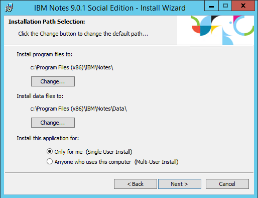
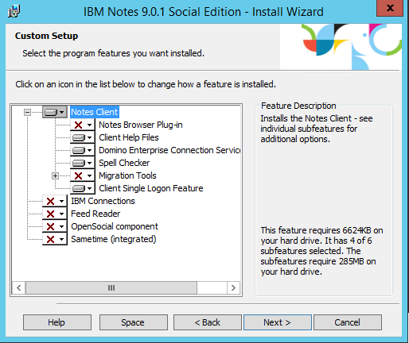
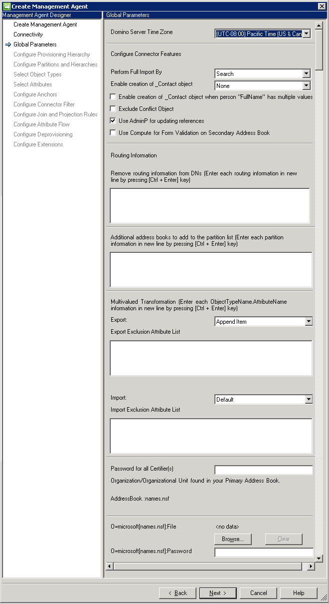
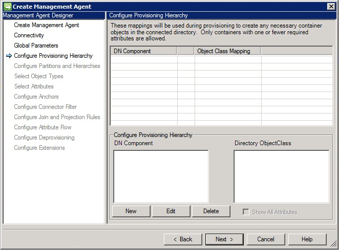
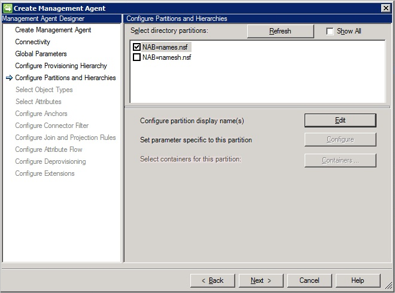
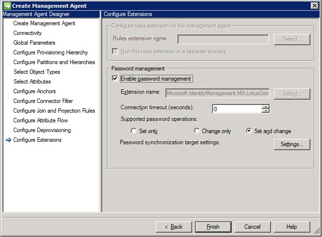

<properties
   pageTitle="Azure AD Connect sync: Lotus Domino Connector | Microsoft Azure"
   description="This article describes how to configure Microsoft's Lotus Domino Connector."
   services="active-directory"
   documentationCenter=""
   authors="AndKjell"
   manager="stevenpo"
   editor=""/>

<tags
   ms.service="active-directory"
   ms.workload="identity"
   ms.tgt_pltfrm="na"
   ms.devlang="na"
   ms.topic="article"
   ms.date="05/24/2016"
   ms.author="andkjell"/>

# Lotus Domino Connector technical reference

This article describes the Lotus Domino Connector. The article applies to the following products:

- Microsoft Identity Manager 2016 (MIM2016)
- Forefront Identity Manager 2010 R2 (FIM2010R2)
    -   Must use hotfix 4.1.3671.0 or later [KB3092178](https://support.microsoft.com/kb/3092178).

For MIM2016 and FIM2010R2 the Connector is available as a download from the [Microsoft Download Center](http://go.microsoft.com/fwlink/?LinkId=717495).

## Overview of the Lotus Domino Connector

The Lotus Domino Connector enable you to integrate the synchronization service with IBM's Lotus Domino server.

From a high level perspective, the following features are supported by the current release of the connector:

Feature | Support
--- | ---
Connected data source | Server: <li>Lotus Domino 8.5.x</li><li>Lotus Domino 9.x</li>Client:<li>Lotus Notes 9.x</li>
Scenarios	| <li>Object Lifecycle Management</li><li>Group Management</li><li>Password Management</li>
Operations | <li>Full and Delta Import</li><li>Export</li><li>Set and change password on HTTP password</li>
Schema | <li>Person (Roaming user, Contact (persons with no certificate))</li><li>Group</li><li>Resource (Resource, Room, Online meeting)</li><li>Mail-in database</li><li>Dynamic discovery of attributes for supported objects</li>

The Lotus Domino connector leverages the Lotus Notes client to communicate with Lotus Domino Server. As a consequence of this, a supported Lotus Notes Client must be installed on the synchronization server. The communication between the client and the server is implemented through the Lotus Notes .NET Interop (Interop.domino.dll) interface. This interface facilitates the communication between the Microsoft.NET platform and Lotus Notes client and supports access to Lotus Domino documents and views. For delta import it is also possible that the C++ native interface is used (depending on the selected delta import method).

### Prerequisites

Before you use the Connector, make sure you have the following on the synchronization server in addition to any hotfix mentioned above:

- Microsoft .NET 4.5.2 Framework or later
- The Lotus Notes client must be installed on your synchronization server
- The Lotus Domino Connector requires the default Lotus Domino LDAP schema database (schema.nsf) to be present on the Domino Directory server. You need to verify that it is present. If it is not present you can install it by running or restarting the LDAP service on the Domino server.

### Connected Data Source permissions

To perform any of the supported tasks in Lotus Domino connector, you must be a member of following groups:

- Full Access administrators
- Administrators
- Database Administrators

The following table lists the permissions that are required for each operation:

Operation | Access Rights
--- | ---
Import | <li>Read public documents</li><li> Full Access Administrator (When you are member of Full Access administrators group, you will automatically have the effective access to in ACL.)</li>
Export and Set Password | Effective Access: <li>Create documents</li><li>Delete documents</li><li>Read public documents</li><li>Write public documents</li><li>Replicate or copy documents</li>In addition to the above access, the following roles must be assigned for export operations: <li>CreateResource</li><li>GroupCreator</li><li>GroupModifier</li><li>UserCreator</li><li>UserModifier</li>

### Direct operations and AdminP

Operations will either go directly to the Domino directory or through the AdminP process. The following tables list all supported objects, operations and, if applicable, the related implementation method:

**Primary Address Book**

Object | Create | Update | Delete
--- | --- | --- | ---
Person | AdminP | Direct | AdminP
Group | AdminP | Direct | AdminP
MailInDB | Direct | Direct | Direct
Resource | AdminP | Direct | AdminP

**Secondary Address Book**

Object | Create | Update | Delete
--- | --- | --- | ---
Person | N/A | Direct | Direct
Group | Direct | Direct | Direct
MailInDB | Direct | Direct | Direct
Resource | N/A | N/A | N/A

When a resource is created a Notes document will be created. Similarly, when a resource is deleted, the Notes document will be deleted.

### Ports and protocols

IBM Lotus Notes client and Domino servers communicate using Notes Remote Procedure Call (NRPC) where NRPC should use TCP/IP. The default port number is 1352, but can be changed by the Domino administrator.

### Not supported

The following operations are not supported by the current release of the Lotus Domino connector:

- Move mailbox between servers.

## Create a new Connector

### Client Software Installation and Configuration

Lotus Notes must be installed on the server **before** the Connector is installed.

When you install, make sure you do a **Single User Install**. The default **Multi-User Install** will not work.

On the features page install only the required Lotus Notes features and **Client Single Logon**. Single Logon is required for the connector to be able to logon to the Domino server.

**Note:** You must start Lotus Notes once with a user that is located on the same server as the account you will use as the connector’s service account. Also make sure to close the Lotus Notes client on the server. It cannot be running at the same time the Connector tries to connect to the Domino server.

### Create Connector

To Create a Lotus Domino connector, in **Synchronization Service** select **Management Agent** and **Create**. Select the **Lotus Domino (Microsoft)** Connector.

If your version of synchronization service offer the ability to set **Architecture**, make sure the connector is set to its default to run in **Process**.

### Connectivity

On the Connectivity page, you must specify the Lotus Domino server name and enter the logon credentials.

The Domino Server property supports two formats for the server name:

- ServerName
- ServerName/DirectoryName

The **ServerName/DirectoryName** format is the preferred format for this attribute because it provides faster response when the connector contacts the Domino Server.

The provided UserID file is stored in the configuration database of the  synchronization service.

For **Delta Import** you have these options:

- **None**. The Connector will not do any delta imports.
- **Add/Update**. The Connector will delta import add and update operations. For delete a **Full Import** operation is required. This operation is using Notes's .Net interop.
- **Add/Update/Delete**. The Connector will delta import add, update, and delete operations. This operation is using Notes's native C++ interfaces.

In **Schema Options** you have the following options:

- **Default Schema**. The default option and the Connector will detect the schema from the Domino server.
- **DSML-Schema**. Only used if the Domino server does not expose the schema. Then you can create a DSML file with the schema and import it instead. For more information on DSML see [OASIS](https://www.oasis-open.org/committees/tc_home.php?wg_abbrev=dsml).

When you click Next, the UserID and password configuration parameters are verified.

### Global Parameters

On the Global Parameters page, you configure the time zone and the import and export operation option.

The **Domino Server Time Zone** parameter defines the location of your Domino Server.

This configuration option is required to support **delta import** operations because it enables the synchronization service determine changes between the last two imports.

#### Import settings, method

The **Perform Full Import By** has these options:

- Search
- View (Recommended)

**Search** is using indexing in Domino but it is common that the indexes are not updated in real-time and the data returned from the server is not always correct.  For a system with many changes, this option usually doesn't work very well and provide false deletes in some situations. However, **search** is faster than **view**.

**View** is the recommended option since it provides the correct state of data. It is slightly slower than search.

#### Creation of Virtual Contact Objects

The **Enable creation of \_Contact object** has these options:

- None
- Non-Reference Values
- Reference and Non-Reference Values

In Domino, reference attributes can contain many different formats to reference other objects. To be able to represent different variations the Connector implements \_Contact objects, a.k.a. as Virtual Contacts (VC). These objects are created so they can be joined to existing MV objects and projected as new objects and in this way preserve reference attributes.

By enabling this setting and if the content of a reference attribute is not a DN format, a \_Contact object is created. For example, a member attribute of a group can contain SMTP addresses. It is also possible to have shortName and other attributes present in reference attributes. For this scenario, select **Non-Reference Values**. This is the most common setting for Domino implementations.

When Lotus Domino is configured to have separate address books with different distinguished names representing the same object, it's possible to also create \_Contact objects for all reference values that are found in an address book. For this scenario, select the **Reference and Non-Reference Values** option.

If you have multiple values in the attribute **FullName** in Domino then you also want to enable the creation of Virtual Contacts so references can be resolved. This attribute can have multiple values after a marriage or divorce. Select the checkbox **Enable ... FullName has multiple values** for this scenario.

By joining on the correct attributes, the \_Contact objects would be joined to the MV object.

These objects will have VC=\_Contact added to their DN.

#### Import settings, conflict object

**Exclude Conflict Object**

In a large Domino implementation, it is possible that multiple objects have the same DN due to replication issues. In these cases, the connector would see two objects with different UniversalIDs but same DN. This would cause a transient object being created in the connector space. The Connector can ignore the objects that have been selected in Domino as replication victims. It is recommended to keep this checkbox selected.

#### Export settings

If the option **Use AdminP for updating references** is unselected then export of reference attributes, such as member, will be a direct call and will not use the AdminP process. This should only be used if AdminP has not been configured to maintain referential integrity.

#### Routing Information

In Domino, it is possible that a reference attribute has routing information embedded as a suffix to the DN. For example the member attribute in a group could contain **CN=example/organization@ABC**. The suffix @ABC is the routing information. The routing information is used by Domino to send emails to the correct Domino system, which could be a system in a different organization. In the Routing Information field you can specify the routing suffixes used within the organization in scope of the Connector. If one of these values is found as a suffix in a reference attribute, the routing information is removed from the reference so it will match the DN for the object in the Connector space. If the routing suffix on a reference value cannot be matched to one of those specified, a \_Contact object is created. These \_Contact objects will be created with **RO=@<RoutingSuffix>** inserted into the DN. For these \_Contact objects the following attributes are also added to allow joining to a real object if necessary: \_routingName, \_contactName, \_displayName, and UniversalID.

#### Additional address books

If you do not have **directory assistance** installed, which will provide the name of secondary address books, then you can manually enter these address books.

#### Multivalued Transformation

Many attributes in Lotus Domino are multi-valued. The corresponding metaverse attributes are typically single valued. By configuring the Import and the Export operation option, you enable the connector to help with the required translation of the affected attributes, which simplifies the configuration.

**Export**

The Export operation option supports two modes:

- Append item
- Replace item

**Replace Item** – When you select this option, the connector will always remove the current values of the attribute in Domino and replace them with the provided values. The provided valued can be either single-valued or multi-valued.

Example:
The Assistant attribute of a person object has the following values:

- CN=Greg Winston/OU= Contoso /O=Americas,NAB=names.nsf
- CN=John Smith/OU= Contoso /O=Americas,NAB=names.nsf

If a new Assistant named **David Alexander** is assigned to this person object, the result is:

- CN=David Alexander/OU= Contoso /O=Americas,NAB=names.nsf

**Append Item** – When you select this option, the connector will retain the existing values on the attribute in Domino and insert new values at the top of the data list.

Example:
The Assistant attribute of a person object has the following values:

- CN=Greg Winston/OU= Contoso /O=Americas,NAB=names.nsf
- CN=John Smith/OU= Contoso /O=Americas,NAB=names.nsf

If a new Assistant named **David Alexander** is assigned to this person object, the result is:

- CN=David Alexander/OU= Contoso /O=Americas,NAB=names.nsf
- CN=Greg Winston/OU= Contoso /O=Americas,NAB=names.nsf
- CN=John Smith/OU= Contoso /O=Americas,NAB=names.nsf

**Import**

The Import operation option supports two modes:

- Default
- Multivalued to Single Value

**Default** – When you select the Default option all values of all the attributes will be imported.

**Multivalued to Single Value** – When you select this option, a multi-valued attribute is converted into a single-valued attribute. If more than one value exists, the value on the top (this is typically also the latest value) will be used.

Example:

The Assistant attribute of a person object has the following values:

- CN=David Alexander/OU= Contoso /O=Americas,NAB=names.nsf
- CN=Greg Winston/OU= Contoso /O=Americas,NAB=names.nsf
- CN=John Smith/OU= Contoso /O=Americas,NAB=names.nsf

The most recent update to this attribute is **David Alexander**. Because the Import operation option is set to Multivalued to Single Value, connector only imports **David Alexander** into the connector space.

The logic to convert multi-valued attributes into single-valued attributes does not apply to member attribute of a group object and to the fullname attribute of a person object.

It also possible to configure import and export transformation rules for multivalued attributes per attribute, as an exception to the global rule. To configure this option, enter [objecttype].[attributename] in the **import exclusion attribute list** and **export exclusion attribute list** text boxes. For example, if you enter Person.Assistant and the global flag is set to import all values, only the first value will be imported for the assistant.

#### Certifiers

All Organization/Organizational Units are listed. To be able to export person objects to the primary address book, a certifier with its password is required.

The **Password for all Certifers(s)** can be used if all certifiers have the same password. Then you can enter the password here and only specify the certifier file.

If you only import, then you do not have to specify any certifiers.

### Configure Provisioning Hierarchy

When you configure the Lotus Domino connector, you can skip this dialog page. This is because the Lotus Domino connector does not support hierarchy provisioning.

### Configure Partitions and Hierarchies

When you configure partitions and hierarchies, you must select the primary address book called NAB=names.nsf.

In addition to the primary address book, you can select secondary address books if they exist.

### Select Attributes

When you configure your attributes, you must select all attributes that are prefixed with **\_MMS\_**. These attributes are required when you provision new objects to Lotus Domino

## Object Lifecycle Management

This section provides an overview of the different objects in Domino.

### Person Objects

The person object represents users in Organization and Organization Units. In addition to the default attributes, the Domino administrator can add custom attributes to a Person object. At a minimum, a Person object must include all mandatory attributes. For a complete list of mandatory attributes, see [Lotus Notes Properties](#lotus-notes-properties). In order to register a person object, the following prerequisites must be met

- The address book (names.nsf) should have been defined and it should be the primary address book.
- You should have the O/OU certifier Id and the password to register a particular user in the Organization / Organization Unit.
- You need to define a specific set of Lotus Notes properties for a person object. These are used for provisioning the person object. For more details, see the section called [Lotus Notes Properties](#lotus-notes-properties) later in this document.
- The initial HTTP password for a person is an attribute and set during provisioning.
- The person object must be one of the following three supported types:
    1. Normal User that has a mail file and a user id file
    2. Roaming User (a Normal User that includes all roaming database files)
    3. Contacts (user with no id file)

Persons (with the exception of contacts) can further be grouped into US Users and International Users as defined by the value of the \_MMS\_IDRegType property. These are the people using the Notes Client to access Lotus Domino servers, database, have a Notes Id, and a Person document. If they are using Notes mail, then they will also have a mail file. The user must be registered to become active. For more information see:

- [Setting up Notes users](http://publib.boulder.ibm.com/infocenter/domhelp/v8r0/index.jsp?topic=/com.ibm.help.domino.admin85.doc/H_SETTING_UP_NOTES_USERS.html)
- [User Registration](http://publib.boulder.ibm.com/infocenter/domhelp/v8r0/index.jsp?topic=/com.ibm.help.domino.admin85.doc/H_REGISTERING_USERS.html)
- [Managing users](http://publib.boulder.ibm.com/infocenter/domhelp/v8r0/index.jsp?topic=/com.ibm.help.domino.admin85.doc/H_MANAGING_USERS_5151.html)
- [Renaming users](http://publib.boulder.ibm.com/infocenter/domhelp/v8r0/index.jsp?topic=/com.ibm.help.domino.admin85.doc/H_RENAMING_A_USER_AUTOMATICALLY.html)

All these operations are performed in Lotus Domino and then imported into the synchronization service.

### Resources and Rooms

A Resource is another type of a database in Lotus Domino. Resources can be conference rooms with various types of equipment such as projectors. There are sub-types of resources supported by Lotus Domino connector that are defined on the basis of the Resource Type attribute:

Type of Resource | Resource Type Attribute
--- | ---
Room | 1
Resource (Other) | 2
Online Meeting | 3

For the Resource object type to work, the following is required:

- Resource Reservation database should already exist in the connected Domino server
- The site is already defined for the Resource

The Resource Reservation database contains 3 types of documents:

- Site Profile
- Resource
- Reservation

For more details on setting up of Resource Reservation database see, [Setting up the Resource Reservations database](https://www-01.ibm.com/support/knowledgecenter/SSKTMJ_8.0.1/com.ibm.help.domino.admin.doc/DOC/H_SETTING_UP_THE_RESOURCE_RESERVATIONS_DATABASE.html).

**Create, Update and Delete Resources**

The Create, Update and Delete operations are performed by the Lotus Domino connector in the Resource Reservation database. As a result of this, resources are created as documents in Names.nsf (i.e. the primary address book). For more details about editing and deleting Resources, see [Editing and deleting Resource documents](http://publib.boulder.ibm.com/infocenter/domhelp/v8r0/index.jsp?topic=/com.ibm.help.domino.admin85.doc/H_EDITING_AND_DELETING_RESOURCE_DOCUMENTS.html).

**Import and Export operation for Resources**

The Resources can be imported to and exported from the synchronization service just like any other object type. You should select the object type as Resource during configuration. For successful export operation, you should have details for Resource type, Conference Database, and Site name.

### Mail-In Databases

A Mail-In Database is a database that is designed to receive mails. It is a Lotus Domino mailbox (Notes database based on the Mail template) that is not associated with any specific Lotus Domino user account (i.e. it does not have its own ID file and password). A mail-in database has a unique UserID ("short name") associated with it and its own e-mail address.

Each user requires only one Lotus Domino account. If there is a need for a separate mailbox with its own e-mail address that can be shared among different users (e.g.: group@contoso.com), a mail-in database is created instead of an additional Notes account. The access to this mailbox is controlled through its Access Control List (ACL), which contains the names of the Notes users that are allowed to open the mailbox using their own ID files and passwords. There is no separate password required to access a mail-in database.

For a list of the required attributes, see the section called [Mandatory Attributes](#mandatory-attributes) later in this article   .

When a database is designed to receive a mail, a Mail-In Database document is created in Lotus Domino. This document must exist in Domino Directory of every server that stores a copy of the database. For a detailed description about creating a mail-in database document see [Creating a Mail-In Database document](http://publib.boulder.ibm.com/infocenter/domhelp/v8r0/index.jsp?topic=/com.ibm.help.domino.admin85.doc/H_CREATING_A_MAILIN_DATABASE_DOCUMENT_FOR_A_NEW_DATABASE_OVERVIEW.html).

Before creating a Mail-In Database, the database should already exist (should have been created by Lotus Admin) at the Domino server.

### Group Management

You can get a detailed overview of the Lotus Domino group management from the following resources:

- [Using groups](http://publib.boulder.ibm.com/infocenter/domhelp/v8r0/index.jsp?topic=/com.ibm.help.domino.admin85.doc/H_USING_GROUPS_OVER.html)
- [Creating a group](http://publib.boulder.ibm.com/infocenter/domhelp/v8r0/index.jsp?topic=/com.ibm.help.domino.admin85.doc/H_CREATING_AND_MODIFYING_GROUPS_STEPS_MIDTOPIC_55038956829238418.html)
- [Creating and modifying groups](http://publib.boulder.ibm.com/infocenter/domhelp/v8r0/index.jsp?topic=/com.ibm.help.domino.admin85.doc/H_CREATING_AND_MODIFYING_GROUPS_STEPS.html)
- [Managing groups](http://publib.boulder.ibm.com/infocenter/domhelp/v8r0/index.jsp?topic=/com.ibm.help.domino.admin85.doc/H_MANAGING_GROUPS_1804.html)
- [Renaming a group](http://publib.boulder.ibm.com/infocenter/domhelp/v8r0/index.jsp?topic=/com.ibm.help.domino.admin85.doc/H_RENAMING_A_GROUP_STEPS.html)

### Password Management

For a registered Lotus Domino user, there are two types of passwords:

1. User password (Stored in User.id file)
2. Internet / HTTP password

The Lotus Domino connector supports only operations with HTTP password.

In order to perform password management, you should enable password management for the connector in the Management Agent Designer. To enable password management, select **Enable password management** on the **Configure Extensions** dialog page.

The Lotus Domino connector support following operations on Internet password:

- Set Password: Set password will set a new HTTP/Internet password on the user in Domino. By default the account will also be unlocked. The unlock flag is exposed on the WMI interface of the Sync Engine.
- Change Password: In this scenario, a user might want to change the password or is prompted to change password after a specified time. For this operation to take place, both (the old and the new password) are mandatory. Once changed, the new password is updated in Lotus Domino.

For more information, see:

- [Using the Internet lockout feature](http://www.ibm.com/developerworks/lotus/library/domino8-lockout/)
- [Managing Internet passwords](http://publib.boulder.ibm.com/infocenter/domhelp/v8r0/index.jsp?topic=/com.ibm.help.domino.admin85.doc/H_NOTES_AND_INTERNET_PASSWORD_SYNCHRONIZATION_7570_OVER.html)

## Reference Information

This section lists such as attribute descriptions and attribute requirements for the Lotus Domino connector.

### Lotus Notes Properties

When you provision Person objects to your Lotus Domino directory, your objects must have a specific set of properties with specific values populated. These values are only required for Create operations.

The following table lists these properties and provides a description of them.

Property | Description
--- | ---
\_MMS_AltFullName | The alternate full name of user.
\_MMS_AltFullNameLanguage | The language to be used for specifying the alternate full name of user.
\_MMS_CertDaysToExpire | The number of days from the current date before the certificate expires. If not specified, the default date is two years from the current date.
\_MMS_Certifier | Property that contains the organizational hierarchy name of the certifier. For Example: OU=OrganizationUnit,O=Org,C=Country.
\_MMS_IDPath | If the property is empty, no user identification file is created locally on the Sync Server. If the property contains a file name, a user ID file is created in the madata folder. The property can also contain a full path in which the user ID file is created in this location.
\_MMS_IDRegType | Persons can be classified into contacts. US Users and international Users. The following table lists the possible values:<li>0 - Contact</li><li>1 - U.S. user</li><li>2 - International user</li>
\_MMS_IDStoreType | Required property for U.S. and international users. The property contains an integer value that specifies whether the user identification is stored as an attachment in the Notes address book or in the person’s mail file. If the User ID file is an attachment in the address book, it can optionally be created as a file with \_MMS_IDPath.<li>Empty - Store ID file in ID Vault, No identification file (used for Contacts).</li><li> 1 - Attachment in the Notes address book. The \_MMS_Password property must be set for user identification files that are attachments</li><li>2 - Store ID in person’s Mail File. The \_MMS_UseAdminP must be set to false to let the mail file be created during the Person registration.The \_MMS_Password property must be set for user identification files.</li>
\_MMS_MailQuotaSizeLimit | The number of megabytes that are allowed for the e-mail file database.
\_MMS_MailQuotaWarningThreshold | The number of megabytes that are allowed for the e-mail file database before a warning is issued.
\_MMS_MailTemplateName | The e-mail template file that is used to create the user's e-mail file. If a template is specified, the mail file is created using the specified template. If no template is specified, the default template file is used to create the file.
\_MMS_OU | Optional property that is the OU name under the certifier. This property should be empty for contacts.
\_MMS_Password | Required property for users. The property contains the password for the identification file of the object.
\_MMS_UseAdminP | Property should be set to true if the mail file should be created by the AdminP process on the Domino server (asynchronous to the export process). If property is set to false the mail file is created with the Domino user (synchronous in the export process).

For a user with an associated identification file, the \_MMS_Password property must contain a value. For e-mail access through the Lotus Notes client, the MailServer and MailFile properties of a user must contain a value.

To access e-mail through a Web browser, the following properties must contain values:

- MailFile - Required property that contains the path on the Lotus Domino server where the mail file is stored.
- MailServer - Required property that contains the name of the Lotus Domino server. This is the name to use when you create the Lotus mail file on the Domino server.
- HTTPPassword - Optional property that contains the Web access password for the object.

To access the Domino Server without mail capability, the HTTPPassword property must contain a value, and the MailFile property and the MailServer property can be empty.

With \_MMS_ IDStoreType = 2 (store id in Mail file), the MailSystem property of NotesRegistrationclass will be set to REG_MAILSYSTEM_INOTES (3).

### Mandatory Attributes

The Lotus Domino connector mainly supports four types of objects (document types) in the synchronization service:

- Group
- Mail-In Database
- Person
- Contact (Person with no certifier)
- Resource

This section lists the attributes that are mandatory for each supported object type in order to export object to a Domino server.

Object Type | Mandatory Attributes
--- | ---
Group | <li>ListName</li>
Main-In Database | <li>FullName</li><li>MailFile</li><li>MailServer</li><li>MailDomain</li>
Person | <li>LastName</li><li>MailFile</li><li>ShortName</li><li>\_MMS_Password</li><li>\_MMS_IDStoreType</li><li>\_MMS_Certifier</li><li>\_MMS_IDRegType</li><li>\_MMS_UseAdminP</li>
Contact (Person with no certifier) | <li>\_MMS_IDRegType</li>
Resource | <li>FullName</li><li>ResourceType</li><li>ConfDB</li><li>ResourceCapacity</li><li>Site</li><li>DisplayName</li><li>MailFile</li><li>MailServer</li><li>MailDomain</li>

## Common issues and questions

### Schema detection does not work

To be able to detect the schema it is necessary that the schema.nsf file is present on the Domino server. This file will only appear if LDAP is installed on the server. If the schema is not detectable, please verify the following:

- The file schema.nsf is present at the root folder of the Domino Server
- The user has permissions to see the schema.nsf file.
- Force a restart of the LDAP server. Open ‘Lotus Domino Console’ and use ‘Tell LDAP ReloadSchema’ command to reload the schema.

### Not all secondary address books are visible

The Domino Connector relies on the feature Directory Assistance to be able to find the secondary address books. If the secondary address books are missing, please verify if [Directory Assistance](http://publib.boulder.ibm.com/infocenter/domhelp/v8r0/index.jsp?topic=%2Fcom.ibm.help.domino.admin85.doc%2FH_ABOUT_DIRECTORY_ASSISTANCE.html) has been enabled and configured on the Domino Server.

### Custom attributes in Domino

There are several ways in Domino to extend the schema so it will appear as a custom attribute consumable by the Connector.

**Approach 1: Extend Lotus Domino schema**

1. Create a copy of Domino Directory Template {PUBNAMES.NTF} by following [these steps](http://publib.boulder.ibm.com/infocenter/domhelp/v8r0/index.jsp?topic=%2Fcom.ibm.help.domino.admin85.doc%2FH_CREATING_A_COPY_OF_THE_DEFAULT_PUBIC_ADDRESS_BOOK_TEMPLATE.html) (you should not customize the default IBM Lotus Domino directory Template):
2. Open Copy of Domino directory template {CONTOSO.NTF} template which is just created, in Domino Designer and follow the below steps:
    - Click on Shared Elements and expand Subforms
    - Double click on ${ObjectName}InheritableSchema subform (where {ObjectName} is the name of the default structural object class ex: Person).
    - Name the attribute you want to add into schema {MyPersonAtrribute} and corresponding to that create a field by selecting “Create” Menu and then select ‘Field’ from menu.
    - In the added field, set its properties by selecting its Type, Style, size, font and other related parameters on field Properties window.
    - Keep the attribute Default value same as the name given for that attribute (e.g. if attribute name is MyPersonAttribute, keep the default value with the same name).
    - Save the ${ObjectName}InheritableSchema subform with updated values
3. Replace the Domino Directory Template {PUBNAMES.NTF} with the new customized template {CONTOSO.NTF} by following [these steps](http://publib.boulder.ibm.com/infocenter/domhelp/v8r0/index.jsp?topic=%2Fcom.ibm.help.domino.admin85.doc%2FH_ABOUT_RULES_FOR_CUSTOMIZING_THE_PUBLIC_ADDRESS_BOOK.html).
4. Close Domino Admin and open Domino Console to restart the LDAP service and to Reload the LDAP Schema:
    - In Domino Console insert the command under **Domino Command** text filed to restart the LDAP service - [Restart Task LDAP]( http://publib.boulder.ibm.com/infocenter/domhelp/v8r0/index.jsp?topic=%2Fcom.ibm.help.domino.admin85.doc%2FH_STARTING_AND_STOPPING_THE_LDAP_SERVER_OVER.html).
    - To reload LDAP schema use Tell LDAP command - Tell LDAP ReloadSchema
5. Open Domino Admin and select People & Groups tab to see added attribute is reflected in domino Add Person
6. Open Schema.nsf from ‘Files’ tab and see added attribute is reflected into dominoPerson LDAP object class

**Approach 2: Create an auxClass with custom attribute and associate with the object class**

1. Create a copy of Domino Directory Template {PUBNAMES.NTF} by following [these steps](http://publib.boulder.ibm.com/infocenter/domhelp/v8r0/index.jsp?topic=%2Fcom.ibm.help.domino.admin85.doc%2FH_CREATING_A_COPY_OF_THE_DEFAULT_PUBIC_ADDRESS_BOOK_TEMPLATE.html) (Never customize the default IBM Lotus Domino directory Template):
2. Open Copy of Domino directory template {CONTOSO.NTF} template which is just created, in Domino Designer.
3. In the left pane, select Shared Code and then Subforms.
4. Click New Subform
5. Do the following to specify the properties for the new subform:
    - With the new subform open, choose Design - Subform Properties
    - Next to the Name property, enter a name for the auxiliary object class -- for example, TestSubform.
    - Keep the Options property "Include in Insert Subform... dialog" selected
    - Deselect the Options property "Render pass through HTML in Notes."
    - Leave the other properties the same, and close the Subform Properties box.
    - Save and close the new subform.
6. Do the following to add a field to define the auxiliary object class:
    - Open the subform you just created.
    - Choose Create - Field.
    - Next to Name on the Basics tab of the Field dialog box, specify any name, for example: {MyPersonTestAttribute}.
    - In the added field, set its properties by selecting its Type, Style, size, font and related properties.
    - Keep the attribute Default value same as the name given for that attribute (e.g. if attribute name is MyPersonTestAttribute, keep the default value with the same name).
    - Save the subform with updated values and do the following:
        - In the left pane, select Shared Code and then Subforms
        - Select the new subform, and choose Design - Design Properties.
        - Click the third tab from the left, and select **Propagate this prohibition of design change**.
7. Open ${ObjectName}ExtensibleSchema subform, (where {ObjectName} is the name of the default structural object class, say – Person).
8. Insert Resource and select the Subform (which you just created, say – TestSubform) and save the ${ObjectName}ExtensibleSchema subform.
9. Replace the Domino Directory Template {PUBNAMES.NTF} with the new customized template {CONTOSO.NTF} by following [these steps](http://publib.boulder.ibm.com/infocenter/domhelp/v8r0/index.jsp?topic=%2Fcom.ibm.help.domino.admin85.doc%2FH_ABOUT_RULES_FOR_CUSTOMIZING_THE_PUBLIC_ADDRESS_BOOK.html).
10. Close Domino Admin and open Domino Console to restart the LDAP service and to Reload the LDAP Schema:
    - In Domino Console insert the command under **Domino Command** text filed to restart the LDAP service - [Restart Task LDAP](http://publib.boulder.ibm.com/infocenter/domhelp/v8r0/index.jsp?topic=%2Fcom.ibm.help.domino.admin85.doc%2FH_STARTING_AND_STOPPING_THE_LDAP_SERVER_OVER.html).
    - To reload LDAP schema use Tell LDAP command - Tell LDAP ReloadSchema
11. Open Domino Admin and select People & Groups tab to see added attribute is reflected in domino Add Person (under Others tab)
12. Open Schema.nsf from **Files** tab and see added attribute is reflected under TestSubform LDAP Auxiliary object class.

**Approach 3: Add the custom attribute to the ExtensibleObject class**

1. Open {Schema.nsf} file placed on the root directory
2. Select LDAP Object Classes from the left menu under **All Schema Documents** and click on **Add Object class** button:
3. Provide LDAP Name in the form of {zzzExtensibleSchema} (where zzz is the name of the default structural object class e.g. Person) with reference to the object for which you want to extend the schema. For example, to extend the schema for Person object class, provide LDAP name {PersonExtensibleSchema}.
4. Provide Superior Object class name, for which you want to extend the schema. For example, to extend the schema for Person object class, provide Superior Object class name {dominoPerson}:
5. Mention a valid OID corresponding to the object class.
6. Select Extended/custom attributes under Mandatory or Optional Attribute Types fields as per the requirement:
7. After adding required attributes to the ExtensibleObjectClass, click on **Save & Close** button.
8. An ExtensibleObjectClass will be created for respective default object class with extended attributes.

## Troubleshooting

-	For information on how to enable logging to troubleshoot the connector, see the [How to Enable ETW Tracing for Connectors](http://go.microsoft.com/fwlink/?LinkId=335731).
