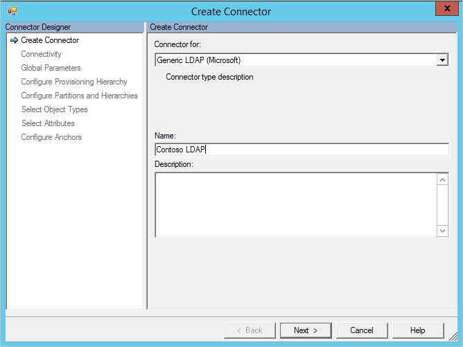
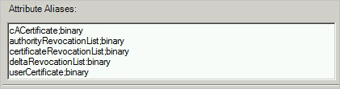
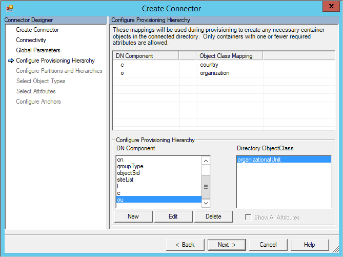
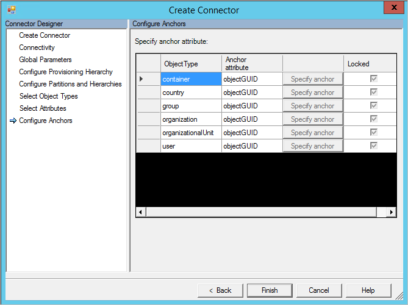

<properties
   pageTitle="Azure AD Connect sync: Generic LDAP Connector | Microsoft Azure"
   description="This article describes how to configure Microsoft's Generic LDAP Connector."
   services="active-directory"
   documentationCenter=""
   authors="AndKjell"
   manager="stevenpo"
   editor=""/>

<tags
   ms.service="active-directory"
   ms.workload="identity"
   ms.tgt_pltfrm="na"
   ms.devlang="na"
   ms.topic="article"
   ms.date="05/24/2016"
   ms.author="andkjell"/>

# Generic LDAP Connector technical reference

This article describes the Generic LDAP Connector. The article applies to the following products:

- Microsoft Identity Manager 2016 (MIM2016)
- Forefront Identity Manager 2010 R2 (FIM2010R2)
    -   Must use hotfix 4.1.3671.0 or later [KB3092178](https://support.microsoft.com/kb/3092178).

For MIM2016 and FIM2010R2 the Connector is available as a download from the [Microsoft Download Center](http://go.microsoft.com/fwlink/?LinkId=717495).

When referring to IETF RFCs, this document is using the format (RFC [RFC number]/[section in RFC document]), e.g. (RFC 4512/4.3).
You can find more information at http://tools.ietf.org/html/rfc4500 (you need to replace 4500 with the correct RFC number).

## Overview of the Generic LDAP Connector

The Generic LDAP Connector enable you to integrate the synchronization service with an LDAP v3 server.

Certain operations and schema elements, such as those needed to perform delta import, are not specified in the IETF RFCs. For these operations only LDAP directories explicitly specified are supported.

From a high level perspective, the following features are supported by the current release of the connector:

Feature | Support
--- | --- |
Connected data source | The Connector is supported with all LDAP v3 servers (RFC 4510 compliant). It has been tested with the following: <li>Microsoft Active Directory Lightweight Directory Services (AD LDS)</li><li>Microsoft Active Directory Global Catalog (AD GC)</li><li>389 Directory Server</li><li>Apache Directory Server</li><li>IBM Tivoli DS</li><li>Isode Directory</li><li>NetIQ eDirectory</li><li>Novell eDirectory</li><li>Open DJ</li><li>Open DS</li><li>Open LDAP (openldap.org)</li><li>Oracle (previously Sun) Directory Server Enterprise Edition</li><li>RadiantOne Virtual Directory Server (VDS)</li><li>Sun One Directory Server</li>**Notable directories not supported:** <li>Microsoft Active Directory Domain Services (AD DS) [Use the built-in Active Directory Connector instead]</li><li>Oracle Internet Directory (OID)</li>
Scenarios	| <li>Object Lifecycle Management</li><li>Group Management</li><li>Password Management</li>
Operations |The following operations are supported on all LDAP directories: <li>Full Import</li><li>Export</li>The following operations are only supported on specified directories:<li>Delta import</li><li>Set Password, Change Password</li>
Schema | <li>Schema is detected from the LDAP schema (RFC3673 and RFC4512/4.2)</li><li>Supports structural classes, aux classes, and extensibleObject object class (RFC4512/4.3)</li>

### Delta import and password management support

Supported Directories for Delta import and Password management:

- Microsoft Active Directory Lightweight Directory Services (AD LDS)
    - Supports all operations for delta import
    - Supports Set Password
- Microsoft Active Directory Global Catalog (AD GC)
    - Supports all operations for delta import
    - Supports Set Password
- 389 Directory Server
    - Supports all operations for delta import
    - Supports Set Password and Change Password
- Apache Directory Server
    - Does not support delta import since this directory does not have a persistent change log
    - Supports Set Password
- IBM Tivoli DS
    - Supports all operations for delta import
    - Supports Set Password and Change Password
- Isode Directory
    - Supports all operations for delta import
    - Supports Set Password and Change Password
- Novell eDirectory and NetIQ eDirectory
    - Supports Add, Update, and Rename operations for delta import
    - Does not support Delete operations for delta import
    - Supports Set Password and Change Password
- Open DJ
    - Supports all operations for delta import
    - Supports Set Password and Change Password
- Open DS
    - Supports all operations for delta import
    - Supports Set Password and Change Password
- Open LDAP (openldap.org)
    - Supports all operations for delta import
    - Supports Set Password
    - Does not support change password
- Oracle (previously Sun) Directory Server Enterprise Edition
    - Supports all operations for delta import
    - Supports Set Password and Change Password
- RadiantOne Virtual Directory Server (VDS)
    - Must be using version 7.1.1 or higher
    - Supports all operations for delta import
    - Supports Set Password and Change Password
-  Sun One Directory Server
    - Supports all operations for delta import
    - Supports Set Password and Change Password

### Prerequisites

Before you use the Connector, make sure you have the following on the synchronization server in addition to any hotfix mentioned above:

- Microsoft .NET 4.5.2 Framework or later

### Detecting the LDAP server

The Connector relies upon a variety of techniques to detect and identify the LDAP server. The Connector uses the Root DSE to find the vendor name and version and it inspects the schema to find unique objects and attributes known to exist in certain LDAP servers. This data, if found, is used to pre-populate the configuration options in the Connector.

### Connected Data Source permissions

To perform import and export operations on the objects in the connected directory, the connector account must have sufficient permissions. The connector will need write permissions to be able to export, and read permissions to be able to import. Permission configuration is performed within the management experiences of the target directory itself.

### Ports and protocols

The connector will use the port number specified in the configuration, which would by default be 389 for LDAP and 636 for LDAPS.

For LDAPS, you must use SSL 3.0 or TLS. SSL 2.0 is not supported and cannot be activated.

### Required controls and features

The following LDAP controls/features must be available on the LDAP server for the connector to work properly:

- 1.3.6.1.4.1.4203.1.5.3 True/False filters

The True/False filter is frequently not reported as supported by LDAP directories and might show up on the **Global Page** under **Mandatory Features Not Found**. It is used to create **OR** filters in LDAP queries, for example when importing multiple object types. If you can import more than one one object type, then your LDAP server supports this.

If you use a directory where a unique identifier is the anchor the following must also be available (see the [Configure Anchors](#configure-anchors) section later in this article for more information):

- 1.3.6.1.4.1.4203.1.5.1 All operational attributes

If the directory has more objects than what can fit in one call to the directory, then it is recommended to use paging. For paging to work, you will need one of the following options:

**Option 1:**

- 1.2.840.113556.1.4.319 pagedResultsControl

**Option 2:**

- 2.16.840.1.113730.3.4.9 VLVControl
- 1.2.840.113556.1.4.473 SortControl

If both options are enabled in the connector configuration, pagedResultsControl will be used.

- 1.2.840.113556.1.4.417 ShowDeletedControl

ShowDeletedControl is only used with the USNChanged delta import method to be able to see deleted objects.

The connector tries to detect if the options are present on the server. If the options cannot be detected, a warning will be present on the Global page in the connector’s properties. Not all LDAP servers will present all controls/features they support and even if this warning is present, the connector might work without issues.

### Delta import

Delta import is only available when a support directory has been detected. The following methods are currently used:

- LDAP Accesslog. See [http://www.openldap.org/doc/admin24/overlays.html#Access Logging](http://www.openldap.org/doc/admin24/overlays.html#Access Logging)
- LDAP Changelog. See [http://tools.ietf.org/html/draft-good-ldap-changelog-04](http://tools.ietf.org/html/draft-good-ldap-changelog-04)
- TimeStamp. For Novell/NetIQ eDirectory the Connector will use last date/time to get created and updated objects. Novell/NetIQ eDirectory does not provide an equivalent means to retrieve deleted objects. This option can also be used if no other delta import method is active on the LDAP server. This option will not be able to import deleted objects.
- USNChanged. See: [https://msdn.microsoft.com/library/ms677627.aspx](https://msdn.microsoft.com/library/ms677627.aspx)

### Not supported

The following LDAP features are not supported:

- LDAP referrals between servers (RFC 4511/4.1.10)

## Create a new Connector

To Create a Generic LDAP connector, in **Synchronization Service** select **Management Agent** and **Create**. Select the **Generic LDAP (Microsoft)** Connector.

### Connectivity

On the Connectivity page, you must specify the Host, Port and Binding information. Depending on which Binding is selected, additional information might be supplied in the following sections.

- The Connection Timeout setting is only used for the first connection to the server when detecting the schema.
- If Binding is Anonymous, then neither username / password nor certificate are used.
- For other bindings, enter information either in username / password or select a certificate.
- If you are using Kerberos to authenticate then also provide the Realm/Domain of the user.

The **attribute aliases** text box is used for attributes defined in the schema with RFC4522 syntax. These cannot be detected during schema detection and the Connector needs help to identify those. For example the following is needed to be entered in the attribute aliases box to correctly identify the userCertificate attribute as a binary attribute:

`userCertificate;binary`

The following is an example for how this could look like:

Select the **include operational attributes in schema** checkbox to also include attributes created by the server. These include attributes such as when the object was created and last update time.

Select **Include extensible attributes in schema** if extensible objects (RFC4512/4.3) are used and enabling this option will allow every attribute to be used on all object. Selecting this option will make the schema very large so unless the connected directory is using this feature the recommendation is to keep the option unselected.

### Global Parameters

On the Global Parameters page, you configure the DN to the delta change log and additional LDAP features. The page will be pre-populated with the information provided by the LDAP server.

The top section shows information provided by the server itself, such as the name of the server. The Connector will also verify that the mandatory controls are present in the Root DSE. If these are not listed, a warning will be presented. Some LDAP directories will not list all features in the Root DSE and it is possible that the Connector will work without issues even if a warning is present.

The **supported controls** checkboxes controls the behavior for certain operations:

- With tree delete selected, a hierarchy will be deleted with one LDAP call. With tree delete unselected, the connector will do a recursive delete if needed.
- With paged results selected the Connector will do paged imports with the size specified on the run steps.
- The VLVControl and SortControl is an alternative to the pagedResultsControl to read data from the LDAP directory.
- If all three options (pagedResultsControl, VLVControl, and SortControl) are unselected then the Connector will import all object in one operation, which might fail if it is a large directory.
- ShowDeletedControl is only used when the Delta import method is USNChanged.

The change log DN is the naming context used by the delta change log, e.g. **cn=changelog**. You need to specify this value to be able to do delta import.

The following is a list of default change log DNs:

Directory | Delta change log
--- | ---
Microsoft AD LDS and AD GC | Automatically detected. USNChanged.
Apache Directory Server | Not available.
Directory 389 | Change log. Default value to use: **cn=changelog**
IBM Tivoli DS | Change log. Default value to use: **cn=changelog**
Isode Directory | Change log. Default value to use: **cn=changelog**
Novell/NetIQ eDirectory | Not available. TimeStamp. The Connector will use last updated date/time to get added and updated records.
Open DJ/DS | Change log.  Default value to use: **cn=changelog**
Open LDAP | Access log. Default value to use: **cn=accesslog**
Oracle DSEE | Change log. Default value to use: **cn=changelog**
RadiantOne VDS | Virtual directory. Depends on the directory connected to VDS.
Sun One Directory Server | Change log. Default value to use: **cn=changelog**

The password attribute is the name of the attribute the Connector should use to set the password in password change and password set operations.
This is by default set to **userPassword** but can be changed if needed for a particular LDAP system.

In the additional partitions list it is possible to add additional namespaces not automatically detected. This can, for example, be used if several servers make up a logical cluster which should all be imported at the same time. Just as Active Directory can have multiple domains in one forest but all domains share one schema, the same can be simulated by entering the additional namespaces in this box. Each namespace can import from different servers and will further be configured on the Configure Partitions and Hierarchies page. Use Ctrl+Enter to get a new line.

### Configure Provisioning Hierarchy

This page is used to map the DN component, e.g. OU, to the object type which should be provisioned, e.g. organizationalUnit.

By configuring provisioning hierarchy you can configure the Connector to automatically create a structure when needed. For example if there is a namespace dc=contoso,dc=com and a new object cn=Joe, ou=Seattle, c=US, dc=contoso, dc=com is provisioned, then the Connector can create a new object of type country for US and an organizationalUnit for Seattle if those are not already present in the directory.

### Configure Partitions and Hierarchies

On the partitions and hierarchies page, select all namespaces with objects you plan to import and export.

For each namespace it is also possible to configure connectivity settings which would override the values specified on the Connectivity screen. If these values are left to their default blank value, the information from the Connectivity screen will be used.

It is also possible to select which containers and OUs the Connector should import from and export to.

### Configure Anchors

This page does always have a preconfigured value and cannot be changed. If the server vendor and version has been identified then this might be populated with an immutable attribute, e.g. the GUID for an object. If it has not been detected or is known to not have an immutable attribute, then the connector will use dn (distinguished name) as the anchor.

The following is a list of LDAP servers and the anchor being used:

Directory | Anchor attribute
--- | ---
Microsoft AD LDS and AD GC | objectGUID
389 Directory Server | dn
Apache Directory | dn
IBM Tivoli DS | dn
Isode Directory | dn
Novell/NetIQ eDirectory | GUID
Open DJ/DS | dn
Open LDAP | dn
Oracle ODSEE | dn
RadiantOne VDS | dn
Sun One Directory Server | dn

## Other notes

This section provides information of aspects which are specific to this Connector or for other reasons are important to know.

### Delta import

The delta watermark in Open LDAP is UTC date/time. For this reason, the clocks between FIM Synchronization Service and the Open LDAP must be synchronized. If not, some entries in the delta change log might be omitted.

For Novell eDirectory the delta import will not detect any object deletes. For this reason it is necessary to run a full import periodically to find all deleted objects.

For directories with a delta change log that is based on date / time, it is highly recommended to run a full import at periodic times to find and dissimilarities between the LDAP server and what is currently in the connector space.

## Troubleshooting

-	For information on how to enable logging to troubleshoot the connector, see the [How to Enable ETW Tracing for Connectors](http://go.microsoft.com/fwlink/?LinkId=335731).
