<properties
   pageTitle="Azure AD Connect sync: Generic SQL Connector | Microsoft Azure"
   description="This article describes how to configure Microsoft's Generic SQL Connector."
   services="active-directory"
   documentationCenter=""
   authors="AndKjell"
   manager="stevenpo"
   editor=""/>

<tags
   ms.service="active-directory"
   ms.workload="identity"
   ms.tgt_pltfrm="na"
   ms.devlang="na"
   ms.topic="article"
   ms.date="05/24/2016"
   ms.author="andkjell"/>

# Generic SQL Connector technical reference

This article describes the Generic SQL Connector. The article applies to the following products:

- Microsoft Identity Manager 2016 (MIM2016)
- Forefront Identity Manager 2010 R2 (FIM2010R2)
    -   Must use hotfix 4.1.3671.0 or later [KB3092178](https://support.microsoft.com/kb/3092178).

For MIM2016 and FIM2010R2 the Connector is available as a download from the [Microsoft Download Center](http://go.microsoft.com/fwlink/?LinkId=717495).

To see this Connector in action, see the [Generic SQL Connector step-by-step](active-directory-aadconnectsync-connector-genericsql-step-by-step.md) article.

## Overview of the Generic SQL Connector

The Generic SQL Connector enable you to integrate the synchronization service with a database system that offer ODBC connectivity.  

From a high level perspective, the following features supported by the current release of the connector:

Feature | Support
--- | ---
Connected data source | The Connector is supported with all 64-bit ODBC drivers. It has been tested with the following: <li>Microsoft SQL Server & SQL Azure</li><li>IBM DB2 10.x</li><li>IBM DB2 9.x</li><li>Oracle 10 & 11g</li><li>MySQL 5.x</li>
Scenarios	| <li>Object Lifecycle Management</li><li>Password Management</li>
Operations | <li>Full Import and Delta Import, Export</li><li>For Export: Add, Delete, Update, and Replace</li><li>Set Password, Change Password</li>
Schema | <li>Dynamic discovery of objects and attributes</li>

### Prerequisites

Before you use the Connector, make sure you have the following on the synchronization server in addition to any hotfix mentioned above:

- Microsoft .NET 4.5.2 Framework or later
- 64-bit ODBC client drivers

### Permissions in connected data source

To create or perform any of the supported tasks in Generic SQL connector, you must have:

- db_datareader
- db_datawriter

### Ports and protocols

For the ports required for the ODBC driver to work, please consult the database vendor's documentation.

## Create a new Connector

To Create a Generic SQL connector, in **Synchronization Service** select **Management Agent** and **Create**. Select the **Generic SQL (Microsoft)** Connector.

### Connectivity

The Connector uses an ODBC DSN file for connectivity. Create the DSN file using **ODBC Data Sources** found in the start menu under **Administrative Tools**. In the administrative tool, create a **File DSN** so it can be provided to the Connector.

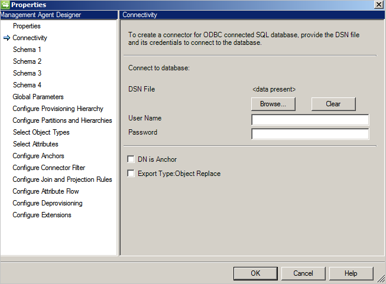

The Connectivity screen is the first when you create a new Generic SQL Connector. You first need to provide the following information:

- DSN file path
- Authentication
    - User Name
    - Password

The database should support one of the authentication methods mentioned below.

- **Windows authentication**: The authenticating database will use the Windows credentials to verify the user. The user name/password specified will be used to authenticate with the database. This account will need permissions to the database.
- **SQL authentication**: The authenticating database will use the user name/password defined one the Connectivity screen to connect to the database. If you store the user name/pasword in the DSN file, the credentials provided on the Connectivity screen has precedence.
- **Azure SQL Database authentication**: For more information see [Connect to SQL Database By Using Azure Active Directory Authentication](..\sql-database\sql-database-aad-authentication.md)

**DN is Anchor**: If you select this option, the DN will also be used as the anchor attribute. It can be used for a simple implementation but also has the following limitations:

-	Connector supports only 1 object type. Therefore any reference attributes can only reference the same object type.

**Export Type: Object Replace**: During export when only some attributes have been changed, the entire object with all attributes will be exported and will replace the existing object.

### Schema 1 (Detect object types)

On this page you are going to configure how the Connector is going to find the different object types in the database.

Every object type will be presented as a partition and configured further on **Configure Partitions and Hierarchies**.

**Object Type detection method**: The Connector supports these object type detection methods.

- **Fixed Value**: You provide the list of object types with a comma separated list. E.g. User,Group,Department.  

- **Table/View/Stored Procedure**: Provide the name of the table/view/stored procedure and then the column name which will provide the list of object types. If you use a stored procedure then also provide parameters for it in the format **[Name]:[Direction]:[Value]**. Provide each parameter on a separate line (use Ctrl+Enter to get a new line).  
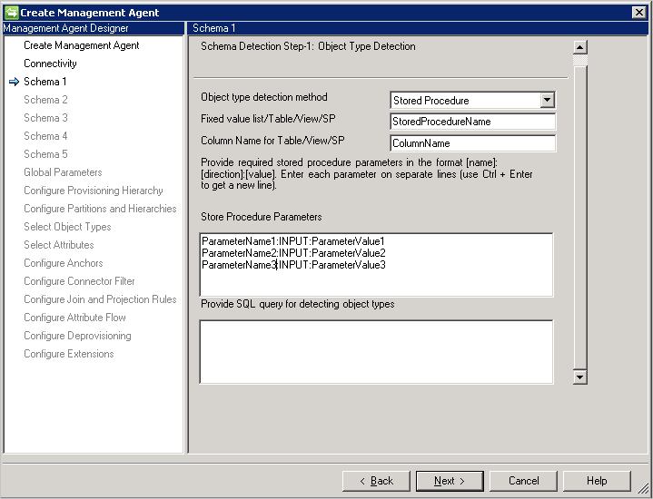
- **SQL Query**: This option allow you to provide a SQL query which will return a single column with object types, e.g. `SELECT [Column Name] FROM TABLENAME`. The returned column must be of type string (varchar).

### Schema 2 (Detect attribute types)

On this page you are going to configure how the attribute names and types are going to be detected. The configuration options are listed for every object type detected on the previous page.

**Attribute Type detection method**: The Connector supports these  attribute type detection methods with every detected object type in Schema 1 screen.

- **Table/View/Stored Procedure**: Provide the name of the table/view/stored procedure which should be used to find the attribute names. If you use a stored procedure then also provide parameters for it in the format **[Name]:[Direction]:[Value]**. Provide each parameter on a separate line (use Ctrl+Enter to get a new line). To detect the attribute names in a multi-valued attribute, provide a comma separated list of Tables or Views. Multivalued scenarios are not supported if parent and child table have same column names.
- **SQL query** This option allow you to provide a SQL query which will return a single column with attribute names, e.g. `SELECT [Column Name] FROM TABLENAME`. The returned column must be of type string (varchar).

### Schema 3 (Define anchor and DN)

This page allows you to configure anchor and DN attribute for each detected object type. You can select multiple attribute to make the anchor unique.

- Multi-valued and Boolean attributes are not listed.
- Same attribute cannot use for DN and anchor, unless **DN is Anchor** is selected on the Connectivity page.
- If **DN is Anchor** is selected on the Connectivity page, this page requires only the DN attribute. This attribute would also be used as the anchor attribute.
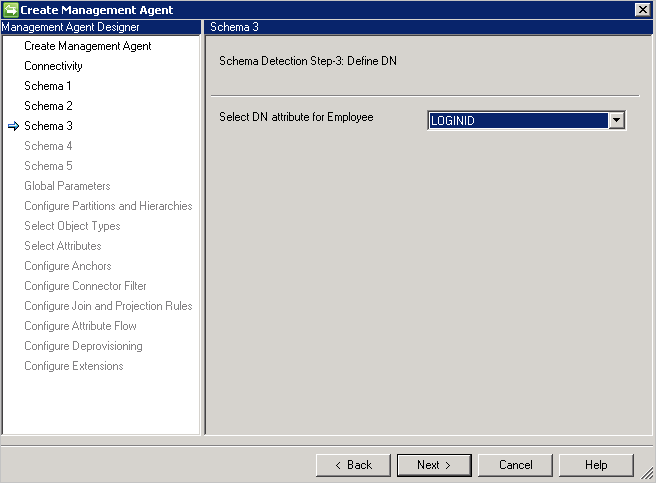

### Schema 4 (Define attribute type, reference, and direction)

This page allows you to configure the attribute type like integer, reference, string, binary, or Boolean and direction for each attribute. All attributes from page **schema 2** are listed including multi-valued attributes.

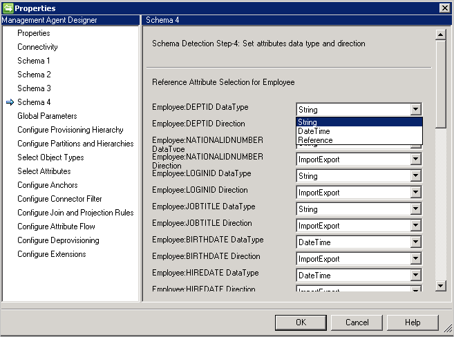

- **DataType**: Used to map the attribute type to those known by the sync engine. The default is to use the same type as detected in the SQL schema, but DateTime and Reference are not easily detactable. For those you need to specify **DateTime** or **Reference**.
- **Direction**: You can set the attribute direction to Import, Export or ImportExport. ImportExport is default.

Notes:

- If an attribute type is not detectable by the Connector, it will use the String data type.
- **Nested tables** can be considered one-column database tables. Oracle stores the rows of a nested table in no particular order. However, when you retrieve the nested table into a PL/SQL variable, the rows are given consecutive subscripts starting at 1. That gives you array-like access to individual rows.
- **VARRYS** are not supported in the connector.

### Schema 5 (Define partition for reference attributes)

On this page you will configure for all reference attributes which partition, i.e. object type, an attribute is referring to.

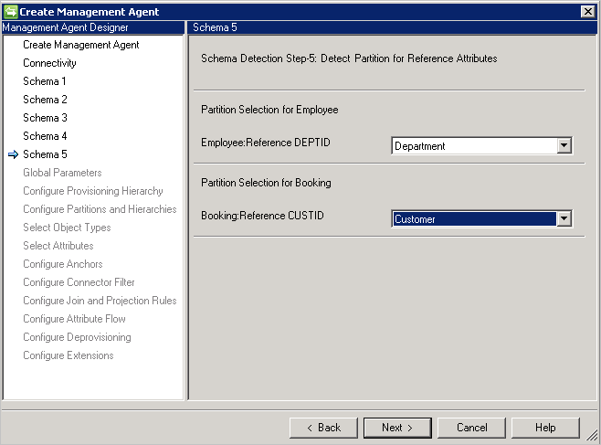

If you use **DN is anchor** then you must use the same object type as the one you are referring from. You cannot reference another object type.

### Global Parameters

The Global Parameters page is used to configure Delta Import, Date/Time format, and Password method.

The Generic SQL Connector supports the following methods for Delta Import:

- **Trigger**: See [Generating Delta Views Using Triggers](https://technet.microsoft.com/library/cc708665.aspx).
- **Watermark**: This is a generic approach and can be used with any database. The watermark query is pre-populated based on the database vendor. A watermark column must be present on every table/view used. This must track inserts and updates to the tables as well as its dependent (multi-valued or child) tables. The clocks between Synchronization Service and the database server must be synchronized. If not, some entries in the delta import might be omitted.  
Limitation:
    - Watermark strategy does not supports deleted objects.
- **Snapshot** (Works only with Microsoft SQL Server) [Generating Delta Views Using Snapshots](https://technet.microsoft.com/library/cc720640.aspx)
- **Change Tracking** (Works only with Microsoft SQL Server) [About Change Tracking](https://msdn.microsoft.com/library/bb933875.aspx)  
Limitations:
    - Anchor & DN attribute must be part of primary key for the selected object in the table.
    - SQL query is unsupported during Import and Export with Change Tracking.

**Additional Parameters**: Specify the Database Server Time Zone indicating where your Database server is located. This value is used to support the various format of date & time attributes.

The Connector will always store date and date-time in UTC format. To be able to correctly convert the date and times the time zone of the database server and the format used must be specified. The format should be expressed in .Net format.

During export every date time attribute must be provided to the Connector in UTC time format.

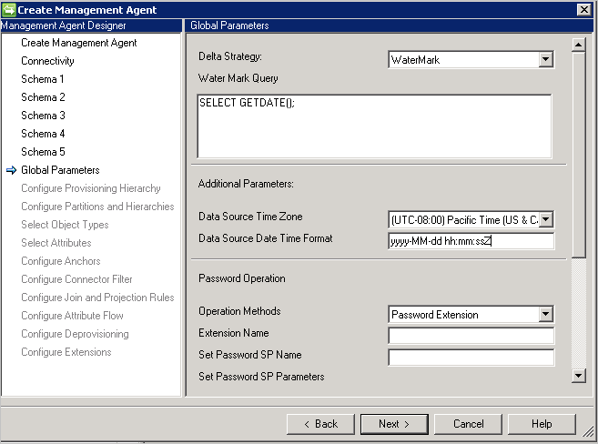

**Password Configuration**: The connector provides password synchronization capabilities and supports set and change password.

The Connector provides two methods to support password synchronization:

- **Stored Procedure**: This method required two stored procedures to support Set & Change password. Type all parameters for add and change the password operation in Set Password SP and Change Password SP Parameters respectively as per below example.
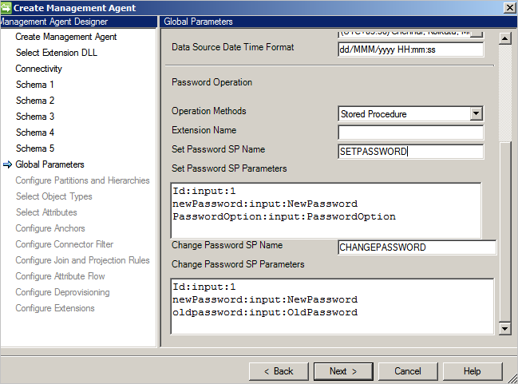
- **Password Extension**: This method requires Password extension DLL (you need to provide the Extension DLL Name that is implementing [IMAExtensible2Password](https://msdn.microsoft.com/library/microsoft.metadirectoryservices.imaextensible2password.aspx) interface). Password extension assembly must be placed in extension folder so that connector can load the DLL at runtime.
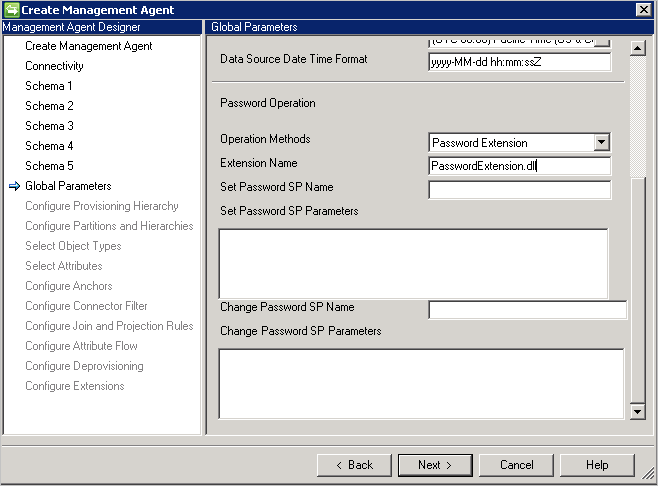

You also have to enable the Password Management on the **Configure Extension** page.
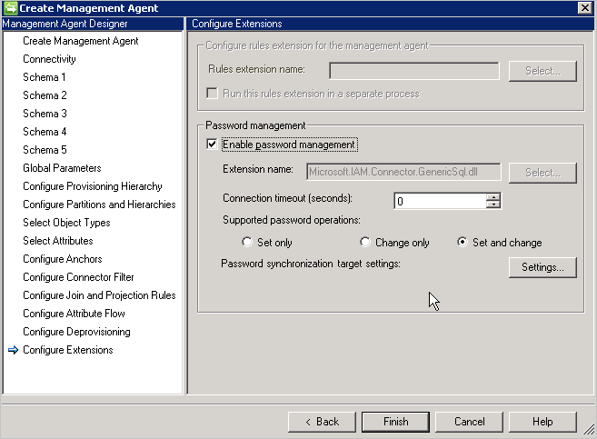

### Configure Partitions and Hierarchies

On the partitions and hierarchies page, select all object types. Each object type is in its own partition.

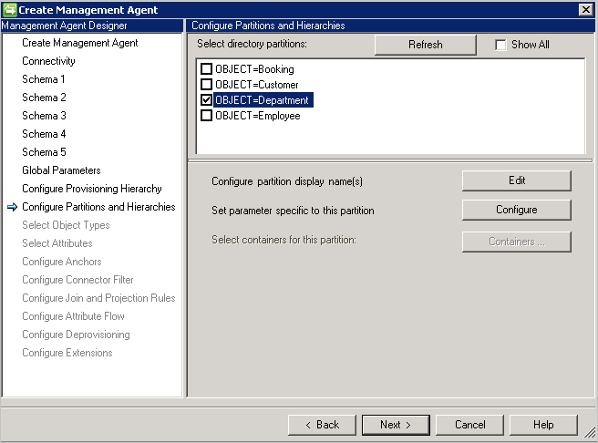

You can also override the values defined on the **Connectivity** or **Global Parameters** page.

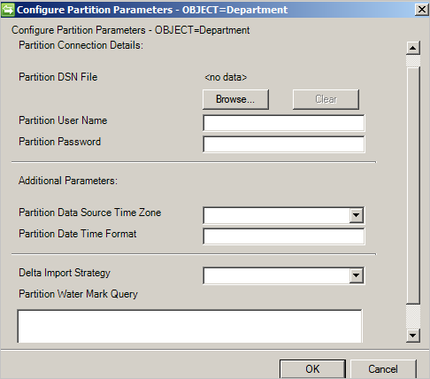

### Configure Anchors

This page is read-only since the anchor has already been defined. The selected anchor attribute is always appended with the object type to ensure it will remain unique across object types.

## Configure Run Step Parameter

These steps are configured on the run profiles on the Connector. These configurations will do the actual work of importing and exporting data.

### Full and Delta Import

Generic SQL Connector support Full and Delta Import using these methods:

- Table
- View
- Stored Procedure
- SQL Query

**Table/View**

To import multi-valued attributes for an object, you have to provide the comma separated table/view name in **Name of Multi-Valued table/views** and respective join conditions in the **Join condition** with the parent table.

Example: You want to import the Employee object and all its multi-valued attributes. There are two tables named Employee (main table) and Department (multi-valued) table.
Do the following:

- Type **Employee** in **Table/View/SP**.
- Type Department in **Name of Multi-Valued table/views**.
- Type the join condition between Employee & Department in **Join Condition**, e.g.
`Employee.DEPTID=Department.DepartmentID`.

**Stored procedures**

- If you have a lot of data it is recommended to implement pagination with your Stored Procedures.
- For your Stored Procedure to support pagination to need to provide Start Index and End Index. See: [Efficiently Paging Through Large Amounts of Data](https://msdn.microsoft.com/library/bb445504.aspx).
- @StartIndex and @EndIndex will be replaced at execution time with respective page size value configured on **Configure Step** page. Example: If connector retrieve first page and the page size is set 500, in such situation @StartIndex would be 1 and @EndIndex considered as 500 and this values, increases as connector retrieve subsequent pages and change the @StartIndex & @EndIndex value.
- To execute parameterized Stored Procedure, provide the parameters in `[Name]:[Direction]:[Value]` format. Enter each parameter on a separate line (Use Ctrl + Enter to get a new line).
- Generic SQL connector also supports Import operation from distributed environment, e.g. Linked Servers in Microsoft SQL Server. In case information is to be retrieved from a Table in Linked server then Table is to be provided in the format: `[ServerName].[Database].[Schema].[TableName]`
    - In distributed environments the Connector only supports Microsoft linked server.
- Generic SQL Connector supports only those objects that have the similar structure (both alias name and data type) between run steps information and schema detection. If the selected object from schema and provided information at run step is different, then SQL Connector will unable to support this type of scenarios.

**SQL Query**

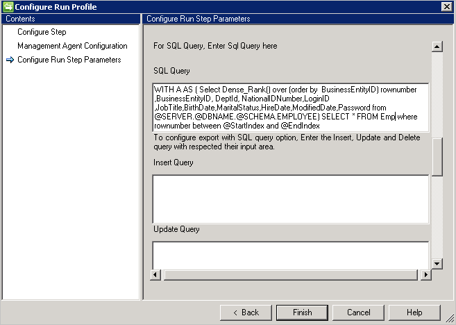

- Multiple result set queries not supported.
- SQL query supports the pagination and provide start Index and End Index as a variable to support pagination.

### Delta Import

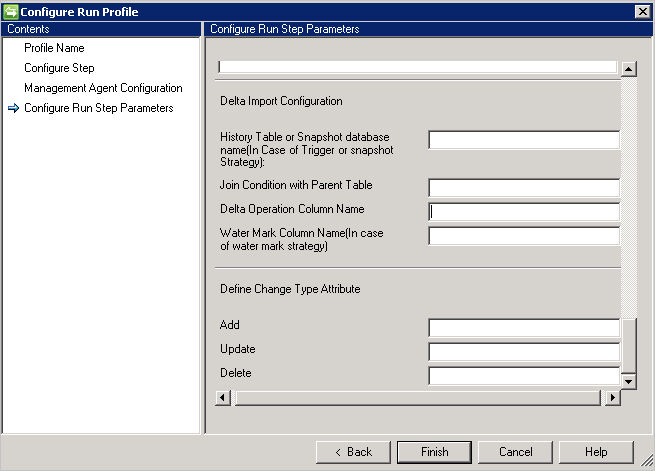

Delta Import configuration require some more configuration along with other supported method like in Full Import.

- If users chooses the Trigger or Snapshot approach to track delta changes, user can provide History Table or Snapshot database in **History Table or Snapshot database name** box.
- User also need to provide join condition between History table and Parent table.
Example: `Employee.ID=History.EmployeeID`
- Track the transaction on parent table from the history table user must provide column name that contains the operation information like (Add/Update/Delete).
- If user chooses Watermark to track the delta changes, user must provide the column name that contains the operation information in **Water Mark Column Name**. Therefore, connector can consider this column while performing Delta Import.
- The **change Type attribute** column is required for the change type. This column maps a change that occurs in the primary table or multi-value table to a change type in the delta view. This column can contain the Modify_Attribute change type for attribute-level change or an Add, Modify, or Delete change type for an object-level change type. If it is something other than the default value Add, Modify, or Delete user can define those values using this option.

### Export

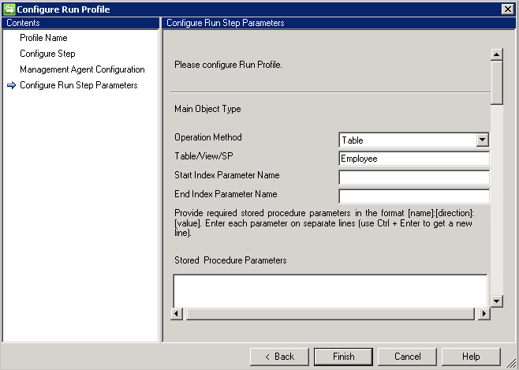

Generic SQL Connector support Export using four supported methods such as:

- Table
- View
- Stored Procedure
- SQL Query

**Table/View**

If users chooses the Table/View option, than connector will generate the respective queries and perform the Export.

**Stored procedures**

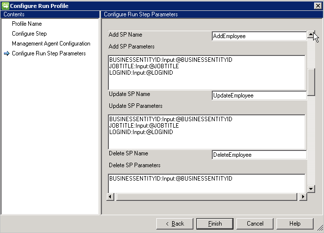

If users chooses the Stored Procedure option, Export require 3 different Stored procedures to perform various Insert/Update/Delete operation.

- **Add SP Name**, This SP execute if any object comes to connector for insertion in the respective table.
- **Update SP Name**, This SP execute if any object comes to connector for update in the respective table.
- **Delete SP Name**, This SP execute if any object comes to connector for deletion in the respective table.
- Attribute selected from the schema used as a parameter value to the stored procedure. Example: EmployeeName: INPUT: @EmployeeName (EmployeeName is selected in the connector schema and connector replace the respective value while performing export)
- Executing parameterized stored procedure type all parameters in `[Name]:[Direction]:[Value]` format. Enter each parameter on a separate line (Use Ctrl + Enter to get a new line).

**SQL query**

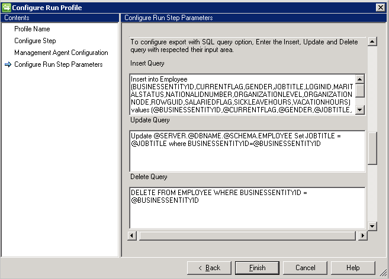

If users chooses the SQL query option, Export require 3 different queries to perform various Insert/Update/Delete operations.

- **Insert Query**: This query execute if any object comes to connector for insertion in the respective table.
- **Update Query**: This query execute if any object comes to connector for update in the respective table.
- **Delete Query**: This query execute if any object comes to connector for deletion in the respective table.
- Attribute selected from the schema used as a parameter value to the query. Example: `Insert into Employee (ID, Name) Values (@ID, @EmployeeName)`

## Troubleshooting

-	For information on how to enable logging to troubleshoot the connector, see the [How to Enable ETW Tracing for Connectors](http://go.microsoft.com/fwlink/?LinkId=335731).
