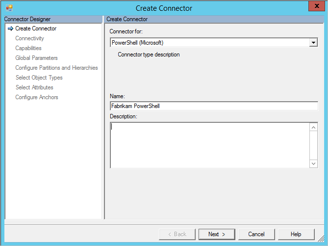

<properties
   pageTitle="Azure AD Connect sync: PowerShell Connector | Microsoft Azure"
   description="This article describes how to configure Microsoft's Windows PowerShell Connector."
   services="active-directory"
   documentationCenter=""
   authors="AndKjell"
   manager="stevenpo"
   editor=""/>

<tags
   ms.service="active-directory"
   ms.workload="identity"
   ms.tgt_pltfrm="na"
   ms.devlang="na"
   ms.topic="article"
   ms.date="05/24/2016"
   ms.author="andkjell"/>

# Windows PowerShell Connector technical reference

This article describes the Windows PowerShell Connector. The article applies to the following products:

- Microsoft Identity Manager 2016 (MIM2016)
- Forefront Identity Manager 2010 R2 (FIM2010R2)
    -   Must use hotfix 4.1.3671.0 or later [KB3092178](https://support.microsoft.com/kb/3092178).

For MIM2016 and FIM2010R2 the Connector is available as a download from the [Microsoft Download Center](http://go.microsoft.com/fwlink/?LinkId=717495).

## Overview of the PowerShell Connector

The PowerShell Connector enable you to integrate the synchronization service with external systems that offer Windows PowerShell based application programming interfaces (APIs). The connector provides a bridge between the capabilities of the call-based extensible connectivity management agent 2 (ECMA2) framework and Windows PowerShell. For more information about the ECMA framework, see the [Extensible Connectivity 2.2 Management Agent Reference](https://msdn.microsoft.com/library/windows/desktop/hh859557.aspx).

### Prerequisites

Before you use the Connector, make sure you have the following on the synchronization server in addition to any hotfix mentioned above:

- Microsoft .NET 4.5.2 Framework or later
- Windows PowerShell 2.0, 3.0, or 4.0

The execution policy on the Synchronization Service server must be configured to allow the connector to run Windows PowerShell scripts. Unless the scripts the connector will run are digitally signed, configure the execution policy by running this command:

`Set-ExecutionPolicy -ExecutionPolicy RemoteSigned`

## Create a new Connector

To create a Windows PowerShell connector in the synchronization service, you must provide a series of Windows PowerShell scripts that execute the steps requested by the synchronization service. Depending on the data source, you will connect to and the functionality you require, the scripts you must implement will vary. This section outlines each of the scripts that can be implemented as well as when they are required.

The Windows PowerShell connector is designed to store each of the scripts inside of the Synchronization Service database. While it is possible to run scripts that are stored on the file system, it is much easier to insert the body of each script directly in to the connector’s configuration

To Create a PowerShell connector, in **Synchronization Service** select **Management Agent** and **Create**. Select the **PowerShell (Microsoft)** Connector.



### Connectivity

Next you can supply configuration parameters for connecting to a remote system. These parameters will be securely stored by the Synchronization Service and made available to your Windows PowerShell scripts when the connector is run.


You can configure the following Connectivity parameters:

**Connectivity**

Parameter | Default Value | Purpose
--- | --- | ---
Server | <Blank> | Server name that the connector should connect to.
Domain | <Blank> | Domain of the credential to store for use when the connector is run.
User | <Blank> | Username of the credential to store for use when the connector is run.
Password | <Blank> | Password of the credential to store for use when the connector is run.
Impersonate Connector Account | False | When true, the synchronization service will execute the Windows PowerShell scripts in the context of the credentials supplied above. When possible, it is recommended that the $Credentials parameter passed to each script is used in lieu of impersonation. For more information on additional permissions that are required to use this parameter, see Additional Configuration for Impersonation.
Load User Profile When Impersonating | False | Instructs Windows to load the user profile of the connector’s credentials during impersonation. If the user to be impersonated has a roaming profile, the connector will not load the roaming profile. For more information on additional permissions that are required to use this parameter, see Additional Configuration for Impersonation.
Logon Type When Impersonating | None | Logon type during impersonation. For more information, refer to the [dwLogonType][dw] documentation.
Signed Scripts Only | False | If true, the Windows PowerShell connector validates that each script has a valid digital signature. If false, ensure that the Synchronization Service server’s Windows PowerShell execution policy is RemoteSigned or Unrestricted.

**Common Module**

The connector allows the administrator to store a shared Windows PowerShell module in the configuration. When the connector executes a script, the Windows PowerShell module is extracted to the file system so that it may be imported by each script.

For Import, Export, and Password Synchronization scripts, the common module is extracted to the connector’s MAData folder. For Schema, Validation, Hierarchy, and Partition discovery scripts, the common module is extracted to the %TEMP% folder. In both cases, the extracted Common Module script is named according to the Common Module Script Name setting.

To load a module called FIMPowerShellConnectorModule.psm1 from the MAData folder, use the following statement:
`Import-Module (Join-Path -Path [Microsoft.MetadirectoryServices.MAUtils]::MAFolder -ChildPath "FIMPowerShellConnectorModule.psm1")`

To load a module called FIMPowerShellConnectorModule.psm1 from the %TEMP% folder, use the following statement:
`Import-Module (Join-Path -Path $env:TEMP -ChildPath "FIMPowerShellConnectorModule.psm1")`

**Parameter Validation**

The Validation Script is an optional Windows PowerShell script that can be used to ensure that connector configuration parameters supplied by the administrator are valid. Validating server and connection credentials as well as connectivity parameters are common usages of the validation script. The validation script is called after the following tabs and dialogs are modified:

- Connectivity
- Global Parameters
- Partition Configuration

The validation script receives the following parameters from the connector:

Name | Data Type | Description
--- | --- | ---
ConfigParameterPage | [ConfigParameterPage][cpp] | The configuration tab or dialog that triggered the validation request.
ConfigParameters | [KeyedCollection][keyk] [string, [ConfigParameter][cp]] | Table of configuration parameters for the Connector.
Credential | [PSCredential][pscred] | Contains any credentials entered by the administrator on the Connectivity tab.

The validation script should return a single ParameterValidationResult object to the pipeline.

**Schema Discovery**

The Schema Discovery script is mandatory. This script returns the object type(s) and attributes, and attribute constraints that the Synchronization Service will use when configuring attribute flow rules. The Schema Discovery script is executed during connector creation and will populate the connector’s schema and subsequently by the Refresh Schema function in the Synchronization Service Manager.

The schema discovery script receives the following parameters from the connector:

Name | Data Type | Description
--- | --- | ---
ConfigParameters | [KeyedCollection][keyk] [string, [ConfigParameter][cp]] | Table of configuration parameters for the Connector.
Credential | [PSCredential][pscred] | Contains any credentials entered by the administrator on the Connectivity tab.

The script must return a single [Schema][schema] object to the pipeline. The Schema object is comprised of [SchemaType][schemaT] objects that represent object types (e.g. users, groups, etc.). The SchemaType object holds a collection of [SchemaAttribute][schemaA] objects that represent the attributes (e.g. given name, surname, postal address, etc.) of the type.

**Additional Parameters**

In addition to the standard configuration settings discussed so far, you can define additional custom configuration settings that are specific to the instance of the Connector. These parameters can be specified at the connector, partition, or run step levels and accessed from the relevant Windows PowerShell script. Custom configuration settings can be stored in the Synchronization Service database in plain text format or they may be encrypted. The Synchronization Service automatically encrypts and decrypts secure configuration settings when required.

To specify custom configuration settings, separate the name of each parameter with a comma ( , ).

To access custom configuration settings from a script, you must suffix the name with and underscore ( \_ ) and the scope of the parameter (Global, Partition, or RunStep). For example, to access the Global FileName parameter, use this code snippet: `$ConfigurationParameters["FileName_Global"].Value`

### Capabilities

The capabilities tab of the Management Agent Designer defines the behavior and functionality of the connector. The selections made on this tab cannot be modified once the connector has been created. The table below lists each of the capability settings.


Capability | Description |
--- | --- |
[Distinguished Name Style][dnstyle] | Indicates if the connector will support distinguished names and if so, what style.
[Export Type][exportT] | Determines the type of objects that are presented to the Export script. <li>AttributeReplace – includes the full set of values for a multi-valued attribute when the attribute changes.</li><li>AttributeUpdate – includes only the deltas to a multi-valued attribute when the attribute changes.</li><li>MultivaluedReferenceAttributeUpdate - includes a full set of values for non-reference multi-valued attributes and only deltas for multi-valued reference attributes.</li><li>ObjectReplace – includes all of the attributes for an object when any attribute changes</li>
[Data Normalization][DataNorm] | Instructs the Synchronization Service to normalize anchor attributes before they are provided to scripts.
[Object Confirmation][oconf] | Configures the pending import behavior in the Synchronization Service. <li>Normal – default behavior that expects all exported changes to be confirmed via import</li><li>NoDeleteConfirmation – when an object is deleted, there is no pending import generated.</li><li>NoAddAndDeleteConfirmation – when an object is created or deleted, there is no pending import generated.</li>
Use DN as Anchor | If the Distinguished Name Style is set to LDAP, the anchor attribute for the connector space is also the distinguished name.
Concurrent Operations of Several Connectors | When checked, multiple Windows PowerShell connectors can run simultaneously.
Partitions | When checked, the connector supports multiple partitions and partition discovery.
Hierarchy | When checked, the connector supports an LDAP style hierarchical structure.
Enable Import | When checked, the connector will import data via import scripts.
Enable Delta Import | When checked, the connector can request deltas from the import scripts.
Enable Export | When checked, the connector will export data via export scripts.
Enable Full Export | When checked, the export scripts support exporting the entire connector space. To use this option, Enable Export must also be checked.
No Reference Values In First Export Pass | When checked, reference attributes are exported in a second export pass.
Enable Object Rename | When checked, distinguished names can be modified.
Delete-Add As Replace | When checked, delete-add operations are exported as a single replacement.
Enable Password Operations | When checked, password synchronization scripts are supported.
Enable Export Password in First Pass | When checked, passwords set during provisioning are exported when the object is created.

### Global Parameters

The Global Parameters tab in the Management Agent Designer enables the administrator to configure each Windows PowerShell script that will be executed by the connector as well global values for custom configuration settings defined on the Connectivity tab.

**Partition Discovery**

A partition is a separate namespace within one shared schema. For example in Active Directory every domain is a partition within one forest. A partition is the logical grouping for import and export operations. Import and Export have partition as a context and all operations must happen in this context. Partitions are supposed to represent a hierarchy in LDAP. The distinguished name of a partition is used in import to verify that all returned objects are within the scope of a partition. The partition distinguished name is also used during provisioning from the metaverse to the connector space to determine which partition an object should be associated with during export.

The partition discovery script receives the following parameters from the connector:

Name | Data Type | Description
--- | --- | ---
ConfigParameters  | [KeyedCollection][keyk][string, [ConfigParameter][cp]] | Table of configuration parameters for the Connector.
Credential | [PSCredential][pscred] | Contains any credentials entered by the administrator on the Connectivity tab.

The script must return a either a single [Partition][part] object or a List[T] of Partition objects to the pipeline.

**Hierarchy Discovery**

The hierarchy discovery script is only used when the Distinguished Name Style capability is LDAP. The script is used to allow administrators to browse for and select a set of containers that will be considered in or out of scope for import and export operations. The script should only provide a list of nodes that are direct children of the root node supplied to the script.

The hierarchy discovery script receives the following parameters from the connector:

Name | Data Type | Description
--- | --- | ---
ConfigParameters | [KeyedCollection][keyk][string, [ConfigParameter][cp]] | Table of configuration parameters for the Connector.
Credential | [PSCredential][pscred] | Contains any credentials entered by the administrator on the Connectivity tab.
ParentNode | [HierarchyNode][hn] | The root node of the hierarchy under which the script should return direct children.

The script must return a either a single child HierarchyNode object or a List[T] of child HierarchyNode objects to the pipeline.

#### Import

Connectors that support import operations must implement three scripts.

**Begin Import**

The begin import script is run at the beginning of an import run step. During this step, you can establish a connection to source systems and conduct any preparatory steps prior to importing data from the connected system.

The begin import script receives the following parameters from the connector:

Name | Data Type | Description
--- | --- | ---
ConfigParameters | [KeyedCollection][keyk][string, [ConfigParameter][cp]] | Table of configuration parameters for the Connector.
Credential | [PSCredential][pscred] | Contains any credentials entered by the administrator on the Connectivity tab.
OpenImportConnectionRunStep | [OpenImportConnectionRunStep][oicrs] | Informs the script about the type of import run (delta or full), partition, hierarchy, watermark, and expected page size.
Types | [Schema][schema] | Schema for the connector space that will be imported.

The script must return a single [OpenImportConnectionResults][oicres] object to the pipeline. The sample code below demonstrates how to return an OpenImportConnectionResults object to the pipeline:

`Write-Output (New-Object Microsoft.MetadirectoryServices.OpenImportConnectionResults)`

**Import Data**

The import data script is called by the connector until the script indicates that there is no more data to import and the synchronization service does not need to request any full object imports during a delta import. The Windows PowerShell connector has a page size of 9,999 objects. If your script will return more than 9,999 objects for import, you must support paging. The connector exposes a custom data property that you can use to a store a watermark so that each time the import data script is called, your script resumes importing objects where it left off.

The import data script receives the following parameters from the connector:

Name | Data Type | Description
--- | --- | ---
ConfigParameters | [KeyedCollection][keyk][string, [ConfigParameter][cp]] | Table of configuration parameters for the Connector.
Credential | [PSCredential][pscred] | Contains any credentials entered by the administrator on the Connectivity tab.
GetImportEntriesRunStep | [ImportRunStep][irs] | Holds the watermark (CustomData) that can be used during paged imports and delta imports.
OpenImportConnectionRunStep | [OpenImportConnectionRunStep][oicrs] | Informs the script about the type of import run (delta or full), partition, hierarchy, watermark, and expected page size.
Types | [Schema][schema] | Schema for the connector space that will be imported.

The import data script must write a List[[CSEntryChange][csec]] object to the pipeline. This collection is comprised of CSEntryChange attributes that represent each object being imported. During a Full Import run, this collection should have a full set of CSEntryChange objects that have all of the attributes for each individual object. During a Delta Import, the CSEntryChange object should either contain the attribute level deltas for each object to import, or a complete representation of the objects that have changed (Replace mode).

**End Import**

At the conclusion of the import run, the End Import script will be run. This script should perform any cleanup tasks necessary (e.g. close connections to systems, respond to failures, etc.).

The end import script receives the following parameters from the connector:

Name | Data Type | Description
--- | --- | ---
ConfigParameters | [KeyedCollection][keyk][string, [ConfigParameter][cp]] | Table of configuration parameters for the Connector.
Credential | [PSCredential][pscred] | Contains any credentials entered by the administrator on the Connectivity tab.
OpenImportConnectionRunStep | [OpenImportConnectionRunStep][oicrs] | Informs the script about the type of import run (delta or full), partition, hierarchy, watermark, and expected page size.
CloseImportConnectionRunStep | [CloseImportConnectionRunStep][cecrs] | Informs the script about the reason the import was ended.

The script must return a single [CloseImportConnectionResults][cicres] object to the pipeline. The sample code below demonstrates how to return a CloseImportConnectionResults object to the pipeline:
`Write-Output (New-Object Microsoft.MetadirectoryServices.CloseImportConnectionResults)`

#### Export

Identical to the import architecture of the connector, connectors that support Export must implement three scripts.

**Begin Export**

The begin export script is run at the beginning of an export run step. During this step, you can establish a connection to source systems and conduct any preparatory steps prior to exporting data from the connected system.

The begin export script receives the following parameters from the connector:

Name | Data Type | Description
--- | --- | ---
ConfigParameters | [KeyedCollection][keyk][string, [ConfigParameter][cp]] | Table of configuration parameters for the Connector.
Credential | [PSCredential][pscred] | Contains any credentials entered by the administrator on the Connectivity tab.
OpenExportConnectionRunStep | [OpenExportConnectionRunStep][oecrs] | Informs the script about the type of export run (delta or full), partition, hierarchy, and expected page size.
Types | [Schema][schema] | Schema for the connector space that will be exported.

The script should not return any output to the pipeline.

**Export Data**

The Synchronization Service will call the Export Data script as many times as is necessary to process all of the pending exports. Depending on whether or not the connector space has more pending exports than the connector’s page size, the presence of reference attributes, or passwords, the export data script may be called multiple times and possibly multiple times for the same object.

The export data script receives the following parameters from the connector:

Name | Data Type | Description
--- | --- | ---
ConfigParameters | [KeyedCollection][keyk][string, [ConfigParameter][cp]] | Table of configuration parameters for the Connector.
Credential | [PSCredential][pscred] | Contains any credentials entered by the administrator on the Connectivity tab.
CSEntries | IList[CSEntryChange][csec] | List of all the connector space objects with pending exports to be processed during this pass.
OpenExportConnectionRunStep | [OpenExportConnectionRunStep][oecrs] | Informs the script about the type of export run (delta or full), partition, hierarchy, and expected page size.
Types | [Schema][schema] | Schema for the connector space that will be exported.

The export data script must return a [PutExportEntriesResults][peeres] object to the pipeline. This object does not need to include result information for each exported connector unless an error or a change to the anchor attribute occurs.

The sample code below demonstrates how to return a PutExportEntriesResults object to the pipeline:
`Write-Output (New-Object Microsoft.MetadirectoryServices.PutExportEntriesResults)`

**End Export**

At the conclusion of the export run, the End Export script will be run. This script should perform any cleanup tasks necessary (e.g. close connections to systems, respond to failures, etc.).

The end export script receives the following parameters from the connector:

Name | Data Type | Description
--- | --- | ---
ConfigParameters | [KeyedCollection][keyk][string, [ConfigParameter][cp]] | Table of configuration parameters for the Connector.
Credential | [PSCredential][pscred] | Contains any credentials entered by the administrator on the Connectivity tab.
OpenExportConnectionRunStep | [OpenExportConnectionRunStep][oecrs] | Informs the script about the type of export run (delta or full), partition, hierarchy, and expected page size.
CloseExportConnectionRunStep | [CloseExportConnectionRunStep][cecrs] | Informs the script about the reason the export was ended.

The script should not return any output to the pipeline.

#### Password Synchronization

Windows PowerShell connectors can be used as a target for password changes/resets.

The password script receives the following parameters from the connector:

Name | Data Type | Description
--- | --- | ---
ConfigParameters | [KeyedCollection][keyk][string, [ConfigParameter][cp]] | Table of configuration parameters for the Connector.
Credential | [PSCredential][pscred] | Contains any credentials entered by the administrator on the Connectivity tab.
Partition | [Partition][part] | Directory partition that the CSEntry is in.
CSEntry | [CSEntry][cse] | Connector space entry for the object that is received a password change or reset.
OperationType | String | Indicates if the operation is a reset (**SetPassword**) or a change (**ChangePassword**).
PasswordOptions | [PasswordOptions][pwdopt] | Flags that specify the intended password reset behavior. This parameter is only available if OperationType is **SetPassword**.
OldPassword | String | Populated with the object’s old password for password changes. This parameter is only available if OperationType is **ChangePassword**.
NewPassword | String | Populated with the object’s new password that the script should set.

The password script is not expected to return any results to the Windows PowerShell pipeline. If an error occurs in the password script, the script should throw one of the following exceptions to inform the Synchronization Service about the problem:

- [PasswordPolicyViolationException][pwdex1] – Thrown if the password does not meet the password policy in the connected system.
- [PasswordIllFormedException][pwdex2] – Thrown if the password is not acceptable for the connected system.
- [PasswordExtension][pwdex3] – Thrown for all other errors in the password script.

## Sample Connectors

For a complete overview of the available sample connectors, see [Windows PowerShell Connector Sample Connector Collection][samp].

## Other notes

### Additional Configuration for Impersonation

Grant the user that will be impersonated the following permissions on the Synchronization Service server:

Read access to the following registry keys:

- HKEY_USERS\\[SynchronizationServiceServiceAccountSID]\Software\Microsoft\PowerShell
- HKEY_USERS\\[SynchronizationServiceServiceAccountSID]\Environment

To determine the Security Identifier (SID) of the Synchronization Service service account, run the following PowerShell commands:

```
$account = New-Object System.Security.Principal.NTAccount "<domain>\<username>"
$account.Translate([System.Security.Principal.SecurityIdentifier]).Value
```

Read access to the following file system folders:

- %ProgramFiles%\Microsoft Forefront Identity Manager\2010\Synchronization Service\Extensions
- %ProgramFiles%\Microsoft Forefront Identity Manager\2010\Synchronization Service\ExtensionsCache
- %ProgramFiles%\Microsoft Forefront Identity Manager\2010\Synchronization Service\MaData\<ConnectorName>

Substitute the name of the Windows PowerShell connector for the <ConnectorName> placeholder.

## Troubleshooting

-	For information on how to enable logging to troubleshoot the connector, see the [How to Enable ETW Tracing for Connectors](http://go.microsoft.com/fwlink/?LinkId=335731).

<!--Reference style links - using these makes the source content way more readable than using inline links-->
[cpp]: https://msdn.microsoft.com/library/windows/desktop/microsoft.metadirectoryservices.configparameterpage.aspx
[keyk]: https://msdn.microsoft.com/library/ms132438.aspx
[cp]: https://msdn.microsoft.com/library/windows/desktop/microsoft.metadirectoryservices.configparameter.aspx
[pscred]: https://msdn.microsoft.com/library/system.management.automation.pscredential.aspx
[schema]: https://msdn.microsoft.com/library/windows/desktop/microsoft.metadirectoryservices.schema.aspx
[schemaT]: https://msdn.microsoft.com/library/windows/desktop/microsoft.metadirectoryservices.schematype.aspx
[schemaA]: https://msdn.microsoft.com/library/windows/desktop/microsoft.metadirectoryservices.schemaattribute.aspx
[dnstyle]: https://msdn.microsoft.com/library/windows/desktop/microsoft.metadirectoryservices.madistinguishednamestyle.aspx
[exportT]: https://msdn.microsoft.com/library/windows/desktop/microsoft.metadirectoryservices.maexporttype.aspx
[DataNorm]: https://msdn.microsoft.com/library/windows/desktop/microsoft.metadirectoryservices.manormalizations.aspx
[oconf]: https://msdn.microsoft.com/library/windows/desktop/microsoft.metadirectoryservices.maobjectconfirmation.aspx
[dw]: https://msdn.microsoft.com/library/windows/desktop/aa378184.aspx
[part]: https://msdn.microsoft.com/library/windows/desktop/microsoft.metadirectoryservices.partition.aspx
[hn]: https://msdn.microsoft.com/library/windows/desktop/microsoft.metadirectoryservices.hierarchynode.aspx
[oicrs]: https://msdn.microsoft.com/library/windows/desktop/microsoft.metadirectoryservices.openimportconnectionrunstep.aspx
[cecrs]: https://msdn.microsoft.com/library/windows/desktop/microsoft.metadirectoryservices.closeexportconnectionrunstep.aspx
[oicres]: https://msdn.microsoft.com/library/windows/desktop/microsoft.metadirectoryservices.openimportconnectionresults.aspx
[cecrs]: https://msdn.microsoft.com/library/windows/desktop/microsoft.metadirectoryservices.closeexportconnectionrunstep.aspx
[cicres]: https://msdn.microsoft.com/library/windows/desktop/microsoft.metadirectoryservices.closeimportconnectionresults.aspx
[oecrs]: https://msdn.microsoft.com/library/windows/desktop/microsoft.metadirectoryservices.openexportconnectionrunstep.aspx
[irs]: https://msdn.microsoft.com/library/windows/desktop/microsoft.metadirectoryservices.importrunstep.aspx
[cse]: https://msdn.microsoft.com/library/windows/desktop/microsoft.metadirectoryservices.csentry.aspx
[csec]: https://msdn.microsoft.com/library/windows/desktop/microsoft.metadirectoryservices.csentrychange.aspx
[peeres]: https://msdn.microsoft.com/library/windows/desktop/microsoft.metadirectoryservices.putexportentriesresults.aspx
[pwdopt]: https://msdn.microsoft.com/library/windows/desktop/microsoft.metadirectoryservices.passwordoptions.aspx
[pwdex1]: https://msdn.microsoft.com/library/windows/desktop/microsoft.metadirectoryservices.passwordpolicyviolationexception.aspx
[pwdex2]: https://msdn.microsoft.com/library/windows/desktop/microsoft.metadirectoryservices.passwordillformedexception.aspx
[pwdex3]: https://msdn.microsoft.com/library/windows/desktop/microsoft.metadirectoryservices.passwordextensionexception.aspx
[samp]: http://go.microsoft.com/fwlink/?LinkId=394291
