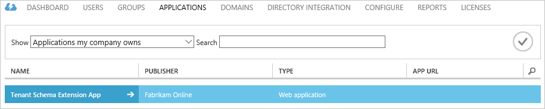

<properties
   pageTitle="Azure AD Connect sync: Directory extensions | Microsoft Azure"
   description="This topic describes the directory extensions feature in Azure AD Connect."
   services="active-directory"
   documentationCenter=""
   authors="AndKjell"
   manager="femila"
   editor=""/>

<tags
   ms.service="active-directory"
   ms.devlang="na"
   ms.topic="article"
   ms.tgt_pltfrm="na"
   ms.workload="identity"
   ms.date="08/19/2016"
   ms.author="andkjell"/>

# Azure AD Connect sync: Directory extensions
Directory extensions allows you to extend the schema in Azure AD with your own attributes from on-premises Active Directory. This feature allows you to build LOB apps consuming attributes you continue to manage on-premises. These attributes can be consumed through [Azure AD Graph directory extensions](https://msdn.microsoft.com/Library/Azure/Ad/Graph/howto/azure-ad-graph-api-directory-schema-extensions) or [Microsoft Graph](https://graph.microsoft.io/). You can see the attributes available using [Azure AD Graph explorer](https://graphexplorer.cloudapp.net) and [Microsoft Graph explorer](https://graphexplorer2.azurewebsites.net/) respectively.

At present no Office 365 workload consumes these attributes.

You configure which additional attributes you want to synchronize in the custom settings path in the installation wizard.

The installation shows the following attributes, which are valid candidates:

- User and Group object types
- Single-valued attributes: String, Boolean, Integer, Binary
- Multi-valued attributes: String, Binary

The list of attributes is read from the cache created during installation of Azure AD Connect. If you have extended the Active Directory schema with additional attributes, the [schema must be refreshed](active-directory-aadconnectsync-installation-wizard.md#refresh-directory-schema) before these new attributes are visible.

An object can have up to 100 directory extensions attributes. The max length is 250 characters. If an attribute value is longer, it is truncated by the sync engine.

During installation of Azure AD Connect, an application is registered where these attributes are available. You can see this application in the Azure portal.  

These attributes are now available through Graph:  

The attributes are prefixed with extension\_{AppClientId}\_. The AppClientId has the same value for all attributes in your Azure AD directory.

## Next steps
Learn more about the [Azure AD Connect sync](active-directory-aadconnectsync-whatis.md) configuration.

Learn more about [Integrating your on-premises identities with Azure Active Directory](active-directory-aadconnect.md).
